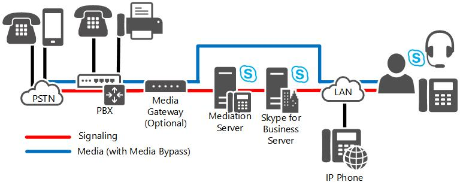
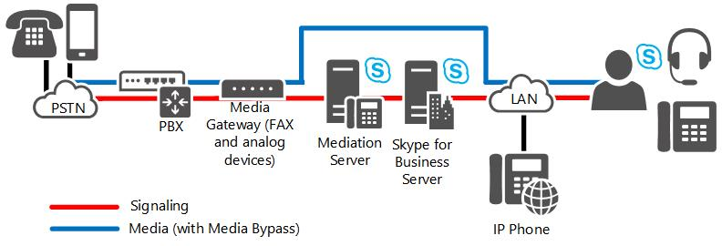

# Direct SIP connections in Skype for Business Server

Direct SIP connections are supported between Skype for Business Server and both PSTN gateways and IP-PBX in Enterprise Voice.

You can use direct SIP connections to connect Skype for Business Server to either of the following:

- An IP-PBX

- A PSTN gateway

To implement a direct SIP connection, you follow essentially the same deployment steps as you would to implement a SIP trunk. In both cases, you implement the connection by using the external interface of a Mediation Server. The only difference is that you connect SIP trunks to an external entity, such as an ITSP gateway, and you connect direct SIP connections to an internal entity within your local network, such as an IP-PBX or a public switched telephone network (PSTN) gateway.

## Direct SIP deployment options

### Skype for Business Server Stand-Alone

If your organization uses one of the deployments described in this section, you can use Skype for Business Server as the sole telephony solution for part or all of an organization. This section describes the following deployments in detail:

- **Incremental deployment:** This option assumes that you have an existing private branch exchange (PBX) infrastructure and you intend to introduce Enterprise Voice incrementally to smaller groups or teams within your organization.

- **VoIP-only deployment:** this option assumes that you are considering deploying Enterprise Voice at a site that does not have a traditional telephony infrastructure.

#### Incremental Deployment

In incremental deployment, Skype for Business Server is the sole telephony solution for individual teams or departments, while the rest of the users in an organization continue to use a PBX. This incremental deployment strategy provides one way to introduce IP telephony into your enterprise through controlled pilot programs. Workgroups whose communication needs are best served by Microsoft Unified Communications are moved to Enterprise Voice, while other users remain on the existing PBX. Additional workgroups can be migrated to Enterprise Voice, as needed.

The incremental option is recommended if you have clearly defined user groups that have communication requirements in common and that lend themselves to centralized management. This option is also effective if you have teams or departments that are spread over wide geographic areas, where the savings in long-distance charges can be significant. In fact, this option is useful for creating virtual teams whose members may be scattered across the globe. You can create, modify, or disband such teams in rapid response to shifting business requirements.

The following figure shows the generic topology for deployment of Enterprise Voice behind a PBX. This is the recommended topology for incremental deployment.

**Incremental deployment option**

> [!NOTE]
> If you are connecting your Skype for Business Server deployment to a certified Direct SIP partner, a public switched telephone network (PSTN) gateway between the Mediation Server and the PBX is not required. For a list of certified Direct SIP partners, see the  [Microsoft Unified Communications Open Interoperability Program](https://go.microsoft.com/fwlink/p/?linkId=203309).

> [!NOTE]
> The media path shown in this figure has media bypass enabled (the recommended configuration). If you opt to disable media bypass, the media path is routed through the Mediation Server.

In this topology, selected departments or workgroups are enabled for Enterprise Voice. A PSTN gateway links the Voice over Internet Protocol (VoIP)-enabled workgroup to the PBX. Users who are enabled for Enterprise Voice, including remote workers, communicate across the IP network. Calls by Enterprise Voice users to the PSTN and to coworkers who are not enabled for Enterprise Voice are routed to the appropriate PSTN gateway. Calls from colleagues who are still on the PBX system, or from callers on the PSTN, are routed to the PSTN gateway, which forwards the calls to Skype for Business Server for routing.

There are two recommended configurations for connecting Enterprise Voice to an existing PBX infrastructure for interoperability: Enterprise Voice behind the PBX and Enterprise Voice in front of the PBX.

#### Enterprise Voice Behind the PBX

When Enterprise Voice is deployed behind the PBX, all calls from the PSTN arrive at the PBX, which routes calls to Enterprise Voice users to a PSTN gateway, and calls to PBX users to the PBX.

#### Enterprise Voice in Front of the PBX

When Enterprise Voice is deployed in front of the PBX, all calls arrive at the PSTN gateway, which routes calls for Enterprise Voice users to Skype for Business Server and calls for PBX users to the PBX. Calls to the PSTN from both Enterprise Voice and PBX users are routed over the IP network to the most cost-efficient PSTN gateway. The following table shows the advantages and disadvantages of this configuration.

**Advantages and Disadvantages of Deploying Enterprise Voice in Front of PBX**

|**Advantages**|**Disadvantages**|
|:-----|:-----|
|PBX still serves users not enabled for Enterprise Voice.    |Existing gateways may not support the features or capacity that you want.    |
|PBX handles all earlier devices.    |Requires a trunk from gateway to the PBX and from the gateway to the Mediation Server. You may need more trunks from the service provider.    |
|Enterprise Voice users keep the same phone numbers.    |   |

#### VoIP-Only Deployment

Enterprise Voice provides new businesses, and also new office sites for existing businesses, with the opportunity to implement a full-featured VoIP solution without having to worry about PBX integration or incurring the substantial deployment and maintenance costs of an IP-PBX infrastructure. This solution supports both on-site and remote workers.

In this deployment, all calls are routed over the IP network. Calls to the PSTN are routed to the appropriate PSTN gateway. Skype for Business or Lync Phone Edition serves as a softphone. Remote call control is unavailable and unnecessary because there are no PBX phones for users to control. Voice mail and auto-attendant services are available through the optional deployment of Exchange Unified Messaging (UM).

> [!NOTE]
> In addition to the network infrastructure that is required to support Skype for Business Server, a VoIP-only deployment can use a small, qualified gateway to support fax machines and analog devices.

The following figure shows a typical topology for a VoIP-only deployment.

**VoIP-only deployment option**

> [!NOTE]
> The media path shown in this figure has media bypass enabled (the recommended configuration). If you opt to disable media bypass, the media path is routed through the Mediation Server.

## PSTN Gateway deployment options

### PSTN Gateways

Public switched telephone network (PSTN) gateways are third-party hardware components that translate signaling and media between the Enterprise Voice infrastructure and the PSTN, either directly or through connection to SIP trunks. In either topology, the gateway terminates the PSTN. The gateway is isolated in its own subnet and is connected to the enterprise network through the Mediation Server.

An enterprise with multiple sites would typically deploy one or more gateways at each site. Branch sites can connect to the PSTN either through a gateway, or through a Survivable Branch Appliance, which combines gateway and servers in a single box. If branch sites use a gateway, both a Registrar and Mediation Server are required on site, unless the WAN link is resilient. One or more Mediation Servers, which are collocated on Front End Servers, can route calls for the one or more gateways at each site. We recommend that the Registrar, Mediation Server, and gateway required on site are deployed as a Survivable Branch Appliance.

Determining the number, size, and location of PSTN gateways is perhaps the most important and expensive decision you must make when planning your Enterprise Voice infrastructure.

Here are the main questions to consider. Keep in mind that the answers to these questions are all interdependent

- How many PSTN gateways are needed? The answer depends on the number of users, the anticipated number of simultaneous calls (traffic load), and the number of sites (each site needs one).

- What size should the gateways be? The answer depends on the number of users at the site and on the traffic load.

- Where should the gateways be located? The answer depends in part on the topology and in part on the geographic distribution of your organization.

  You should also consider your gateway topology options (for details, see Gateway Topologies later in this topic).

#### M:N Trunk Support

The Mediation Servers can route calls through multiple gateways, Session Border Controllers (SBCs) provided by Internet telephony service providers, or a combination of the two. Additionally, multiple Mediation Servers in the pool can interact with multiple gateways. The logical route defined between a Mediation Server and gateway is called a trunk. When an internal user places a PSTN call, outbound routing logic on the Front End pool chooses which trunk to route over out of all possible combinations that may be available for routing that particular call. With DNS load balancing, if a call fails to reach a gateway due to an issue with a particular Mediation Server in the pool, the call will be retried to an alternate Mediation Server in the pool.

For details about planning for multiple gateways, see [M:N trunk in Skype for Business Server](m-n-trunk.md).

For details about other outbound routing enhancements, see [Call Routes](https://technet.microsoft.com/library/a2ddf327-2ec4-407b-af0f-276f2b13eefd.aspx).

#### Gateway Topologies

When you consider the fundamental questions of gateway deployment, follow these steps:

1. Count the sites at which you want to provide PSTN connectivity by using Enterprise Voice.

2. Estimate the traffic at each site (number of users and average number of calls per hour per user).

3. Deploy one or more gateways at each site to handle the anticipated traffic.

With this topology, calls among workers at each site and between sites are all routed over your intranet. Calls to the PSTN are routed over the enterprise IP network to the gateways that are closest to the location of the destination numbers.But what if your organization supports dozens or hundreds or even thousands of sites spread across one or more continents, as many financial institutions and other large enterprises do? In such cases, deploying a separate gateway at each site is not practical.

To address this issue, many large companies prefer to deploy one or a few large telephony central sites.

In this topology, several large gateways sufficient to accommodate the anticipated user load are deployed at each central site. All calls to users in the enterprise are forwarded by the company's telephone service provider to a central site. Routing logic at the central site determines whether the call should be routed over the intranet or to the PSTN.

#### Gateway Location

Gateway location may also determine the types of gateways that you choose and how they are configured. There are dozens of PSTN protocols, none of which is a worldwide standard. If all your gateways are located in a single country/region, this is not an issue, but if you locate gateways in several countries/regions, each must be configured according to the PSTN standards of that country/region. Moreover, gateways that are certified for operation in, for example, Canada, may not be certified in India, Brazil, or the European Union.

#### Gateway Size and Number

The PSTN gateways that most organizations will consider deploying range in size from 2 to as many as 960 ports. (There are even larger gateways, but these are used mainly by telephone service providers.) When estimating the number of ports your organization requires, use the following guidelines:

- Organizations with light telephony usage (one PSTN call per user per hour) should allocate one port for every 15 users. For example, if you have 20 users, you will require a gateway with two ports.

- Organizations with moderate telephony usage (two PSTN calls per user per hour) should allocate one port for every 10 users. For example, if you have 100 users, you will require a total of 10 ports allocated among one or more gateways.

- Organizations with heavy telephony usage (three or more PSTN calls per user per hour) should allocate one port for every five users. For example, if you have 47,000 users, you will require a total of 9,400 ports allocated among at least 10 large gateways.

- Additional ports can be acquired as the number of users or amount of traffic in your organization increases.

For any given number of users you must support, you have the choice of deploying fewer, larger gateways, or smaller ones. As a rule, a minimum of two gateways for an organization is recommended to maintain availability if one gateway fails.

Each PSTN gateway that you deploy must have at least one corresponding Mediation Server.

