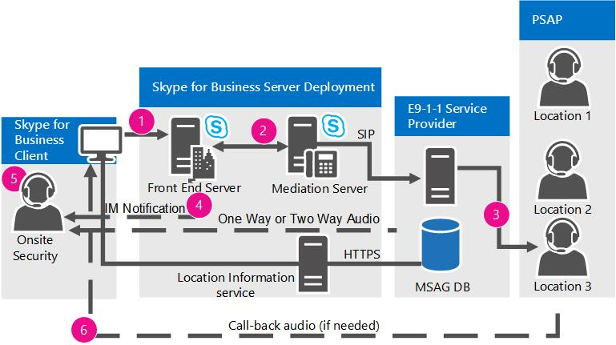
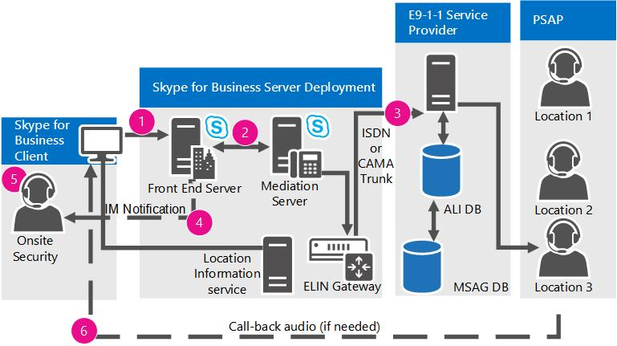

# Plan for emergency services in Skype for Business Server

Learn about Enhanced 9-1-1 (E9-1-1) services in Skype for Business Server Enterprise Voice, including location acquiring and call routing.

Skype for Business Server supports Enhanced 9-1-1 (E9-1-1) services within the United States as part of an Enterprise Voice deployment. E9-1-1 is an emergency dispatch feature that associates a 9-1-1 call with an Emergency Response Location (ERL) that consists of civic (that is, street) addresses and other more specific location information, such as floor numbers, for calls from office buildings and other multitenant facilities. By using the provided ERL, a Public Safety Answering Point (PSAP) can immediately dispatch first responders to the caller in distress with reduced risk of inadvertently directing the responder to an incorrect or ambiguous location.

> [!NOTE]
> Skype for Business Server now supports the configuration of multiple emergency numbers for a client. For more information see [Plan for multiple emergency numbers in Skype for Business Server](multiple-emergency-numbers.md).

> [!NOTE]
> Skype for Business Server has three advanced Enterprise Voice features: call admission control, emergency services (E9-1-1), and media bypass. For an overview of planning information that is common to all three of these features, see [Network settings for the advanced Enterprise Voice features in Skype for Business Server](network-settings-for-advanced-features.md).

Skype for Business Server supports Enhanced 9-1-1 (E9-1-1) calling from Skype for Business clients and Lync Phone Edition devices. When you configure Skype for Business Server for E9-1-1, emergency calls placed from Skype for Business or Lync Phone Edition include Emergency Response Location (ERL) information from the Location Information service database. ERLs consist of civic (that is, street) addresses and other information that helps to identify a more precise location in office buildings and other multitenant facilities. When a user makes an emergency call, Skype for Business Server routes the call audio, along with the location and callback information, through a Mediation Server to an E9-1-1 service provider. The E9-1-1 service provider uses the civic address of the caller to route the call to the Public Safety Answering Point (PSAP) that serves the caller's location, and sends along an Emergency Service Query Key (ESQK) that the PSAP uses to look up the caller's ERL.

Skype for Business Server supports two methods for routing emergency calls to an E9-1-1 service provider:

- A Session Initiation Protocol (SIP) trunk connection to a qualified E9-1-1 service provider

- An Emergency Location Identification Number (ELIN) gateway to a public switched telephone (PSTN)-based E9-1-1 service provider

When you use a SIP trunk E9-1-1 service provider, you add ERLs to the Location Information service database, and then validate the locations against a Master Street Address Guide (MSAG) that is maintained by the E9-1-1 service provider. If an E9-1-1 service provider receives a call that doesn't have location information or has a location that has not been validated against the MSAG, the E9-1-1 service provider routes the call to a national/regional Emergency Call Response Center (ECRC), which is staffed with specially trained personnel who verbally obtain the caller's location, if possible, and manually route the call to the appropriate PSAP. (Some SIP trunk E9-1-1 service providers also provide customers with a PSTN direct inward dialing (DID) number to the ECRC, which provides an alternate means of routing 9-1-1 calls, if the SIP trunk fails for any reason.)

Unlike time division multiplexing (TDM) and IP-based private branch exchange (PBX) phones, which have fixed locations, a Skype for Business endpoint can be very mobile. When you deploy the E9-1-1 feature, Skype for Business Server helps to ensure that no matter where a caller is located, the emergency call can be routed to the PSAP that serves the caller's location. For example, if a user's main office is located in Redmond, Washington, but the user places an emergency call from a computer in a branch office in Wichita, Kansas, the SIP trunk or PSTN-based E9-1-1 service provider will route the call to the PSAP in Wichita, not to the PSAP in Redmond.

When you use an ELIN gateway, you also add ERLs to the Location Information service database, but you include also an ELIN number for each location. The ELIN number becomes the emergency calling number during the emergency call. You must then make sure that your PSTN carrier uploads the ELINs to the Automatic Location Identification (ALI) database.

> [!NOTE]
> Skype for Business-connected analog devices cannot receive location information from the Location Information service or transmit location to the E9-1-1 service provider.

 If you use the SIP trunk E9-1-1 service provider option and need to support E9-1-1 from analog phones, you have two options:

- **Traditional PS-ALI option** If you have local PSTN gateways at each site where analog phones are deployed and each analog phone has a DID, you can provision the analog device's location directly with a Private Switch/Automatic Location Identification (PS-ALI) service provider. In this case, you configure specially-crafted Skype for Business voice policies and assign them to the analog device contact objects so that E9-1-1 calls from those phones route directly through the local gateway to the PSTN provider that services the site (instead of routing the call to an E9-1-1 service provider SIP trunk). When an emergency call is placed, a database at a PS-ALI provider that is associated with the PSTN trunk maps the DID of each analog phone to a physical location and provides this location to the PSAP. These records must be updated with the PS-ALI service provider every time phones are moved to different ERLs.

- **E9-1-1 service provider option** You can register the analog phone DIDs and their corresponding ERLs with the E9-1-1 service provider, if this is supported by the E9-1-1 service provider. If the provider receives a call from Skype for Business Server that doesn't include PIDF-LO data, the provider can see if there is a database match on the calling party's DID number. By using the ERL retrieved from its database, the provider can automatically route the emergency call to the correct PSAP, and the PSAP will receive the DID of the analog device and an ESQK record that allows the dispatcher to lookup the caller's location.

If you use the ELIN gateway option and need to support E9-1-1 from analog phones, you can provision the analog device's location directly with the PS-ALI service provider, as described in the first option above.

From a Skype for Business Server perspective, the E9-1-1 process can be separated into two stages:

- Stage 1: Acquiring a location

- Stage 2: Routing the emergency call to an E9-1-1 service provider

This section describes how these stages work.

If you plan to configure your infrastructure to automatically detect client location, first you need to decide which network elements you will use to map callers to locations. For details about the possible options, see [Define the network elements used to determine location in Skype for Business Server](network-location.md).

## Acquiring a location

In a Skype for Business Server E9-1-1 deployment, each internally-connected Skype for Business or Lync Phone Edition client actively acquires its own location. After SIP registration, the client furnishes all the network connectivity information that it knows about itself it in a location request to the Location Information service, which is a web service backed by a replicated SQL Server database. Each central site pool has a Location Information service, which uses the network information to query its records for a matching location. If there is a match, the Location Information service returns a location to the client. If there is not a match, the user may be prompted to enter a location manually (depending on location policy settings). The location data are transmitted back to the client in an Internet Engineering Task Force (IETF) standardized XML format called Presence Information Data Format Location Object (PIDF-LO).

The Skype for Business client includes the PIDF-LO data as part of an emergency call, and this data is used by the E9-1-1 service provider to determine the appropriate PSAP and route the call to that PSAP along with the correct ESQK, which allows the PSAP dispatcher to obtain the caller's location.

The following diagram shows how a Skype for Business client acquires a location (except for the third-party client MAC address-based location method):

For a client to acquire a location, the following steps must take place:

1. The administrator populates the Location Information service database with the network wiremap (tables that map various types of network addresses to corresponding Emergency Response Locations (ERLs)).

2. If you use a SIP trunk E9-1-1 service provider, the administrator validates the civic address portions of the ERLs against a Master Street Address Guide (MSAG) database maintained by the E9-1-1 service provider. If you use an ELIN gateway, the administrator ensures that the PSTN carrier uploads the ELINs to the Automatic Location Identification (ALI) database.

3. During registration or whenever a network change occurs, an internally-connected client sends a location request that contains the client's discovered network addresses to the Location Information service.

4. The Location Information service queries its published records for a location, and, if a match is found, returns the ERL to the client in PIDF-LO format.

## Routing E9-1-1 calls using a SIP trunk

Using a SIP trunk to connect to a qualified E9-1-1 service provider is one way that you can deploy E9-1-1. For details about using an ELIN gateway to connect to a public switched telephone network (PSTN)-based E9-1-1 service provider, see [Routing E9-1-1 Calls by Using an ELIN Gateway](https://technet.microsoft.com/library/5a3997e3-898d-49cb-922a-4184c3373350.aspx).

The following diagram shows how an emergency call is routed from Skype for Business Server to the Public Safety Answering Point (PSAP) when you use a SIP trunk and qualified E9-1-1 service provider.

**Routing E9-1-1 calls through a SIP trunk**

When an emergency call is placed from a compatible Skype for Business Server client:

1. A SIP INVITE that contains the location, the caller's callback number, and the (optional) Notification URL and conference callback number is routed to Skype for Business Server.

2. Skype for Business Server matches the emergency number and routes the call (based on the **PSTN Usage** value that is defined in the applicable location policy) to a Mediation Server, and from there, over a SIP trunk to the E9-1-1 service provider.

3. The E9-1-1 service provider routes the emergency call to the correct PSAP based on the location that is provided with the call. When the client includes a validated Emergency Response Location (ERL) with the emergency call, the provider automatically routes the call to the appropriate PSAP. If the location was manually entered by the user, the Emergency Call Response Center (ECRC) first verbally verifies the accuracy of the location with the caller before routing the emergency call to the PSAP.

4. If you configured the location policy for notifications, one or more of your organization's security officers are sent a special Skype for Business emergency notification instant message. This message always pops up on the security officers' screen(s) and contains the caller's name, phone number, time, and location, enabling security personnel to quickly respond to the emergency caller by using an instant message or voice.

5. If you configured the location policy for conferencing and it is supported by the E9-1-1 service provider, an internal Security Desk is conferenced into the call with either one-way audio or two-way audio.

6. If the call is broken prematurely, the PSAP uses the callback number to contact the caller directly.

## Routing E9-1-1 calls by using an ELIN gateway

Some partners in the Unified Communications Open Interoperability Program provide qualified Emergency Location Identification Number (ELIN)-capable gateways, which can serve as an alternative to a SIP trunk connection to a qualified E9-1-1 service provider. ELIN gateways support ISDN or Centralized Automatic Message Accounting (CAMA) connectivity to public switched telephone network (PSTN)-based E9-1-1 services. For details about partners who provide ELIN gateways and links to their documentation, see [Infrastructure qualified for Microsoft Lync](https://go.microsoft.com/fwlink/p/?LinkId=248425) and [Telephony Infrastructure for Skype for Business](https://docs.microsoft.com/SkypeForBusiness/certification/infra-gateways).

Like SIP trunk connections to E9-1-1 service providers, ELIN gateways also provide the means of routing an emergency call to the caller's most appropriate Public Safety Answering Point (PSAP), but these gateways use an ELIN as the location identifier. You define ELINs for each Emergency Response Location (ERL) in your organization (for details, see [Manage locations for ELIN gateways in Skype for Business Server](elin-gateways.md)).

When you use an ELIN gateway for emergency calls, you use the same Skype for Business Server E9-1-1 infrastructure that you would use for a SIP trunk connection. That is, the Location Information service database provides the location to the Skype for Business client, and the location policy enables the feature and defines the routing. With an ELIN gateway, however, you need to add the ELINs to the Location Information service database and have your PSTN carrier upload them to the Automatic Location Identification (ALI) database.

When a Skype for Business client obtains its location from the Location Information service, the location includes the ELIN. During an emergency call, the ELIN is included with the location sent to the ELIN gateway. The ELIN gateway identifies the call as an emergency call and swaps the calling party's number with the ELIN. The ELIN gateway then routes the call to the PSTN with the ELIN as the calling number. The PSTN E9-1-1 provider looks up the ELIN in the ALI database, which is a companion database to the Master Street Address Guide (MSAG) database. The PSTN then sends the call to the most appropriate PSAP based on the ALI lookup, and the PSAP sends first responders to the caller's location based on the ALI lookup. The calling number is cached on the ELIN gateway for a predefined amount of time for callbacks. During a callback, the PSAP reaches the ELIN gateway, which swaps the ELIN for the caller's direct inward dialing (DID) number.

ELIN gateways support emergency calls only from within your organization's network. They do not support emergency calls made from outside your network.

> [!NOTE]
> For details about using a SIP trunk connection for emergency calls, see [Routing E9-1-1 Calls by Using a SIP Trunk](https://technet.microsoft.com/library/157753c3-fe74-4e2c-81da-ee06911d4cc2.aspx).

The following diagram shows how an emergency call is routed from Skype for Business Server to the PSAP when you use an ELIN gateway.

**Routing E9-1-1 calls with an ELIN gateway**

1. A SIP INVITE containing the location, the caller's callback number, and the (optional) Notification URL and conference callback number is routed to Skype for Business Server.

2. Skype for Business Server matches the emergency number and then routes the call (based on the **PSTN Usage** value defined in the applicable location policy) to a Mediation Server, and from there to an ELIN gateway.

3. The ELIN gateway routes the call over an ISDN or CAMA trunk to the PSTN.

4. The PSTN identifies the call as an emergency call and routes it to an E9-1-1 selective router in the network. The E9-1-1 selective router looks up the caller's number in the ALI database to obtain the geographical location. The E9-1-1 selective router sends the call to the most appropriate PSAP based on the location information that was retrieved from the ALI database.

5. If you configured the location policy for notifications, one or more of your organization's security officers are sent a special Skype for Business emergency notification instant message. This message always pops up on the security officers' screen(s) and contains the caller's name, phone number, time, and location, enabling security personnel to quickly respond to the emergency caller by using an instant message or voice.

6. If the call is broken prematurely, the PSAP uses the ELIN to contact the caller directly. The ELIN gateway swaps the ELIN for the caller's DID.

