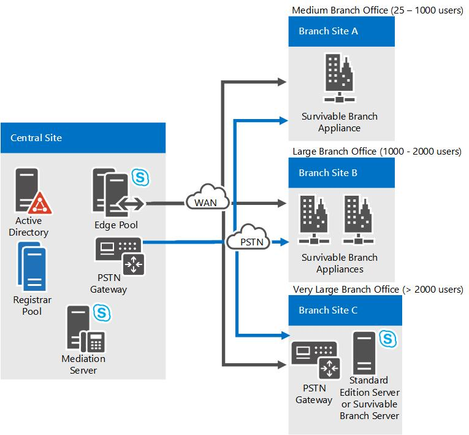

# Plan for Enterprise Voice resiliency in Skype for Business Server

Learn how to support voice resiliency in Skype for Business Server Enterprise Voice, at both central sites and branch sites. Branch site options include deploying Survivable Branch Appliances or Survivable Branch Servers.

Voice resiliency refers to the ability of users to continue making and receiving calls if a central site that hosts Skype for Business Server becomes unavailable, whether through a wide area network (WAN) failure or another cause. If a central site fails, Enterprise Voice service must continue uninterrupted through seamless failover to a backup site. In the event of WAN failure, branch site calls must be redirected to a local PSTN gateway. This section discusses planning for voice resiliency in the event of central-site or WAN failure.

## Central site resiliency

Increasingly, enterprises have multiple sites spread across the globe. Maintaining emergency services, access to help desk, and the ability to conduct critical business tasks when a central site is out of service is essential for any Enterprise Voice resiliency solution. When a central site becomes unavailable, the following conditions must be met:

- Voice failover must be provided.

- Users who ordinarily register with the Front End pool at the central site must be able to register with an alternative Front End pool. This can be done by creating multiple DNS SRV records, each of which resolves to a Director pool or Front End pool in each of your central sites. You can adjust the priority and weights of the SRV records so that users who are served by that central site get the corresponding Director and Front End pool ahead of those in other SRV records.

- Calls to and from users located at other sites must be rerouted to the PSTN.

This topic describes the recommended solution for securing central site voice resiliency.

### Architecture and Topology

Planning for voice resiliency at a central site requires a basic understanding of the central role played by the Skype for Business Server Registrar in enabling voice failover. The Skype for Business Server Registrar is a service that enables client registration and authentication and provides routing services. It runs on all Standard Edition server, Front End Server, Director, or Survivable Branch Appliance. A Registrar pool consists of Registrar Services running on the Front End pool and residing at the same site. A Skype for Business client discovers the Front End pool through the following discovery mechanism:

1. DNS SRV record

2. Autodiscovery Web Service

3. DHCP option 120

After the Skype for Business client connects to the Front End pool, it is directed by the load balancer to one of the Front End Servers in the pool. That Front End Server, in turn, redirects the client to a preferred Registrar in the pool.

Each user enabled for Enterprise Voice is assigned to a particular Registrar pool, which becomes that user's primary Registrar pool. At a given site, hundreds or thousands of users typically share a single primary Registrar pool. To account for the consumption of central site resources by any branch site users that rely on the central site for presence, conferencing, or failover, we recommend that you consider each branch site user as though the user were a user registered with the central site. There are currently no limits on the number of branch site users, including users registered with a Survivable Branch Appliance.

To assure voice resiliency in the event of a central site failure, the primary Registrar pool must have a single designated backup Registrar pool located at another site. The backup can be configured by using Topology Builder resiliency settings. Assuming a resilient WAN link between the two sites, users whose primary Registrar pool is no longer available are automatically directed to the backup Registrar pool.

The following steps describe the client discovery and registration process:

1. A client discovers Skype for Business Server through DNS SRV records. In Skype for Business Server, DNS SRV records can be configured to return more than one FQDN to the DNS SRV query. For example, if enterprise Contoso has three central sites (North America, Europe, and Asia-Pacific) and a Director pool at each central site, DNS SRV records can point to the Director pool FQDNs in each of the three locations. As long as the Director pool in one of the locations is available, the client can connect to the first hop Skype for Business Server.

    > [!NOTE]
    > Using a Director pool is optional. A Front End pool can be used instead.

2. The Director pool informs the Skype for Business client about the user's primary Registrar pool and backup Registrar pool.

3. The Skype for Business client attempts to connect to the user's primary Registrar pool first. If the primary Registrar pool is available, the Registrar accepts the registration. If the primary Registrar pool is unavailable, the Skype for Business client attempts to connect to the backup Registrar pool. If the backup Registrar pool is available and has determined that the user's primary Registrar pool is unavailable (by detecting a lack of heartbeat for a specified failover interval) the backup Registrar pool accepts the user's registration. After the backup Registrar detects that the primary Registrar is again available, the backup Registrar pool will redirect failover clients to their primary pool.

### Requirements and Recommendations

The following requirements and recommendations for implementing central site voice resiliency are appropriate for most organizations:

- The sites in which the primary and backup Registrar pools reside should be connected by a resilient WAN link.

- Each central site must contain a Registrar pool consisting of one or more Registrars.

- Each Registrar pool must be load-balanced by using DNS load balancing, hardware load balancing, or both. For detailed information about planning your load balancing configuration, see [Load balancing requirements for Skype for Business](../../plan-your-deployment/network-requirements/load-balancing.md).

- Each user must be assigned to a primary Registrar pool by using either the Skype for Business Server Management Shell **set-CsUser** cmdlet or the Skype for Business Server Control Panel.

- The primary Registrar pool must have a single backup Registrar pool located in a different central site.

- The primary Registrar pool must be configured to fail over to the backup Registrar pool. By default, the primary Registrar is set to fail over to the backup Registrar pool after an interval of 300 seconds. You can change this interval by using the Skype for Business Server Topology Builder.

- Configure a failover route. When configuring the route, specify a gateway that is located at a different site from the gateway specified in the primary route.

- If the central site contained your primary management server and the site is likely to be down for an extended period, you will need to reinstall your management tools at the backup site; otherwise, you won't be able to change any management settings.

### Dependencies

Skype for Business Server depends on the following infrastructure and software components to assure voice resiliency:

|**Component**   |**Functional**   |
|:-----|:-----|
|DNS    |Resolving SRV records and A records for server-server and server-client connectivity    |
|Exchange and Exchange Web Services (EWS)    |Contact storage; calendar data    |
|Exchange Unified Messaging and Exchange Web Services    |Call logs, voice mail list, voice mail    |
|DHCP Options 120    |If DNS SRV is unavailable, the client will attempt to use DHCP Option 120 to discover the Registrar. For this to work, either a DHCP server must be configured or Skype for Business Server DHCP must be enabled.    |

### Survivable Voice Features

If the preceding requirements and recommendations have been implemented, the following voice features will be provided by the backup Registrar pool:

- Outbound PSTN calls

- Inbound PSTN calls, if the telephony service provider supports the ability to fail over to a backup site

- Enterprise calls between users at both the same site and between two different sites

- Basic call handling, including call hold, retrieval, and transfer

- Two-party instant messaging and sharing audio and video between users at the same site

- Call forwarding, simultaneous ringing of endpoints, call delegation, and team call services, but only if both parties to call delegation, or all team members, are configured at the same site.

- Existing phones and clients continue to work.

- Call detail recording (CDR)

- Authentication and authorization

Depending on how they are configured, the following voice features may or may not work when a primary central site is out of service:

- Voice mail deposit and retrieval

    If you want to make Exchange UM available when the primary central site is out of service, you must do one of the following:

  - Change DNS SRV records so that the Exchange UM servers at the central site point to backup Exchange UM servers at another site.

  - Configure each user's Exchange UM dial plan to include Exchange UM servers at both the central site and the backup site, but designate the backup Exchange UM servers as disabled. If the primary site becomes unavailable, the Exchange administrator has to mark the Exchange UM servers at the backup site as enabled.

    If neither of the preceding solutions is possible, then Exchange UM will not be available in the event the central site becomes unavailable.

- Conferencing of all types

    A user who has failed over to a backup site can join a conference that is created or hosted by an organizer whose pool is available but cannot create or host a conference on his or her own primary pool, which is no longer available. Similarly, others users cannot join conferences that are hosted on the affected user's primary pool.

The following voice features do not work when a primary central site is out of service:

- Conference Auto-Attendant

- Presence and DND-based routing

- Updating call forwarding settings

- Response Group service and Call Park

- Provisioning new phones and clients

- Address Book Web Search

## Branch site resiliency

If you want to provide branch-site resiliency, that is, high-availability Enterprise Voice service, you have three options for doing so:

- Survivable Branch Appliance

- Survivable Branch Server

- A full Skype for Business Server deployment at the branch site

This guide will help you evaluate which resiliency solution is best for your organization and, based on your resiliency solution, which PSTN-connectivity solution to use. It will also help you prepare to deploy the solution that you choose by describing prerequisites and other planning considerations.

### Branch site resiliency features

If you provide branch-site resiliency, if a branch site's WAN connection to a central site fails or if the central site is unreachable, the following voice features should continue to be available:

- Inbound and outbound public switched telephone network (PSTN) calls

- Enterprise calls between users at both the same site and between two different sites

- Basic call handling, including call hold, retrieval, and transfer

- Two-party instant messaging

- Call forwarding, simultaneous ringing of endpoints, call delegation, and team call services, but only if the delegator and delegate (for example, a manager and the manager's administrator), or all team members, are configured at the same site

- Call detail records (CDRs)

- PSTN dial-in conferencing with Conferencing Auto-Attendant

- Voice mail capabilities, if you configure voice mail rerouting settings.

- User authentication and authorization

The following features will be available only if your resiliency solution is a full-scale Skype for Business Server deployment at the branch site:

- IM, web, and A/V conferencing

- Presence and Do Not Disturb (DND)-based routing (where calls are prevented from ringing on extensions that have DND activated)

- Updating call forwarding settings

- Response Group application and Call Park application

- Provisioning new phones and clients, but only if Active Directory Domain Services is present at the branch site.

- Enhanced 9-1-1 (E9-1-1)

    If E9-1-1 is deployed, and the SIP trunk at the central site is not available because the WAN link is down, then the Survivable Branch Appliance will route E9-1-1 calls to the local branch gateway. To enable this feature, the branch-site users' voice policies should route calls to the local gateway in the event of WAN failure.

> [!NOTE]
> SBA (survivable branch office) is not supported for XMPP. Users homed in a SBA configurations will not be able to send IMs or see Presence with XMPP contacts.

### Branch site resiliency solutions

There are obvious advantages to providing branch-site resiliency to your organization. Specifically, if you lose the connection to the central site, branch site users will continue to have Enterprise Voice service and voice mail (if you configure voice mail rerouting settings). However, for sites with fewer than 25 users, a resiliency solution may not provide a sufficient return on investment.

If you decide to provide branch-site resiliency, you have three options. The following table can help you determine the best option for your organization.

|**If you…**|**We recommend that you use a…**|
|:-----|:-----|
|Host between 25 and 1000 users at your branch site, and if the return on investment does not support a full deployment or where local administrative support is unavailable    |Survivable Branch Appliance    The Survivable Branch Appliance is an industry-standard blade server with a Skype for Business Server Registrar and Mediation Server running on Windows Server 2008 R2. The Survivable Branch Appliance also contains a public switched telephone network (PSTN) gateway. Qualified third-party devices (developed by Microsoft partners in the Survivable Branch Appliance (SBA) qualification/certification program) provide a continuous PSTN connection in the event of WAN failure, but this approach does not provide resilient presence and conferencing because these features depend on Front End Servers at the central site.    For details about Survivable Branch Appliances, see "Survivable Branch Appliance Details," later in this topic.    **Note:** If you decide to also use a SIP trunk with your Survivable Branch Appliance, contact your Survivable Branch Appliance vendor to learn about which service provider is best for your organization.   |
|Host between 1000 and 2000 users at your branch site, lack a resilient WAN connection, and have trained Skype for Business Server administrators available    |Survivable Branch Server or two Survivable Branch Appliances.    The Survivable Branch Server is a Windows Server meeting specified hardware requirements that has Skype for Business Server Registrar and Mediation Server software installed on it. It must connect to either a PSTN gateway or a SIP trunk to a telephone service provider.    For details about Survivable Branch Servers, see "Survivable Branch Server Details," later in this topic.    |
|If you require presence and conferencing features in addition to voice features for up to 5000 users, and have trained Skype for Business Server administrators available    |Deploy as a central site with a Standard Edition server rather than as a branch site.    A full-scale Skype for Business Server deployment provides a continuous PSTN connection and resilient presence and conferencing in the event of WAN failure.    |

#### Resiliency Topologies

The following figure shows the recommended topologies for branch-site resiliency.

**Branch site resiliency options**

#### Survivable Branch Appliance Details

The Skype for Business Server Survivable Branch Appliance includes the following components:

- A Registrar for user authentication, registration and call routing

- A Mediation Server for handling signaling between the Registrar and a PSTN gateway

- A PSTN gateway for routing calls to the PSTN as a fallback transport in the event of a WAN outage

- SQL Server Express for local user data storage

The Survivable Branch Appliance also includes PSTN trunks, analog ports, and an Ethernet adapter.

If the branch site's WAN connection to a central site becomes unavailable, internal branch users continue to be registered with the Survivable Branch Appliance Registrar and obtain uninterrupted voice service by using the Survivable Branch Appliance connection to the PSTN. Branch site users who connect from home or other remote locations will be able to register with a Registrar server at a central site if the WAN link to the branch site is unavailable. These users will have full unified communications functionality, with the one exception that inbound calls to the branch site will go to voice mail. When the WAN connection becomes available, full functionality should be restored to branch site users. Neither the failover to the Survivable Branch Appliance nor the restoration of service requires the presence of an IT administrator.

Skype for Business Server supports up to two Survivable Branch Appliance at a branch site.

#### Survivable Branch Appliance Deployment Overview

The Survivable Branch Appliance is manufactured by original equipment manufacturers in partnership with Microsoft and deployed on their behalf by value-added retailers. This deployment should occur only after Skype for Business Server has been deployed at the central site, a WAN connection to the branch site is in place, and branch site users are enabled for Enterprise Voice.

For details about these phases, see [Deploying a Survivable Branch Appliance or Server](https://technet.microsoft.com/library/cb780c14-dc5f-41ba-8092-f20ae905bd16.aspx) in the Deployment documentation.

|**Phase**|**Steps**|**User Rights**|
|:-----|:-----|:-----|
|Set up Active Directory Domain Services for the Survivable Branch Appliance    |**At the central site:**    Create a domain user account (or enterprise identity) for the technician who will install and activate the Survivable Branch Appliance at the branch site.    Create a computer account (with the applicable fully qualified domain name (FQDN)) for Survivable Branch Appliance in Active Directory Domain Services.    In Topology Builder, create and publish the Survivable Branch Appliance.   |The technician user account must be a member of RTCUniversalSBATechnicians. The Survivable Branch Appliance must belong to the RTCSBAUniversalServices group, which happens automatically when you use Topology Builder.    |
|Install, and activate the Survivable Branch Appliance.    |**At the branch site:**    Connect the Survivable Branch Appliance to an Ethernet port and PSTN port.    Start the Survivable Branch Appliance.    Join the Survivable Branch Appliance to the domain, using the domain user account created for the Survivable Branch Appliance at the central site. Set the FQDN and IP address to match the FQDN created in the computer account.    Configure the Survivable Branch Appliance using the OEM user interface.    Test PSTN connectivity.   |The technician user account must be a member of RTCUniversalSBATechnicians.    |

#### Survivable Branch Server Details

In Topology Builder create the branch site, add the Survivable Branch Server to that site, and then run the Skype for Business Server Deployment Wizard on the computer where you want to install the role.

### Branch site resiliency requirements

This topic will help you to prepare users for branch-site resiliency and voice mail survivability, and also specifies the relevant hardware and software requirements.

#### Preparing Branch Users for Branch-Site Resiliency

Prepare users for branch-site resiliency by setting their Registrar pool as the Survivable Branch Appliance (SBA) or Survivable Branch Server.

#### Registrar Assignments for Branch Users

Regardless of which branch-site resiliency solution you choose, you will need to assign a primary Registrar to each user. Branch site users should always register with the Registrar at the branch site, regardless of whether that Registrar resides in the Survivable Branch Appliance, Survivable Branch Server, or stand-alone Skype for Business Server Standard or Enterprise Edition server. A domain name system (DNS) service (SRV) resource record is required so that a client can discover its Registrar pool. If the Survivable Branch Appliance becomes unavailable, this is how branch site clients will automatically discover the backup Registrar.

If a branch site does not have a DNS server, there are two alternative ways to configure discovery of the Survivable Branch Appliance or Survivable Branch Server:

- Configure DHCP option 120 on the branch site's Dynamic Host Configuration Protocol (DHCP) server to point to the fully qualified domain name (FQDN) of the Survivable Branch Appliance or Survivable Branch Server.

- Configure the Survivable Branch Appliance or Survivable Branch Server to respond to DHCP 120 queries.

#### Voice Routing for Branch Users

We recommend that you create a separate user-level Voice over Internet Protocol (VoIP) policy for users in a branch site. This policy should include a primary route that uses the Survivable Branch Appliance or branch server gateway, and one or more backup routes that use a trunk with a public switched telephone network (PSTN) gateway at the central site. If the primary route is unavailable, the backup route that uses one or more central site gateways is used instead. This way, regardless of where a user is registered—on the branch site Registrar or the backup Registrar pool at the central site—the user's VoIP policy is always in effect. This is an important consideration for failover scenarios. For example, if you need to rename the Survivable Branch Appliance or reconfigure the Survivable Branch Appliance to connect to a backup Registrar pool at the central site, then you must move branch site users to the central site for the duration. (For details about renaming or reconfiguring a Survivable Branch Appliance, see [Appendix B: Managing a Survivable Branch Appliance](https://technet.microsoft.com/library/2ec9d505-6d39-491c-9524-8cf36866b855.aspx) in the Deployment documentation.) If those users do not have user-level VoIP policies or user-level dial plans, when the users are moved to another site, the site-level VoIP policies and site-level dial plans of the central site apply to the users by default, instead of the branch site site-level VoIP policies and dial plans,. In this scenario, unless the site-level VoIP policies and site-level dial plans used by the backup Registrar pool can also apply to the branch site users, their calls will fail. For example, if users from a branch site located in Japan are moved to a central site in Redmond, then a dial plan with normalization rules that prepend +1425 to all 7-digit calls is unlikely to appropriately translate calls for those users.

> [!IMPORTANT]
> When you create a branch office backup route, we recommend that you add two PSTN phone usage records to the branch office user policy and assign separate routes to each one. The first, or primary, route would direct calls to the gateway associated with the Survivable Branch Appliance (SBA) or branch server; the second, or backup, route would direct calls to the gateway at the central site. In directing calls, the SBA or branch server will attempt all routes assigned to the first PSTN usage record before attempting the second usage record.

To help ensure that inbound calls to branch site users will reach those users when the branch gateway or the Windows component of the Survivable Branch Appliance site is unavailable (which would happen, for example, if the Survivable Branch Appliance or branch gateway were down for maintenance), create a failover route on the gateway (or work with your Direct Inward Dialing (DID) provider) to redirect incoming calls to the backup Registrar pool at the central site. From there, the calls will be routed over the WAN link to branch users. Be sure that the route translates numbers to comply with the PSTN gateway or other trunk peer's accepted phone number formats. For details about creating a failover route, see [Configuring a Failover Route](https://technet.microsoft.com/library/76e48df4-3b78-4fb7-b1f7-c1e604b81bad.aspx). Also create service-level dial plans for the trunk associated with the gateway at the branch site to normalize incoming calls. If you have two Survivable Branch Appliances at a branch site, you can create a site-level dial plan for both unless a separate service-level plan for each is necessary.

> [!NOTE]
> To account for the consumption of central site resources by any branch site users that rely on the central site for presence, conferencing, or failover, we recommend that you consider each branch site user as if the user were registered with the central site. There are currently no limits on the number of branch site users, including users registered with a Survivable Branch Appliance.

We also recommend that you create a user-level dial plan and voice policy, and then assign it to branch site users. For details, see [Create or modify a dial plan in Skype for Business Server](../../deploy/deploy-enterprise-voice/dial-plans.md) and [Create the VoIP Routing Policy for Branch Users](https://technet.microsoft.com/library/10deca9f-f870-4a42-b25d-e4fc53108658.aspx) in the Deployment documentation.

#### Routing Extension Numbers

When preparing dial plans and voice policies for branch site users, be sure to include normalization rules and translation rules that match the strings and number format used in the msRTCSIP-line (or Line URI) attribute, so that Skype for Business calls enabled between branch site users and central site users will be routed correctly—particularly when calls must be rerouted over the PSTN because the WAN link is unavailable. Additionally, there are special considerations for dialed numbers that include extension numbers, rather just phone numbers.

Normalization rules and translations rules that match Line URIs that contain an extension number, whether exclusively or in addition to a full E.164 phone number, have additional requirements. This section describes several example scenarios to route calls for Line URIs with an extension number.

If your organization does not have Direct Inward Dial (DID) phone numbers configured for individual users and the Line URI of each user is configured with only an extension number, internal users can call one another by dialing only an extension number. However, you must configure normalization rules that can apply to calls from a branch site user to a central site user, that match the extension numbers.

In a scenario where the WAN link between a branch site and a central site is available, calls from branch site users to central site users do not require the matching normalization rule to translate the number because the call is not routed over the PSTN. For example:

|**Rule name**|**Description**|**Number pattern**|**Translation**|**Example**|
|:-----|:-----|:-----|:-----|:-----|
|5digitExtensions    |Does not translate 5-digit numbers    |^(\d{5})$    |$1    |10001 is not translated    |

You must also accommodate extension numbers for specific scenarios, such as when the WAN link between a branch site and central site is unavailable and a call from a branch site must be routed over the PSTN. During a WAN outage, if a branch site user calls a central site user only by dialing the central site user's extension, you must have an outbound translation rule that adds the central site user's full phone number. If a user's Line URI contains your organization's full phone number and the user's unique extension number instead of a full phone number that is unique to the user, then you must have an outbound translation rule that adds your organization's full phone number instead. For example:

|**Description**|**Matching pattern**|**Translation**|**Example**|
|:-----|:-----|:-----|:-----|
|Translates 5-digit numbers to a user's phone number and extension    |^(\d{5})$    |+14255550123;ext=$1    |10001 is translated to +14255550123;ext=10001    |
|Translates 5-digit numbers to your organization's phone number and a user's extension    |^(\d{5})$    |+14255550100;ext=$1    |10001 is translated to +14255550100;ext=10001    |

In this scenario, if the trunk peer that handles rerouting to the PSTN does not support extension numbers, then the outbound translation rule must also remove the extension number. For example:

|**Description**|**Matching pattern**|**Translation**|**Example**|
|:-----|:-----|:-----|:-----|
|Removes extension from phone numbers with extensions    |^\+(\d\*);ext=(\d\*)$    |+$1    |+14255550123;ext=10001 is translated to +14255550123    |

Whether or not a WAN link is available, if your organization does not have DID numbers configured for individual users and the Line URI for a user contains your organization's phone number and the user's unique extension number, then you must configure your organization's phone number Line URI with a number that is reachable by the trunk peer or PSTN gateway at the branch site. You must also configure your organization's phone number Line URI to include its own unique extension for calls to be routed to that number.

#### Preparing for Voice Mail Survivability

Exchange Unified Messaging (UM) is usually installed only at a central site and not at branch sites. A caller should be able to leave a voice mail message, even if the WAN link between branch site and central site is unavailable. As a result, configuring the Line URI for the Exchange UM Auto Attendant phone number that provides voice mail for branch site users requires special considerations, in addition to the voice policy, dial plan, and normalization rules applicable to that voice mail number.

Survivable Branch Appliances (SBAs) and Survivable Branch Servers provide voice mail survivability for branch users during a WAN outage. Specifically, if you are using a Survivable Branch Appliance or Survivable Branch Server and the WAN becomes unavailable, the SBA or Survivable Branch Server reroutes unanswered calls over the PSTN to Exchange UM at the central site. With a SBA or Survivable Branch Server, users can also retrieve voice mail messages through the PSTN during a WAN outage. Finally, during a WAN outage the Survivable Branch Appliance or Survivable Branch Server queues missed-call notifications and then uploads them to the Exchange UM server when the WAN is restored. To help ensure that voice mail rerouting is resilient, be sure that you add an entry for the central site pool's FQDN and an entry for the Edge Server FQDN to the hosts file on the Survivable Branch Server. Otherwise, DNS resolution can time out if you do not have a DNS server at the branch site.

We recommend the following configurations for voice mail survivability for branch site users:

- An Microsoft Exchange administrator should configure Exchange UM Auto Attendant (AA) to accept messages only. This configuration disables all other generic functionality, such as transfer to a user or transfer to an operator, and limits the AA to only accepting messages. Alternatively, the Exchange administrator can use a generic AA or an AA customized to route the call to an operator.

- The Skype for Business Server administrator should take the AA phone number and use that phone number as the **exchange um auto attendant** number in the voice mail rerouting settings for the Survivable Branch Appliance or branch server.

- The Skype for Business Server administrator should get the Exchange UM subscriber access phone number and use that number as the **subscriber access** number in the voice mail rerouting settings for the Survivable Branch Appliance or Survivable Branch Server.

- The Skype for Business Server administrator should configure Exchange UM so that only one dial plan is associated with all branch users who need access to voice mail during a WAN outage.

- When the WAN link is unavailable, calls to branch site users can be routed to the user's Exchange Unified Messaging (UM) voice mailbox, but only if the voice policy applied to the call specifies a voice mail phone number that is unique and does not include an extension number.

#### Hardware and Software Requirements for Branch-Site Resiliency

The hardware and software requirements vary, depending on your resiliency solution.

#### Requirements for Survivable Branch Appliances

Required hardware and software is built into the Survivable Branch Appliance. However, we also recommend that each branch site deploy a DHCP server to obtain client IP addresses; otherwise, when the DHCP lease expires, clients will not have IP connectivity.

If the enterprise DNS servers are located only in central sites, branch site users will be unable to connect to them during a WAN outage, and therefore Skype for Business Server discovery that uses DNS SRV (service (SRV) resource record) will fail. To assure prompt rerouting during a WAN outage, DNS records must be cached at the branch site. If the branch router supports it, turn on DNS caching. Or, you can deploy a DNS server at the branch. This can be a stand-alone server or a version of the Survivable Branch Appliance that supports DNS capabilities. For details, contact your Survivable Branch Appliance provider.

> [!NOTE]
> It is not necessary to have a domain controller at a branch site. The Survivable Branch Appliance authenticates clients by using a special certificate that it sends the client in response to the client's certificate request when it signs in.

Skype for Business clients can discover the Skype for Business Server by using DHCP Option 120 (SIP Registrar Option). This can be configured in one of two ways:

- Configure the DHCP server at the branch site to reply to DHCP 120 queries, which return the FQDN of the Registrar on the Survivable Branch Appliance or Survivable Branch Server.

- Turn on Skype for Business Server DHCP. When this is turned on, the Skype for Business Server Registrar responds to DHCP Option 120 queries. Note that the Registrar does not respond to any DHCP queries other than DHCP Options 120.

Additionally, for larger branch sites that have multiple subnets, DHCP relay agents should be enabled to forward DHCP Option 120 queries to the DHCP Server (configuration 1) or to the Registrar (configuration 2).

Finally, branch site users must be configured for Enterprise Voice and provisioned with an appropriate unified communications endpoint.

#### Requirements for Survivable Branch Servers

The requirements for Survivable Branch Servers are the same as the requirements for a Front End Server. For details, see [Server requirements for Skype for Business Server 2015](../../plan-your-deployment/requirements-for-your-environment/server-requirements.md).

#### Requirements for Full-Scale Skype for Business Server Branch-Site Deployments

For details, see [Server requirements for Skype for Business Server 2015](../../plan-your-deployment/requirements-for-your-environment/server-requirements.md) in the Planning documentation.

### Example: configuring a failover route

 The following example shows how an administrator can define a failover route for use if the Dallas-GW1 is down for maintenance or is otherwise unavailable. The following tables illustrate the required configuration change.

**Table 1. User Policy**

|**User policy**|**Phone usage**|
|:-----|:-----|
|Default Calling Policy    |Local    GlobalPSTNHopoff    |
|Redmond Local Policy    |RedmondLocal    |
|Dallas Calling Policy    |DallasUsers    GlobalPSTNHopoff    |

**Table 2. Routes**

| **Route name**             | **Number pattern** | **Phone usage**         | **Trunk**                                 | **Gateway**                                     |
|:---------------------------|:-------------------|:------------------------|:------------------------------------------|:------------------------------------------------|
| Redmond Local Route    | ^\+1(425           | 206                     | 253)(\d{7})$                          | Local    RedmondLocal                   |
| Dallas Local Route     | ^\+1(972           | 214                     | 469)(\d{7})$                          | Local                                       |
| Universal Route        | ^\+?(\d\*)$    | GlobalPSTNHopoff    | Trunk1    Trunk2    Trunk3    | Red-GW1    Red-GW2    Dallas-GW1    |
| Dallas Users Route     | ^\+?(\d\*)$    | DallasUsers         | Trunk3                                | Dallas-GW1                                  |

In Table 1, a phone usage of GlobalPSTNHopoff is added after the DallasUsers phone usage in the Dallas Calling Policy. This enables calls with the Dallas Calling policy to use routes that are configured for the GlobalPSTNHopoff phone usage if a route for the DallasUsers phone usage is unavailable.

