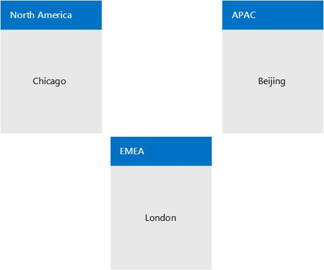
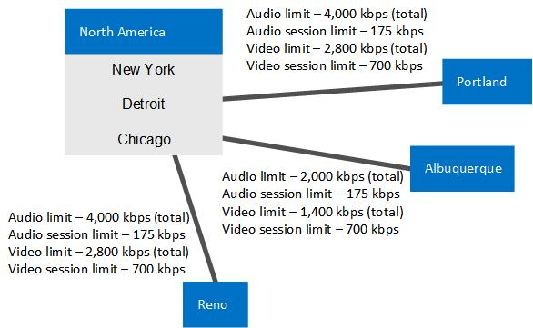
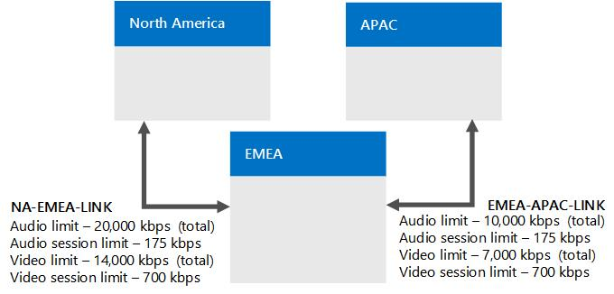
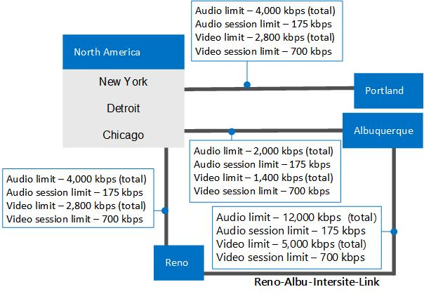

# Example: Gathering requirements for call admission control in Skype for Business Server

Provides a detailed example of planning for call admission control in Skype for Business Server Enterprise Voice, including gathering information about your network's sites, regions, and bandwidth.

This example shows you how to plan for and implement call admission control (CAC). At a high level, this consists of the following activities:

1. Identify all of your network hubs and backbones (known as network regions).

2. Identify the Skype for Business Server central site that will manage CAC for each network region.

3. Identify and define the network sites that are connected to each network region.

4. For each network site whose connection to the WAN is bandwidth-constrained, describe the bandwidth capacity of the WAN connection and the bandwidth limits that to the network administrator has set for Skype for Business Server media traffic, if applicable. You do not need to include sites whose connection to the WAN is not bandwidth-constrained.

5. Associate each subnet in your network with a network site.

6. Map the links between the network regions. For each link, describe its bandwidth capacity and any limits that the network administrator has placed on Skype for Business Server media traffic.

7. Define a route between every pair of network regions.

## Gather the Required Information

To prepare for call admission control, gather the information described in the following steps:

1. Identify your network regions. A network region represents a network backbone or a network hub. 

    A network backbone or a network hub is a part of computer network infrastructure that interconnects various pieces of network, providing a path for the exchange of information between different LANs or subnets. A backbone can tie together diverse networks, from a small location to a wide geographic area. The backbone's capacity is typically greater than that of the networks connected to it.

    Our example topology has three network regions: North America, EMEA, and APAC. A network region contains a collection of network sites. Work with your network administrator to define the network regions for your enterprise.

2. Identify each network region's associated central site. A central site contains at least one Front End Server and is the Skype for Business Server deployment that will manage CAC for all media traffic that passes through the network region's WAN connection.

   **An example enterprise network divided into three network regions**

     

    > [!NOTE]
    > A Multiprotocol Label Switching (MPLS) network should be represented as a network region in which each geographic location has a corresponding network site. For details, see [Components and topologies for call admission control in Skype for Business](components-and-topologies.md). 

    In the preceding example network topology, there are three network regions, each with a Skype for Business Server central site that manages CAC. The appropriate central site for a network region is chosen by the geographic vicinity. Because media traffic will be heaviest within network regions, the ownership by geographic vicinity makes it self-contained and will continue to be functional even if other central sites become unavailable. 

    In this example, a Skype for Business deployment named Chicago is the central site for the North America region.

    All Skype for Business users in North America are homed on servers in the Chicago deployment. The following table shows central sites for all three network regions.

    **Network Regions and their Associated Central Sites**

    |**Network Region**|**Central Site**|
    |:-----|:-----|
    |North America    |Chicago    |
    |EMEA    |London    |
    |APAC    |Beijing    |

    > [!NOTE]
    > Depending on your Skype for Business Server topology, the same central site can be assigned to multiple network regions. 

3. For each network region, identify all of the network sites (offices or locations) whose WAN connections are not bandwidth-constrained. Because these sites are not bandwidth constrained, you do not need to apply CAC bandwidth policies to them.

    In the example shown in the following table, three network sites do not have bandwidth-constrained WAN links: New York, Chicago, and Detroit.

   **Network Sites not Constrained by WAN Bandwidth**

   | **Network Site** | **Network Region**   |
   |:-----------------|:---------------------|
   | New York     | North America    |
   | Chicago      | North America    |
   | Detroit      | North America    |

4. For each network region, identify all of the network sites that connect to the network region through bandwidth-constrained WAN links.

    To help ensure audio and video quality, we recommend that these bandwidth-constrained network sites have their WANs monitored and CAC bandwidth policies that limit media (voice or video) traffic flow to and from the network region.

    In the example shown in the following table, there are three network sites that are constrained by WAN bandwidth: Portland, Reno and Albuquerque.

   **Network Sites Constrained by WAN Bandwidth**

   |**Network Site**|**Network Region**|
   |:-----|:-----|
   |Albuquerque    |North America    |
   |Reno    |North America    |
   |Portland    |North America    |

   **CAC network region North America with three network sites that are unconstrained by bandwidth (Chicago, New York, and Detroit) and three network sites that are constrained by WAN bandwidth (Portland, Reno, and Albuquerque)**

     

5. For each bandwidth-constrained WAN link, determine the following:

   - Overall bandwidth limit that you want to set for all concurrent audio sessions. If a new audio session will cause this limit to be exceeded, Skype for Business Server does not allow the session to start.

   - Bandwidth limit that you want to set for each individual audio session. The default CAC bandwidth limit is 175 kbps, but it can be modified by the administrator.

   - Overall bandwidth limit that you want to set for all concurrent video sessions. If a new video session will cause this limit to be exceeded, Skype for Business Server does not allow the session to start.

   - Bandwidth limit that you want to set for each individual video session. The default CAC bandwidth limit is 700 kbps, but it can be modified by the administrator.

     **Network Sites with WAN Bandwidth Constraint Information (Bandwidth in kbps)**

     | **Network Site**   | **Network Region**   | **BW Limit**      | **Audio Limit**   | **Audio Session Limit** | **Video Limit**   | **Video Session Limit** |
     |:-------------------|:---------------------|:------------------|:------------------|:------------------------|:------------------|:------------------------|
     | Albuquerque    | North America    | 5,000         | 2,000         | 175                 | 1,400         | 700                 |
     | Reno           | North America    | 10,000        | 4,000         | 175                 | 2,800         | 700                 |
     | Portland       | North America    | 5,000         | 4,000         | 175                 | 2,800         | 700                 |
     | New York       | North America    | (no limit)    | (no limit)    | (no limit)          | (no limit)    | (no limit)          |
     | Chicago        | North America    | (no limit)    | (no limit)    | (no limit)          | (no limit)    | (no limit)          |
     | Detroit        | North America    | (no limit)    | (no limit)    | (no limit)          | (no limit)    | (no limit)          |

6. For every subnet in your network, specify its associated network site.

    > [!IMPORTANT]
    > Every subnet in your network must be associated with a network site, even if the network site is not bandwidth constrained. This is because call admission control uses subnet information to determine at which network site an endpoint is located. When the locations of both parties in the session are determined, call admission control can determine if there is sufficient bandwidth to establish a call. When a session is established over a link that has no bandwidth limits, an alert is generated. 

    > [!IMPORTANT]
    > If you deploy Audio/Video Edge Servers, the public IP addresses of each Edge Server must be associated with the network site where the Edge Server is deployed. Each public IP address of the A/V Edge Server must be added to your network configuration settings as a subnet with a subnet mask of 32. For example, if you deploy A/V Edge Servers in Chicago, then for each external IP address of those servers create a subnet with a subnet mask of 32 and associate network site Chicago with those subnets. For details about public IP addresses, see [Plan network requirements for Skype for Business](../../plan-your-deployment/network-requirements/network-requirements.md). 

    A Key Health Indicator (KHI) alert is raised, specifying a list of IP addresses that are present in your network but are either not associated with a subnet, or the subnet that includes the IP addresses is not associated with a network site. This alert will not be raised more than once within an 8 hour period. The relevant alert information and an example are as follows:

    **Source**: CS Bandwidth Policy Service (Core) 

    **Event number**: 36034

    **Level**: 2

    **Description**: The subnets for the following IP Addresses: \<List of IP Addresses\> are either not configured or the subnets are not associated to a network site. 

    **Cause**: The subnets for the corresponding IP addresses are missing from the network configuration settings or the subnets are not associated to a network site. 

    **Resolution**: Add subnets corresponding to the preceding list of IP addresses into the network configuration settings and associate every subnet to a network site.

    For example, if the IP address list in the alert specifies 10.121.248.226 and 10.121.249.20, either these IP addresses are not associated with a subnet, or the subnet that they are associated with does not belong to a network site. If 10.121.248.0/24 and 10.121.249.0/24 are the corresponding subnets for these addresses, you can resolve this issue as follows:

    a. Be sure that IP address 10.121.248.226 is associated with the 10.121.248.0/24 subnet and IP address 10.121.249.20 is associated with the 10.121.249.0/24 subnet.

    b. Be sure that the 10.121.248.0/24 and 10.121.249.0/24 subnets are each associated with a network site.

   **Network Sites and Associated Subnets (Bandwidth in kbps)**

   | **Network Site**   | **Network Region**   | **BW Limit**      | **Audio Limit**   | **Audio Session Limit** | **Video Limit**   | **Video Session Limit** | **Subnets**                                                            |
   |:-------------------|:---------------------|:------------------|:------------------|:------------------------|:------------------|:------------------------|:-----------------------------------------------------------------------|
   | Albuquerque    | North America    | 5,000         | 2,000         | 175                 | 1,400         | 700                 | 172.29.79.0/23, 157.57.215.0/25, 172.29.90.0/23, 172.29.80.0/24    |
   | Reno           | North America    | 10,000        | 4,000         | 175                 | 2,800         | 700                 | 157.57.210.0/23, 172.28.151.128/25                                 |
   | Portland       | North America    | 5,000         | 4,000         | 175                 | 2,800         | 700                 | 172.29.77.0/24 10.71.108.0/24, 157.57.208.0/23                     |
   | New York       | North America    | (no limit)    | (no limit)    | (no limit)          | (no limit)    | (no limit)          | 172.29.80.0/23, 157.57.216.0/25, 172.29.91.0/23, 172.29.81.0/24    |
   | Chicago        | North America    | (no limit)    | (no limit)    | (no limit)          | (no limit)    | (no limit)          | 157.57.211.0/23, 172.28.152.128/25                                 |
   | Detroit        | North America    | (no limit)    | (no limit)    | (no limit)          | (no limit)    | (no limit)          | 172.29.78.0/24 10.71.109.0/24, 157.57.209.0/23                     |

7. In Skype for Business Server call admission control, the connections between network regions are called region links. For each region link, determine the following, just as you did for the network sites:

   - Overall bandwidth limit that you want to set for all concurrent audio sessions. If a new audio session will cause this limit to be exceeded, Skype for Business Server does not allow the session to start.

   - Bandwidth limit that you want to set for each individual audio session. The default CAC bandwidth limit is 175 kbps, but it can be modified by the administrator.

   - Overall bandwidth limit that you want to set for all concurrent video sessions. If a new video session will cause this limit to be exceeded, Skype for Business Server does not allow the session to start.

   - Bandwidth limit that you want to set for each individual video session. The default CAC bandwidth limit is 700 kbps, but it can be modified by the administrator.

   **Network Region links with associated bandwidth limits**

     

   **Region Link Bandwidth Information (Bandwidth in kbps)**

   | **Region Link Name**  | **First Region**     | **Second Region** | **BW Limit**  | **Audio Limit** | **Audio Session Limit** | **Video Limit** | **Video Session Limit** |
   |:----------------------|:---------------------|:------------------|:--------------|:----------------|:------------------------|:----------------|:------------------------|
   | NA-EMEA-LINK      | North America    | EMEA          | 50,000    | 20,000      | 175                 | 14,000      | 700                 |
   | EMEA-APAC-LINK    | EMEA             | APAC          | 25,000    | 10,000      | 175                 | 7,000       | 700                 |

8. Define a route between every pair of network regions.

    > [!NOTE]
    > Two links are required for the route between the North America and APAC regions because there is no region link that directly connects them. 

   **Region Routes**

   | **Region Route Name**  | **First Region**     | **Second Region** | **Region Links**                    |
   |:-----------------------|:---------------------|:------------------|:------------------------------------|
   | NA-EMEA-ROUTE      | North America    | EMEA          | NA-EMEA-LINK                    |
   | EMEA-APAC-ROUTE    | EMEA             | APAC          | EMEA-APAC-LINK                  |
   | NA-APAC-ROUTE      | North America    | APAC          | NA-EMEA-LINK, EMEA-APAC-LINK    |

9. For every pair of network sites that are directly connected by a single link (called an inter-site link), determine the following:

     - Overall bandwidth limit that you want to set for all concurrent audio sessions. If a new audio session will cause this limit to be exceeded, Skype for Business Server does not allow the session to start.

     - Bandwidth limit that you want to set for each individual audio session. The default CAC bandwidth limit is 175 kbps, but it can be modified by the administrator.

     - Overall bandwidth limit that you want to set for all concurrent video sessions. If a new video session will cause this limit to be exceeded, Skype for Business Server does not allow the session to start.

     - Bandwidth limit that you want to set for each individual video session. The default CAC bandwidth limit is 700 kbps, but it can be modified by the administrator.

   **CAC network region North America showing the bandwidth capacities and bandwidth limits for the inter-site link between Reno and Albuquerque**

     

   **Bandwidth Information for an Inter-Site Link between Two Network Sites (Bandwidth in kbps)**

   |**Inter-Site Link Name**|**First Site**|**Second Site**|**BW Limit**|**Audio Limit**|**Audio Session Limit**|**Video Limit**|**Video Session Limit**|
   |:-----|:-----|:-----|:-----|:-----|:-----|:-----|:-----|
   |Reno-Albu-Intersite-Link    |Reno    |Albuquerque    |20,000    |12,000    |175    |5,000    |700    |

### Next Steps

After you have gathered the required information, you can perform CAC deployment either by using the Skype for Business Server Management Shell or Skype for Business Server Control Panel.

> [!NOTE]
> Although you can perform most network configuration tasks by using Skype for Business Server Control Panel, to create subnets and intersite links, you must use Skype for Business Server Management Shell. For details, see [New-CsNetworkSubnet](https://docs.microsoft.com/powershell/module/skype/new-csnetworksubnet?view=skype-ps) and [New-CsNetworkInterSitePolicy](https://docs.microsoft.com/powershell/module/skype/new-csnetworkintersitepolicy?view=skype-ps). 

