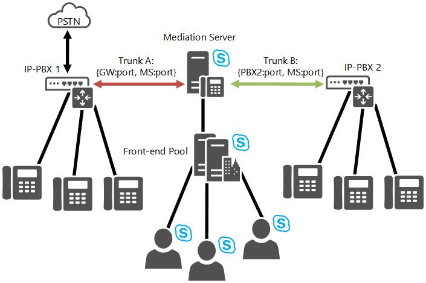

# Inter-trunk routing in Skype for Business Server
 
Learn how Skype for Business Server Enterprise Voice supports inter-trunk routing.
  
Skype for Business Server provides basic session management through the support of intertrunk routing. This enables Skype for Business Server to provide call control functionalities to downstream telephony systems. Intertrunk routing can interconnect an IP-PBX to a public switched telephone network (PSTN) gateway so that calls from a private branch exchange (PBX) phone can be routed to the PSTN, and incoming PSTN calls can be routed to a PBX phone. Similarly, Skype for Business Server can interconnect two or more IP-PBX systems so that calls can be placed and received between PBX phones from the different IP-PBX systems. 
  
The following figure illustrates Skype for Business Server providing interconnectivity between a PSTN gateway and an IP-PBX.
  

  
The next figure illustrates Skype for Business Server connecting two IP-PBX systems.
  

  

