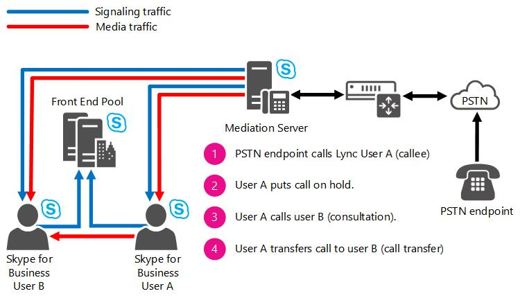

# Location-Based Routing for Conferencing in Skype for Business Server

Planning for location-based routing for conferencing in Skype for Business Server Enterprise Voice, including consultative call transfers.

Location-Based Routing makes it possible to restrict the routing of calls between VoIP endpoints and PSTN endpoints based on the location of the parties in the call. Location-Based Routing for Conferencing enables you to enforce Location-Based Routing rules on meetings (i.e. conferences) to prevent PSTN toll bypass. The application monitors an active conference and enforces Location-Based Routing restrictions based on the location of users participating. The Location-Based Routing for Conferencing application additionally enables the enforcement of Location-Based Routing restrictions to consultative transfers involving PSTN endpoints.

The Location-Based Routing Conferencing application provides to Skype for Business Conferences a mechanism for the prevention of PSTN toll bypass. The application monitors active conferences and enforces Location-Based Routing restrictions based on the location of the Skype for Business users participating.

The Location-Based Routing Conferencing application determines whether Location-Based Routing is to be enforced on a Skype for Business meeting if the following criteria are met:

- The meeting organizer is enabled for Location-Based Routing. Location-Based Routing restrictions will be applied only to conferences that are organized by users who are enabled for Location-Based Routing.

- At least one meeting participant is a PSTN endpoint. Location-Based Routing restrictions are applicable only for conferences that include PSTN endpoints.

- The network site where the PSTN gateway used to bridge the conference to the PSTN is located as well as the network sites where the organizers and participants are connecting from.

The Location-Based Routing for Conferencing application prevents the participation of Skype for Business users and PSTN endpoints from different network sites to the same conference. If the organizer of a meeting is enabled for Location-Based Routing, the Conferencing application enforces the following restrictions:

- The endpoints that can join a Skype for Business meeting depend on the endpoints that already joined the conference, and this restriction adjusts as joined endpoints leave and new endpoints join the conference. If organizers and participants are joining a Skype for Business meeting from the same network site, then a PSTN endpoint, another participant from the same network site, another participant from a different network site or a participant from an unknown network site are allowed to join.

- If organizers and participants are joining the meeting from different or unknown network sites, a PSTN endpoint is not allowed to join the meeting if the PSTN call ingresses from a SIP trunk enabled for Location-Based Routing.

- If organizers and participants are all joining the meeting from the same network site and there are participants joining the same meeting from the PSTN, a Skype for Business endpoint from a different network site is not allowed to join the meeting.

These conferencing Location-Based Routing restrictions are summarized in the following table.

|
|

|**User(s) in a conference at any given point**|**User(s) allowed to join the conference**|**User(s) not allowed to join the conference**|
|:-----|:-----|:-----|
|Skype for Business VoIP client user(s) from a single network site    |Skype for Business VoIP client user from the same network site    Skype for Business VoIP client user from a different network site    Skype for Business VoIP client user from an unknown network site    Federated Skype for Business VoIP client user    User joining from a PSTN endpoint    |None    |
|Skype for Business VoIP client user(s) from an unknown network site    |Skype for Business VoIP client user from any site    Skype for Business VoIP client user from an unknown site    Federated Skype for Business VoIP client user    |User joining via a PSTN endpoint    |
|Skype for Business VoIP client users from different network sites    |Skype for Business VoIP client user from any network site    Skype for Business VoIP client user from an unknown network site    Federated Skype for Business VoIP client user    |User joining via a PSTN endpoint    |
|Skype for Business VoIP client user(s) from a single network site and users joining from a PSTN endpoint    |Skype for Business VoIP client user from the same network site    |Skype for Business VoIP client user from a different network site    Skype for Business VoIP client user from an unknown network site    Federated Skype for Business VoIP client user    |

The following are additional characteristics of the Location-Based Routing for Conferencing application:

- When a user is not allowed to join a conference given Location-Based Routing restrictions, the call to the conference will be rejected and the Skype for Business client will report that the call was not completed or has ended.

- A PSTN endpoint joining a conference with Location-Based Routing enforcements will not be restricted to join the conference regardless of its state if the endpoint joins via a trunk that is not enabled for Location-Based Routing.

- A PBX system connected to a Mediation Server over a SIP trunk that does not egress calls to the PSTN will have the same enforcements as Skype for Business users located in the same network site where the SIP trunk is defined. For example, a PSTN endpoint will be able to join a conference with a PBX user and a Skype for Business user if they are located in the same network site; otherwise, the PSTN endpoint will not be allowed to join the conference if the PBX user is in a different network site than the Skype for Business user.

> [!NOTE]
> With Skype for Business Cumulative Update 4, the behavior in the following table should be observed:

|**User**|**Other Party**|**Action**|**Result**|
|:-----|:-----|:-----|:-----|
|Skype for Business Mobile    |PSTN    |Skype for Business Mobile is in a PSTN call. Skype for Business Mobile then escalates the call to a Conference Auto Attendant (CAA).    |The call is blocked, with an appropriate error message.    |
|Skype for Business Mobile    |Skype for Business Client or Federated User    |The Client or Federated User is on a VoIP call to a Skype for Business Mobile Location-Based Routing user, and either party escalates to a CAA.    |The escalation call is blocked, with an appropriate error message.    |

## Consultative call transfers

In addition to enforcing Location-Based Routing to Skype for Business meetings, the Location-Based Routing for Conferencing application enforces Location-Based Routing restrictions on consultative call transfers that egress to PSTN endpoints. A consultative call transfer is a call established between two parties where one of the parties transfers the call to a new user. For example, a PSTN endpoint calls user A (Skype for Business callee). User A determines the PSTN user should be forwarded to user B (Skype for Business user). User A places the call with the PSTN user on hold, and calls user B. User B agrees to talk to the PSTN user. User A transfers the call on-hold to user B.

**Consultative call transfer call flow**

When a user enabled for Location-Based Routing initiates a consultative call transfer of a PSTN endpoint (as shown in the preceding figure), this creates two active calls, one call between the PSTN user and Skype for Business user A, and the other between Skype for Business user A and Skype for Business user B. the following behavior is enforced by the Location-Based Routing for Conferencing application:

- If the SIP trunk routing the PSTN call is authorized to re-route the PSTN call to the network site where Skype for Business user B (i.e. transfer target) is located,, then the call transfer will be allowed; otherwise, the consultative call transfer will be blocked. This authorization is performed based on the transferred party's location being in the same network site as the SIP trunk that is routing the active call to the PSTN endpoint.

- If the SIP trunk routing the inbound PSTN call is not authorized to route calls to the network site where the transferred party (Skype for Business user B) is located or the transferred party is located in an unknown network site, then the consultative call transfer to the PSTN endpoint (i.e. call transfer target) will be blocked.

The following table describes how Location-Based Routing restrictions are applied by the Location-Based Routing for Conferencing application for consultative call transfers. Although PBX endpoints are not directly associated with a network site, the SIP trunk the PBX is connected to can be assigned a network site. Therefore, the PBX endpoint can be indirectly associated with a network site.

|**Network site of call transferred party**|**Network site of call transfer target**|**Behavior**|
|:-----|:-----|:-----|
|PSTN endpoint    |Skype for Business user in the same network site (i.e. site 1)    |Consultative transfer will be allowed    |
|PSTN endpoint    |Skype for Business user in different network sites (i.e. site 2)    |Consultative transfer will be disallowed    |
|PSTN endpoint    |Skype for Business user in an unknown network site    |Consultative transfer will be disallowed    |
|PSTN endpoint    |Federated Skype for Business user    |Consultative transfer will be disallowed    |
|PSTN endpoint    |PBX endpoint in the same site (i.e. site 1)    |Consultative transfer will be allowed    |
|PSTN endpoint    |PBX endpoint in a different sites (i.e. site 2)    |Consultative transfer will be disallowed    |
|PBX endpoint in the same site (i.e. site 1)    |PSTN endpoint    |Consultative transfer will be allowed    |
|PBX endpoint in a different site (i.e. site 2)    |PSTN endpoint    |Consultative transfer will be disallowed    |
|PBX endpoint in any site    |Skype for Business user in the same network site (i.e. site 1)    |Consultative transfer will be allowed    |
|PBX endpoint in any site    |Skype for Business user in different network sites (i.e. site 2)    |Consultative transfer will be allowed    |
|PBX endpoint in any site    |Skype for Business user in an unknown network site    |Consultative transfer will be allowed    |
|PBX endpoint in any site    |Federated Skype for Business user    |Consultative transfer will be allowed    |

## Requirements

The Location-Based Routing for Conferencing application requires that either Skype for Business Server or Lync Server 2013 Cumulative Update 2 is deployed on all Front-End pools and Standard Edition Servers in your topology. If these server versions are not installed on some servers in your topology, Location-Based Routing restrictions cannot be fully enforced on meetings and consultative call transfers.

The following table identifies the combination of server roles and versions that support Location-Based Routing.

|**Front-End Pool version**|**Mediation Server version**|**Supported**|
|:-----|:-----|:-----|
|Skype for Business Server or Lync Server 2013 Cumulative Update 2    |Skype for Business Server or Lync Server 2013 Cumulative Update 2    |Yes    |
|Lync Server 2013 Cumulative Update 2    |Lync Server 2013 Cumulative Update 1    |No    |
|Lync Server 2013 Cumulative Update 2    |Lync Server 2010    |No    |
|Lync Server 2013 Cumulative Update 2    |Office Communications Server 2007 R2    |No    |
|Lync Server 2013 Cumulative Update 1    |Any    |No    |
|Lync Server 2010    |Any    |No    |
|Office Communications Server 2007 R2    |Any    |No    |

## Configuration of Location-Based Routing for Conferencing

The Location-Based Routing for Conferencing application relies on the configuration of Location-Based Routing. The main configurations are the following:

- The location of participants joining a meeting is determined based on their network site. A network site and its associated network subnets must be defined in Skype for Business Server in order to enforce Location-Based Routing.

- To enforce Location-Based Routing of meetings, Skype for Business participants must be enabled for Location-Based Routing.

- To enforce Location-Based Routing of PSTN endpoints joining meetings, the SIP trunk used to connect the PSTN endpoints must be configured for Location-Based Routing.

## Enabling the Location-Based Routing for Conferencing

The Location-Based Routing for Conferencing application is disabled by default. Before enabling this application, you need to determine the right priority to assign for the application. To determine this priority, run the following cmdlet in Skype for Business Server Management Shell:

Get-CsServerApplication -Identity Service:Registrar:<Pool FQDN>In this cmdlet, \<Pool FQDN\> is the pool in which the Location-Based Routing for Conferencing application is to be enabled.

This cmdlet will return the list of the applications hosted by Skype for Business Server and the priority value for each of them. The Location-Based Routing for Conferencing application needs to be assigned a priority value larger than the "UdcAgent" application and smaller than the "DefaultRouting", "ExumRouting" and "OutboundRouting" applications. We recommend that you assign the Location-Based Routing for Conferencing application a priority value that is one point higher than the priority value of the "UdcAgent" application.

For example, if the "UdcAgent" application has a priority value of "2", the "DefaultRouting" application has a priority value of "8", the "ExumRouting" application has a priority value of "9" and the "OutboundRouting" application has a priority value of "10" then you should assign the Location-Based Routing for Conferencing application a priority value of "3". Doing so would place the priority of the applications in the following order: Other applications (Priorities: 0 to 1), "UdcAgent" (Priority: 2), Location-Based Routing Conferencing application (Priority: 3), other applications (Priorities: 4 to 8), "DefaultRouting" (Priority: 9), "ExumRouting" (Priority: 10) and "OutboundRouting" (Priority: 11).

After you find the correct priority value for the Location-Based Routing for Conferencing application, type the following cmdlet for each Front-End pool or Standard Edition Server that homes users enabled for Location-Based Routing:

New-CsServerApplication -Identity Service:Registrar:`<Pool FQDN`>/LBRouting -Priority \<Application Priority\> -Enabled $true -Critical $true -Uri <http://www.microsoft.com/LCS/LBRouting> 

For example:

New-CsServerApplication -Identity Service:Registrar:LS2013CU2LBRPool.contoso.com/LBRouting -Priority 3 -Enabled $true -Critical $true -Uri http://www.microsoft.com/LCS/LBRouting 

After using this cmdlet, restart all Front End servers in the pool or the Standard Edition Servers where the Location-Based Routing for Conferencing application has been enabled.

> [!IMPORTANT]
> Location-Based Routing enforcements to conferences or consultative transfers won't be enforced until all the Front End Servers in the applicable pools or the Standard Edition Servers are restarted. If you set **-Critical** to **$true** in the preceding cmdlets, your Skype for Business Server services will be immediately restarted. If you do not want these services to immediately restart, set **-Critical** to **$false** for now, and then use **Set-CsServerApplication** to change **-Critical** to **$true** later, after the services have been restarted.

Once the Location-Based Routing for Conferencing application has been successfully enabled and all applicable servers have been restarted, all conferences organized by Skype for Business users enabled for Location-Based Routing will be monitored to prevent PSTN toll bypass

