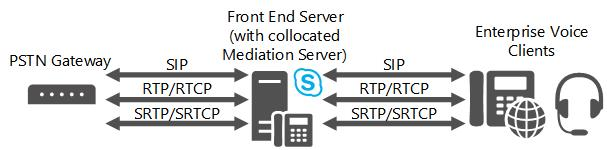
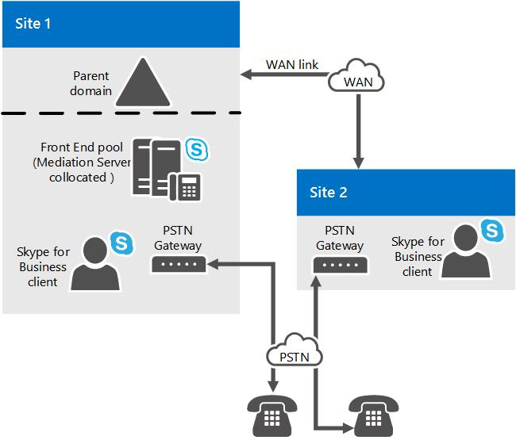
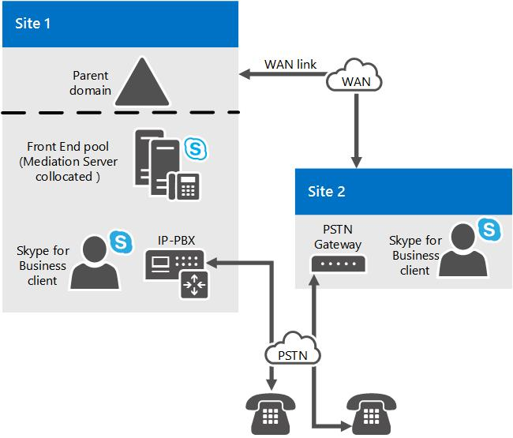

# Mediation Server component in Skype for Business Server
 
Learn about Mediation Servers in Skype for Business Server, including its supported topologies and its relations to M:N trunks, media bypass, and call admission control.
  
To deploy Enterprise Voice, you must deploy one or more Mediation Servers. 
  
The Mediation Server translates signaling between your internal Enterprise Voice infrastructure and a public switched telephone network (PSTN) gateway or a Session Initiation Protocol (SIP) trunk. In some deployments, it also translates the media itself between these points.
  
On the Skype for Business Server side, Mediation Server listens on a single mutual TLS (MTLS) transport address. On the gateway side, Mediation Server listens on all associated listening ports associated with trunks. All qualified gateways must support TLS, but can enable TCP as well. TCP is supported for gateways that do not support TLS.
  
If you also have an existing Public Branch Exchange (PBX) in your environment, Mediation Server handles calls between Enterprise Voice users and the PBX. If your PBX is an IP-PBX, you can create a direct SIP connection between the PBX and Mediation Server. If your PBX is a Time Division Multiplex (TDM) PBX, you must also deploy a PSTN gateway between Mediation Server and the PBX.
  
The Mediation Server is collocated with the Front End Server by default. The Mediation Server can also be deployed in a stand-alone pool.
  
## What Mediation Server Does

The main functions of the Mediation Server are as follows:
  
- Encrypting and decrypting SRTP on the Skype for Business Server side. 
    
- Translating SIP over TCP (for gateways that do not support TLS) to SIP over mutual TLS.
    
- Translating media streams between Skype for Business Server and the gateway peer of the Mediation Server.
    
- Connecting clients that are outside the network to internal ICE components, which enable media traversal of NAT and firewalls.
    
- Acting as an intermediary for call flows that a gateway does not support, such as calls from remote workers on an Enterprise Voice clien.t
    
- In deployments that include SIP trunking, working with the SIP trunking service provider to provide PSTN support, which eliminates the need for a PSTN gateway.
    
The following figure shows the signaling and media protocols that are used by the Mediation Server when communicating with a basic PSTN gateway and the Enterprise Voice infrastructure.
  
**Signaling and media protocols used by the Mediation Server**

  
> [!NOTE]
> If you are using TCP or RTP/RTCP (instead of SRTP or SRTCP) on the network between the PSTN gateway and the Mediation Server, we recommend that you take measures to help ensure the security and privacy of the network. 
  
## M:N trunk

Skype for Business Server supports flexibility in the definition of a trunk for call routing purposes. A trunk is a logical association between a Mediation Server and listening port number, with a gateway and a listening port number. This implies several things: A Mediation Server can have multiple trunks to the same gateway; a Mediation Server can have multiple trunks to different gateways; conversely a gateway can have multiple trunks to different Mediation Servers.
  
You must still create a root trunk when you add a gateway to your Skype for Business topology using Topology Builder. The number of gateways that a given Mediation Server can handle depends on the processing capacity of the server during peak busy hours. If you deploy a Mediation Server on hardware that meets the minimum hardware requirements for Skype for Business Server, as described in [Server requirements for Skype for Business Server 2015](../../plan-your-deployment/requirements-for-your-environment/server-requirements.md), then a stand-alone Mediation Server can handle approximately 1000 calls. The Mediation Server is performs transcoding, but still route calls for multiple gateways even if the gateways do not support media bypass.
  
When defining a call route, you specify the trunks associated with that route, but you do not specify which Mediation Servers are associated with that route. Instead, you use Topology Builder to associate trunks with Mediation Servers. In other words, routing determines which trunk to use for a call, and, subsequently, the Mediation Server associated with that trunk is sent the signaling for that call.
  
The Mediation Server can be deployed as a pool; this pool can be collocated with a Front End pool, or it can be deployed as a stand-alone pool. When a Mediation Server is collocated with a Front End pool, the pool size can be at most 12 (the limit of the Registrar pool size). Taken together, these capabilities increase the reliability and deployment flexibility for Mediation Servers, but they require similar capabilities in the following:
  
- **PSTN gateway.** A Skype for Business Server qualified gateway must implement DNS load balancing, which enables a qualified public switched telephone network (PSTN) gateway to act as a load balancer for one pool of Mediation Servers, and thereby to load-balance calls across the pool.
    
- **Session Border Controller.** For a SIP trunk, the peer entity is a Session Border Controller (SBC) at an Internet telephony service provider. In the direction from the Mediation Server pool to the SBC, the SBC can receive connections from any Mediation Server in the pool. In the direction from the SBC to the pool, traffic can be sent to any Mediation Server in the pool. One method of achieving this is through DNS load balancing, if supported by the service provider and SBC. An alternative is to give the service provider the IP addresses of all Mediation Servers in the pool, and the service provider will provision these in their SBC as a separate SIP trunk for each Mediation Server. The service provider will then handle the load balancing for its own servers. Not all service providers or SBCs may support these capabilities. Furthermore, the service provider may charge extra for this capability. Typically, each SIP trunk to the SBC incurs a monthly fee.
    
- **IP-PBX.** In the direction from the Mediation Server pool to the IP-PBX SIP termination, the IP-PBX can receive connections from any Mediation Server in the pool. In the direction from the IP-PBX to the pool, traffic can be sent to any Mediation Server in the pool. Because most IP-PBXs do not support DNS load balancing, we recommend that individual direct SIP connections be defined from the IP-PBX to each Mediation Server in the pool. The IP-PBX will then handle its own load balancing by distributing traffic over the trunk group. The assumption is that the trunk group has a consistent set of routing rules at the IP-PBX. Whether a particular IP-PBX supports this trunk group concept and how it intersects with the IP-PBX's own redundancy and clustering architecture needs to be determined before you can decide whether a Mediation Server cluster can interact correctly with an IP-PBX.
    
A Mediation Server pool must have a uniform view of the peer gateway with which it interacts. This means that all members of the pool access the same definition of the peer gateway from the configuration store and are equally likely to interact with it for outgoing calls. Therefore, there is no way to segment the pool so that some Mediation Servers communicate with only certain gateway peers for outgoing calls. If such segmentation is necessary, a separate pool of Mediation Servers must be used. This would be the case, for example, if the associated capabilities in PSTN gateways, SIP trunks, or IP-PBXs to interact with a pool as detailed earlier in this topic are not present.
  
A particular PSTN gateway, IP-PBX, or SIP trunk peer can route to multiple Mediation Servers or trunks. The number of gateways that a particular pool of Mediation Servers can control depends on the number of calls that use media bypass. If a large number of calls use media bypass, a Mediation Server in the pool can handle many more calls, because only signaling layer processing is necessary. 
  
## Call Admission Control and Mediation Server

Call admission control (CAC), manages real-time session establishment, based on available bandwidth, to help prevent poor Quality of Experience (QoE) for users on congested networks. To support this, the Mediation Server is responsible for bandwidth management for its two interactions on the Skype for Business Server side and on the gateway side. In call admission control, the terminating entity for a call handles the bandwidth reservation. The gateway peers (PSTN gateway, IP-PBX, SBC) that the Mediation Server interacts with on the gateway side do not support Skype for Business Server call admission control. Thus, the Mediation Server has to handle bandwidth interactions on behalf of its gateway peer. Whenever possible, the Mediation Server will reserve bandwidth in advance. If that is not possible (for example, if the locality of the ultimate media endpoint on the gateway side is unknown for an outgoing call to the gateway peer), bandwidth is reserved when the call is placed. This behavior can result in oversubscription of bandwidth, but it is the only way to prevent false rings.
  
Media bypass and bandwidth reservation are mutually exclusive. If media bypass is employed for a call, call admission control is not performed for that call. The assumption here is that there are no links with constrained bandwidth involved in the call. If call admission control is used for a particular call that involves the Mediation Server, that call cannot employ media bypass.
  
For details about media bypass or call admission control, see [Plan for media bypass in Skype for Business](media-bypass.md) or [Plan for call admission control in Skype for Business Server](call-admission-control.md).
  
## Enhanced 9-1-1 (E9-1-1) and Mediation Server

The Mediation Server has extended capabilities so that it can correctly interact with Enhanced 9-1-1 (E9-1-1) service providers. No special configuration is needed on the Mediation Server. The SIP extensions required for E9-1-1 interaction are, by default, included in the Mediation Server's SIP protocol for its interactions with a gateway peer (PSTN gateway, IP-PBX, or the SBC of an Internet Telephony Service Provider, including E9-1-1 Service Providers)
  
Whether the SIP trunk to an E9-1-1 Service Provider can be terminated on an existing Mediation Server pool or will require stand-alone Mediation Servers will depend on whether the E9-1-1 SBC can interact with a pool of Mediation Servers. For details, see [M:N trunk in Skype for Business Server](m-n-trunk.md).
  
## Media bypass and Mediation Server

Media bypass is a Skype for Business Server capability that enables an administrator to configure call routing to flow directly between the user endpoint and the public switched telephone network (PSTN) gateway without traversing the Mediation Server. Media bypass improves call quality by reducing latency, unnecessary translation, possibility of packet loss, and the number of potential points of failure. Where a remote site without a Mediation Server is connected to a central site by one or more WAN links with constrained bandwidth, media bypass lowers the bandwidth requirement by enabling media from a client at a remote site to flow directly to its local gateway without first having to flow across the WAN link to a Mediation Server at the central site and back.This reduction in media processing also complements the Mediation Server's ability to control multiple gateways.
  
Media bypass and call admission control (CAC) are mutually exclusive. If media bypass is employed for a call, CAC is not performed for that call. The assumption is that there are no links with constrained bandwidth involved in the call.
  
## Topologies for Mediation Server

The Skype for Business Server, Mediation Server is by default collocated with Standard Edition server, a Front End pool, or Survivable Branch Appliance. All Mediation Servers in a Front End pool must be configured identically.
  
Where performance is an issue, it may be preferable to deploy one or more Mediation Servers in a dedicated stand-alone pool. We definitely recommend a stand-alone pool if you are deploying SIP trunking. 
  
If you deploy Direct SIP connections to a qualified PSTN gateway that supports media bypass and DNS load balancing, a stand-alone Mediation Server pool is not necessary. This is because qualified gateways are capable of DNS load balancing to a pool of Mediation Servers and they can receive traffic from any Mediation Server in a pool.
  
We also recommend that you collocate the Mediation Server on a Front End pool when you have deployed IP-PBXs or connect to an Internet Telephony Server Provider's Session Border Controller (SBC), as long as any of the following conditions are met:
  
- The IP-PBX or SBC is configured to receive traffic from any Mediation Server in the pool and can route traffic uniformly to all Mediation Servers in the pool.
    
- The IP-PBX does not support media bypass, but the Front End pool that is hosting the Mediation Server can handle voice transcoding for calls to which media bypass does not apply.
    
You can use the Microsoft Lync Server 2013, Planning Tool to evaluate whether the Front End pool where you want to collocate the Mediation Server can handle the load. If your environment cannot meet these requirements, then you must deploy a stand-alone Mediation Server pool.
  
The following figure shows a simple topology consisting of two sites connected by a WAN link. Mediation Server is collocated on a Front End pool at Site 1. The Mediation Servers at Site 1 controls both the PSTN gateway at Site 1 and the gateway at Site 2. In this topology, media bypass is enabled globally to use site and region information, and the trunks to each PSTN gateway (GW1 and GW2) have bypass enabled.
  
**Example of sites connected by a WAN link with a Mediation Server at Site 1 and a PSTN gateway at Site 2**

  
The next figure shows a simple topology where Mediation Server is collocated on Front End pool at Site 1 and has a Direct SIP connection to the IP-PBX at Site 1. In this figure, the Mediation Server also controls a PSTN gateway at Site 2. Assume that Skype for Business users exist at both Sites 1 and 2. Also assume that the IP-PBX has an associated media processor that must be traversed by all media originating from Skype for Business endpoints before being sent to media endpoints controlled by the IP-PBX. In this topology, media bypass is enabled globally to use site and region information, and the trunks to the PBX and PSTN gateway have media bypass enabled.
  
**Example of sites connected by a WAN link with a Mediation Server at Site 1 and a PBX at Site 2**

  
The last figure in this topic shows a topology where the Mediation Server is connected to the SBC of an Internet Telephony Service Provider. 
  
## Planning decisions for Mediation Server

This topic describes planning decisions you need to make for your Mediation Server deployment,
  
### Collocated or Stand-alone Mediation Server?

Mediation Server is by default collocated on the Standard Edition server or Front End Server in a Front End pool at central sites. The number of public switched telephone network (PSTN) calls that can be handled and the number of machines required in the pool will depend on the following:
  
- The number of gateway peers that the Mediation Server pool controls
    
- The high-volume traffic periods through those gateways
    
- The percentage of calls that are calls whose media bypass the Mediation Server
    
When planning, be sure to take into account the media processing requirements for PSTN calls and A/V conferences that are not configured for media bypass, as well as the processing needed to handle signaling interactions for the number of busy-hour calls that need to be supported. If there is not enough CPU, then you must deploy a stand-alone pool of Mediation Servers; and PSTN gateways, IP-PBXs, and SBCs will need to be split into subsets that are controlled by the collocated Mediation Servers in one pool and the stand-alone Mediation Servers in one or more stand-alone pools.
  
If you deployed PSTN gateways, IP-PBXs, or Session Border Controllers (SBCs) that do not support the correct capabilities to interact with a pool of Mediation Servers, including the following, then they will need to be associated with a stand-alone pool consisting of a single Mediation Server:
  
- Perform network layer Domain Name System (DNS) load balancing across Mediation Servers in a pool (or otherwise route traffic uniformly to all Mediation Servers in a pool)
    
- Accept traffic from any Mediation Server in a pool
    
You can use the Microsoft Lync Server 2013, Planning Tool to evaluate whether collocating the Mediation Server with your Front End pool can handle the load. If your environment cannot meet these requirements, then you must deploy a stand-alone Mediation Server pool.
  
### Central Site and Branch Site Considerations

 Mediation Servers at the central site can be used to route calls for IP-PBXs or PSTN gateways at branch sites. If you deploy SIP trunks, however, you must deploy a Mediation Server at the site where each trunk terminates. Having a Mediation Server at the central site route calls for an IP-PBX or PSTN gateway at a branch site does not require the use of media bypass. However, if you can enable media bypass, doing so will reduce media path latency and improve the media quality because the media path is no longer required to follow the signaling path. Media bypass also decreases the processing load on the pool.
  
> [!NOTE]
> Media bypass will not interoperate with every PSTN gateway, IP-PBX, and SBC. Microsoft has tested a set of PSTN gateways and SBCs with certified partners and has done some testing with Cisco IP-PBXs. Media bypass is supported only with products and versions listed at [Unified Communications Open Interoperability Program - Lync Server](https://go.microsoft.com/fwlink/p/?LinkId=268730). 
  
If branch site resiliency is required, a Survivable Branch Appliance or combination of a Front End Server, a Mediation Server, and a gateway must be deployed at the branch site. (The assumption with branch site resiliency is that presence and conferencing are not resilient at the site.) For guidance on branch site planning for voice, see [Plan for Enterprise Voice resiliency in Skype for Business Server](enterprise-voice-resiliency.md).
  
For interactions with an IP-PBX, if the IP-PBX does not correctly support early media interactions with multiple early dialogs and RFC 3960 interactions, there can be clipping of the first few words of the greeting for incoming calls from the IP-PBX to Skype for Business endpoints. This issue can be more severe if a Mediation Server at a central site is routing calls for an IP-PBX where the route terminates at a branch site, because more time is needed for signaling to complete. If you experience this behavior, deploying a Mediation Server at the branch site is the only way to reduce clipping of the first few words.
  
Finally, if your central site has a TDM PBX, or if your IP-PBX does not eliminate the need for a PSTN gateway, then you must deploy a gateway on the call route connecting Mediation Server and the PBX.
  
> [!NOTE]
> To improve the media performance of standalone Mediation Server, you should enable receive-side scaling (RSS) on the network adapters on these servers. RSS enables incoming packets to be handled in parallel by multiple processors on the server. For details, see ["Receive-Side Scaling Enhancements in Windows Server"](https://go.microsoft.com/fwlink/p/?LinkId=268731). For details about how to enable RSS, see your network adapter documentation. 
  

