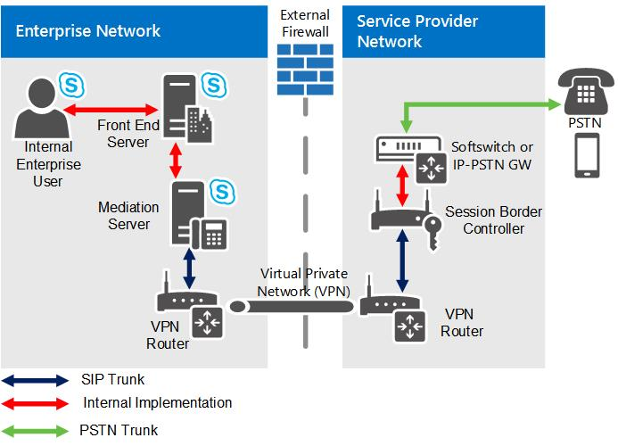

# SIP trunking in Skype for Business Server

Learn about SIP trunking in Skype for Business Server Enterprise Voice

Session Initiation Protocol (SIP) is used to initiate and manage Voice over IP (VoIP) communications sessions for basic telephone service and for additional real-time communication services, such as instant messaging, conferencing, presence detection, and multimedia. This section provides planning information for implementing SIP trunks, a type of SIP connection that extends beyond the boundary of your local network.

## What is SIP Trunking?

A SIP trunk is an IP connection that establishes a SIP communications link between your organization and an Internet telephony service provider (ITSP) beyond your firewall. Typically, a SIP trunk is used to connect your organization's central site to an ITSP. In some cases, you may also opt to use SIP trunking to connect your branch site to an ITSP.

Deploying SIP trunking can be a big step toward simplifying your organization's telecommunications and preparing for up-to-date enhancements to real-time communications. One of the primary advantages of SIP trunking is that you can consolidate your organization's connections to the public switched telephone network (PSTN) at a central site, as opposed to its predecessor, time division multiplexing (TDM) trunking, which typically requires a separate trunk from each branch site.

### Cost Savings

The cost savings associated with SIP trunking can be substantial:

- Long distance calls typically cost much less through a SIP trunk.

- You can cut manageability costs and reduce the complexity of deployment.

- Basic rate interface (BRI) and primary rate interface (PRI) fees can be eliminated if you connect a SIP trunk directly to your ITSP at significantly lower cost. In TDM trunking, service providers charge for calls by the minute. The cost of SIP trunking may be based on bandwidth usage, which you can buy in smaller, more economical increments. (The actual cost depends on the service model of the ITSP you choose.)

#### SIP Trunking vs. Hosting a PSTN Gateway or IP-PBX

Because SIP trunks connect directly to your service provider, you can eliminate your PSTN gateways and their management cost and complexity. Using a SIP trunk can lead to substantial cost savings through reduced maintenance and administration.

### Expanded VoIP Services

Voice features are often the primary motivation for deploying SIP trunking, but voice support is just the first step. With SIP trunking, you can extend VoIP capabilities and enable Skype for Business Server to deliver a richer set of services. For example:

- Enhanced presence detection for devices that are not running Skype for Business Server can provide better integration with mobile phones, enabling you to see when a user is on a mobile phone call.

- E9-1-1 emergency calling enables the authorities who answer 911 calls to determine the caller's location from his or her telephone number.

> [!NOTE]
> Contact your ITSP for a list of services that they support and can enable for your organization.

### SIP Trunks vs. Direct SIP Connections

The term trunk is derived from circuit-switched technology. It refers to a dedicated physical line that connects telephone switching equipment. Like their predecessor, time division multiplexing (TDM) trunks, SIP trunks are connections between two separate SIP networks—the Skype for Business Server enterprise and the ITSP. Unlike circuit-switched trunks, SIP trunks are virtual connections that can be established over any of the supported SIP trunking connection types.

Direct SIP connections, on the other hand, are SIP connections that do not cross the local network boundary (that is, they connect to a public switched telephone network (PSTN) gateway or private branch exchange (PBX) within your internal network). For details about how you can use direct SIP connections with Skype for Business Server, see [Direct SIP connections in Skype for Business Server](direct-sip.md).

## How do I implement SIP Trunking?

To implement SIP trunking, you must route the connection through a Mediation Server, which acts as a proxy for communications sessions between Skype for Business Server clients and the service provider and transcodes media, when necessary.

Each Mediation Server has an internal network interface and an external network interface. The internal interface connects to the Front End Servers. The external interface is commonly called the gateway interface because it has traditionally been used to connect the Mediation Server to a public switched telephone network (PSTN) gateway or an IP-PBX. To implement a SIP trunk, you connect the external interface of the Mediation Server to the external edge component of the ITSP. The external edge component of the ITSP could be a Session Border Controller (SBC), a router, or a gateway.

For details about Mediation Servers, see [Mediation Server component in Skype for Business Server](mediation-server.md).

### Centralized vs. Distributed SIP Trunking

Centralized SIP trunking routes all VoIP traffic, including branch site traffic, through your central site. The centralized deployment model is simple, cost-effective, and is generally the recommended approach for implementing SIP trunks with Skype for Business Server.

Distributed SIP trunking is a deployment model in which you implement local SIP trunks at one or more branch sites. VoIP traffic is then routed from the branch site directly to a service provider without going through the central site.

Distributed SIP trunking is required only in the following cases:

- The branch site requires survivable phone connectivity (for example, if the WAN goes down). This requirement should be analyzed for each branch site; some of your branches may require redundancy and failover, whereas others may not.

- Resiliency is required between two central sites. You need to make sure that a SIP trunk terminates at each central site. For example, if you have Dublin and Tukwila central sites and both use only one site's SIP trunk, if the trunk goes down, the other site's users cannot make PSTN calls.

- The branch site and central site are in different countries/regions. For compatibility and legal reasons, you need at least one SIP trunk per country/region. For example, in the European Union, communications cannot leave a country/region without terminating locally at a centralized point.

Depending on the geographical location of sites and how much traffic you anticipate within your enterprise, you may not want to route all users through the central SIP trunk, or you may opt to route some users through a SIP trunk at their branch site. To analyze your needs, answer the following questions:

- How big is each site (that is, how many users are enabled for Enterprise Voice)?

- Which direct inward dialing (DID) numbers at each site get the most phone calls?

The decision whether to deploy centralized or distributed SIP trunking requires a cost-benefit analysis. In some cases, it may be advantageous to opt for the distributed deployment model even if it is not required. In a completely centralized deployment, all branch site traffic is routed over WAN links. Instead of paying for the bandwidth required for WAN linking, you may want to use distributed SIP trunking. For example, you may want to deploy a Standard Edition server at a branch site with federation to the central site, or you may want to deploy a Survivable Branch Appliance or a Survivable Branch Server with a small gateway.

> [!NOTE]
> For details about distributed SIP trunking, see [Branch site SIP trunking in Skype for Business Server](branch-site.md).

### Supported SIP Trunking Connection Types

Skype for Business Server supports the following connection types for SIP trunking:

- Multiprotocol Label Switching (MPLS) is a private network that directs and carries data from one network node to the next. The bandwidth in an MPLS network is shared with other subscribers, and each data packet is assigned a label to distinguish one subscriber's data from another's. This connection type does not require a virtual private network (VPN). A potential drawback is that excessive IP traffic can interfere with VoIP operation unless VoIP traffic is given priority.

- A private connection with no other traffic—for example, a leased fiber-optic connection or T1 line—is typically the most reliable and secure connection type. This connection type provides the highest call-carrying capacity, but it is typically the most expensive. VPN is not required. Private connections are appropriate for organizations with high call volumes or stringent security and availability requirements.

- The Internet is the least expensive connection type, but it is also the least reliable. Internet connection is the only Skype for Business Server SIP trunking connection type that requires VPN.

#### Selecting a Connection Type

The most appropriate SIP trunking connection type for your enterprise depends on your needs and your budget.

- For a mid-size or larger enterprise, an MPLS network usually provides the greatest value. It can provide the necessary bandwidth at a cheaper rate than a specialized private network.

- Large enterprises may require a private fiber-optic, T1, T3 or higher connection (E1, E3 or higher in the European Union).

- For a small enterprise or branch site with low call volume, SIP trunking through the Internet may be the best choice. This connection type is not recommended for mid-size or larger sites.

### Bandwidth Requirements

The amount of bandwidth your implementation requires depends on call capacity (the number of concurrent calls you must be able to support). You need to consider bandwidth availability, so that you can take full advantage of the peak capacity that you have paid for. Use the following formula to calculate SIP trunk peak bandwidth requirement:

SIP Trunk Peak Bandwidth = Max Simultaneous Calls x (64 kbps + header size)

> [!NOTE]
> Header size is 20 bytes maximum.

### Codec Support

Skype for Business Server supports only the following codecs:

- G.711 a-law (used primarily outside North America)

- G.711 µ-law (used in North America)

### Internet Telephony Service Provider

How you implement the service provider side of a SIP trunk connection varies from one ITSP to another. For deployment information, contact your service provider. For a list of certified SIP trunking service providers, see [Microsoft Unified Communications Open Interoperability Program website](https://go.microsoft.com/fwlink/p/?LinkId=287029).

For details about Microsoft certified SIP trunking providers, contact your Microsoft representative.

> [!IMPORTANT]
> You must use a Microsoft certified service provider to ensure that your ITSP supports all of the functionality that traverses the SIP trunk (for example, setting up and managing sessions and supporting all of the extended VoIP services). Microsoft technical support does not extend to configurations that use noncertified providers. If you currently use an Internet service provider that is not certified for SIP trunking, you can opt to continue using that provider as your ISP and use a provider certified by Microsoft for SIP trunking.

### Topologies and Components for SIP Trunking

The following figure depicts the SIP trunking topology in Skype for Business Server.

**SIP trunking topology**

As shown in the diagram, an IP virtual private network (VPN) is used for connectivity between the enterprise network and the public switched telephone network (PSTN) service provider. The purpose of this private network is to provide IP connectivity, enhance security, and (optionally) obtain Quality of Service (QoS) guarantees. Because of the nature of a VPN, you do not need to use Transport Layer Security (TLS) for SIP signaling traffic or secure real-time transport protocol (SRTP) for the media traffic. Connections between the enterprise and the service provider therefore consist of plain TCP connections for SIP and plain real-time transport protocol (RTP) (over UDP) for media tunneled through an IP VPN. Ensure that all firewalls between the VPN routers have ports open to allow the VPN routers to communicate, and that the IP addresses on the external edges of the VPN routers are publicly routable.

> [!IMPORTANT]
> Contact your service provider to determine whether it provides support for high availability, including failover. If so, you will need to determine the procedures for setting it up. For example, do you need to configure only one IP address and one SIP trunk on each Mediation Server, or do you need to configure multiple SIP trunks on each Mediation Server? > If you have multiple central sites, also ask whether the service provider has the ability to enable connections to and from another central site.

> [!NOTE]
> For SIP trunking, we strongly recommend that you deploy stand-alone Mediation Servers. For details, see [Deploying Mediation Servers and Defining Peers](https://technet.microsoft.com/library/a684f1da-6671-4011-adf6-2db49e2528e2.aspx) in the Deployment documentation.

### Securing the Mediation Server for SIP Trunking

For security purposes, you should set up a virtual LAN (VLAN) for each connection between the two VPN routers. The actual process for setting up a VLAN varies from one router manufacturer to another. For details, contact your router vendor.

We recommend that you follow these guidelines:

- Set up a virtual LAN (VLAN) between the Mediation Server and the VPN router in the perimeter network (also known as DMZ, demilitarized zone, and screened subnet).

- Do not allow broadcast or multicast packets to be transferred from the router to the VLAN.

- Block any routing rules that route traffic from the router to anywhere but the Mediation Server.

If you use a VPN server, we recommend that you follow these guidelines:

- Set up a VLAN between the VPN server and the Mediation Server.

- Do not allow broadcast or multicast packets to be transmitted from the VPN server to the VLAN.

- Block any routing rule that routes VPN server traffic to anywhere but the Mediation Server.

- Encrypt data on the VPN by using generic routing encapsulation (GRE).

## See also

[Branch site SIP trunking in Skype for Business Server](branch-site.md)

