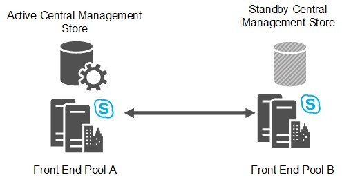

# Front End pool disaster recovery in Skype for Business Server
 
For disaster recovery, Skype for Business Server offers pool pairing with failover in case one pool goes down.
  
For the most robust disaster recovery options in Skype for Business Server, deploy pairs of Front End pools across two geographically dispersed sites. Each site has a Front End pool which is paired with a corresponding Front End pool in the other site. Both sites are active, and the Backup Service provides real-time data replication to keep the pools synchronized. See [Deploy paired Front End pools for disaster recovery in Skype for Business Server](../../deploy/deploy-high-availability-and-disaster-recovery/front-end-pools-for-disaster-recovery.md) if you want to implement Front End pool pairing.
  

  
If the pool in one site fails, you can fail over the users from that pool to the pool in the other site, which then serves all the users in both pools. For capacity planning, you should design each pool to be able to handle the workload of all users in both pools in the event of a disaster.
  
Two data centers that include Front End pools paired with each other can be any distance apart. We recommend that you pair two data centers in the same world region, with high-speed links between them. 
  
Having two data centers across world regions is possible, but could incur higher data loss if there is a disaster, because of latency in data replication.
  
When you plan which pools to pair, you must keep in mind that only the following pairings are supported:
  
- Enterprise Edition pools can be paired only with other Enterprise Edition pools. Similarly, Standard Edition pools can be paired only with other Standard Edition pools.
    
- Physical pools can be paired only with other physical pools. Similarly, virtual pools can be paired only with other virtual pools.
    
- Pools that are paired together must be running the same base operating system.
    
Neither Topology Builder nor topology validation will prohibit pairing two pools in a way that does not follow these recommendations. For example, Topology Builder allows you to pair an Enterprise Edition pool with a Standard Edition pool. However, these types of pairings are not supported.
  
## Backup Registrar relationships and Survivable Branch Appliances

In addition to providing disaster recovery ability, two paired pools serve as the backup Registrars for each other. Each pool can be the backup for only one other Front End pool.
  
Even though backup relationships between two Front End pools must be 1:1 and symmetrical, each Front End pool can still also be the backup registrar for any number of Survivable Branch Appliances.
  
Note that Skype for Business does not extend disaster recovery support to users homed on a Survivable Branch Appliance. If a Front End pool that serves as the backup for a Survivable Branch Appliance goes down, users signed into the Survivable Branch Appliance fall into resiliency mode even though users homed on the Front End pool are failed over to the backup Front End pool.
  
## Recovery time for pool failover and pool failback

For pool failover and pool failback, the engineering target for recovery time objective (RTO) is 15-20 minutes. This is the time required for the failover to happen, after administrators have determined there was a disaster and started the failover procedures. It does not include the time for administrators to assess the situation and make a decision, nor does it include the time for users to sign in again after failover is complete.
  
For pool failover and pool failback, the engineering target for recovery point objective (RPO) is 5 minutes. This represents the time measure of data that could be lost due to the disaster, due to replication latency of the Backup Service. For example, if a pool goes down at 10:00 A.M., and the RPO is 5 minutes, data written to the pool between 9:55 A.M. and 10:00 A.M .might not have replicated to the backup pool, and would be lost.
  
All RTO and RPO numbers in this document assume that the two data centers are located within the same world region with high-speed, low-latency transport between the two sites. These numbers are measured for a pool with 40,000 concurrently active users and 200,000 users enabled for Lync with respect to a pre-defined user model where there is no backlog in data replication. They are subject to change based on performance testing and validation.
  
## Central Management store failover

The Central Management store contains configuration data about the servers and services in your deployment. Each Skype for Business Server deployment includes one Central Management store, which is hosted by the Back End Server of one Front End pool.
  
If you pair the pool that hosts the Central Management store, a backup Central Management store database is set up in the backup pool. At any point, one of the two Central Management store databases is active, and the other is a standby. The content is replicated by the Backup Service from the active database to the standby.
  

  
During a pool failover that involves the pool hosting the Central Management store, you must fail over the Central Management store before you fail over the Front End pool.
  
After the disaster is repaired, it is not necessary to fail back the Central Management store. The Central Management store can remain in the pool you failed it over to.
  
The engineering targets for Central Management store failover are 5 minutes for recovery time objective (RTO) and 5 minutes for recovery point objective (RPO).
  
## Front End pool pairing data security

The Backup Service transfers user data and conference content between two paired Front End pools continuously. The user data contains user SIP URIs as well as conference schedules, contact lists and settings. Conference content includes Microsoft PowerPoint uploads, as well as whiteboards used in conferences.
  
From the source pool, this data is exported from the local storage, zipped, and then transferred to the target Pool, where it is unzipped and imported to local storage. The Backup Service assumes that the communications link between the two data centers is within the corporate network that is protected from the Internet. It does not encrypt the transferred data between the two data centers, nor is the data natively encapsulated within a secure protocol, such as HTTPS. Therefore, a man-in-the-middle attack from internal personnel within the corporate network is possible.
  
Any enterprise which deploys Skype for Business Server across multiple data centers and uses the disaster recovery feature must ensure that traffic between data centers is protected by their corporate Intranet. Enterprises that care about internal attack protection must secure the communication links among the data centers. This is a standard requirement that also helps protech many other types of corporate sensitive data transferred among data centers.
  
While the risk of man-in-the-middle attacks within the corporate network exists, it is relatively contained as compared to exposing the traffic to the Internet. Specifically, the user data exposed by Backup Service (such as SIP URIs) are generally available to all employees within the company via other means such as the Global Address Book or other directory software. Hence, your focus should be on securing the WAN between the two data centers when the Backup Service is used to copy data between the two paired pools.
  
### Mitigating security risks

You have many ways to enhance security protection for the Backup Service traffic. This ranges from restricting access to the data centers to securing the WAN transport between the two data centers. In most cases, enterprises deploying Skype for Business Server might already have the required security infrastructure in place. For enterprises looking for guidance, Microsoft provides a solution as an example of how to build a secure IT infrastructure. For details, see [https://go.microsoft.com/fwlink/p/?LinkId=268544](https://go.microsoft.com/fwlink/p/?LinkId=268544). 
  
We do not imply that it is the only solution, nor do we imply that it is the preferred solution for Skype for Business Server. We recommend that enterprise customers choose the solution suits their specific needs, based on their IT security infrastructure and requirements. The example Microsoft solution employs IPSec and Group Policy for Server and Domain Isolation.
  
Another possible solution is to use IPSec just to help secure the data sent by the Backup Service itself. If you choose this method, you should configure the IPSec rules for the SMB protocol for the following servers, where Pool A and Pool B are two paired Front End pools.
  
- The SMB Service (TCP/445) from each Front End Server in Pool A to the File Store used by Pool B.
    
- The SMB Service (TCP/445) from each Front End Server in Pool B to the File Store used by Pool A.
    
> [!CAUTION]
>  IPsec is not intended as a replacement for application-level security, such as SSL/TLS. One advantage of using IPsec is that it can provide network traffic security for existing applications without having to change them. Enterprises that want to just secure the transport between the two data centers should consult their respective networking hardware vendors about ways to set up secure WAN connections by using the vendor's equipment.
  
## See also

[Deploy paired Front End pools for disaster recovery in Skype for Business Server](../../deploy/deploy-high-availability-and-disaster-recovery/front-end-pools-for-disaster-recovery.md)
