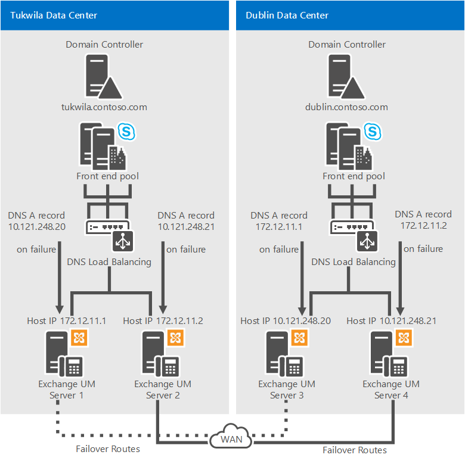
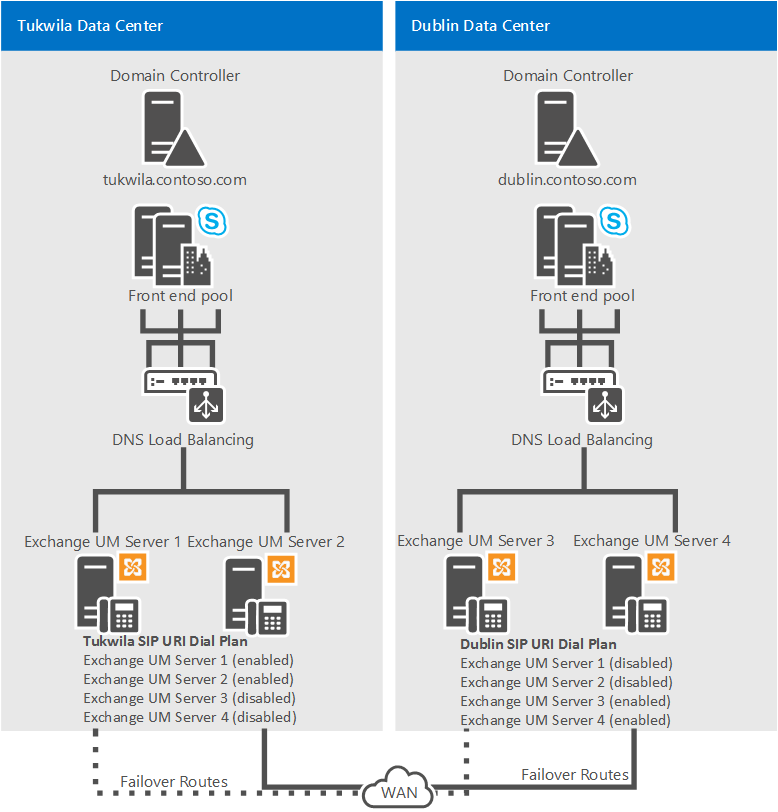

# Plan for Exchange Unified Messaging integration in Skype for Business
 
**Summary:** Review this topic while planning to integrate Skype for Business Server 2015 with Exchange 2013.
  
Skype for Business Server 2015 supports integration with Exchange Unified Messaging (UM) for combining voice messaging and email messaging into a single messaging infrastructure. In Exchange, Exchange Unified Messaging (UM) is one of several Exchange server roles that you can install and configure. 
  
In Microsoft Exchange Server 2013, Exchange UM runs as a service on an Exchange Mailbox server. For Skype for Business Server 2015 Enterprise Voice deployments, Unified Messaging combines voice messaging and email messaging into a single store that users can access from a telephone (Outlook Voice Access) or a computer. Unified Messaging and Skype for Business Server 2015 work together to provide call answering, Outlook Voice Access, and auto-attendant services to users of Enterprise Voice.
  
For more information about the architecture changes in Microsoft Exchange Server 2013, see [Voice Architecture Changes](https://go.microsoft.com/fwlink/p/?LinkId=266730) in the Microsoft Exchange Server 2013 documentation.
  
For these features to be supported in an on-premises Exchange UM deployment, you must be running one of the following:
  
- Microsoft Exchange Server 2010 or latest service pack
    
- Microsoft Exchange Server 2013
    
-  Microsoft Exchange Server 2016
    
## Features of integrated Unified Messaging and Skype for Business Server 2015

Skype for Business Server 2015, Enterprise Voice uses the Exchange Unified Messaging (UM) infrastructure to provide call answering, call notification, voice access (including voice mail), and auto-attendant services.
  
- **Call Answering** Call answering is the receiving of voice messages on behalf of users whose calls are not answered or are busy. It includes playing a personal greeting, recording a message, and submitting the message to be queued for delivery to the user's mailbox, which is stored on the Exchange mailbox server.
    
    If a caller leaves a message, the message is routed to the user's Inbox. If a caller chooses not to leave a message, a missed call notification is stored in the user's mailbox. Users can then access their Inbox by using the Microsoft Outlook messaging and collaboration client, Outlook Web Access, the Exchange ActiveSync technology, or Outlook Voice Access. The subject and priority of calls can be displayed in a way similar to that of email.
    
- **Outlook Voice Access** Outlook Voice Access enables an Enterprise Voice user to access not just voice mail, but also the Exchange inbox, including email, calendar, and contacts from a telephony interface. The subscriber access number is assigned by an Exchange UM administrator.
    
- **Auto attendant** Auto attendant is an Exchange UM feature that can be used to configure a phone number that outside users can dial to reach company representatives. In particular, it provides a series of voice prompts that assist an external caller in navigating a menu system. The list of available options is configured on the Exchange UM server by the Exchange UM administrator.
    
- **Fax Services** Exchange UM includes fax features, which enable users to receive incoming faxes in their Exchange mailboxes. For details, see[Unified Messaging](https://go.microsoft.com/fwlink/p/?linkId=135652) in the Microsoft Exchange Server documentation.
    
    > [!NOTE]
    > Fax services provided by the Exchange UM server are not available in Skype for Business Server deployments that are integrated with Microsoft Exchange Server 2010, Exchange 2010 with the latest service pack, or Exchange 2013. 
  
## Components and topologies for on-premises Unified Messaging in Skype for Business Server 2015

### Exchange Server Components

To provide the Exchange UM features and services described in [Features of Integrated Unified Messaging and Lync Server 2013](http://technet.microsoft.com/library/094f549d-fccc-43ab-9f39-6ddd18130915.aspx) to Enterprise Voice users in your organization, you must deploy an Microsoft Exchange Mailbox server and Client Access server, which hosts user mailboxes and provides a single storage location for email and voice mail. Exchange UM runs as a service on Exchange Mailbox and Client Access servers.
  
For details about Exchange UM components in Microsoft Exchange Server 2010, see [Deploying On-Premises Exchange UM to Provide Lync Server 2013 Preview Voice Mail](http://technet.microsoft.com/library/9673bd73-a3a3-425d-870f-04d801c6d0d5.aspx) in the Deployment documentation.
  
### Supported Topologies

You can deploy Skype for Business Server 2015 and Exchange Unified Messaging (UM) in the same forest or multiple forests. If the deployment spans multiple forests, you must perform the Exchange integration steps for each Exchange UM forest. Furthermore, you must configure each Microsoft Exchange forest to trust the Skype for Business Server 2015 forest and the Skype for Business Server 2015 forest to trust each Exchange UM forest. In addition to this forest trust, the Exchange UM settings for all users must be set on the user objects in the Skype for Business Server 2015 forest. 
  
Skype for Business Server 2015 supports the following topologies for Exchange UM integration:
  
- Single forest
    
- Single domain (that is, a single forest with a single domain). Skype for Business Server 2015, Microsoft Exchange, and users all reside in the same domain.
    
- Multiple domain (that is, a root domain with one or more child domains). Skype for Business Server 2015, and Microsoft Exchange servers are deployed in different domains from the domain where you create users. Exchange UM servers can be deployed in different domains from the Skype for Business Server 2015 pool they support.
    
- Multiple forest (that is, resource forest). Skype for Business Server 2015 is deployed in a single forest, and then users are distributed across multiple forests. The users' Exchange UM attributes must be replicated over to the Skype for Business Server 2015 forest.
    
    > [!NOTE]
    > Exchange can be deployed in multiple forests. Each Exchange organization can provide Exchange UM to its users, or Exchange UM can be deployed in the same forest as Skype for Business Server 2015. 
  
## Guidelines for integrating on-premises Unified Messaging and Skype for Business Server 2015

The following are guidelines and best practices to consider when you deploy Enterprise Voice:
  
> [!IMPORTANT]
> Exchange Unified Messaging (UM) supports IPv6 only if you are also using UCMA 4. 
  
- Deploy a Skype for Business Server 2015 Standard Edition server or a Front End pool. For details about installation, see [Deploy Skype for Business Server 2015](../../deploy-1/deploy-1.md) in the Deployment documentation.
    
- Work with Exchange administrators to confirm which tasks each of you will perform to assure a smooth and successful integration.
    
- Deploy the Exchange Mailbox server roles in each Exchange Unified Messaging (UM) forest where you want to enable users for Exchange UM. For details about installing Exchange server roles, see the Microsoft Exchange Server 2013 documentation.
    
    > [!IMPORTANT]
    > When Exchange Unified Messaging (UM) is installed, it is configured to use a self-signed certificate. The self-signed certificate does not enable Skype for Business Server 2015 and Exchange UM to trust each other, which is why it is necessary to request a separate certificate from a certification authority that both servers trust. 
  
- If Skype for Business Server 2015 and Exchange UM are installed in different forests, configure each Exchange forest to trust the Skype for Business Server 2015 forest and the Skype for Business Server 2015 forest to trust each Exchange forest. Also, set the users' Exchange UM settings on the user objects in the Skype for Business Server 2015 forest, typically by using a script or a cross-forest tool, such as Identity Lifecycle Manager (ILM).
    
- If necessary, install the Exchange Management Console to manage your Unified Messaging servers.
    
- Obtain valid phone numbers for Outlook Voice Access and auto attendant.
    
- If you are using a version of Exchange UM earlier than Microsoft Exchange Server 2010 Service Pack 1 (SP1), coordinate names for Exchange UM SIP URI dial plans and Enterprise Voice dial plans. 
    
### Deploying Redundant Exchange UM Servers

> [!IMPORTANT]
> We recommend that you deploy a minimum of two servers on which Exchange UM services is running for each Exchange UM SIP URI dial plan that you configure for your organization. In addition to providing expanded capacity, deploying redundant servers provides high availability. In the event of an server failure, Skype for Business Server 2015 can be configured to fail over to another server. 
  
The following example configurations provide Exchange UM resiliency.
  
**Example 1: Exchange UM Resiliency**

  
In Example 1, Exchange UM servers 1 and 2 are enabled in the Tukwila data center, and Exchange UM servers 3 and 4 are enabled in the Dublin data center. In the event of an Exchange UM outage in Tukwila, the Domain Name System (DNS) A records for servers 1 and 2 should be configured to point to servers 3 and 4, respectively. In the event of an Exchange UM outage in Dublin, the DNS A records for servers 3 and 4 should be configured to point to servers 1 and 2, respectively.
  
> [!NOTE]
> For Example 1, you should also assign one of following certificates on each Exchange UM server: either use a certificate with a wildcard in the Subject Alternative Name (SAN) or Put the fully qualified domain name (FQDN) of each of the four Exchange UM servers in the SAN. 
  
**Example 2: Exchange UM Resiliency**

  
In Example 2, under ordinary operating conditions Exchange UM servers 1 and 2 are enabled in the Tukwila data center, and Exchange UM servers 3 and 4 are enabled in the Dublin data center. All four servers are included in the Tukwila users' SIP URI dial plan; however, servers 3 and 4 are disabled. In the event of an Exchange UM outage in Tukwila, for example, Exchange UM servers 1 and 2 should be disabled and Exchange UM servers 3 and 4 should be enabled so the Tukwila Exchange UM traffic will be routed to the servers in Dublin.
  
For details about how to enable or disable Unified Messaging on Exchange 2013, see [Integrate Exchange 2013 UM with Lync Server](https://go.microsoft.com/fwlink/p/?LinkId=265372). The information provided applies equally to Skype for Business Server 2015.
  
For details about how to enable or disable Unified Messaging on Microsoft Exchange Server 2010, see:
  
- [Enable Unified Messaging on Exchange 2010](https://go.microsoft.com/fwlink/p/?LinkId=204418)
    
- [Disable Unified Messaging on Exchange 2010](https://go.microsoft.com/fwlink/p/?LinkId=204416)
    
## See also

#### 

[Deployment process overview for integrating on-premises Unified Messaging and Skype for Business](deployment-overview.md)

