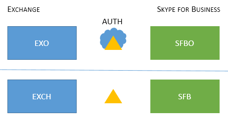
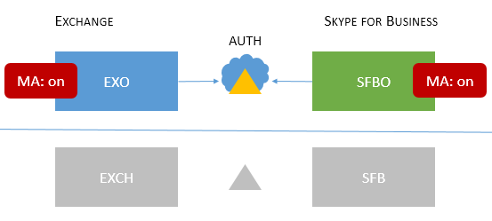
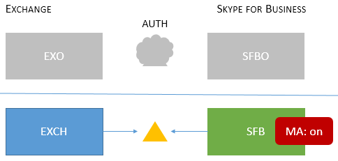
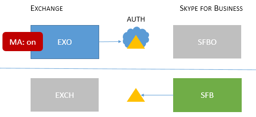
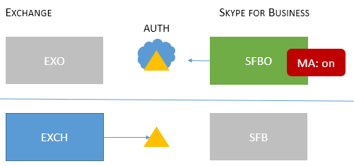
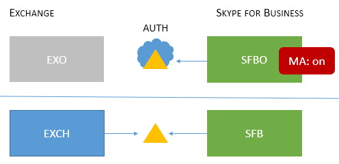
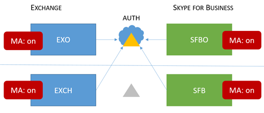

# Skype for Business topologies supported with Modern Authentication
 
This article lists what online and on-premises topologies are supported with Modern Authentication in Skype for Business, as well as security features that apply to each topology.
  
## Modern Authentication in Skype for Business

Skype for Business can leverage security advantages of Modern Authentication. Because Skype for Business works closely with Exchange, the login behaviour Skype for Business client users will see will also be effected by the MA status of Exchange. This will also apply if you have a Skype for Business split-domain hybrid. That's a lot of moving parts, but the aim here is an easy to visualize list of supported topologies.
  
Given Skype for Business, Skype for Business online, Exchange Server, and Exchange online, what topologies are supported with MA?
  
<!--  > [!TIP] > Not sure what Modern Authentication even is? No worries.  This Skype for Business article  4e6a99cd-7859-4062-8a30-5ac79ba36b52  explains it in the first paragraphs. --> 
  
### Supported MA topologies in Skype for Business

There are potentially two server applications, and two Office 365 workloads, involved with Skype for Business topologies used by MA.
  
- Skype for Business server (CU 5) on-premises
    
- Skype for Business online (SFBO)
    
- Exchange server on-premises
    
- Exchange server online (EXO)
    
Another important part of MA is knowing where the authentication (authN) and authorization (authZ) of users will take place. The two options are:
  
- Azure AD, online in the Microsoft Cloud
    
- Active Directory Federation Server (ADFS) on-premises
    
So it looks a bit like this, with EXO and SFBO in the Cloud with Azure AD, and Exchange Server (EXCH) and Skype for Business server (SFB) on-prem.
  

  
Here are the supported topologies. Please note the key for the graphics:
  
- If the icon is dimmed or grey, it is not used in the scenario.
    
- EXO is Exchange Online.
    
- SFBO is Skype for Business Online.
    
- EXCH is Exchange on-premises.
    
- SFB is Skype for Business on-premises.
    
- Authorizing servers are represented by triangles, for example, the Azure AD is a triangle with a cloud behind it.
    
- Arrows point at the authorizing server that will be used when clients try to reach the specified server resource.
    
First, let's cover MA with Skype for Business in both On-premises-only or Cloud-only topologies.
  
> [!IMPORTANT]
> Are you ready to set up Modern Authentication in Skype for Business Online? The steps to enable this feature are right [here](https://social.technet.microsoft.com/wiki/contents/articles/34339.skype-for-business-online-enable-your-tenant-for-modern-authentication.aspx). 
  
|Topology name    |Example    |Description    |Supported    |
|:-----|:-----|:-----|:-----|
|Cloud only    |Users homed/mailboxes located: Online    |MA is on for both EXO and SFBO.    Therefore, the authorization server is Azure AD.    |Multi-factor authentication (MFA), Client-certificate based authentication (CBA), Conditional Access (CA)/Mobile Application Management (MAM) with Intune. \*    |
|On-prem only    |Users homed/mailboxes located: On-premises    |MA is on for SFB on-premises.    Therefore, the authorization server is ADFS.    For configuration details, please see [this article.](https://technet.microsoft.com/en-us/library/mt710548.aspx)   |MFA (Windows Desktop only - mobile clients are not supported). No Exchange integration features.    |
   
> [!IMPORTANT]
> It's recommended that the MA state be the same across Skype for Business and Exchange (and their online counterparts) to reduce the number of prompts. 
  
Mixed topologies involve combinations of SFB split-domain hybrids. These are the Mixed topologies currently supported:
  
|Topology name    |Example    |Description    |Supported    |
|:-----|:-----|:-----|:-----|
|Mixed 1    |             Users homed/mailboxes located: EXO and SFB    |MA is not enabled for SFB; no SFB MA features available in this topology.    |No MA features for SFB.    |
|Mixed 2    |             Users homed/mailboxes located: EXCH and SFBO    |MA is on for SFBO only. The authorization server is Azure AD for users homed in SFBO, but AD for EXCH on-premises.    |MFA, CBA, CA/MAM with Intune.\*    |
|Mixed 3    |             Users homed/mailboxes located: EXO + SFB, or EXCH + SFB    |No SFB MA features available in this topology    |No MA features for SFB.    |
|Mixed 4    |             Users homed/mailboxes located: EXCH +SFBO or EXCH + SFB    |MA is on for SFBO, therefore the authorization server is Azure AD for users homed in SFBO. On-prem users in SFB and EXO use AD.    |MFA, CBA, CA/MAM with Intune for online users only.\*    |
|Mixed 5    |             Users homed/mailboxes located: EXO + SFBO, EXO + SFB, EXCH + SFBO, or EXCH + SFB    |MA is on in both EXO and SFBO, therefore the authorization server is Azure AD for users homed in SFBO; on-prem users in EXCH and SFB use AD.    |MFA, CBA, CA/MAM with Intune for online users only.\*    |
|Mixed 6    |             Users homed/mailboxes located: EXO + SFBO, EXO + SFB, EXCH + SFBO, or EXCH + SFB    |MA is on everywhere, therefore the authorization server is Azure AD for all users. (online and on-premises)     Please see [https://aka.ms/ModernAuthOverview](https://aka.ms/ModernAuthOverview) for deployment steps.   |MFA, CBA and CA/MAM (via Intune) for all users.    |
   
\* - MFA includes Windows Desktop, MAC, iOS, Android devices, and Windows Phones; CBA includes Windows Desktop, iOS and Android devices; CA/MAM with Intune, includes Android and iOS devices. 
  
> [!IMPORTANT]
> It's very important to note that users may see **multiple prompts** in some cases, notably where the MA state is not the same across all the server resources that clients may need and request, as is the case with all versions of the Mixed topologies.

> [!IMPORTANT]
> Also note that in some cases (Mixed 1, 3, and 5 specifically) an [AllowADALForNonLynIndependentOfLync](https://support.microsoft.com/en-us/help/3082803/info-about-the-allowadalfornonlyncindependentoflync-setting-in-skype-for-business,-lync-2013,-and-exchange-online) registry key must be set for proper configuration for Windows Desktop Clients.
  

