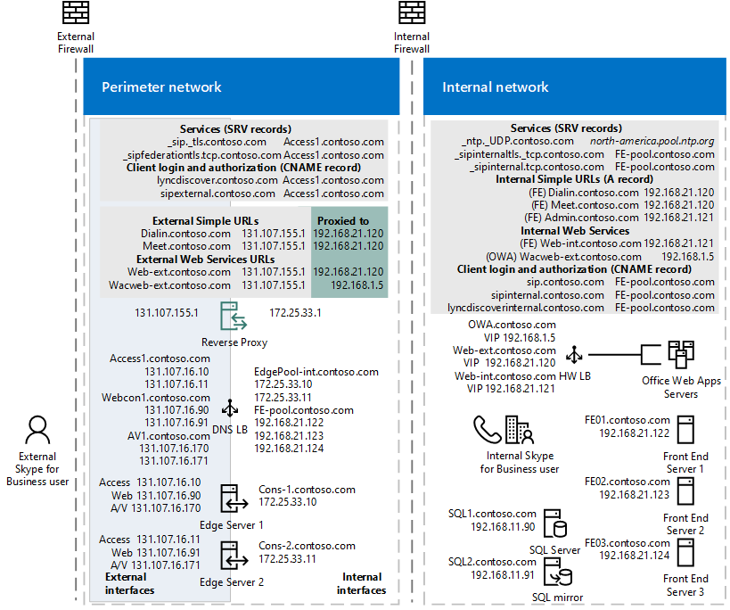

# Load balancing requirements for Skype for Business
 
**Summary:** Review the load balancing considerations before implementing Skype for Business Server.
  
Load balancing distributes traffic among the servers in a pool. If you have Front End pools, Mediation Server pools, or Edge Server pools, you need to deploy load balancing for these pools.
  
Skype for Business Server supports two types of load balancing solutions for client-to-server traffic: Domain Name System (DNS) load balancing and hardware load balancing (often abbreviated as HLB). DNS load balancing offers several advantages including simpler administration, more efficient troubleshooting, and the ability to isolate much of your Skype for Business Server traffic from any potential hardware load balancer problems.
  
Decide for yourself which load balancing solution is appropriate for each pool in your deployment, but keep in mind the following restrictions: 
  
- The internal Edge interface and external Edge interface must use the same type of load balancing. You cannot use DNS load balancing on one interface and hardware load balancing on the other.
    
- Some types of traffic require a hardware load balancer. For example, HTTP traffic requires a hardware load balancer instead of DNS load balancing. DNS load balancing does not work with client-to-server web traffic.
    
If you choose to use DNS load balancing for a pool but still need to implement hardware load balancers for traffic such as HTTP traffic, the administration of the hardware load balancers is greatly simplified. For example, configuring the hardware load balancer will be simpler as it will only manage the HTTP and HTTPS traffic, while all other protocols will be managed by DNS load balancing. For details, see [DNS Load Balancing](load-balancing.md#BKMK_DNSLoadBalancing). 
  
For server-to-server traffic, Skype for Business Server uses topology-aware load balancing. Servers read the published topology in the Central Management store to obtain the FQDNs of servers in the topology, and automatically distribute the traffic among the servers. Administrators do not need to set up or manage this type of load balancing. 
  
If you use DNS load balancing and you need to block traffic to a specific computer, it is not sufficient to just remove the IP address entries from the Pool FQDN. You must remove the DNS entry for the computer as well. 
  
## Hardware load balancer requirements

The Skype for Business Server scaled consolidated Edge topology is optimized for DNS load balancing for new deployments federating primarily with other organizations using Skype for Business Server or Lync Server. If high availability is required for any of the following scenarios, a hardware load balancer must be used on Edge Server pools for the following: 
  
- Federation with organizations using Office Communications Server 2007 R2 or Office Communications Server 2007
    
- Exchange UM for remote users using Exchange UM prior to Exchange 2010 with SP1
    
- Connectivity to public IM users
    
> [!IMPORTANT]
> Using DNS load balancing on one interface and hardware load balancing on the other is not supported. You must use hardware load balancing for both interfaces or DNS load balancing for both. 
  
> [!NOTE]
> If you are using a hardware load balancer, the load balancer deployed for connections with the internal network must be configured to load balance only the traffic to servers running the Access Edge service and the A/V Edge service. It cannot load balance the traffic to the internal Web Conferencing Edge service or the internal XMPP Proxy service. 
  
> [!NOTE]
> The direct server return (DSR) NAT is not supported with Skype for Business Server. 
  
To determine whether your hardware load balancer supports the necessary features required by Skype for Business Server, see [Infrastructure for Skype for Business](https://docs.microsoft.com/SkypeForBusiness/certification/infra-gateways). 
  
### Hardware Load Balancer Requirements for Edge Servers Running the A/V Edge Service

Following are the hardware load balancer requirements for Edge Servers running the A/V Edge service:
  
- Turn off TCP nagling for both internal and external ports 443. Nagling is the process of combining several small packets into a single, larger packet for more efficient transmission.
    
- Turn off TCP nagling for external port range 50,000 - 59,999. 
    
- Do not use NAT on the internal or external firewall. 
    
- The edge internal interface must be on a different network than the Edge Server external interface and routing between them must be disabled. 
    
- The external interface of the Edge Server running the A/V Edge Service must use publicly routable IP addresses and no NAT or port translation on any of the edge external IP addresses. 
    
- The load balancer must not change the source address of the client.
    
### Other Hardware Load Balancer requirements

Cookie-based affinity requirements are greatly reduced in Skype for Business Server for Web services. If you are deploying Skype for Business Server and will not retain any Lync Server 2010 Front End Servers or Front End pools, you do not need cookie-based persistence. However, if you will temporarily or permanently retain any Lync Server 2010 Front End Servers or Front End pools, you still use cookie-based persistence as it is deployed and configured for Lync Server 2010. 
  
> [!NOTE]
> **If you decide to use cookie-based affinity even though your deployment does not require it**, there is no negative impact to doing so. 
  
For deployments that **will not use** cookie-based affinity:
  
- On the reverse proxy publishing rule for port 4443, set **Forward host header** to True. This will ensure that the original URL is forwarded.
    
For deployments that **will use** cookie-based affinity:
  
- On the reverse proxy publishing rule for port 4443, set **Forward host header** to True. This will ensure that the original URL is forwarded.
    
- Hardware load balancer cookie MUST NOT be marked httpOnly
    
- Hardware load balancer cookie MUST NOT have an expiration time
    
- Hardware load balancer cookie MUST be named **MS-WSMAN** (This is the value that the Web services expect, and cannot be changed)
    
- Hardware load balancer cookie MUST be set in every HTTP response for which the incoming HTTP request did not have a cookie, regardless of whether a previous HTTP response on that same TCP connection had already obtained a cookie. If the load balancer optimizes cookie insert to only occur once per TCP connection, that optimization MUST NOT be used
    
> [!NOTE]
> Typical hardware load balancer configurations use source-address affinity and a 20 min. TCP session lifetime, which is fine for Lync Server and Lync 2013 clients because session state is maintained through client usage and/or and application interaction. 
  
If you are deploying mobile devices, your hardware load balancer must be able to load balance individual request within a TCP session (in effect, you must be able to load balance an individual request based on the target IP address).
  
> [!CAUTION]
> If you are deploying mobile devices, your hardware load balancer must be able to individually load balance each request within a TCP connection. The latest Apple iOS mobile apps require Transport Layer Security (TLS) version 1.2.  
  
> [!CAUTION]
> For details on third party hardware load balancers, see [Infrastructure for Skype for Business](https://docs.microsoft.com/SkypeForBusiness/certification/infra-gateways).  
  
Following are the hardware load balancer requirements for Director and Front End pool Web Services:
  
- For internal Web Services VIPs, set Source_addr persistence (internal port 80, 443) on the hardware load balancer. For Skype for Business Server, Source_addr persistence means that multiple connections coming from a single IP address are always sent to one server to maintain session state.
    
- Use TCP idle timeout of 1800 seconds.
    
- On the firewall between the reverse proxy and the next hop pool's hardware load balancer, create a rule to allow https: traffic on port 4443, from the reverse proxy to the hardware load balancer. The hardware load balancer must be configured to listen on ports 80, 443, and 4443.
    
### Summary of Hardware Load Balancer Affinity Requirements

|**Client/user location**|**External web services FQDN affinity requirements**|**Internal web services FQDN affinity requirements**|
|:-----|:-----|:-----|
|Lync Web App (internal and external users)    Mobile device (internal and external users)    |No affinity    |Source address affinity    |
|Lync Web App (external users only)    Mobile device (internal and external users)    |No affinity    |Source address affinity    |
|Lync Web App (internal users only)    Mobile device (not deployed)    |No affinity    |Source address affinity    |
   
### Port Monitoring for Hardware Load Balancers

You define port monitoring on the hardware load balancers to determine when specific services are no longer available due to hardware or communications failure. For example, if the Front End Server service (RTCSRV) stops because the Front End Server or Front End pool fails, the HLB monitoring should also stop receiving traffic on the Web Services. You implement port monitoring on the HLB to monitor the following:
  
**Front End Server User Pool - HLB Internal Interface**

|**Virtual IP/Port**|**Node Port**|**Node Machine/Monitor**|**Persistence Profile**|**Notes**|
|:-----|:-----|:-----|:-----|:-----|
|\<pool\>web-int_mco_443_vs    443    |443    |Front End    5061    |Source    |HTTPS    |
|\<pool\>web-int_mco_80_vs    80    |80    |Front End    5061    |Source    |HTTP    |
   
**Front End Server User Pool - HLB External Interface**

|**Virtual IP/Port**|**Node Port**|**Node Machine/Monitor**|**Persistence Profile**|**Notes**|
|:-----|:-----|:-----|:-----|:-----|
|\<pool\>web_mco_443_vs    443    |4443    |Front End    5061    |None    |HTTPS    |
|\<pool\>web_mco_80_vs    80    |8080    |Front End    5061    |None    |HTTP    |
   
## DNS Load Balancing

Skype for Business Server enables DNS load balancing, a software solution that can greatly reduce the administration overhead for load balancing on your network. DNS load balancing balances the network traffic that is unique to Skype for Business Server, such as SIP traffic and media traffic.
  
If you deploy DNS load balancing, your organization's administration overhead for hardware load balancers will be minimized. Additionally, complex troubleshooting of problems related to misconfiguration of load balancers for SIP traffic will be eliminated. You can also prevent server connections so that you can take servers offline. DNS load balancing also ensures that hardware load balancer problems do not affect elements of SIP traffic such as basic call routing.

The following diagram shows an example that includes both internal and external DNS load balancing: 
  
**Edge network diagram using Public IPv4 addresses**

  
If you use DNS load balancing, you may also be able to purchase lower-cost hardware load balancers than if you used the hardware load balancers for all types of traffic. You should use load balancers that have passed interoperability qualification testing with Skype for Business Server. For details about load balancer interoperability testing, see [Lync Server 2010 Load Balancer Partners](https://go.microsoft.com/fwlink/p/?linkId=202452). The content there applies to Skype for Business Server.
  
DNS load balancing is supported for Front End pools, Edge Server pools, Director pools, and stand-alone Mediation Server pools.
  
DNS load balancing is typically implemented at the application level. The application (for example, a client running Skype for Business), tries to connect to a server in a pool by connecting to one of the IP addresses returned from the DNS A and AAAA (if IPv6 addressing is used) record query for the pool fully qualified domain name (FQDN). 
  
For example, if there are three front end servers in a pool named pool01.contoso.com, the following will happen:
  
- Clients running Skype for Business query DNS for pool01.contoso.com. The query returns three IP addresses and caches them as follows (not necessarily in this order):
    
    pool01.contoso.com 192.168.10.90
    
    pool01.contoso.com 192.168.10.91
    
    pool01.contoso.com 192.168.10.92
    
- The client attempts to establish a Transmission Control Protocol (TCP) connection to one of the IP addresses. If that fails, the client tries the next IP address in the cache.
    
- If the TCP connection succeeds, the client negotiates TLS to connect to the primary registrar on pool01.contoso.com.
    
- If the client tries all cached entries without a successful connection, the user is notified that no servers running Skype for Business Server are available at the moment.
    
> [!NOTE]
> DNS-based load balancing is different from DNS round robin (DNS RR) which typically refers to load balancing by relying on DNS to provide a different order of IP addresses corresponding to the servers in a pool. Typically DNS RR only enables load distribution, but does not enable failover. For example, if the connection to the one IP address returned by the DNS A and AAAA (if you are using IPv6 addressing) query fails, the connection fails. Therefore, DNS round robin by itself is less reliable than DNS-based load balancing. You can use DNS round robin in conjunction with DNS load balancing. 
  
DNS load balancing is used for the following:
  
- Load balancing server-to-server SIP to the Edge Servers
    
- Load balancing Unified Communications Application Services (UCAS) applications such as Conferencing Auto Attendant, Response Group, and Call Park
    
- Preventing new connections to UCAS applications (also known as "draining")
    
- Load balancing all client-to-server traffic between clients and Edge Servers
    
DNS load balancing cannot be used for the following:
  
- Client-to-server web traffic to Director or Front End Servers
    
DNS load balancing and federated traffic:
  
If multiple DNS records are returned by a DNS SRV query, the Access Edge service always picks the DNS SRV record with the lowest numeric priority and highest numeric weight. The Internet Engineering Task Force document "A DNS RR for specifying the location of services (DNS SRV)" [RFC 2782, DNS SRV RR](https://www.ietf.org/rfc/rfc2782.txt) specifies that if there are multiple DNS SRV records defined, priority is first used, then weight. For example DNS SRV record A has a weight of 20 and a priority of 40 and DNS SRV record B has a weight of 10 and priority of 50. DNS SRV record A with priority 40 will be selected. The following rules apply to DNS SRV record selection:
  
- Priority is considered first. A client MUST attempt to contact the target host defined by the DNS SRV record with the lowest numbered priority it can reach. Targets with the same priority SHOULD be tried in an order defined by the weight field.
    
- The weight field specifies a relative weight for entries with the same priority. Larger weights SHOULD be given a proportionately higher probability of being selected. DNS administrators SHOULD use Weight 0 when there isn't any server selection to do. In the presence of records containing weights greater than 0, records with weight 0 should have a very small chance of being selected.
    
If multiple DNS SRV records with equal priority and weight are returned, the Access Edge service will select the SRV record that was received first from the DNS server.
  
### DNS Load Balancing on Front End Pools and Director Pools

You can use DNS load balancing for the SIP traffic on Front End pools and Director pools. With DNS load balancing deployed, you still need to also use hardware load balancers for these pools, but only for client-to-server HTTPS traffic. The hardware load balancer is used for HTTPS traffic from clients over ports 443 and 80. 
  
Although you still need hardware load balancers for these pools, their setup and administration will be primarily for HTTPS traffic, which the administrators of hardware load balancers are accustomed to.
  
#### DNS Load Balancing and Supporting Older Clients and Servers

DNS load balancing supports automatic failover only for servers running Skype for Business Server or Lync Server 2010, and for Lync 2013 and Skype for Business clients. Earlier versions of clients and Office Communications Server can still connect to pools running DNS load balancing, but if they cannot make a connection to the first server that DNS load balancing refers them to, they are unable to fail over to another server in the pool. 
  
Additionally, if you are using Exchange UM, you must use a minimum of Exchange 2010 SP1 to get support for Skype for Business Server DNS load balancing. If you use an earlier version of Exchange, your users will not have failover capabilities for these Exchange UM scenarios:
  
- Playing their Enterprise voicemail on their phone
    
- Transferring calls from an Exchange UM Auto Attendant
    
All other Exchange UM scenarios will work properly.
  
#### Deploying DNS Load Balancing on Front End Pools and Director Pools

Deploying DNS load balancing on Front End pools and Director pools requires you to perform a couple of extra steps with FQDNs and DNS records.
  
- A pool that uses DNS load balancing must have two FQDNs: the regular pool FQDN that is used by DNS load balancing (such as pool01.contoso.com), and resolves to the physical IPs of the servers in the pool, and another FQDN for the pool's Web services (such as web01.contoso.com), which resolves to virtual IP address of the pool. 
    
    In Topology Builder, if you want to deploy DNS load balancing for a pool, to create this extra FQDN for the pool's Web services you must select the **Override internal Web Services pool FQDN** check box and type the FQDN, in the **Specify the Web Services URLs for this Pool** page.
    
- To support the FQDN used by DNS load balancing, you must provision DNS to resolve the pool FQDN (such as pool01.contoso.com) to the IP addresses of all the servers in the pool (for example, 192.168.1.1, 192.168.1.2, and so on). You should include only the IP addresses of servers that are currently deployed.
    
    > [!CAUTION]
    > If you have more than one Front End pool or Front End Server the external Web services FQDN must be unique. For example, if you define the external Web services FQDN of a Front End Server as **pool01.contoso.com**, you cannot use **pool01.contoso.com** for another Front End pool or Front End Server. If you are also deploying Directors, the external Web services FQDN defined for any Director or Director pool must be unique from any other Director or Director pool as well as any Front End pool or Front End Server. If decide to override the Internal web services with a self-defined FQDN, each FQDN must be unique from any other Front End pool, Director or a Director pool.
  
### DNS Load Balancing on Edge Server Pools

You can deploy DNS load balancing on Edge Server pools. If you do, you must be aware of some considerations.
  
Using DNS load balancing on your Edge Servers causes a loss of failover ability in the following scenarios:
  
- Federation with organizations that are running versions of Skype for Business Server released prior to Lync Server 2010.
    
- Instant message exchange with users of public instant messaging (IM) services AOL and Yahoo!, in addition to XMPP-based providers and servers, such as Google Talk, currently the only supported XMPP partner.
    
These scenarios will work as long as all Edge Servers in the pool are up and running, but if one Edge Server is unavailable, any requests for these scenarios that are sent to it will fail, instead of routing to another Edge Server.
  
 If you are using Exchange UM, you must use a minimum of Exchange 2013 to get support for Skype for Business Server DNS load balancing on Edge. If you use an earlier version of Exchange, your remote users will not have failover capabilities for these Exchange UM scenarios:
  
- Playing their Enterprise voicemail on their phone
    
- Transferring calls from an Exchange UM Auto Attendant
    
All other Exchange UM scenarios will work properly.
  
The internal Edge interface and external Edge interface must use the same type of load balancing. You cannot use DNS load balancing on one Edge interface and hardware load balancing on the other Edge interface.
  
#### Deploying DNS Load Balancing on Edge Server Pools

To deploy DNS load balancing on the external interface of your Edge Server pool, you need the following DNS entries:
  
- For the Access Edge service, you need one entry for each server in the pool. Each entry must resolve the FQDN of the Access Edge service (for example, sip.contoso.com) to the IP address of the Access Edge service on one of the Edge Servers in the pool.
    
- For the Web Conferencing Edge service, you need one entry for each server in the pool. Each entry must resolve the FQDN of the Web Conferencing Edge service (for example, webconf.contoso.com) to the IP address of the Web Conferencing Edge service on one of the Edge Servers in the pool.
    
- For the Audio/Video Edge service, you need one entry for each server in the pool. Each entry must resolve the FQDN of the Audio/Video Edge service (for example, av.contoso.com) to the IP address of the A/V Edge service on one of the Edge Servers in the pool.
    
To deploy DNS load balancing on the internal interface of your Edge Server pool, you must add one DNS A record, which resolves the internal FQDN of the Edge Server pool to the IP address of each server in the pool.
  
### Using DNS Load Balancing on Mediation Server Pools

You can use DNS load balancing on stand-alone Mediation Server pools. All SIP and media traffic is balanced by DNS load balancing.
  
To deploy DNS load balancing on a Mediation Server pool, you must provision DNS to resolve the pool FQDN (for example, mediationpool1.contoso.com) to the IP addresses of all the servers in the pool (for example, 192.168.1.1, 192.168.1.2, and so on).
  
### Blocking Traffic to a Server With DNS Load Balancing

If you use DNS load balancing and you need to block traffic to a specific computer, it is not sufficient to just remove the IP address entries from the Pool FQDN. You must remove the DNS entry for the computer as well. 
  
Note that for server-to-server traffic, Skype for Business Server uses topology-aware load balancing. Servers read the published topology in the Central Management store to obtain the FQDNs of servers in the topology, and automatically distribute the traffic among the servers. To block a server from receiving server-to-server traffic, you must remove the server from the topology. 
  

