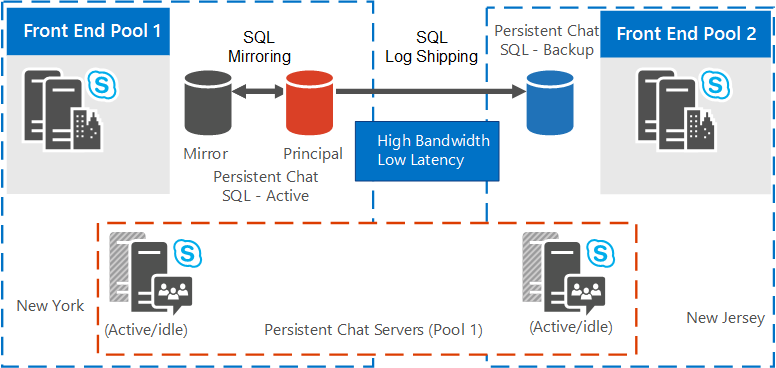
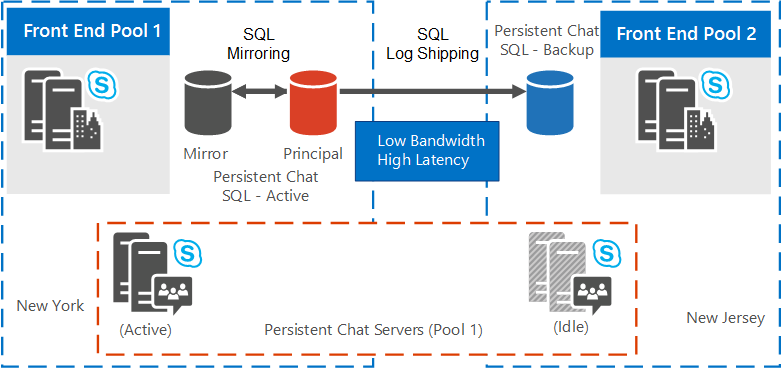

# Plan for high availability and disaster recovery for Persistent Chat Server in Skype for Business Server 2015
 
**Summary:** Read this topic to learn how to plan for high availability and disaster recovery for Persistent Chat Server in Skype for Business Server 2015.
  
High availability and disaster recovery for Persistent Chat Server require additional resources beyond what is typically needed for full operation. 
  
> [!NOTE]
> Using SQL AlwaysOn Availability Groups is not supported with Persistent Chat Server databases. 

> [!NOTE] 
> Persistent chat is available in Skype for Business Server 2015 but is no longer supported in Skype for Business Server 2019. The same functionality is available in Teams. For more information, see [Getting started with your Microsoft Teams upgrade](/microsoftteams/upgrade-start-here). If you need to use Persistent chat, your choices are to either migrate users requiring this functionality to Teams, or to continue using Skype for Business Server 2015. 
  
## Resource requirements

Before configuring Persistent Chat Server for high availability and disaster recovery, ensure that you have the following additional resources. 
  
- One dedicated database instance located in the same physical data center in which the home front end of the Persistent Chat Server service is located. This database will serve as the SQL Server mirror for the primary Persistent Chat database. Optionally, designate an additional SQL Server to serve as the mirroring witness if you want an automated failover to the mirror database.
    
- One dedicated database instance located in the other physical data center. This database will serve as the SQL Server Log Shipping secondary database for the database in the primary data center.
    
- One dedicated database instance to serve as the SQL Server mirror for the secondary database. Optionally, designate an additional SQL Server to server as the mirroring witness. Both of these must be located in the same physical data center as the secondary database.
    
- If Persistent Chat Server compliance is enabled, an additional three dedicated database instances are required. Their distribution is the same as those previously outlined for the Persistent Chat database. While it is possible for the compliance database to share the same SQL Server instance as the Persistent Chat database, standalone instances for high availability and disaster recovery are recommended.
    
- A file share must be created and designated for the SQL Server Log Shipping transaction logs. All SQL Servers in both data centers that run Persistent Chat databases must have read/write access to this file share. This share is not defined as part of a FileStore role.
    
- A file share on the secondary database server to serve as the destination folder for the SQL Server transaction logs that are copied from the primary server file share.
    
## Disaster recovery and high availability solutions

Skype for Business Server supports multiple modes of high availability for your Back End Servers, including database mirroring. For more information, see [Plan for high availability and disaster recovery in Skype for Business Server 2015](../../plan-your-deployment/high-availability-and-disaster-recovery/high-availability-and-disaster-recovery.md). 
  
The disaster recovery solution for Persistent Chat Server described in this topic is built on a stretched Persistent Chat Server pool. There is no requirement for a stretched virtual local area network (VLAN). By stretching a Persistent Chat Server pool, you configure one pool in the topology logically, but you physically place the servers in the pool in two different data centers. You configure SQL Server mirroring for the database in the same way, and deploy the database and the mirror in the same data center. You need to configure a backup database in the secondary data center (with an optional mirror to provide high availability during disaster recovery). This is the backup database used for failover during disaster recovery. 
  
For details about how to configure high availability and disaster recovery for Persistent Chat Server, see [Configure high availability and disaster recovery for Persistent Chat Server in Skype for Business Server 2015](../../deploy/deploy-persistent-chat-server/configure-hadr-for-persistent-chat.md). 
  
The following figures show how the Persistent Chat Server pool can be configured in two different stretched pool topologies:
  
- Stretched Persistent Chat Server pool when data centers are geo-located with high bandwidth/low latency.
    
- Stretched Persistent Chat Server pool when data centers are geo-located with low bandwidth/high latency.
    
Figure 1 shows a stretched Persistent Chat Server pool topology where data centers are geo-located with high bandwidth/low latency. Assume the following for the logical and physical topologies:
  
- The logical topology consists of the following:
    
  - A Persistent Chat pool across Sites 1 and 2 containing servers 1 through 8.
    
  - A Front End Server pool, a Persistent Chat database, a mirrored database, and, optionally, a witness database (not shown in diagram) residing physically on Site 1. 
    
  - A second Front End Server pool and a backup database residing physically on Site 2.
    
- The physical topology consists of Sites 1 and 2 as follows:
    
  - A Persistent Chat pool, containing servers 1 through 4, two active, two idle on Site 1.
    
  - A Persistent Chat pool, containing servers 5 through 8, two active, two idle on Site 2.
    
  - A Front End Server pool, a Persistent Chat database, a mirrored database, and, optionally, a witness database (not shown in diagram) on Site 1.
    
  - A Front End Server Pool, and a backup database, which is the SQL log shipping target, on Site 2.
    
**Stretched Persistent Chat Server pool when data centers are geo-located with high bandwidth/low latency**

  
Figure 2 shows a stretched Persistent Chat Server pool topology where data centers are geo-located with low bandwidth/high latency.
  
- The logical topology consists of the following:
    
  - A Persistent Chat pool across Sites 1 and 2 containing servers 1 through 8.
    
  - A Front End Server pool, a Persistent Chat database, a mirrored database, and, optionally, a witness database (not shown in diagram) residing physically on Site 1. 
    
  - A second Front End Server pool and a backup database residing physically on Site 2.
    
- The physical topology consists of Sites 1 and 2 as follows:
    
  - A Persistent Chat pool, containing servers 1 through 4, all active, on Site 1.
    
  - A Persistent Chat pool, containing servers 5 through 8, all idle, on Site 2.
    
  - A Front End Server pool, a Persistent Chat database, a mirrored database, and, optionally, a witness database (not shown in diagram) on Site 1.
    
  - A Front End Server pool, and a backup database, which is the SQL log shipping target, on Site 2.
    
**Stretched Persistent Chat Server pool when data centers are geo-located with low bandwidth/high latency**

  

