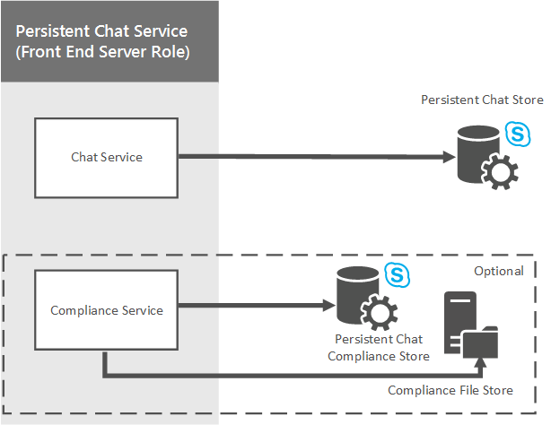

# Plan for Persistent Chat Server in Skype for Business Server 2015
 
**Summary:** Read this topic to learn how to plan for Persistent Chat Server in Skype for Business Server 2015.
  
Persistent Chat Server is an optional role that lets multiple users in your organization participate in chat room conversations that persist over time. Although users can communicate in real time during a chat session, the content of each session--including text, links, and files--is persistent, which means users can view and search all content of the session at any time.
  
Persistent Chat Server can help improve communication within your organization by:
  
- Broadening information awareness and participation throughout the organization
    
- Enabling efficient information sharing 
    
- Improving communication between teams, including geographically dispersed and cross-functional teams
    
- Reducing information overload
    
- Following compliance regulations by optionally deploying the Persistent Chat Compliance service

> [!NOTE] 
> Persistent chat is available in Skype for Business Server 2015 but is no longer supported in Skype for Business Server 2019. The same functionality is available in Teams. For more information, see [Journey from Skype for Business to Microsoft Teams](/microsoftteams/journey-skypeforbusiness-teams). If you need to use Persistent chat, your choices are to either migrate users requiring this functionality to Teams, or to continue using Skype for Business Server 2015. 
    
## Persistent Chat Server high-level architecture

The following diagram shows a high-level view of the Persistent Chat Server architecture. 
  

  
Persistent Chat consists of a front-end server role that provides the Persistent Chat services as well as a back-end SQL database component. Both front-end and back-end components are included in a dedicated Persistent Chat pool. Each computer that hosts Persistent Chat Server must have access to an existing Skype for Business Server 2015 topology. In this diagram, there is one Persistent Chat Server pool (A), which is dependent on Skype for Business Server Pool A for routing messages to it.
  
You can deploy one or more Persistent Chat Server pools, each with up to four active Persistent Chat Servers supporting up to 80K concurrent users.
  
Skype for Business Server 2015 communicates with the Persistent Chat service using the Session Initiation Protocol (SIP) for registration and the Extensible Chat Communication Over SIP protocol (XCCOS) for chat. 
  
## Persistent Chat services

The following diagram shows the Persistent Chat Server front-end services, and how these services communicate with the back-end database components. The front-end components include the Persistent Chat services and the Compliance service. The back-end components include the Persistent Chat store and the Persistent Chat compliance store.
  

  
### Chat service

The Chat service, also called the Channel service, is the core service responsible for Persistent Chat Server. The Chat service provides the following functions:
  
- Accepts incoming messages
    
- Registers and lists online participants within a Persistent Chat room
    
- Retransmits messages to other channel subscribers
    
- Implements logic for channel management, chat room invitations, search and new content notifications
    
The Persistent Chat service stores and accesses chat room content and other system metadata (authorization rules and so on) by using the Persistent Chat store. The service stores files that are uploaded into chat rooms in the Persistent Chat file store.
  
### Compliance service

If your organization has regulations that require Persistent Chat activity to be archived, you can deploy the optional Persistent Chat Compliance service. The Compliance service is responsible for archiving chat content and events, such as joining and leaving rooms, to the Persistent Chat Compliance file store. The Compliance service is installed on each Persistent Chat Server in a Persistent Chat pool. 
  
### Web services

The Persistent Chat web services run on the Skype for Business Front End Servers. The web services depend on Internet Information Services (IIS), and are implemented as web components:
  
- Persistent Chat web services for file upload and download are responsible for posting and retrieving files from chat rooms.
    
- Persistent Chat web services for chat room management are responsible for providing users the ability to manage their chat rooms, and create new chat rooms.
    
## Defining requirements for your organization

If you decide to deploy Persistent Chat Server, you'll need to determine your organization's business requirements, then define the topology, infrastructure, and technical requirements to support your business needs. To optimize your deployment, you'll need to answer the following questions:
  
- Are you migrating from a previous version of Group Chat Server, or a previous version of Persistent Chat Server, or are you deploying Persistent Chat Server for the first time?
    
- Who can use Persistent Chat Server? You specify Persistent Chat policies to determine user access at the global, site, or user level.
    
- How many users will require access to Persistent Chat Server? Persistent Chat Server supports 150,000 provisioned users (enabled by policy), and a maximum of 80,000 concurrent users. A single Persistent Chat Server can support 20,000 connected users, and a single Persistent Chat Server pool can have up to 4 active servers for a total of 80,000 concurrently connected users.
    
- How do you want to control scopes, ethical boundaries, and access? You can define categories to segregate these boundaries, and choose who is allowed to be in rooms that are created in each of these categories.
    
- How do you want to control who can create rooms? You can define creators who can create rooms. Creators can assign other members as chat room managers for ongoing management of the rooms.
    
- How do you want to create rooms? Persistent Chat Server provides a web-based feature for creating and managing rooms. This can be launched from the Skype for Business client. You can choose to define a customer solution that implements your business requirements and workflows, and configures Persistent Chat Server to direct users to your custom solution.
    
- What kind of add-ins do you want to provision? Add-ins enhance the in-room experience by leveraging the extensibility pane in the Skype for Business client to provide context that is relevant to the room. You can choose what general add-ins might be most useful (for example, your company website, internal collaboration documents, and so on). Chat room managers can choose one of the registered add-ins and associate it with their rooms, if desired. 
    
- What kind of high availability and disaster recovery requirements do you have? Persistent Chat Server supports SQL Server mirroring and SQL Server clustering for high availability. For disaster recovery, Persistent Chat Server supports up to 8 servers (4 active and 4 standby) in a stretched pool with SQL Server log shipping. 
    
- Are there regulatory requirements? If your company is in a country or region where data needs to be kept within the country, you may need to deploy multiple Persistent Chat Server pools, each local to a specific geography. A room, category, or add-in does not span pools--it belongs to only one Persistent Chat Server pool. 
    
    > [!NOTE]
    > Having multiple Persistent Chat Server pools does not give you more scale (you can still have only 80,000 concurrent users across all your Persistent Chat Server pools). The primary reason for supporting multiple Persistent Chat Server pools is to support regulatory concerns. 
  
## For more information

For more information about installing and configuring Persistent Chat Server, see the following topics:
  
- For details about how to deploy Persistent Chat Server, see [Deploy Persistent Chat Server in Skype for Business Server 2015](../../deploy/deploy-persistent-chat-server/deploy-persistent-chat-server.md). 
    
- For details about how to configure settings on your Persistent Chat Server deployment, see [Manage Persistent Chat Server in Skype for Business Server 2015](../../manage/persistent-chat/persistent-chat.md).
    

