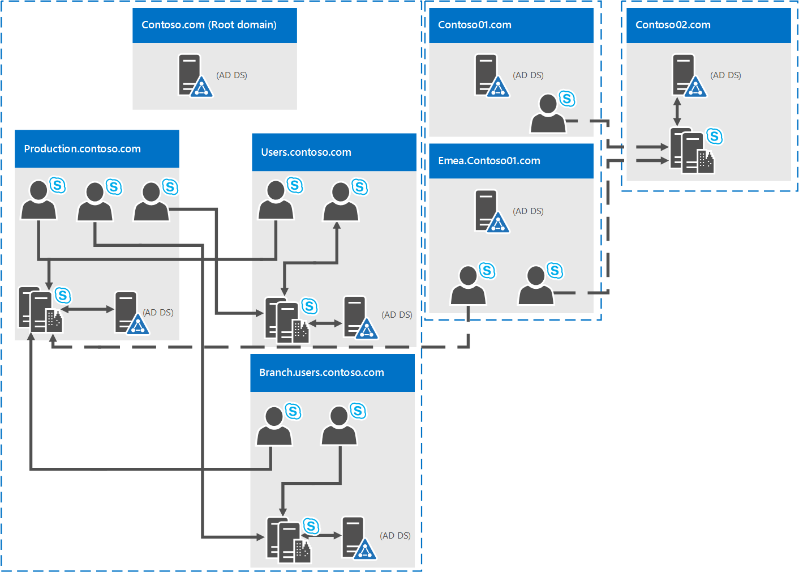

# Environmental requirements for Skype for Business Server 2015
 
**Summary:** Configure your non-server requirements for Skype for Business Server 2015. There are a variety of things you'll want configured before doing your deployment, including Active Directory, DNS, Certs and Fileshares.
  
What is an environmental requirement for Skype for Business Server 2015? Well, we've put everything that's not directly server related into this topic, so you don't have to do as much clicking around. If you're looking for Server Prerequisites, you can check out the [Server requirements for Skype for Business Server 2015](server-requirements.md) doc.[Networking Planning](../../plan-your-deployment/network-requirements/network-requirements.md) is also documented separately. Otherwise, this is what we've got in this article:
  
- [Active Directory](environmental-requirements.md#AD)
  
- [Domain Name System (DNS)](environmental-requirements.md#DNS)
  
- [Certificates](environmental-requirements.md#Certs)
  
- [File Share](environmental-requirements.md#Fileshare)
  
## Active Directory

While a lot of configuration data for servers and services is stored in Skype for Business Server 2015's Central Management store, there are some things still stored in Active Directory:
  
|**Active Directory objects**|**Object types**|
|:-----|:-----|
|Schema extensions    |User object extensions    |
||Extensions for Lync Server 2013 and Lync Server 2010, to maintain backward compatibility with the previous supported versions.    |
|Data    |User SIP URI and other user settings    |
||Contact objects for applications (like the Response Group application and the Conferencing Attendant application).    |
||Data published for backward compatibility.    |
||A service control point (SCP) for the Central Management store.    |
||Kerberos Authentication Account (an optional computer object).    |
   
### OS for Domain Controllers

So, what Domain Controller OS can be used? We have the following list:
  
- Windows Server 2016
    
- Windows Server 2012 R2
    
- Windows Server 2012
    
- Windows Server 2008 R2
    
- Windows Server 2008
    
Now, the domain functional level of any domain you deploy Skype for Business Server 2015 into, and the forest functional level of any forest you deploy Skype for Business Server 2015 into, have to be one of the following:
  
- Windows Server 2016
    
- Windows Server 2012 R2
    
- Windows Server 2012
    
- Windows Server 2008 R2
    
- Windows Server 2008
    
- Windows Server 2003
    
Can you have read-only domain controllers in these environments? Sure, as long as there are also writable domain controller available.
  
Now, it's important to know that Skype for Business Server 2015 doesn't support single-labeled domains. What are they? If you have a root domain labeled contoso.local, that's going to be fine. If you have a root domain that's just named local, that's not going to work, and it's not supported as a result. A little more about this has been written [in this Knowledge Base article](https://support.microsoft.com/kb/300684/en-us).
  
Skype for Business Server 2015 also doesn't support renaming domains. If you've really got to do that, then you'll need to uninstall Skype for Business Server 2015, do the domain rename, and then reinstall Skype for Business Server 2015.
  
Finally, you may be dealing with a domain with a locked-down AD DS environment, and that's all right. We have more information on how to deploy Skype for Business Server 2015 into that sort of environment in the Deployment docs.
  
### AD Topologies

Skype for Business Server 2015's supported topologies are:
  
- Single forest with single domain
    
- Single forest with a single tree and multiple domains
    
- Single forest with multiple trees and disjoint namespaces
    
- Multiple forests in a central forest topology
    
- Multiple forests in a resource forest topology
    
- Multiple forests in a Skype for Business resource forest topology with Exchange Online
    
- Multiple forests in a resource forest topology with Skype for Business Online and Azure Active Directory Connect
    
We have diagrams and descriptions to help you determine what topology you have in your environment, or what you may need to set up prior to installing Skype for Business Server 2015. To keep it simple, we're also including a key:
  

  
#### Single forest with single domain

  
It doesn't get easier than this, it's a single domain forest, this is a common topology.
  
#### Single forest with a single tree and multiple domains

  
This diagram shows a single forest, again, but it has one or more child domains as well (there are three in this specific example). So the domain the users are created in might be different from the domain Skype for Business Server 2015 is deployed to. Why worry about this? It's important to remember that when you deploy a Skype for Business Server Front End pool, all the servers in that pool need to be in a single domain. You can have cross-domain administration via Skype for Business Server's support of Windows universal administrator groups.
  
Back to the diagram above, you can see that users from one domain are able to access Skype for Business Server pools from the same domain or from different domains, even if those users are in a child domain.
  
#### Single forest with multiple trees and disjoint namespaces

  
It may be that you've got a topology similar to this diagram, where you have one forest, but within that forest are multiple domains, with separate AD namespaces. If that's the case, this diagram's a good illustration, as we have users in three different domains accessing Skype for Business Server 2015. Solid lines indicate they're accessing a Skype for Business Server pool in their own domain, while a dashed line indicates they're going to a pool in a different tree altogether.
  
As you can see, users in the same domain, the same tree, or even a different tree are able to access pools successfully.
  
#### Multiple forests in a central forest topology

  
Skype for Business Server 2015 does support multiple forests configured in a central forest topology. If you're not sure that's what you have, the central forest in the topology uses objects in it to represent users in the other forests, and hosts user accounts for any users in the forest.
  
How does this work? Well, a directory synchronization product (such as Forefront Identity Manager, or FIM) manages your organization's user accounts throughout their existence. When an account is created or deleted from a forest, that change is synched up to the corresponding contact in the central forest.
  
Clearly, if your AD infrastructure is in-place moving to this topology might not be easy, but if you're already there, or still planning out your forest infrastructure, this can be a good choice. You can centralize your Skype for Business Server 2015 deployment within a single forest, while users can search, communicate, and view the presence of other users in any forest. All user contact updates are handled automatically with synchronization software.
  
#### Multiple forests in a Skype for Business resource forest topology

  
A resource forest topology is also supported; it's where a forest is dedicated to running your server applications, like Microsoft Exchange Server and Skype for Business Server 2015. This resource forests also hosts a synchronized representation of active user objects, but no logon-enabled user accounts. So the resource forest is a shared services environment for other forests in which user objects reside, and they have a forest-level trust relationship with the resource forest.
  
Note that Exchange Server can be deployed in the same resource forest as Skype for Business Server or in a different forest.
  
To deploy Skype for Business Server 2015 in this type of topology, you'd create one disabled user object in the resource forest for each user account in the user forests (if Microsoft Exchange Server is already in the environment, this might be done for you). Then you'll need a directory synchronization tool (like Forefront Identity Manager, or FIM) to manage user accounts through their life cycle.
  
#### Multiple forests in a Skype for Business resource forest topology with Exchange Online

This topology is similar to the topology described in [Multiple forests in a Skype for Business resource forest topology](environmental-requirements.md#BKMK_multipleforestopology).
  
In this topology, there are one or more user forests, and Skype for Business Server is deployed in a dedicated resource forest. Exchange Server can be deployed on-premises in the same resource forest or a different forest and configured for hybrid with Exchange Online, or email services may be provided exclusively by Exchange Online for the on-premises accounts. There is no diagram available for this topology.
  
#### Multiple forests in a resource forest topology with Skype for Business Online and Azure Active Directory Connect

  
With this scenario, there are multiple forests on-premises, with a resource forest topology. There is a full trust relationship between the Active Directory forests. The Azure Active Directory Connect tool is used to synchronize accounts between the on-premises user forests and Office 365.
  
 The organization also has Office 365, and uses [Azure Active Directory Connect](https://go.microsoft.com/fwlink/p/?LinkId=614836) to synchronize their on-premises accounts with Office 365. Users who are enabled for Skype for Business are enabled via Office 365 and Skype for Business Online. Skype for Business Server is not deployed on-premises.
  
Single sign-on authentication is provided by an Active Directory Federation Services farm located in the user forest.
  
In this scenario, it is supported to deploy Exchange on-premises, Exchange Online, a hybrid Exchange solution, or to not have Exchange deployed at all. (The diagram shows only Exchange on-premises, but the other Exchange solutions are also fully supported.)
  
#### Multiple forests in a resource forest topology with hybrid Skype for Business

In this scenario, there are one or more on-premises user forests, and Skype for Business is deployed in a dedicated resource forest and is configured for hybrid mode with Skype for Business Online. Exchange Server can be deployed on-premises in the same resource forest or a different forest and may be configured for hybrid with Exchange Online. Alternatively, email services may be provided exclusively by Exchange Online for the on-premises accounts.
  
For more information, see [Configure a multi-forest environment for hybrid Skype for Business](../../skype-for-business-hybrid-solutions/deploy-hybrid-connectivity/configure-a-multi-forest-environment-for-hybrid.md).
  
## Domain Name System (DNS)

Skype for Business Server 2015 requires DNS, for the following reasons:
  
- DNS enables Skype for Business Server 2015 to discover internal servers or pools, allowing for server-to-server communications.
    
- DNS allows client machines to discover the Front End pool or Standard Edition server being used for SIP transactions.
    
- It associates simple URLs for conferences with the servers hosting those conferences.
    
- DNS allows external users and client machines to connect to your Edge Servers, or the HTTP reverse proxy, for instant messaging (IM) or conferencing.
    
- It lets unified communications (UC) devices that aren't logged in discover the Front End pool or Standard Edition server that's running the Device Update web service to get updates and send logs.
    
- Using DNS allows mobile clients to automatically discover web services resources without requiring users to manually enter URLs in their device settings.
    
- And it's used in DNS load balancing.
    
It's important to note that Skype for Business Server 2015 doesn't support internationalized domain names (IDNs).
  
And it's extremely important to remember that any name in DNS be identical to the computer name configured on any server being used by Skype for Business Server 2015. Specifically, we can't have any short-names in the environment, and must have FQDNs for Topology Builder.
  
This seems like it would be logical for any computer already joined to a domain, but if you have an Edge Server that's not joined to your domain, it may have a default of a short name, with no domain suffix. Make sure that's not the case, either in DNS or on the Edge Server, or any Skype for Business Server 2015 server or pool, for that matter.
  
And definitely don't use Unicode characters or underscores. Standard characters (which are A-Z, a-z, 0-9, and hyphens) are the ones that are going to be supported by external DNS and public Certificate Authorities (you'll need to assign FQDNs to the SN in the certificate, don't forget), so you'll spare yourself a lot of grief if you name with this in mind.
  
For further reading on DNS requirements for Networking, check out the [Networking](../../plan-your-deployment/network-requirements/network-requirements.md) section of our Planning documentation.
  
## Certificates

One of the most important things you can do before deploying is make sure you have your certificates in order. Skype for Business Server 2015 needs a public key infrastructure (PKI) for transport layer security (TLS) and mutual transport layer security (MTLS) connections. Basically, to communicate securely in a standardized way, Skype for Business Server uses certificates issued by Certificate Authorities (CAs).
  
These are some of the things that Skype for Business Server 2015 uses certificates for:
  
- TLS connections between clients and servers
    
- MTLS connections between servers
    
- Federation usin automatic DNS discovery of partners
    
- Remote user access for instant messaging (IM)
    
- External user access to audio/video (AV) sessions, application sharing, and conferencing
    
- Talking to web applications and Outlook Web Access (OWA)
    
So certificate planning's a must. Now, let's look at a list of some of the things you need to keep in mind when requesting certificates:
  
- All server certificates must support server authorization (Server EKU).
    
- All server certificates must contain a CRL Distribution Point (CDP).
    
- All certificates must be signed using a signing algorithm supported by the operating system. Skype for Business Server 2015 supports the SHA-1 and SHA-2 suite of digest sizes (224, 256, 384 and 512-bit), and meets or exceeds the operating system requirements.
    
- Auto-enrollment is supported for internal servers running Skype for Business Server 2015.
    
- Auto-enrollment is not supported for Skype for Business Server 2015 Edge Servers.
    
- When you submit a web-based certificate request to a Windows Server 2003 CA, you must submit it from a computer running either Windows Server 2003 with SP2 or Windows XP.
    
> [!NOTE]
> Although KB922706 provides support for resolving issues with enrolling web certificates against a Windows Server 2003 Certificate Services web enrollment, it does not make it possible to use Windows Server 2008, Windows Vista, or Windows 7 to request a certificate from a Windows Server 2003 CA. 
  
> [!NOTE]
> Using the RSASSA-PSS signature algorithm is unsupported, and may lead to errors on login and call forwarding issues, among other problems. 
  
- Encryption key lengths of 1024, 2048, and 4096 are supported. Key lengths of 2048 and greater are recommended.
    
- The default digest, or hash signing, algorithm is RSA. The ECDH_P256, ECDH_P384, and ECDH_P521 algorithms are also supported.
    
So that's a lot to think about, and definitely, there's a variety of comfort levels with requesting certificates from a CA. We'll give you some further guidance below to make your planning as painless as possible.
  
### Certificates for your internal servers

You'll need certificates for most of your internal servers, and most likely, you'll get them from an internal CA (that's one located in your domain). If you want to, you can request these certificates from an external CA (one located on the internet). If you're wondering what public CA you should go to, you can check out the [Unified Communications certificate partners](https://support.microsoft.com/kb/929395/en-us) list.
  
You're also going to need certificates when Skype for Business Server 2015 communicates with other applications and servers, such as Microsoft Exchange Server. This will, obviously, need to be a certificate these other apps and servers can use in a supported way. Skype for Business Server 2015 and other Microsoft products support the Open Authorization (OAuth) protocol for server-to-server authentication and authorization. If you're interested in this, we have an additional planning article for OAuth and Skype for Business Server 2015.
  
Skype for Business Server 2015 also includes support for (without requiring) certificates signed using the SHA-256 cryptographic hash function. To support external access using SHA-256, the external certificate needs to be issued by a public CA using SHA-256.
  
To try and keep things straightforward, we've put the certificate requirements for Standard Edition servers, Front End pools, and other roles, into the following tables, with the fictional contoso.com being used for examples (you'll probably be using something else for your environment). These are all standard web server certificates, with private keys that are non-exportable. Some additional things to note:
  
- Server enhanced key usage (EKU) is automatically configured when you use the certificate wizard to request certificates.
    
- Each certificate friendly name has to be unique in the computer store.
    
- As per the sample names below, if you've configured sipinternal.contoso.com or sipexternal.contoso.com in your DNS, they need to be added to the certificate's Subject Alternative Name (SAN).
    
Certificates for Standard Edition servers:
  
|**Certificate**|**Subject name/Common name**|**Subject alternative name**|**Example**|**Comments**|
|:-----|:-----|:-----|:-----|:-----|
|Default    |FQDN of the pool    |FQDN of the pool and FQDN of the server    If you have multiple SIP domains and have enabled automatic client configuration, the certificate wizard detects and adds each supported SIP domain FQDNs.    If this pool is the auto-logon server for clients and strict Domain Name System (DNS) matching is required in group policy, you also need entries for sip.sipdomain (for each SIP domain you have).    |SN=se01.contoso.com; SAN=se01.contoso.com    If this pool is the auto-logon server for clients and strict DNS matching is required in group policy, you also need SAN=sip.contoso.com; SAN=sip.fabrikam.com    |On Standard Edition servers Standard Edition server, the server FQDN is the same as the pool FQDN.    The wizard detects any SIP domains you specified during setup and automatically adds them to the subject alternative name.    You can also use this certificate for Server-to-Server Authentication.    |
|Web internal    |FQDN of the server    |Each of the following:    • Internal web FQDN (which is the same as the FQDN of the server)    AND    • Meet simple URLs    • Dial-in simple URL    • Admin simple URL    OR    • A wildcard entry for the simple URLs    |SN=se01.contoso.com; SAN=se01.contoso.com; SAN=meet.contoso.com; SAN=meet.fabrikam.com; SAN=dialin.contoso.com; SAN=admin.contoso.com    Using a wildcard certificate:    SN=se01.contoso.com; SAN=se01.contoso.com; SAN=\*.contoso.com    |You can't override the Internal web FQDN in Topology Builder.    If you have multiple Meet simple URLs, you've got to include all of them as SANs.    Wildcard entries are supported for the simple URL entries.    |
|Web external    |FQDN of the server    |Each of the following:    • External web FQDN    AND    • Dial-in simple URL    • Meet simple URLs per SIP domain    OR    • A wildcard entry for the simple URLs    |SN=se01.contoso.com; SAN=webcon01.contoso.com; SAN=meet.contoso.com; SAN=meet.fabrikam.com; SAN=dialin.contoso.com    Using a wildcard certificate:    SN=se01.contoso.com; SAN=webcon01.contoso.com; SAN=\*.contoso.com    |If you have multiple Meet simple URLs, you've got to include all of them as subject alternative names.    Wildcard entries are supported for the simple URL entries.    |
   
Certificates for Front End Servers in a Front End pool:
  
|**Certificate**|**Subject name/Common name**|**Subject alternative name**|**Example**|**Comments**|
|:-----|:-----|:-----|:-----|:-----|
|Default    |FQDN of the pool    |FQDN of the pool and FQDN of the server    If you have multiple SIP domains and have enabled automatic client configuration, the certificate wizard detects and adds each supported SIP domain FQDNs.    If this pool is the auto-logon server for clients and strict Domain Name System (DNS) matching is required in group policy, you also need entries for sip.sipdomain (for each SIP domain you have).    |SN=eepool.contoso.com; SAN=eepool.contoso.com; SAN=ee01.contoso.com    If this pool is the auto-logon server for clients and strict DNS matching is required in group policy, you also need SAN=sip.contoso.com; SAN=sip.fabrikam.com    |The wizard detects any SIP domains you specified during setup and automatically adds them to the subject alternative name.    You can also use this certificate for Server-to-Server Authentication.    |
|Web internal    |FQDN of the pool    |Each of the following:    • Internal web FQDN (which is NOT the same as the FQDN of the server)    • Server FQDN    • Skype for Business pool FQDN    AND    • Meet simple URLs    • Dial-in simple URL    • Admin simple URL    OR    • A wildcard entry for the simple URLs    |SN=ee01.contoso.com; SAN=ee01.contoso.com; SAN=meet.contoso.com; SAN=meet.fabrikam.com; SAN=dialin.contoso.com; SAN=admin.contoso.com    Using a wildcard certificate:    SN=ee01.contoso.com; SAN=ee01.contoso.com; SAN=\*.contoso.com    |If you have multiple Meet simple URLs, you've got to include all of them as subject alternative names.    Wildcard entries are supported for the simple URL entries.    |
|Web external    |FQDN of the pool    |Each of the following:    • External web FQDN    AND    • Dial-in simple URL    • Admin simple URL    OR    • A wildcard entry for the simple URLs    |SN=ee01.contoso.com; SAN=webcon01.contoso.com; SAN=meet.contoso.com; SAN=meet.fabrikam.com; SAN=dialin.contoso.com    Using a wildcard certificate:    SN=ee01.contoso.com; SAN=webcon01.contoso.com; SAN=\*.contoso.com    |If you have multiple Meet simple URLs, you've got to include all of them as subject alternative names.    Wildcard entries are supported for the simple URL entries.    |
   
Certificates for the Director:
  
|**Certificate**|**Subject name/Common name**|**Subject alternative name**|**Example**|
|:-----|:-----|:-----|:-----|
|Default    |Director pool    |FQDN of the Director, FQDN of the Director pool.    If this pool is the auto-logon server for clients and strict DNS matching's required in group policy, you'll also need entries for sip.sipdomain (for each SIP domain you have).    |pool.contoso.com; SAN=dir01.contoso.com    If this Director pool is the auto-logon server for clients and strict DNS matching is required in group policy, you also need SAN=sip.contoso.com; SAN=sip.fabrikam.com    |
|Web internal    |FQDN of the server    |Each of the following:    • Internal web FQDN (which is the same as the FQDN of the server)    • Server FQDN    • Skype for Business pool FQDN    AND    • Meet simple URLs    • Dial-in simple URL    • Admin simple URL    OR    • A wildcard entry for the simple URLs    |SN=dir01.contoso.com; SAN=dir01.contoso.com; SAN=meet.contoso.com; SAN=meet.fabrikam.com; SAN=dialin.contoso.com; SAN=admin.contoso.com    Using a wildcard certificate:    SN=dir01.contoso.com; SAN=dir01.contoso.com SAN=\*.contoso.com    |
|Web external    |FQDN of the server    |Each of the following:    • External web FQDN    AND    • Meet simple URLs per SIP domain    • Dial-in simple URL    OR    • A wildcard entry for the simple URLs    |The Director external web FQDN must be different from the Front End pool or Front End Server.    SN=dir01.contoso.com; SAN=directorwebcon01.contoso.com SAN=meet.contoso.com; SAN=meet.fabrikam.com; SAN=dialin.contoso.com    Using a wildcard certificate:    SN=dir01.contoso.com; SAN=directorwebcon01.contoso.com SAN=\*.contoso.com    |
   
Certificates for Stand-alone Mediation Server:
  
|**Certificate**|**Subject name/Common name**|**Subject alternative name**|**Example**|
|:-----|:-----|:-----|:-----|
|Default    |FQDN of the pool    |FQDN of the pool    FQDN of the pool member server    |SN=medsvr-pool.contoso.net; SAN=medsvr-pool.contoso.net; SAN=medsvr01.contoso.net    |
   
Certificates for Survivable Branch Appliance:
  
|**Certificate**|**Subject name/Common name**|**Subject alternative name**|**Example**|
|:-----|:-----|:-----|:-----|
|Default    |FQDN of the appliance    |SIP.\<sipdomain\> (you need only one entry per SIP domain)    |SN=sba01.contoso.net; SAN=sip.contoso.com; SAN=sip.fabrikam.com    |
   
### Certificates for your Persistent Chat Server

When installing your Persistent Chat Server, you're going to need a certificate that's issued by the same CA as the one used by your Skype for Business Server 2015 internal servers. This needs to be done for each server running the Persistent Chat Web Services for File Upload/Download. We highly recommend you have the required certificate(s) before you start your Persistent Chat installation, and if your CA is external, even more so (these things can take a little time to be issued).
  
### Certificates for external user access (Edge)

Skype for Business Server 2015 supports the use of a **single public certificate** for access and web conferencing Edge external interfaces, plus the A/V Authentication service, which is all provided via the Edge Server(s). Your Edge internal interface will typically use a private certificate issued by your internal CA, but if you'd prefer, you can use a public certificate for this as well, if it's from a trusted CA.
  
Your reverse proxy (RP) is also going to use a public certificate, and it encrypts the communication from your RP to clients, and the RP to internal servers by using HTTP (or more precisely, TLS over HTTP).
  
### Certificates for mobility

If you're deploying mobility and you're supporting automatic discovery for mobile clients, you're going to need to include some additional subject alternate name entries on your certificates to support the secure connections from the mobile clients.
  
Which certs? You'll need SAN names for automatic discovery on the certificates here:
  
- Director pool
    
- Front End pool
    
- Reverse Proxy
    
We'll list the specifics in each table below.
  
Now, this is where a little pre-planning is good, but sometimes you've deployed Skype for Business Server 2015 without intending to deploy mobility, and that comes up down the line when you already have certificates in your environment. Reissuing them via an internal CA is typically pretty easy, but with public certificates from a public CA, that can be a little more pricy.
  
If that's what you're looking at, and if you have a lot of SIP domains (which would make adding SANS more expensive), you can configure your reverse proxy to use HTTP for the initial Autodiscover Service request, instead of using HTTPS (which is the default configuration). The Planning for Mobility topic has more info on this.
  
Director pool and Front End pool certificate requirements:
  
|**Description**|**SAN entry**|
|:-----|:-----|
|Internal Autodiscover service URL    |SAN=lyncdiscoverinternal.\<sipdomain\>    |
|External Autodiscover service URL    |SAN=lyncdiscover.\<sipdomain\>    |
   
You can alternatively use SAN=\*.\<sipdomain\>
  
Reverse Proxy (Public CA) certificate requirements:
  
|**Description**|**SAN entry**|
|:-----|:-----|
|External Autodiscover service URL    |SAN=lyncdiscover.\<sipdomain\>    |
   
This SAN needs to be assigned to the certificate that's assigned to the SSL Listener on your reverse proxy.
  
> [!NOTE]
> Your reverse proxy listener's going to have SANs for your external Web Services URL(s). Some examples would be SAN=skypewebextpool01.contoso.com and dirwebexternal.contoso.com, if you've deployed the Director, (which is optional). 
  
## File Share

Skype for Business Server 2015 is able to use the same file share for all file storage. You do need to keep the following in mind:
  
- A file share needs to be on either direct attached storage (DAS) or a storage area network (SAN), and this includes the Distributed File System (DFS) as well as a redundant array of independent disks (RAID) for file stores. For further reading on DFS for Windows Server 2012, check out [this DFS page](https://technet.microsoft.com/en-us/library/jj127250.aspx).
    
- We recommend a shared cluster for the file share. If you're using one, you should cluster Windows Server 2012 or Windows Server 2012 R2. Windows Server 2008 R2 is acceptable as well. Why the latest Windows? Older versions may not have the right permissions to enable all features. You can use Cluster Administrator to create the file shares, and this [How to create file shares on a cluster](https://support.microsoft.com/en-us/help/224967/how-to-create-file-shares-on-a-cluster) article will help you with those details.
    
> [!CAUTION] 
> You should know that using network attached storage (NAS) as a file share isn't supported, so use one of the options listed above. 
  

