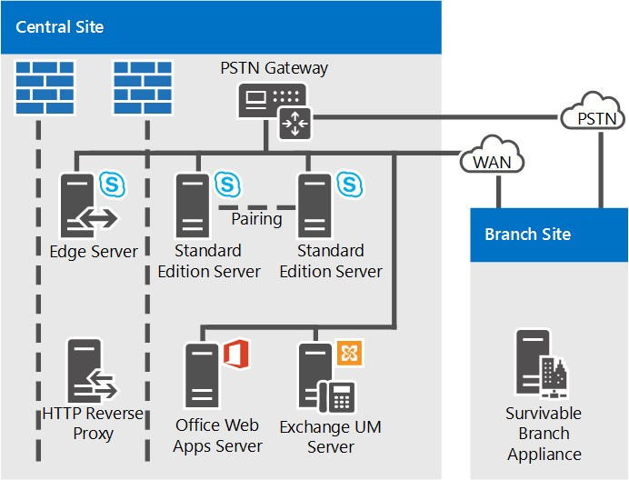
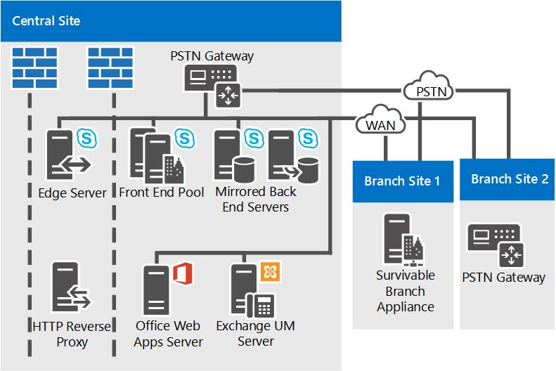
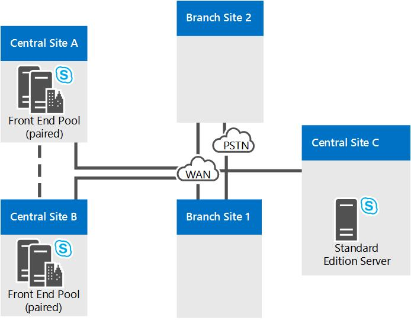
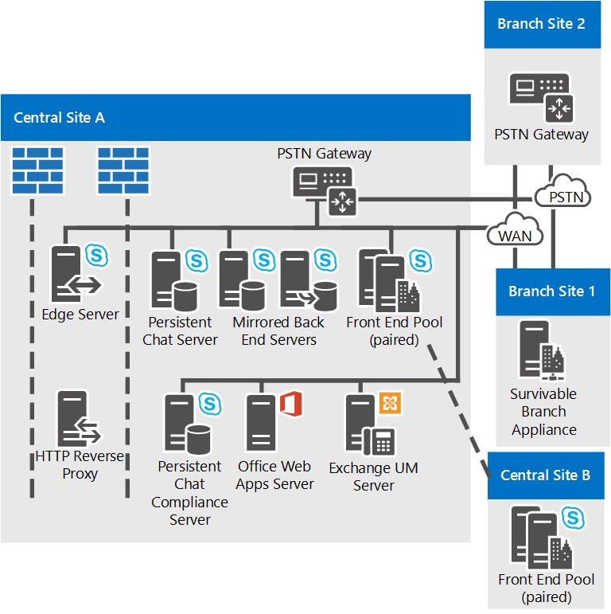
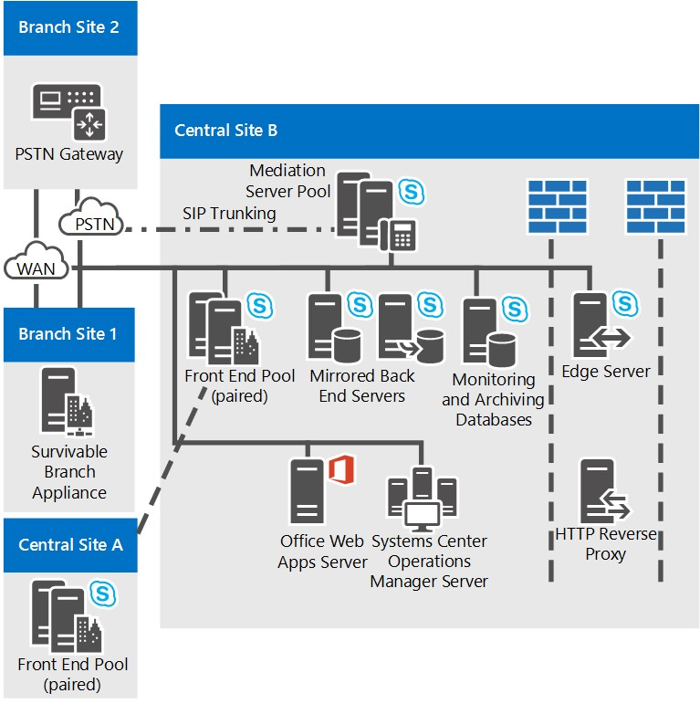
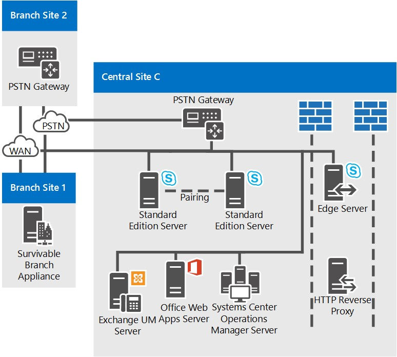

# Reference topologies for Skype for Business Server

Reference topologies for Skype for Business Server, including diagrams and decisions to make for large, medium, and small organizations.

The best Skype for Business Server topology for you depends on your organization's size, the workloads you want to deploy, and your preferences for high availability versus cost of investment.

This section outlines three sample reference topologies, including the reasoning behind many of the decisions that factored into each topology.

## Reference topology for a small organization

The reference topology for small organizations shows how you can deploy a robust, highly available solution by deploying only three servers running Skype for Business Server.

**Reference topology for small organizations**

- **Pair of Standard Edition Servers Deployed** This organization has 4,000 users at their central site. They have deployed two Standard Edition servers and paired them together to enable high availability and disaster recovery. Each server homes 2,000 users, but information about all users is synchronized between the two servers. If one goes down, an administrator can fail over those users to be served by the other server, with a minimum of disruption to users. For more information about high availability and disaster recovery features in Skype for Business Server, see [Plan for high availability and disaster recovery in Skype for Business Server](../../plan-your-deployment/high-availability-and-disaster-recovery/high-availability-and-disaster-recovery.md).

- **Edge Server deployment is recommended.** Although deploying an Edge Server is not required for internal IM, presence and conferencing, we recommend it even for small deployments. You can maximize your Skype for Business Server investment by deploying an Edge Server to provide service to users currently outside your organization's firewalls. The benefits include the following:

  - Your organization's own users can use Skype for Business Server functionality, if they are working from home or are out on the road.

  - Your users can invite outside users to participate in meetings.

  - If you have a partner, vendor or customer organization that also uses Skype for Business Server, you can form a federated relationship with that organization. Your Skype for Business Server deployment would then recognize users from that federated organization, leading to better collaboration.

  - Your users can exchange instant messages with users of some public IM services.

- **Branch site survivability.** This organization is running a pilot program of the Enterprise Voice feature of Skype for Business Server. Some users are using Skype for Business Server as their sole voice solution. Some of these Enterprise Voice pilot users are located at the branch site. The branch site does not have a reliable wide area network (WAN) link to the central site, so a Survivable Branch Appliance is deployed there. With this deployed, if the WAN link goes down, users at the branch site can still make and receive calls (both calls within the organization and PSTN calls), have voice mail functionality, and communicate with two-party instant messaging (IM). Users can also be authenticated when the WAN link is unavailable as well. For more information, see [Plan for Enterprise Voice resiliency in Skype for Business Server](../../plan-your-deployment/enterprise-voice-solution/enterprise-voice-resiliency.md).

- **Exchange UM deployment.** This reference topology includes an Exchange Unified Messaging (UM) Server, which runs Microsoft Exchange Server, not Skype for Business Server.

- **Office Web Apps Server.** We recommend deploying an Office Web Apps Server or Office Web Apps Server farm in every organization that uses web conferencing. Office Web Apps Server makes it possible for PowerPoint slides to be presented in web conferences..

## Reference topology for a medium organization

The reference topology with high availability and a single data center is designed for a small-to-medium size organization with one central site. The exact topology in the following diagram is for an organization of 20,000 users.

**Reference topology for medium organizations**

- **Accommodate more users by adding more Front End Servers.** The exact topology in this diagram has three Front End Servers to provide support for 20,000 users. If you have a single central site and more users, you can simply add more Front End Servers to the pool. The maximum number of users per pool is 80,000, with twelve Front End Servers.

    However, the single site topology can support even more users by adding another Front End pool to the site.

- **Disaster Recovery could be added.** For this organization, high availability for their Skype for Business Server services is a necessary feature, but disaster recovery is not. The pool of Front End Servers they have deployed provides high availability.

    If they wanted to add disaster recovery ability, they could consider establishing another datacenter and adding another Front End pool there, and pairing it with the Front End pool in their current datacenter. Then, if there was a disaster affecting their primary pool, the administrators could fail over users to the backup pool.

- **Back End Servers are mirrored** To provide more high availability for basic user features, the organization has deployed a mirrored pair of Back End Servers for each Front End pool.

- **Monitoring Server database options.** This organization has deployed Monitoring to ensure the quality of Enterprise Voice calls and A/V conferences. Monitoring is deployed on every Front End Server, and the Monitoring database is collocated with the Back End Servers. We also support topologies in which the Monitoring database is located on a separate server.

- **Edge Server high availability** In this example organization with 20,000 users, just one Edge Server would be sufficient for performance. However, they have deployed a pool of two Edge Servers deployed to provide high availability.

- **Branch site deployment options.** The organization in this topology has Enterprise Voice deployed as their voice solution. Branch Site 1 does not have a resilient wide area network (WAN) link to the central site, so it has a Survivable Branch Appliance deployed to maintain many Skype for Business Server features in case the WAN link to the central site goes down. Branch Site 2 however has a resilient WAN link, so only a public switched telephone network (PSTN) gateway is needed. The PSTN gateway deployed there supports media bypass, so no Mediation Server is needed at Branch Site 2. For more information, see [Plan for Enterprise Voice resiliency in Skype for Business Server](../../plan-your-deployment/enterprise-voice-solution/enterprise-voice-resiliency.md).

- **DNS load balancing.** The Front End pool and Edge Server pool, have DNS load balancing for SIP traffic deployed. This eliminates the need for hardware load balancers for the Edge Servers, and significantly lessens the setup and maintenance of the hardware load balancers for the other pools, as the hardware load balancers are needed only for HTTP traffic. For more information, see (../../plan-your-deployment/network-requirements/load-balancing.md#BKMK_DNSLoadBalancing).

- **Exchange UM deployment.** This reference topology includes an Exchange Unified Messaging (UM) Server, which runs Microsoft Exchange Server, not Skype for Business Server.

- **Office Web Apps Server.** We recommend deploying an Office Web Apps Server or Office Web Apps Server farm in every organization that uses web conferencing. Office Web Apps Server makes it possible for Powerpoint slides to be presented in web conferences.

- **Directors could be added.** If this organization wanted to help to increase security against denial of service attacks, it could also deploy a pool of Directors. A Director is a separate, optional server role in Skype for Business Server that does not home user accounts, or provide presence or conferencing services. It serves as an internal next hop server to which an Edge Server routes inbound SIP traffic destined for internal servers. The Director pre-authenticates inbound requests and redirects them to the user's home pool or server. Pre-authentication at the Director allows for dropping of requests from user accounts unknown to the deployment. A Director helps insulate Front End Servers from malicious traffic such as denial-of-service (DoS) attacks. If the network is flooded with invalid external traffic in such an attack, the traffic ends at the Director.

- **System Center Operations Manager is recommended.** We recommend that you monitor the health of your Skype for Business Server deployment to help ensure service availability for end-users. You can use the System Center Operations Manager Management Pack for Skype for Business that is available as a free download from Microsoft. With the Skype for Business Management Pack, you can proactively get real-time alerts when issues occur, run synthetic transactions to test end-to-end Skype for Business functionality, get reports for service availability, and so on. This helps you to proactively respond to issues with your deployment before end-users experience them.

## Reference topology for a large organization

The reference topology for a large organization with multiple data centers support is for any size of organization with more than one central site. The exact topology in the following diagram is for an organization of 50,000 users, with 20,000 users at Central Site A, 20,000 at Central Site B. and a total of 10,000 at Central Site C and branch sites. The type of topology shown in this diagram can accommodate organizations with any number of users.

In addition to the high availability provided by pools of Front End Servers, this topology adds disaster recovery support. The Front End pools at Central Sites A and B are paired together. If one of these pools goes down, the administrator can shift the services for the affected users to the paired pool at the unaffected site.

This topology is shown in multiple diagrams, with an overview first followed by detailed views of the central sites.

**Overview of the reference topology for large organizations with multiple data centers**

**Reference topology for large organizations: Detailed view of Central Site A**

**Reference topology for large organizations: Detailed view of Central Site B**

**Reference topology for large organizations: Detailed view of Central Site C**

- **Front End pools Are Paired to Enable Disaster Recovery.** The Front End pools at Site A and Site B are paired with each other, to provide disaster recovery support. If the pool at one site fails, the administrator can fail over the users from that site to the paired Front End pool at the other site, with a minimum of service interruption for users. Each of these two Front End pools has six servers, which is enough for all 40,000 users in both pools in case of failover. For more information, see [Plan for high availability and disaster recovery in Skype for Business Server](../../plan-your-deployment/high-availability-and-disaster-recovery/high-availability-and-disaster-recovery.md).

- **Back End Servers are mirrored** To provide more high availability for basic user features, the organization has deployed a mirrored pair of Back End Servers for each Front End pool. This is an optional topology, and you could choose to deploy a single Back End Server instead. SQL clustering and AlwaysOn Availability groups are also supported. For more information, see [Back End Server high availability in Skype for Business Server](../../plan-your-deployment/high-availability-and-disaster-recovery/back-end-server.md).

- **Using Standard Edition server at a branch site.** This organization considers Site C as a branch site because it has only 600 employees. However, the users there have many A/V conferences among themselves. If it was deployed in Skype for Business Server as a branch site, the media for these conferences would run across the wide area network (WAN) to and from a central site that has a Front End Server deployed. To avoid this potential bandwidth load, they have installed a pair of Standard Edition servers at this site, which will host these conferences. And because Standard Edition servers are installed there, Skype for Business Server by definition considers it a central site, and it is treated as such in Topology Builder and the Planning Tool.

    Just one Standard Edition server would be enough for performance here, but the organization has deployed two and paired them together to provide high availability in case one server goes down.

    Although Site C is considered a central site, you do not have to deploy Edge Servers there. In this example, Site C will use the Edge Servers deployed at Site A.

- **Monitoring and Archiving** This organization has deployed both Monitoring and Archiving. When you deploy Monitoring or Archiving, it runs on every Front End Server. The databases for these features can be collocated with the Back End Database, or located on a separate server. This organization has located these databases on a server separate from the Back End Servers, in Central Site B. The databases here receive Monitoring and Archiving data from the Front End Servers in all sites.

- **Branch site deployment options.** This organization actually has over 50 branch sites, only two of which are shown in the detailed diagrams. Branch Site 1 does not have a resilient WAN link to the central site, so they have Survivable Branch Appliances deployed to provide telephone service in case the WAN link to the central site goes down. Branch Site 2 however has a resilient WAN link, so it needs only a public switched telephone network (PSTN) gateway. The PSTN gateway deployed there supports media bypass, so no Mediation Server is needed at Branch Site 2. For details about deciding what to install at a branch site, see [Plan for Enterprise Voice resiliency in Skype for Business Server](../../plan-your-deployment/enterprise-voice-solution/enterprise-voice-resiliency.md).

- **SIP trunking and Mediation Server.** Notice that at Central Site B, Mediation Server is not collocated with the Front End Servers. This is because stand-alone Mediation Server is recommended for sites that use SIP trunking. In most other instances, we recommend you collocate Mediation Server with Front End Server. For details about Mediation Server topologies, see [Components and Topologies for Mediation Server](https://technet.microsoft.com/library/71397168-36c3-4d21-b8ef-db6a751634ee.aspx) in the Planning documentation.

- **Persistent Chat is Deployed.** This organization has deployed the servers necessary to enable Persistent Chat. It has deployed multiple Persistent Chat Front End Servers to both handle the load for the number of users in the pool, and to provide high availability. It has also deployed Compliance for Persistent Chat, and located the Persistent Chat Store and the Persistent Chat Compliance Store on separate servers. These stores could be collocated, and can even be collocated with the Back End Server, but this organization has chosen to separate them to provide better performance.

    > [!NOTE]
    > Persistent chat is available in Skype for Business Server 2015 but is no longer supported in Skype for Business Server 2019. The same functionality is available in Teams. For more information, see [Journey from Skype for Business to Microsoft Teams](/microsoftteams/journey-skypeforbusiness-teams). If you need to use Persistent chat, your choices are to either migrate users requiring this functionality to Teams, or to continue using Skype for Business Server 2015.

- **DNS load balancing.** The Front End pool and Edge Server pool use DNS load balancing. This eliminates the need for hardware load balancers for the internal interface of the Edge Servers, and significantly decreases the amount of time you have to spend on the setup and maintenance of the hardware load balancers for the other pools, as the hardware load balancers are needed only for HTTP traffic. For more information, see (../../plan-your-deployment/network-requirements/load-balancing.md#BKMK_DNSLoadBalancing).

- **Exchange UM deployment.** Skype for Business Server works with both on-premises deployments of Exchange Unified Messaging (UM) and hosted Exchange UM. Central Site A includes an Exchange Unified Messaging (UM) Server, which runs Microsoft Exchange Server, not Skype for Business Server. The Exchange UM functionality for Skype for Business Server runs on the Front End pool.

    Central Site B uses hosted Exchange, so the Exchange UM Server functionality is also hosted.

    For details about Exchange UM, see [On-Premises Exchange Unified Messaging Integration](https://technet.microsoft.com/library/e7c63a71-2d99-4aa9-b649-36c1a431bdf1.aspx) and [Hosted Exchange Unified Messaging Integration](https://technet.microsoft.com/library/f4de0165-da3b-499e-98fc-28ddd0db02d5.aspx) in the Planning documentation.

- **Office Web Apps Server.** We recommend deploying an Office Web Apps Server or Office Web Apps Server farm in every organization that uses web conferencing. You could deploy a single Office Web Apps Server farm in one site which serves traffic from all sites, or deploy it in each site. Office Web Apps Server makes it possible for Powerpoint slides to be presented in web conferences.

- **Directors could be added.** If this organization wanted to increase security against denial of service attacks, it could also deploy a pool of Directors. A Director is a separate, optional server role in Skype for Business Server that does not home user accounts, or provide presence or conferencing services. It serves as an internal next hop server to which an Edge Server routes inbound SIP traffic destined for internal servers. The Director pre-authenticates inbound requests and redirects them to the user's home pool or server. Pre-authentication at the Director allows for dropping of requests from user accounts unknown to the deployment. A Director helps insulate Front End Servers from malicious traffic such as denial-of-service (DoS) attacks. If the network is flooded with invalid external traffic in such an attack, the traffic ends at the Director.

- **System Center Operations Manager is recommended.** We recommend that you monitor the health of your Skype for Business Server deployment to help ensure service availability for end-users. You can use the System Center Operations Manager Management Pack for Skype for Business that is available as a free download from Microsoft. With the Skype for Business Management Pack, you can proactively get real-time alerts when issues occur, run synthetic transactions to test end-to-end Skype for Business functionality, get reports for service availability, and so on. This helps you to proactively respond to issues with your deployment before end-users experience them.

