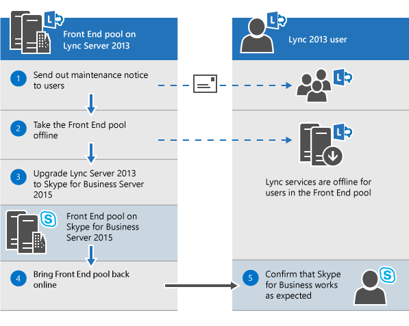
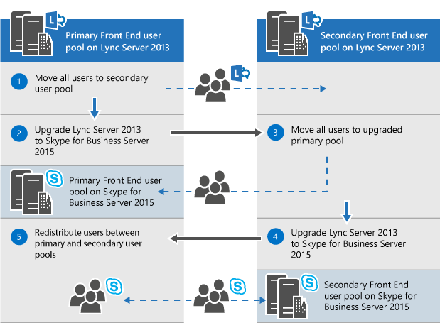
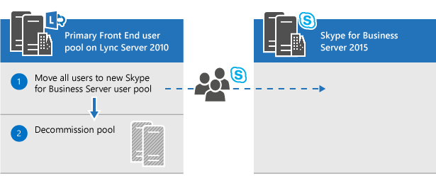
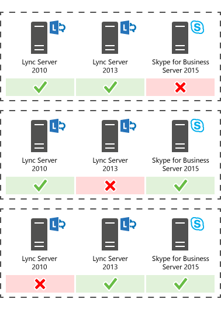

# Plan to upgrade to Skype for Business Server 2015
 
Summary: Learn about the things you should consider when you plan an upgrade to Skype for Business Server 2015. Download a free trial of Skype for Business Server 2015 from the Microsoft Evaluation center at: [https://www.microsoft.com/evalcenter/evaluate-skype-for-business-server](https://www.microsoft.com/evalcenter/evaluate-skype-for-business-server).
  
As part of your plan to upgrade to Skype for Business Server 2015, use this topic to understand the recommended upgrade paths to Skype for Business Server 2015, how the In-Place Upgrade works, what the supported coexistence scenarios are, and what the upgrade process looks like.

> [!NOTE]
> In-place upgrades were available in Skype for Business Server 2015 but are no longer supported in Skype for Business Server 2019. Side by side coexistance is supported, see [Migration to Skype for Business Server 2019](../../SfBServer2019/migration/migration-to-skype-for-business-server-2019.md) for more information.
  
## Recommended upgrade paths to Skype for Business Server 2015

 To upgrade from Lync Server 2013, Lync Server 2010, or Office Communications Server 2007 R2 to Skype for Business Server 2015, use the following upgrade paths:
  
> [!CAUTION]
> In-Place Upgrade automatically moves conference directories from Lync Server 2013 to Skype for Business Server 2015. However, if you plan to manually move conference directories it is very important to use the Skype for Business Server 2015 Management Shell. If you try to use the Lync Server 2013 Management Shell to move conference directories from Lync Server 2013 to Skype for Business Server 2015 then data loss can occur. In general, whenever you are working with Skype for Business Server 2015 in any capacity you should use the Skype for Business Server 2015 tool set.  
  
|**Version**|**Recommendations**|
|:-----|:-----|
|Lync Server 2013    | To upgrade, use the Skype for Business Server Topology Builder and the new In-Place Upgrade feature on each of the servers associated with the pool. see [Plan to upgrade from Lync Server 2013 to Skype for Business Server 2015](upgrade.md#BKMK_PlanUpgradeFromLync2013) and [Upgrade to Skype for Business Server 2015](../deploy/upgrade-to-skype-for-business-server.md) for detailed steps.   |
|Lync Server 2010 + Lync Server 2013 (dual-mode)    |First, upgrade to Lync Server 2013, and then upgrade to Skype for Business Server 2015 by using the new In-Place Upgrade feature. However, if your topology is primary Lync Server 2010 you can also roll back the Lync Server 2013 components to Lync Server 2010 and then upgrade directly to Skype for Business Server 2015. In this case you would not be able to take advantage of In-Place Upgrade and would use straight co-existence between Lync Server 2010 and Skype for Business Server 2015. Tri-existence is not supported but co-existence is supported.    |
|Lync Server 2010    |Bring up a new Skype for Business Server 2015 pool and then migrate users to this new pool. You can then decommission the old Lync Server 2010 pool. Upgrading from Lync Server 2010 to Skype for Business Server 2015 is similar to upgrading from Lync Server 2010 to Lync Server 2013. See [Migration from Lync Server 2010 to Lync Server 2013](https://go.microsoft.com/fwlink/p/?LinkId=526615).    |
|Office Communications Server 2007 R2    | Pick one of two options:    Set up a new Skype for Business Server 2015 environment.    Or if your hardware and software meet the requirements for Skype for Business Server 2015, upgrade to Lync Server 2013, and then upgrade to Skype for Business Server 2015 by using the new In-Place Upgrade feature. For more information, see [Server requirements for Skype for Business Server 2015](requirements-for-your-environment/server-requirements.md) and [Migration from Office Communications Server 2007 R2 to Lync Server 2013](https://go.microsoft.com/fwlink/p/?LinkId=526616).    |
   
> [!NOTE]
> SQL Server 2014 is supported in Skype for Business Server 2015 but is not supported in Lync Server 2013. If you want to upgrade from SQL Server 2012 to SQL Server 2014 then the pool must first be upgraded to Skype for Business Server 2015 using the In-Place Upgrade method as described in this document. You can then upgrade from SQL Server 2012 to SQL Server 2014, see [Upgrade to SQL Server 2014](https://msdn.microsoft.com/en-us/library/bb677622%28v=sql.120%29.aspx). To learn more about database requirements, see [Server requirements for Skype for Business Server 2015](requirements-for-your-environment/server-requirements.md). 
  
## Plan to upgrade from Lync Server 2013 to Skype for Business Server 2015

You can upgrade Lync Server 2013 systems to Skype for Business Server 2015 using the new In-Place Upgrade feature. In-place upgrade provides a one-click solution that backs up certificates, uninstalls server components, upgrades local databases, and installs the Skype for Business Server 2015 roles. In-place upgrade seeks to preserve existing hardware and server investments, reducing the overall cost to deploy Skype for Business Server 2015.
  
> [!NOTE]
> In-Place Upgrade allows you to use the same hardware when upgrading to Skype for Business Server. However, reusing the same hardware does not translate into the same performance capacity. You should not expect the performance loads for Lync Server 2013 and Skype for Business Server 2015 to be identical. 
  
> [!NOTE]
> In-Place upgrade does not support high availability or disaster recovery for Skype for Business Server. 
  
In-place upgrade involves taking the Lync Server 2013 pool offline and upgrading it to a Skype for Business Server 2015 pool. 
  
### Create an In-Place Upgrade plan

Make a plan that includes:
  
1. An understanding of your current topology.
    
    > [!NOTE]
    > Be sure to uninstall LRS Admin tool for Lync Server 2013 before running In-Place Upgrade. The LRS Admin Tool for Lync Server 2013 cannot coexist with Skype for Business Server 2015. After running In-Place Upgrade install the new LRS Admin tool, see [Microsoft Lync Room System Administrative Web Portal for Skype for Business Server 2015 ](https://go.microsoft.com/fwlink/?LinkID=544807)
  
2. The primary pool for the upgrade.
    
3. Whether you'll upgrade the Archiving and Monitoring databases or create new ones.
    
4. The In-Place Upgrade method you'll use: Offline or Move Users. As part of Move Users you also will need to migrate the global conference directories associated with the primary pool. 
    
5. A communication plan for impacted users.
    
6. A backup plan in case the upgrades fails.
    
Any users that are in the primary pool while it's being upgraded won't be able to use the services until the upgrade is complete. If you have a working secondary pool, you can avoid impacting users by moving them to the secondary pool before the upgrade. After the upgrade, move the users back to the primary pool.
  
### In-place upgrade methods

There are two scenarios for In-Place Upgrade: 
  
- The Move User method, which requires no downtime for users. 
    
- The Offline method, which requires downtime.
    
We recommend that an Offline method upgrade be scheduled during a maintenance window and users are notified of the downtime.
  
> [!NOTE]
> When upgrading a paired pool on Lync Server 2013 and you want to upgrade both pools to Skype for Business Server 2015. Make sure to upgrade the second pool immediately after upgrading the first pool. When one pool is running Lync Server 2013 and the second pool is running Skype for Business Server 2015 then disaster recovery options are minimized. For example, if one pool is running 2013 and the second is 2015 and there is a disaster then you could experience data loss because pool failover is not supported in disaster mode when paired pools are not the same version. 
  
#### In-place upgrade Offline method

Use this method if you don't want to move users between user pools. During the upgrade, users will not be able to use Lync or Skype for Business services. 
  
The following diagram shows an overview of this process.
  

  
> [!NOTE]
> If you have paired pools, do not unpair them before the upgrade. 
  
Once you start to upgrade a server pool, you must complete the upgrade of the entire pool. Skype for Business Server doesn't support having only a portion of the pool upgraded. 
  
#### Move Users method (no user downtime)

To use this method, you move users to another pool before you start the upgrade. During the upgrade, users can use Lync services. After they're moved to the upgraded pool, they can use Skype for Business. The following diagram shows an overview of this process.
  
> [!IMPORTANT]
> As part of Move Users you also will need to migrate the global conference directories associated with the primary pool. PSTN dial-in conferencing will still resolve ConferenceID to the pool being upgraded, instead of the paired pool. So you need to move Conference Directories, if you still want PSTN conferences scheduled in the pool to be accessible during upgrade. 
  

  
#### Move users for hardware upgrade

 If your hardware doesn't meet the [Server requirements for Skype for Business Server 2015](requirements-for-your-environment/server-requirements.md), set up a new Skype for Business Server 2015 environment, and move users there. The following diagram shows an overview of this process for upgrade from Lync Server 2010. 
  

  
### In-place upgrade process

 Upgrade from Lync Server 2013 to Skype for Business Server 2015 using the following steps:
  
1. Back up all databases before the upgrade.
    
2. Make sure all services that are to be upgraded are in a running state.
    
3. Upgrade and publish the topology file using the topology builder.
    
4. Stop all services on all Front End servers.
    
5. Install new prerequisites required for Skype for Business Server.
    
6. On each Front End server, start the In-Place Upgrade.
    
7. When the upgrade is complete, restart all services.
    
   - For the Front End pool, restart services using the command Start-CsPool.
    
   - For non-Front End servers, use Start-CSWindowsService.
    
> [!NOTE]
>  If you don't want to upgrade your existing Archiving and Monitoring databases, remove the dependency before you upgrade the topology. If you want to create new Archiving and Monitoring databases, during the upgrade, you can create a new SQL store and associate it with the pool. You can find the steps on how to do this in the topic,[Upgrade to Skype for Business Server 2015](../deploy/upgrade-to-skype-for-business-server.md). >  In-place upgrade does not support high availability or disaster recovery for Skype for Business Server. To avoid interrupting users' services, use the [Move Users method (no user downtime)](upgrade.md#bkmk_MoveUsersMethod) to upgrade.>  During the upgrade process the xds-replica is placed in the local shared folder on the disk drive with the most free space. If that disk is later removed then you can run into issues such as services not starting.
  
### Upgrade order

Upgrade the topology from the inside to the outside. Upgrade all your pools first, then the edge servers, and finally the Central Management Store (CMS) pool. 
  
### Kerberos authentication considerations

If you use Kerberos authentication for Web Services, you must reassign Kerberos accounts and reset the password after the In-Place Upgrade is complete. To learn how to do this, see [Setting up Kerberos authentication](https://go.microsoft.com/fwlink/p/?LinkId=530342).
  
## Support for coexistence with Lync Server 2013 and Lync Server 2010

You can run Skype for Business Server 2015 in the same topology as Lync Server 2013 or Lync Server 2010, but you can't have all three in the same topology.
  
If you have a co-existence between Lync Server 2010 and Lync Server 2013, it is recommended to upgrade the entire topology to Lync Server 2013, and then upgrade to Skype for Business Server 2015 using the In-Place Upgrade. For more information, see [Migration from Lync Server 2010 to Lync Server 2013](https://go.microsoft.com/fwlink/p/?LinkId=526615).
  
If your topology is primarily Lync Server 2010, roll back the Lync Server 2013 components to Lync Server 2010 before upgrading the topology to Skype for Business Server 2015. In this case, you lose the benefit of the In-Place Upgrade and have a co-existence topology between Lync Server 2010 and Skype for Business Server 2015.
  
The following diagram shows the coexistence support of Skype for Business Server 2015 with Lync Server 2013 and Lync Server 2010.
  

  
## Upgrade process with existing Survivable Branch Appliance and Server

Skype for Business Server 2015 doesn't support an In-Place Upgrade of a Survivable Branch Appliance (SBA) or a Survivable Branch Server (SBS).
  
However, we do support coexistence of Skype for Business Server datacenters with Lync Server 2010 or Lync Server 2013 SBA/SBS. 
  
When planning for an In-Place Upgrade of a Lync Server 2013 Front End (FE) pool with an associated branch, you can leave the existing users on the Lync Server 2013 SBA/SBS. During the upgrade, the SBA/SBS users will go in resiliency mode and will return to normal functionality after the upgrade has completed. For more information about the users' experience during the resiliency mode, please see [Branch-site resiliency features in Lync Server 2013](https://technet.microsoft.com/library/gg398715.aspx).
  
When migrating a Lync Server 2010 topology to Skype for Business Server 2015, the SBA/SBS must re-added to the topology, similar to the migration to Lync Server 2013. For the required steps, please read [Connecting Survivable Branch Appliance to Lync Server 2013 Front End pool](https://technet.microsoft.com/library/jj688026.aspx).
  
For co-existence topologies of Lync Server 2010 and Lync Server 2013, align first to the recommendations made in the section 'Support for coexistence with Lync Server 2013 and Lync Server 2010'.
  
## See also

[Upgrade to Skype for Business Server 2015](../deploy/upgrade-to-skype-for-business-server.md)
  
[Environmental requirements for Skype for Business Server 2015](requirements-for-your-environment/environmental-requirements.md)
  
[Server requirements for Skype for Business Server 2015](requirements-for-your-environment/server-requirements.md)
