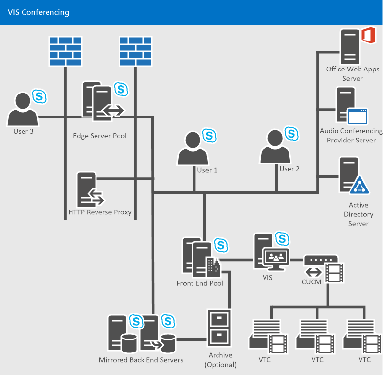
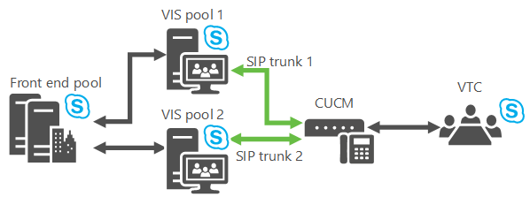
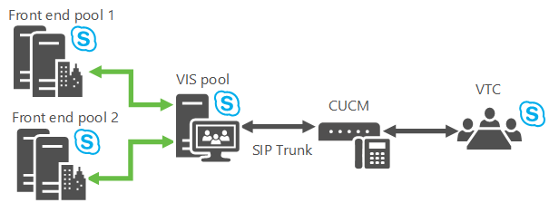

# Plan for Video Interop Server in Skype for Business Server
 
**Summary:** Review this topic while planning to integrate Skype for Business Server with third-party teleconferencing devices.
  
Skype for Business Server now allows you to integrate with certain third-party VTC (Video Teleconferencing System) solutions. The new server role that enables this video conferencing interoperability is the Video Interop Server (VIS), which is currently implemented as a standalone server role available only for on-premises installations. A VIS acts as an intermediary between a third party teleconference system and a Skype for Business Server deployment. For this release, VIS is focused on interoperability with Cisco/Tandberg video systems. Review this article to determine whether to use this feature in your Skype for Business Server installation.
  
## Device interoperability

Interoperation is tested and supported with Cisco VTCs registering with Cisco Unified Communications Manager (CallManager, or CUCM) version 10.5 and TCP SIP trunks set up between CUCM and the VIS.
  
The currently supported VTCs are:
  
- Cisco C40
    
- Cisco C60
    
- Cisco C90
    
- Cisco MX200
    
- Cisco MX300
    
- Cisco DX80
    
- Cisco EX60
    
- Cisco EX90
    
- Cisco SX20
    
> [!NOTE]
>  Cisco software release TC7.0.0 or above is required on these systems for integration with Skype for Business Server to work as expected.
  
## SIP trunks

The Video Interop Server functions in SIP trunk mode, where the VTCs continue to register with the existing Cisco infrastructure - for example, Cisco Call Manager (CUCM). A video SIP trunk is defined between CUCM and the VIS so that calls can be routed between the two systems. Only calls over the SIP trunk from the VTC to the VIS are supported. Thus, VTCs can dial into a Skype for Business conference (by dialing the phone number associated with the Call Automated Attendant), but cannot be dragged and dropped into the conference.
  

  
## Features

This server role provides:
  
- Conversion between the H.264 formats used by 3rd party video systems and the Skype for Business Server deployment.
    
- Conversion of a single video stream at a given resolution from a VTC into multiple simulcast streams of different resolutions for use in the Skype for Business Server deployment. These streams can be sent to the AVMCU and then to Skype for Business Server endpoints and other video systems that have requested different resolutions. This conversion is also used when the third party video system is involved in a Skype for Business A/V conference call. Once the transcoding limit is reached in a particular VIS server, any following requests for different resolutions will only receive a stream with the lowest resolution. 
    
- Support for a video SIP trunk between the CUCM gateway and a Skype for Business Server Video Interop Server; VTCs continue to register with the Cisco gateway, and initiate calls to the Skype for Business deployment through the gateway. Calls are routed from the gateway to the Skype for Business Video Interop Server over the video SIP trunk.
    
- Support for a user in a conference room with a supported video system to dial from that system to join an open or closed conference. This call will traverse the video SIP trunk.
    
- Support for a user in a conference room with a supported video system to call a Skype for Business client. The call will traverse the SIP trunk.
    
- Support for mid-call control from the Skype for Business Server side or from the supported VTC system for both point to point and multipoint calls including mute/un-mute audio, pause/resume video, lock video, and hold/un-hold call.
    
## Known limitations

This server role has the following limitations:
  
- New calls from the Skype for Business deployment to the VTCs over the video SIP trunk are not supported. . This means that only new calls from the VTCs into the Skype for Business deployment are supported over the video SIP trunk. Presence for the supported video system will not be available over the video SIP trunk to the VIS. 
    
- Only a standalone VIS pool will be supported for video SIP trunk mode.
    
-  TLS + SRTP or TCP + RTP will be supported for communications between the VTC and VIS over the video SIP trunk.
    
- Application sharing is not supported. A Skype for Business user in the conference room needs to join the Skype for Business conference (via a laptop for example) and display the app sharing screens on one of the free monitors in the conference room not associated with the VTC.
    
- The ability for a VTC to join a federated meeting via VIS is not supported.
    
- The ability for a VTC to join an online meeting via VIS is not supported.
    
- Calls from a VTC to the PSTN via VIS are not supported.
    
- Calls from the PSTN to a VTC via VIS are not supported.
    
## Resiliency mechanisms

The VIS supports incoming calls from a CUCM that are carried over a video SIP trunk. It's possible to lose connectivity either upstream or downstream, so for robust resiliency consider both possibilities:
  
1. **VIS Pool Failover** If the main VIS pool that the video gateway points to is down, recovery is possible if the video gateway has defined trunks to two (or more) VIS pools. If the video gateway determines it cannot make calls to the primary VIS pool, it simply routes the calls to a secondary VIS pool.
    
     
  
    A particular VIS pool can have trunks to multiple gateways, but normally a particular gateway can't have trunks to multiple VIS pools, so a trick needs to be done to support this failover: Define 2 FDQNs in DNS which resolve to the same IP address of a video gateway. Represent each FQDN as a separate video gateway in the Topology Document where each video gateway has a trunk to a different VIS pool, and recovery is now possible. (If TLS is used, the multiple names will need to be in the SAN of the video gateway certificate.)
    
    > [!NOTE]
    > VIS only allows incoming calls from gateways configured in the Topology Document. 
  
2. **Front End failover** If a VIS pool receives a call from CUCM but cannot reach its primary next-hop Registrar or Front End pool, calls are routed to a backup Front End pool.
    
     
  
    The VIS will keep track of the status of its primary Front End pool and its backup Front End pool (the setting is found in the backup setting for the Registrar service in the Topology Document). It sends Options polls once a minute to both pools, and if there are five consecutive failures the VIS assumes that a particular Front End pool is down. If the primary Front End pool is marked as down and there is an available configured backup the VIS sends new calls from the gateway to the backup Front End pool. Once the primary Front End pool comes back, the VIS will resume using the primary Front End pool for new calls.
    
    The VIS will also implement a 10 second timer for calls from the video SIP trunk. If the primary next-hop Front End pool was used for a call from the video SIP trunk, and the primary next-hop Front End pool did not answer with some SIP message (including 100 Trying) to the Invite sent to it within this timer value, the backup next-hop proxy for the call should be tried if configured. 
    
    > [!NOTE]
    > If the backup next hop was tried first, the primary will not be tried next. 
  
    The admin could also use the Windows PowerShell failover command to force VIS to use the backup Front End pool, for example, when maintenance has to be performed on the primary Front End pool.
    
## Co-existence of Voice and Video Trunks to the Same Gateway Peer

Skype for Business Server supports having voice and video SIP trunks use the same gateway peer. So the same CUCM deployment could have voice SIP trunks to the Mediation Server and video SIP trunks to VIS.
  
- A PSTN Gateway will need to be defined with a particular FQDN in the Topology Document for the voice SIP trunks.
    
- The peer to the PSTN Gateway will be the Mediation Server.
    
- Multiple voice trunks can be defines spanning from a PSTN Gateway to multiple Mediation Server pools if necessary.
    
- A Video Gateway will need to be defined in the Topology Document for the video SIP trunk with the same FQDN as for the PSTN Gateway.
    
- The peer to the Video Gateway will be VIS.
    
- A single video trunk can be defined from a Video Gateway to a particular VIS pool.
    
- CUCM will need to be configured to correctly route calls over the voice trunk vs. the video trunk. For example, a special dial prefix could be used when dialing from the VTC; CUCM could associate this dial prefix with calls to VIS, and appropriate translation rules would strip this prefix from the SIP Invite to VIS.
    
## Co-existence of VIS in the Skype for Business Release with Previous Releases of Lync

VIS can only be deployed as part of Skype for Business deployment. It can interoperate with Lync 2013 conferences and clients that are a part of an existing deployment; in those cases, the VIS pool will need to be part of a Skype for Business deployment that includes a Registrar/FE pool that is the next-hop for the VIS pool.
  
VIS does not support transcoding between RTV and H.264. There is no video interoperability between pre-Lync 2013 clients and VTC participants in a conference.
  
Having pre-Lync 2013 clients in a conference will cause mobile clients to send using RTV resulting in VTCs receiving no video when the mobile client becomes the dominant speaker.
  
In order for Lync 2013 to work correctly with VIS that is part of a Skype for Business deployment, Lync 2013 needs the appropriate CU to be applied that upgrades the Lync 2013 client, CAA, and AVMCU to work with VIS.
  
Interoperability of VIS with Lync 2013 and Skype for Business desktop clients has been tested and is supported.
  
Interoperability of VIS with non-desktop (Android, Ipad, Iphone, Windows Phone, LMX, etc.) Skype for Business clients available from the applicable Apps Store at the time of VIS release has been tested and is supported.
  
## Recovery from Packet Loss via FEC

FEC can be turned on to aid in recovery from packet loss. If turned on, 50% more video bandwidth will be used in the VIS to VTC direction.
  
## VIS Sizing and Transcoding Costs

Transcoding the single video streams from the Cisco VTC to multiple simulcast streams uses CPU capacity. Approximately 16 VTCs can have their video transcoded (assuming a 720p video stream from each VTC is transcoded into 3 separate simulcast streams at 720p, 360p, and 180p) in a single VIS running on the equivalent of the Lync 2013 recommended FE platform. If Transcoding is turned off, this will save on VIS CPU. However, the video image requested by VIS from the VTC will be the lowest common resolution to satisfy all receivers on the Skype for Business side. Note that even with transcoding off, transcoding may be activated when Skype for Business clients request certain low resolutions that VTCs cannot send.
  
## Call Distribution from the Video Gateway to VIS

Distribution is accomplished via one of the CUCM distribution mechanisms:
  
- Dynamically using DNS.
    
- On the CUCM side, you can define individual trunks, where each trunk terminates on a different server in the VIS pool. CUCM will route calls across the different trunks.
    
## No Hybrid Interoperability

Support for VTCs joining online meetings via on-premises VIS is not part of Skype for Business.
  
## No Federation Support

Support for VTCs joining federated meetings via VIS is not part of Skype for Business.
  
## See also

[Deploy Video Interop Server in Skype for Business Server](../deploy/deploy-video-interop-server/deploy-video-interop-server.md)
