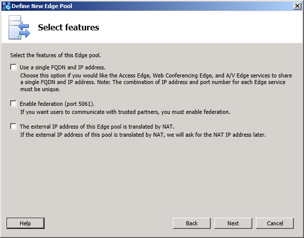

# Add Edge Server Options for Lync Server 2010
[]
You define a new Edge Server or Edge pool and are presented with the opportunity to define features for the new server or pool. The options that you can choose are:
  
- **Use a single FQDN and IP address**: Select the check box to use a single IPv4 or IPv6 (if you choose to use both IPv4 and IPv6, then you will need to define one of each IP address type) address and fully qualified domain name (FQDN) for the external Edge interfaces. 
    
    > [!IMPORTANT]
    > If you choose this option, you will use only one IP address, or one IPv4 and one IPv6, but you must assign different port numbers to each Edge interface. 
  
- **Enable federation (port 5061)**: Select this check box if you will federate with other SIP federations, providers, or hosted offerings that use the session initiation protocol (SIP).
    
- **The external IP address of this Edge pool is translated by NAT**: Select this check box if you use private IP addresses for the Edge external interfaces and will provide a network address translation (NAT) device to place the Edge Server or Edge pool logically behind.
    

  
## See also

#### 

[Planning for external user access in Lync Server 2013](planning-for-external-user-access.md)
  
[Deploying external user access in Lync Server 2013](deploying-external-user-access.md)

