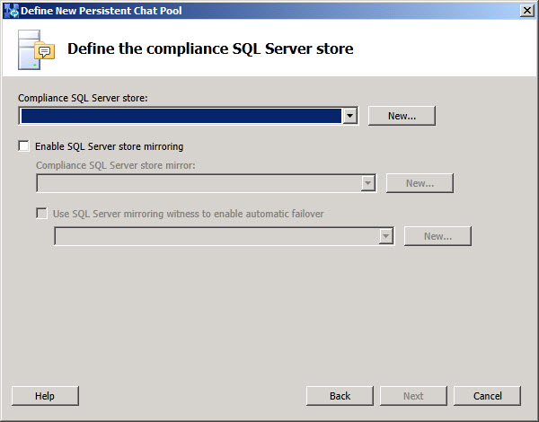

# Add Persistent Chat Compliance SQL Server Store
[]
You configure the compliance SQL Server stores that will provide databases for the Persistent Chat Server or Persistent Chat Server compliance feature.
  
 **SQL Server store**: Select an existing SQL Server and optionally an instance for Persistent Chat.
  
Click **New** to define a new SQL Server and optionally a new instance for the Persistent Chat compliance data. 
  
Select the **Enable SQL Server store mirroring** checkbox to configure a SQL Server database and optional instance that will provide a mirrored database for the Persistent Chat compliance data. 
  
Select from the list **Mirroring SQL Server store** a SQL Server and optional instance to act as the SQL Server mirror for the Persistent Chat compliance SQL Server. 
  
Click **New** to define a new SQL Server and optionally a new instance for the Persistent Chat SQL Server mirroring. 
  
Select the list **Use SQL Server mirroring witness to enable automatic failover** a SQL Server that will act as the witness server in failover scenarios. The witness server does not mirror or host data for the Persistent Chat servers, but ensures that only one SQL Server in a mirrored configuration is the active SQL Server at any time. 
  
Click **New** to define a new SQL Server witness optionally an instance for the Persistent Chat compliance SQL Server mirroring witness. 
  
Click **Back** to go back to the previous pool definition dialog. 
  
Click **Next** after you have finished entering the options for this pool's backup SQL Server store configuration and to proceed with the Persistent Chat Server pool definition. 
  
Click **Cancel** to discard all changes and end the **Define New Persistent Chat Pool** wizard. 
  
Click **Help** to access context sensitive help, such as this page. 
  

  
## See also

#### 

[Components and topologies for Persistent Chat Server in Lync Server 2013](components-and-topologies-for-persistent-chat-server.md)
  
[Required resources for Persistent Chat Server in Lync Server 2013](required-resources.md)

