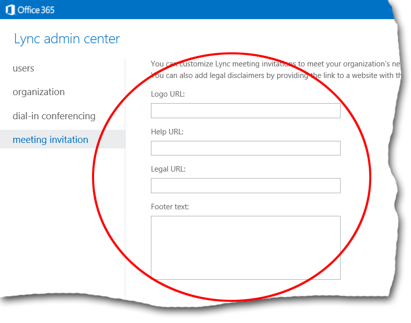

# An introduction to Windows PowerShell and Skype for Business Online
[]
Windows PowerShell is a command shell and scripting language that can be used to manage Skype for Business Online. Instead of using the graphical Skype for Business Online admin center to manage Skype for Business Online, you can alternatively manage the product by using command-line commands similar to this:
  
```
Get-CsOnlineUser -Identity "kenmyer@litwareinc.com"
```

In addition to carrying out simple commands such as the preceding example (which returns information about the user with the UPN kenmyer@litwareinc.com), users more experienced with Windows PowerShell can also organize these commands into scripts. These scripts can be used to automate processes and/or to carry out repetitive tasks.
  
As a general rule, any task that you can carry out by using the Skype for Business Online admin center can also be carried out by using Windows PowerShell. For example, you can use the admin center to manage mobile phone notifications, also known as push notifications. Push notifications enable you to send notifications about events (for example, new instant messages or new voice mail) to mobile devices such as iPhones and Windows Phones. These notifications can be received on the mobile device even if the Lync application on those devices is running in the background.
  
How do you manage push notifications? One way is to use the Skype for Business Online admin center, where you can enable or disable push notifications by selecting the appropriate option from the **organization** tab: 
  

  
You can also enable or disable push notifications by using a remote Windows PowerShell session and the [Set-CsPushNotificationConfiguration](set-cspushnotificationconfiguration.md) cmdlet. For example, this command disables push notifications for both iPhones and Windows Phones: 
  
```
Set-CsPushNotificationConfiguration -EnableApplePushNotificationService $False -EnableMicrosoftPushNotificationService $False
```

As you can see, the parameters (that is, EnableApplePushNotificationService and EnableMicrosoftPushNotificationService), used with the **Set-CsPushNotificationConfiguration** cmdlet, correspond to the options available in the Skype for Business Online admin center: 
  

  
In sum, you can use either the admin center or a Windows PowerShell cmdlet and the appropriate parameters to manage push notifications. Both approaches work, and both approaches work equally well.
  
> [!NOTE]
> For definitions of specific Windows PowerShell terms, such as cmdlet, parameter, parameter value, and argument, see [Windows PowerShell cmdlets, parameters, and parameter values in Skype for Business Online](windows-powershell-cmdlets-parameters-and-parameter-values.md). 
  
This brings up an obvious question: if the Skype for Business Online admin center and Windows PowerShell provide the exact same functionality, why would you choose to use one over the other? For that matter, why would you ever choose to type commands in Windows PowerShell, rather than to simply select or clear check boxes in the admin center?
  
In a simple case such as the earlier example, deciding which approach to use comes down to personal preference: some people prefer using a graphical user interface, while others prefer a command-line tool, such as Windows PowerShell. However, in some cases, Windows PowerShell provides the most efficient way to perform a management task, or the only way to perform a management task. For example, the Skype for Business Online admin center enables you to customize meeting invitations:
  

  
You can make these same customizations by using the [Set-CsMeetingConfiguration](set-csmeetingconfiguration.md) cmdlet. However, the **Set-CsMeetingConfiguration** cmdlet also includes options not available in Skype for Business Online admin center. For example, if someone in your organization joins a meeting, they are automatically configured as a meeting presenter, by default. This setting cannot be changed by using the Skype for Business Online admin center—only by using Windows PowerShell and the **Set-CsMeetingConfiguration** cmdlet. Specifically, this command sets the DesignateAsPresenter property to None, which means that only the meeting organizer will be configured as a presenter when joining the meeting: 
  
```
Set-CsMeetingConfiguration -DesignateAsPresenter "Everyone"
```

For more details about using Windows PowerShell, see the following topics:
  
- [Windows PowerShell cmdlets, parameters, and parameter values in Skype for Business Online](windows-powershell-cmdlets-parameters-and-parameter-values.md)
    
- [Working with parameters in Skype for Business Online](working-with-parameters.md)
    
- [Mandatory and optional parameters in Skype for Business Online](mandatory-and-optional-parameters.md)
    
- [Parameters vs. properties in Skype for Business Online](parameters-vs-properties.md)
    
- [Combining Skype for Business Online cmdlets with other Windows PowerShell cmdlets in](combining-skype-for-business-online-cmdlets-with-other-windows-powershell-cmdlet.md)
    
- [More help for using Windows PowerShell in Skype for Business Online](more-help-for-using-windows-powershell.md)
    

