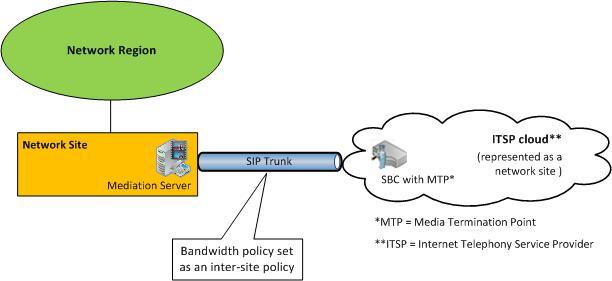

# Call admission control on a SIP trunk in Lync Server 2013
[]
To deploy call admission control (CAC) on a SIP trunk, you create a network site to represent the Internet telephony service provider (ITSP). To apply bandwidth policy values on the SIP trunk, you create an inter-site policy between the network site in your enterprise and the network site that you create to represent the ITSP.
  
The following figure shows an example CAC deployment on a SIP trunk.
  
**CAC configuration on a SIP trunk**

  
To configure CAC on a SIP trunk, you will have to perform the following tasks during CAC deployment:
  
1. Create a network site to represent the ITSP. Associate the network site to an appropriate network region, and allocate bandwidth of zero for audio and video for this network site. For details, see [Configure network sites for CAC in Lync Server 2013](configure-network-sites-for-cac.md) in the Deployment documentation. 
    
    > [!NOTE]
    > For the ITSP, this network site configuration is not functional. Bandwidth policy values are actually applied in step 2. 
  
2. Create an inter-site link for the SIP trunk using the relevant parameter values for the site you created in step 1. For example, use the name of the network site in your enterprise as the value of the NetworkSiteID1 parameter, and the ITSP network site as the value of the NetworkSiteID2 parameter. For details, see [Create network intersite policies in Lync Server 2013](create-network-intersite-policies.md) in the Deployment documentation. Also see the Lync Server Management Shell documentation for the New-CsNetworkInterSitePolicy cmdlet. 
    
3. Get the IP address of the Session Border Controller's (SCB) Media Termination Point from your ITSP. Add that IP address with a subnet mask of 32 to the network site that represents the ITSP. For details, see [Associate a subnet with a network site in Lync Server 2013](associate-a-subnet-with-a-network-site.md).
    

