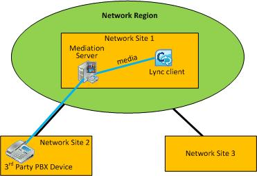

# Call admission control in Lync Server 2013 with a third-party PSTN gateway or PBX
[]
 **In this article**
  
[Case 1: CAC between the Mediation Server and a PSTN gateway](#sectionSection0)
  
[Case 2: CAC between the Mediation Server and a third-party PBX with Media Termination Point](#sectionSection1)
  
[Case 3: CAC between the Mediation Server and a third-party PBX without a Media Termination Point](#sectionSection2)
  
This topic describes examples of how call admission control (CAC) can be deployed on the link between the Mediation Server's gateway interface and a third-party public switched telephone network (PSTN) gateway or private branch exchange (PBX).
  
## Case 1: CAC between the Mediation Server and a PSTN gateway

CAC can be deployed on the WAN link from the Mediation Server's gateway interface to a third-party PBX or PSTN gateway.
  
**Case 1: CAC between the Mediation Server and a PSTN gateway**

  
In this example, CAC is applied between the Mediation Server and a PSTN gateway. If a Lync client user at Network Site 1 places a PSTN call through the PSTN gateway in Network Site 2, the media flows through the WAN link. Therefore, two CAC checks are performed for each PSTN session:
  
- Between the Lync client application and the Mediation Server
    
- Between the Mediation Server and the PSTN gateway
    
This works for both incoming PSTN calls to a client in Network Site 1, and for outgoing PSTN calls originating from a client application in Network Site 1.
  
> [!NOTE]
> Make sure that the IP subnet that the PSTN gateway belongs to is configured and associated with Network Site 2. > Make sure that the IP subnet that both interfaces of the Mediation Server belong to is configured and associated with Network Site 1. > For details, see [Associate a subnet with a network site in Lync Server 2013](associate-a-subnet-with-a-network-site.md). 
  
## Case 2: CAC between the Mediation Server and a third-party PBX with Media Termination Point

This configuration is similar to Case 1. In both the cases, the Mediation Server knows what device terminates media at the opposite end of the WAN link, and the IP address of the PSTN gateway or PBX with Media Termination Point (MTP) is configured on the Mediation Server as the next hop.
  
**Case 2: CAC between the Mediation Server and a third-party PBX with MTP**

  
In this example, CAC is applied between the Mediation Server and the PBX/MTP. If a Lync client user at the Network Site 1 places a PSTN call through the PBX/MTP located in Network Site 2, the media flows through the WAN link. Therefore, for each PSTN session two CAC checks are performed:
  
- Between the Lync client application and the Mediation Server
    
- Between the Mediation Server and the PBX/MTP
    
This works for both incoming PSTN calls to a client in Network Site 1, and outgoing PSTN calls originating from a client in Network Site 1.
  
> [!NOTE]
> Make sure that the IP subnet that the MTP belongs to is configured and associated with Network Site 2. > Make sure that the IP subnet that both interfaces of the Mediation Server belong to is configured and associated with Network Site 1. > For details, see [Associate a subnet with a network site in Lync Server 2013](associate-a-subnet-with-a-network-site.md). 
  
## Case 3: CAC between the Mediation Server and a third-party PBX without a Media Termination Point

Case 3 is slightly different from the first two cases. If there is no MTP on the third-party PBX, for an outgoing session request to the third-party PBX the Mediation Server does not know where media will terminate in the PBX boundary. In this case, the media flows directly between the Mediation Server and the third-party endpoint device.
  
**Case 3: CAC between the Mediation Server and a third-party PBX without MTP**

  
In this example, if a Lync client user at Network Site 1 places a call to a user through the PBX, the Mediation Server is able to perform CAC checks only on the proxy leg (between the Lync client application and Mediation Server). Because the Mediation Server does not have information about the endpoint device while the session is being requested, CAC checks cannot be performed on the WAN link (between the Mediation Server and the third-party endpoint) prior to call establishment. After the session is established, however, the Mediation Server facilitates in accounting for the bandwidth used on the trunk.
  
For calls that originate from the third-party endpoint, the information about that endpoint device is available at the time of session request and CAC check can be performed on both the sides of the Mediation Server.
  
> [!NOTE]
> Make sure that the IP subnet that the endpoint devices belong to is configured and associated with Network Site 2. > Make sure that the IP subnet that both interfaces of the Mediation Server belong to is configured and associated with Network Site 1. > For details, see [Associate a subnet with a network site in Lync Server 2013](associate-a-subnet-with-a-network-site.md). 
  

