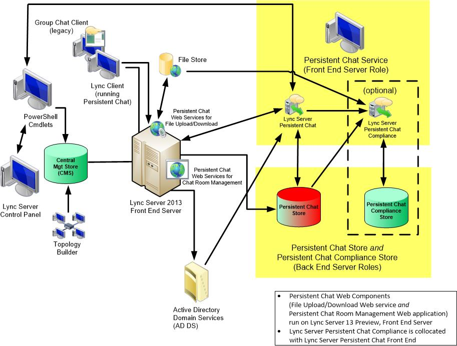

# Components and topologies for Persistent Chat Server in Lync Server 2013
[]
 **In this article**
  
[Persistent Chat Server Components](#sectionSection0)
  
[Supported Collocation](#sectionSection1)
  
[Persistent Chat Server Topologies](#sectionSection2)
  
Persistent Chat Server supports both single-server configurations and multiple-server configurations. Persistent Chat Server can also run on a Lync Server 2013 Standard Edition server. These configurations consist of the following Persistent Chat Server components and topologies.
  
## Persistent Chat Server Components

Installing the latest version of Persistent Chat Server requires the following components:
  
- One or more computers running Persistent Chat Server and providing the following services:
    
  - Persistent Chat service
    
  - Compliance service, which is turned on if compliance is enabled
    
    > [!IMPORTANT]
    > In Lync Server 2013, the Persistent Chat Web Services for File Upload/Download is now collocated with Lync Server 2013 Front End Server. > The Persistent Chat Web Services for Chat Room Management is also collocated with Lync Server 2013 Front End Server. 
  
- Server(s) (more than one server if mirroring is used) that host the SQL Server back-end database for hosting the Persistent Chat content database where chat room content, rooms, and categories are stored.
    
    > [!NOTE]
    > The back-end database stores chat history data, including information about categories and Persistent Chat rooms that are created. 
  
- If compliance was enabled, a server(s) (more than one server if mirroring is used) that host the SQL Server back-end database for hosting the Persistent Chat Compliance database, where compliance events and chat content for the purpose of compliance are stored.
    
To administer Persistent Chat Server from a separate computer (such as an administrative console), use the Lync Server Control Panel on the computer. This computer must then be deployed in an Active Directory Domain Services domain, with at least one global catalog server in the forest root.
  
For details about hardware and software requirements for Persistent Chat Server, see [Technical requirements for Persistent Chat Server in Lync Server 2013](technical-requirements-for-persistent-chat-server.md), [Supported hardware for Lync Server 2013](supported-hardware.md), and [Server software and infrastructure support in Lync Server 2013](server-software-and-infrastructure-support.md) in the Supportability documentation. 
  
## Supported Collocation

Lync Server 2013 supports a variety of collocation scenarios, providing you the flexibility to save hardware costs by running multiple components on one server (if you have a small organization), or to run individual components on different servers (if you have a larger organization that needs scalability and performance). Scalability factors should certainly be considered before you decide whether to collocate components.
  
The Persistent Chat Compliance service, if compliance is enabled, is collocated with the Lync Server 2013 Front End Server.
  
Persistent Chat Server can be deployed on the Standard Edition server. The Persistent Chat Server Back End Server and the Persistent Chat Compliance database can be collocated on the Standard Edition server on the local SQL Server Express Back End Server. For details about components that can be collocated there, see [Supported server collocation in Lync Server 2013](supported-server-collocation.md) in the Supportability documentation. 
  
For Lync Server 2013 Enterprise Edition, Persistent Chat Servers cannot be collocated on the Enterprise Edition server. The SQL Server database for Persistent Chat Server can be collocated with the Back End Server database of an Enterprise Edition Front End pool. The SQL Server database for Persistent Chat compliance can also be collocated with the Back End Server database of an Enterprise Edition pool.
  
> [!IMPORTANT]
> The server hosting the Persistent Chat database can host other databases. However, when you consider collocating the Persistent Chat database with other databases, be aware that if you are storing the messages of more than a few users, the disk space needed by the Persistent Chat database can grow very large. For this reason, we do not recommend collocating the Persistent Chat database with the back-end database. 
  
If you collocate the Persistent Chat database with the back-end database, you can either use a single instance of SQL Server for any or all of the databases, or you can use a separate instance of SQL Server for each database, with the following limitation:
  
- Each instance of SQL Server can contain only a single back-end database and a single Persistent Chat database.
    
For details about collocation of all server roles and databases, see [Supported server collocation in Lync Server 2013](supported-server-collocation.md) in the Supportability documentation. 
  
## Persistent Chat Server Topologies

Persistent Chat Server supports the following topologies:
  
- Lync Server 2013 Enterprise Edition single server Persistent Chat Server Front End Server
    
- Lync Server 2013 Enterprise Edition multiple server Persistent Chat Server Front End Server
    
- Lync Server 2013 Standard Edition server using SQL Server Express
    
- Lync Server 2013 Standard Edition server and Persistent Chat Server on a separate server using Standard Edition server as the next hop server.
    
You can add Persistent Chat Server to your Lync Server 2013 deployment by using Topology Builder. You can add a single server or a multiple server Persistent Chat Server pool to your topology.
  
> [!IMPORTANT]
> After you create a Persistent Chat Server pool with a single server by using Topology Builder, you cannot add additional servers to the pool. 
  
### Single-Server Topology

The minimum configuration and simplest deployment for Persistent Chat Server is a single Persistent Chat Server Front End Server topology. This deployment requires a single server that runs Persistent Chat Server (which optionally runs the Compliance service, if compliance is enabled), a server that hosts both the SQL Server database, and if compliance is required, the SQL Server database to store the compliance data.
  
> [!IMPORTANT]
> You cannot add additional servers to a Persistent Chat Server pool that is started as a single-server deployment in Topology Builder. We recommend using the multiple-server pool topology, even if you're using a single server, so that you can add more servers later, if needed.. 
  
The following figure shows all required and optional components of a topology for a single Persistent Chat Server Front End Server with compliance.
  
**Single Persistent Chat Server**

  
### Multiple-Server Topology

To provide greater capacity and reliability, you can deploy a multiple-server topology, as described in [Planning for Persistent Chat Server in Lync Server 2013](planning-for-persistent-chat-server.md). The multiple-server topology can include as many as four active computers running Persistent Chat Server (high availability and disaster recovery configurations will allow up to eight, but only four can be active and the remaining four on standby). Each server can support as many as 20,000 concurrent users, for a total of 80,000 concurrent users connected to a Persistent Chat Server pool with 4 servers. A multiple-server topology is the same as the single-server topology except that multiple servers host Persistent Chat Server, and can scale higher. Multiple computers running Persistent Chat Server should reside in the same Active Directory Domain Services domain as Lync Server and the Compliance service.
  
The following figure shows all the components of a multiple-server topology with multiple computers running Persistent Chat Server, the optional Compliance service, and a separate compliance database.
  
**Multiple Persistent Chat Servers**

  
Multiple-server topologies provide pooling of server functionality. In a server pool, the Persistent Chat services communicate and share data. For example, chat history that was originally posted to one Persistent Chat service is available from any Persistent Chat service in the system. A file that is uploaded through one Persistent Chat service can be accessed by any Persistent Chat service. Users can be connected to different Persistent Chat Server Front End Servers and can be chatting and communicating with each other.
  
The default port of TCP 8011 connects a server to a server pool, and is used by the Persistent Chat service to communicate between themselves, or for administrative purposes.
  

