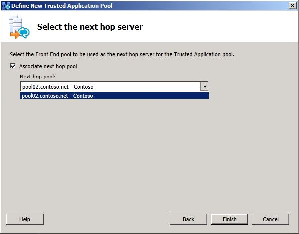

# Configure trusted application servers [OCS 2007 R2 to W15]
[]
In a mixed environment, if you create a new trusted application server after merging the legacy Office Communications Server topology with Lync Server 2013, and you define a new trusted application server using Topology Builder, you must set the next hop pool to be a Lync Server 2013 pool. In a merged environment, both the legacy Office Communications Server pool and the Lync Server 2013 pool appear in the drop down list. Selecting the legacy pool is  *not*  supported. 
  
## To select Lync Server 2013 as next hop when creating a Trusted application server

1. Open an existing topology in Topology Builder.
    
2. In the left pane, right click **Trusted application servers** and click **New Trusted Application Pool**.
    
3. Enter the **Pool FQDN** of the trusted application pool and select whether it will be a single-server or multiple-server deployment. 
    
4. Click **Next**.
    
5. On the **Select the next hop** page, from the list, select the Lync Server 2013 Front End pool. 
    
     
  
6. Click **Finish**.
    
7. Select the top node **Lync Server** and from the **Actions** pane, select **Publish**.
    
8. Verify the **Trusted Application Pool** was created successfully and is associated with the correct Front End pool. 
    

