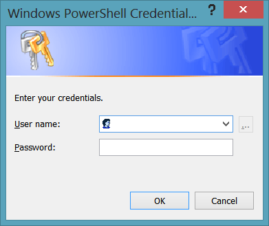

# Connecting to Skype for Business Online by using Windows PowerShell
[]
After you have installed the prerequisite software, you are ready to begin using Windows PowerShell to manage Skype for Business Online. To do that, you begin by opening a standard instance of Windows PowerShell. You don't need to open a special instance of Windows PowerShell (similar to, say, the Lync Server Management Shell), nor do you need to open a Control Panel app or any other special type of application. This is because Skype for Business Online management is performed by using a remote session of Windows PowerShell. In turn, this means that:
  
1. You use a regular session of Windows PowerShell to connect to Skype for Business Online. When connecting remotely, you work on your local computer and you use your local copy of Windows PowerShell, but you manage objects found on a remote system (that is, Skype for Business Online).
    
2. All the cmdlets, scripts, and other items needed to manage Skype for Business Online are downloaded to your computer. These items are kept in memory and are available only in the remote session established with Skype for Business Online. This is important to keep in mind. When you make a remote connection to Skype for Business Online, the Skype for Business Online cmdlets—such as [Get-CsTenant](get-cstenant.md)—will be copied, in memory, to your computer. In your remote session, you'll be able to run these cmdlets. However, these cmdlets are available only in that remote session. For example, you might start a second session of Windows PowerShell, but without connecting to Skype for Business Online in this session. If you try to run the **Get-CsTenant** cmdlet from within that session, you'll receive the following error message: 
    
  ```
  Get-CsTenant : The term 'Get-CsTenant' is not recognized as the name of a cmdlet, function, script file, or operable program. Check the spelling of the name, or if a path was included, verify that the path is correct and try again.
  ```

    Also note that searching your hard disk for the **Get-CsTenant** cmdlet (or any other Skype for Business Online cmdlet) will come up empty. This is because nothing is actually saved to your hard disk when you create a remote session. 
    
3. When you close your remote session, the downloaded items are deleted from your computer's memory. For example, you might start a remote session of Windows PowerShell with the **Get-CsTenant** cmdlet, and then close that session. If you restart Windows PowerShell, the **Get-CsTenant** cmdlet will no longer be available. To get access to the **Get-CsTenant** cmdlet, you'll need to reconnect to Skype for Business Online. 
    
> [!NOTE]
> If your are working with a hybrid deployment, you should follow the procedures outlined in the article [Using Windows PowerShell in a hybrid deployment with Skype for Business Online](using-windows-powershell-in-a-hybrid-deployment.md). 
  
To create a remote connection to Skype for Business Online, begin by starting a new session of Windows PowerShell on your local computer. If you are running Windows 7, Windows Server 2008 R2, Windows Server 2012, or Windows Server 2012 R2 do the following:
  
- Click **Start**, click **All Programs**, click **Accessories**, click **Windows PowerShell**, and then click **Windows PowerShell**.
    
If you are running Windows 8 or 8.1, do this instead:
  
- Access the Charms bar, click **Search**, and then click **Windows PowerShell**. You can quickly access the Charms bar on any Windows 8 or 8.1 computer (touch screen or non-touch screen) by holding down the Windows key and pressing C.
    
After the Windows PowerShell console appears, you must then create a Windows PowerShell credentials object. The credentials object is used to securely convey your user name and password to Skype for Business Online. To create a credentials object, type the following command at the Windows PowerShell prompt and then press ENTER:
  
```
$credential = Get-Credential
```

> [!NOTE]
> In this example, your user name and password will be stored in the variable $credential. You can name this variable anything you want, as long as it adheres to the variable name rules for Windows PowerShell. However, you must use a variable of some kind in order to store the user name and password. Otherwise, the credentials object that you create will disappear the moment after it gets created. 
  
After you press ENTER, you should see the **Windows PowerShell Credential** dialog box: 
  

  
In the **User name** box, type your Skype for Business Online user name. In the **Password** box, type your Skype for Business Online password (the password will be masked and will not be visible onscreen). For example, if your user name is kenmyer@litwareinc.com and your password is p@ssw0rd!, the dialog box will look like this: 
  

  
To create the credentials object, click **OK**. If you want to verify that the object was created, simply type the variable name at the Windows PowerShell prompt and press ENTER:
  
```
$credential
```

Windows PowerShell will respond by showing you something similar to this:
  
```
UserName                            Password
--------                            --------
kenmyer@litwareinc.com              System.Security.SecureString
```

> [!NOTE]
> Keep in mind that the **Get-Credential** cmdlet accepts any credentials that you type and does not attempt to verify that you have entered a valid user name and password. This validation will occur only when you attempt to log on to Skype for Business Online. 
  
After you have created the credentials object, you can then create a new remote Windows PowerShell session that makes a connection to Skype for Business Online. To do this, type the following command at the Windows PowerShell prompt and then press ENTER:
  
```
$session = New-CsOnlineSession -Credential $credential -Verbose
```

> [!NOTE]
> $session is a variable that is used to hold information—in this case, information about the connection to Skype for Business Online. Again, you can give this variable any name as long as that name meets the Windows PowerShell variable name guidelines (for example, the name should not include blank spaces or punctuation marks). 
  
Make sure that you type the command exactly as shown (with the possible exception of the variable name). Note that it does not matter what the name of your Skype for Business Online domain is. Regardless of your domain name, the **New-CsOnlineSession** cmdlet will connect you to Office 365 and log you on, using the supplied credentials. After you make the connection and have been authenticated, you will then be automatically redirected to the appropriate URI based on the supplied credentials. 
  
If your connection succeeds, you'll see messages similar to this in the Windows PowerShell console:
  
```
VERBOSE: Determining domain to admin
VERBOSE: AdminDomain = litwareinc.com
VERBOSE: Discovering PowerShell endpoint URI
VERBOSE: TargetUri = 'https://admin2a.online.lync.com/OcsPowershellLiveId'
VERBOSE: Requesting authentication token
VERBOSE: Success
VERBOSE: Initializing remote session
VERBOSE: Success
Id Name       ComputerName    State        ConfigurationName     Availability -- ----       ------------    -----        -----------------     ------------
2 Session2    litwarein...    Opened       Microsoft.PowerShell  Available
```

Are you now ready to begin using Windows PowerShell to manage Skype for Business Online? Not quite. The **New-CsOnlineSession** cmdlet connects to Skype for Business Online and creates a new session for you. However, you must then import that new session into the Windows PowerShell console. Do this by running the following command: 
  
```
Import-PSSession $session
```

When you press ENTER, you'll see a progress meter similar to this displayed in the Windows PowerShell console:
  
```
Creating implicit remoting module . . .
     Getting command information from remote session . . . 16 commands  
          received
     [oooooooooooooooo
     00:00:33 remaining
```

What's happening at this point is that Windows PowerShell is downloading cmdlets and other items needed to manage Skype for Business Online. When the download is complete, you'll see information similar to this in the Windows PowerShell console:
  
```
ModuleType Name                 ExportedCommands
---------- ----                 ----------------
Script     tmp_5astd3uh.m5v     {Disable-CsMeetingRoom, Enable-Cs ...}
```

At this point, you are ready to begin using Windows PowerShell to manage Skype for Business Online. To verify that that the download was successful, and to view the Skype for Business Online cmdlets available for use, you must first determine the name of the temporary Windows PowerShell module that contains all the Skype for Business Online cmdlets. To do that, run this command from the Windows PowerShell prompt:
  
```
Get-Module
```

Information similar to the following will appear onscreen:
  
```
ModuleType Name                 ExportedCommands
---------- ----                 ----------------
Manifest   Microsoft.PowerS...  {Add-Computer, Add-Content, A…}
Script     tmp_5astd3uh.m5v     {Disable-CsMeetingRoom, Enabl…}
```

The module with the ModuleType Script is the module that contains the Skype for Business Online cmdlets. To return a list of those cmdlets, run the **Get-Command** cmdlet, using the name of the Script module as the module name: 
  
```
Get-Command -Module tmp_5astd3uh.m5v
```

Windows PowerShell should then display a list of all of the Skype for Business Online cmdlets.
  
After you have finished your management tasks, you should always run the following command before you close the Windows PowerShell console:
  
```
Remove-PSSession $session
```

The **Remove-PSSession** cmdlet disconnects you from Skype for Business Online and closes the remote session. In fact, if you try to reimport the session (by running the **Import-PSSession** cmdlet), you'll get the following error message: 
  
```
Import-PSSession : State of runspace is not valid for this operation.
```

This message simply means that, in order to reconnect to Skype for Business Online, you'll need to create a new session.
  
If you forget to remove the session before closing the Windows PowerShell console (or if the console closes unexpectedly), nothing bad will happen. After 15 minutes of inactivity, the session will automatically disconnect itself. However, by default, each Skype for Business Online administrator is allowed only three simultaneous connections to Skype for Business Online. If you close the Windows PowerShell console without removing the session, that closed session will still count as one connection, even though it's not being used at the moment. (And it will continue to count as one connection until it times out.) For example, you might open and close the Windows PowerShell console three times, each time without removing the Skype for Business Online session. If you open Windows PowerShell and try to make a fourth connection, your command will hang, and no connection will be made.
  
> [!NOTE]
> If Windows PowerShell hangs while trying to make a connection, press Ctrl-C to terminate the stuck command. 
  
While individual administrators can have only three simultaneous connections to a Skype for Business Online tenant, an organization can have as many as nine simultaneous connections. That means that three administrators could have three simultaneous connections apiece, or nine administrators could have one connection to Skype for Business Online, and so on. However, again, no single administrators can have more than three active sessions.
  
## See also

#### 

[Configuring your computer for Skype for Business Online management](configuring-your-computer-for-skype-for-business-online-management.md)

