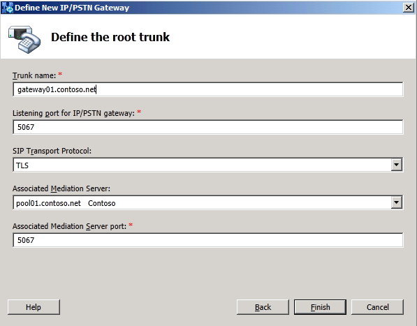

# Define a gateway in Topology Builder in Lync Server 2013
[]
Follow these steps to use Topology Builder to define a peer with which you can associate a Mediation Server to provide connectivity to the public switched telephone network (PSTN) for users enabled for Enterprise Voice. A peer to the Mediation Server can be a PSTN gateway, an IP-PBX, or a Session Border Controller (SBC) for an Internet Telephony Service Provider (ITSP) to which you connect by configuring a SIP trunk. 
  
> [!NOTE]
> This topic assumes that you have set up at least one internal Front End pool or Standard Edition server in at least one central site with a collocated or stand-alone Mediation Server, as described in [Define and configure a Front End pool or Standard Edition server in Lync Server 2013](define-and-configure-a-front-end-pool-or-standard-edition-server.md) and [Publish the topology in Lync Server 2013](publish-the-topology.md) in the Deployment documentation. This topic also assumes that you have verified that your infrastructure meets the prerequisites described in [Software prerequisites for Enterprise Voice in Lync Server 2013](software-prerequisites-for-enterprise-voice.md) and [Security and configuration prerequisites for Enterprise Voice in Lync Server 2013](security-and-configuration-prerequisites-for-enterprise-voice.md). 
  
### To Define a Peer for the Mediation Server

1. Start Topology Builder: Click **Start**, click **All Programs**, click **Microsoft Lync Server 2013**, and then click **Lync Server Topology Builder**.
    
2. Under Lync Server 2013, your site name, Shared Components, right-click the **PSTN Gateways** node, and then click **New PSTN Gateway**.
    
     
  
3. In **Define New IP/PSTN Gateway**, type the fully qualified domain name (FQDN) or IP address of the peer, and click **Next**.
    
     
  
    > [!NOTE]
    > If you specify Transport Layer Security (TLS) as the transport type, you must specify the FQDN instead of the IP address of the peer of the Mediation Server. 
  
4. Define the listening mode (IPv4 or IPv6) of the IP address of your new PSTN gateway, and click **Next**.
    
     
  
5. Define a root trunk for the PSTN gateway. A trunk is a logical connection between a Mediation Server and a gateway uniquely identified by the tuple. 
    
    {Mediation Server FQDN, Mediation Server listening port (TLS or TCP) : gateway IP and FQDN, gateway listening port}
    
  - When defining a PSTN gateway in Topology Builder, you must define a root trunk to successfully add the PSTN gateway to your topology.
    
  - The root trunk cannot be removed until the associated PSTN gateway is removed.
    
     
  
6. Under **Listening Port for IP/PSTN Gateway**, type the listening port that the gateway, PBX, or SBC will use for SIP messages from the Mediation Server that will be associated with the root trunk of the PSTN gateway. (By default, the ports are 5066 for Transmission Control Protocol (TCP) and 5067 for Transport Layer Security (TLS) on a PSTN gateway, PBX or SBC. On a Survivable Branch Appliance at a branch site, the default ports are 5081 for TCP and 5082 for TLS.)
    
7. Under **SIP Transport Protocol**, click the transport type that the peer uses, and then click **OK**.
    
    > [!NOTE]
    > For security reasons, we strongly recommend that you deploy a peer to the Mediation Server that can use TLS. 
  
8. Under **Associated Mediation Server**, select the Mediation Server pool to associate with the root trunk of this this PSTN Gateway.
    
9. Under **Associated Mediation Server port**, type the listening port that the Mediation Server will use for SIP messages from the gateway.
    
    > [!NOTE]
    > With multiple trunk support in Lync Server 2013, multiple SIP signaling ports can be defined on the Mediation Server to be used for communication with multiple PSTN gateways. When defining a trunk, the **Associated Mediation Server port** must be within the range of the listening ports for the respective protocol allowed by the Mediation Server. This port range is defined under Lync Server 2013 and Mediation Pools. Right-click the Mediation Server pool of interest, and select **Edit Properties**. Specify the port range in the **Listening ports** field. 
  
10. Click **Finish**.
    
> [!IMPORTANT]
> Before you finish this step, be sure that the peer that you defined is running and using the FQDN or IP address that you specified. 
  
Next, to add the peer to the topology, follow the procedures in [Publish the topology in Lync Server 2013](publish-the-topology.md) in the Deployment documentation. You must publish your topology each time that you use Topology Builder to build or modify your topology, so that the data can be used to install the files for servers that are running Lync Server. 
## See also

#### 

[Modify a trunk in Topology Builder in Lync Server 2013](modify-a-trunk-in-topology-builder.md)

