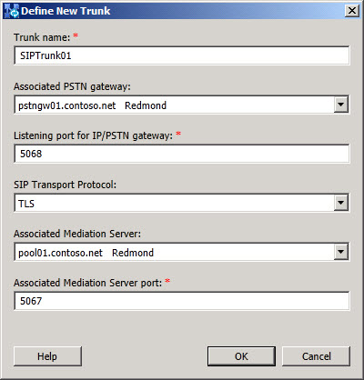

# Define a New Trunk
[]
You define a new session initiation protocol (SIP) trunk by providing the following information:
  
- **Trunk name**: unique name in your topology that will identify this trunk
    
- **Associated PSTN Gateway**: select a deployed and configured PSTN gateway in your deployment from the list
    
- **Listening port for the IP/PSTN gateway**: port that the IP-PBX or PSTN gateway will listen on. Must be unique from all other trunk listening ports configured in your deployment
    
- **SIP Transport Protocol**: select from the list either TCP or TLS
    
- **Associated Mediation Server**: select from the list a Mediation Server that is deployed and configured in your deployment
    
- **Associated Mediation Server port**: set the port value equal to the TCP or TLS port value of the Mediation Server that this SIP trunk will use 
    

  
## See also

#### 

[How do I implement SIP trunking in Lync Server 2013?](how-do-i-implement-sip-trunking.md)
  
[M:N trunk in Lync Server 2013](m-n-trunk.md)

