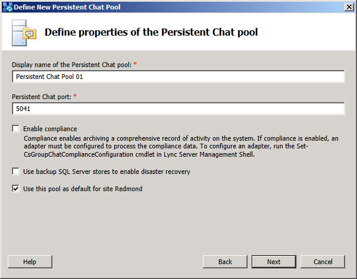

# Define Properties and Options for Persistent Chat Pool
[]
You configure options for your Persistent Chat Server or Persistent Chat Server pool by defining the following properties:
  
 **Display name of the Persistent Chat pool**: A required property that defines a user friendly name that will be displayed for this Persistent Chat Server or Persistent Chat Server pool.
  
 **Persistent Chat port**: A required property that will define the port number that this Persistent Chat Server or Persistent Chat Server pool will listen on.
  
 **Enable compliance**: Select the check box if you plan to deploy and implement the optional Persistent Chat compliance feature and database.
  
 **Use backup SQL Server stores to enable disaster recovery**: Select this check box if you plan to deploy and implement disaster recovery of the Persistent Chat SQL Server stores from a configured backup set of stores on another SQL Server. For details, see [Configuring Persistent Chat Server for high availability and disaster recovery in Lync Server 2013](configuring-persistent-chat-server-for-high-availability-and-disaster-recovery.md)
  
> [!NOTE]
> This option is available only for pools with multiple servers. 
  
 **Use this pool as default for the site \<site that this server or pool is being configured in\>**: Select this check box if this will be the default Persistent Chat Server or Persistent Chat Server pool for the site. You must have one default Persistent Chat server or pol per site.
  
> [!NOTE]
> If your topology includes multiple sites, a checkbox for **Use this pool as default for all sites** is also displayed. 
  
Click **Back** to go back to the previous pool definition dialog. 
  
Click **Next** after you have finished entering the options for this pool to proceed with the Persistent Chat Server pool definition. 
  
Click **Cancel** to discard all changes and end the **Define New Persistent Chat Pool** wizard. 
  
Click **Help** to access context sensitive help, such as this page. 
  

  
## See also

#### 

[Add Persistent Chat Server to the topology in Lync Server 2013](add-persistent-chat-server-to-the-topology.md)
  
[Components and topologies for Persistent Chat Server in Lync Server 2013](components-and-topologies-for-persistent-chat-server.md)

