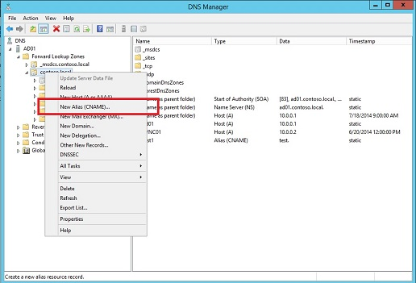
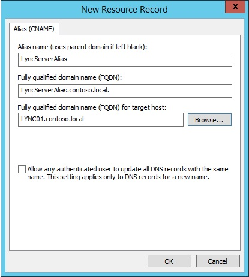
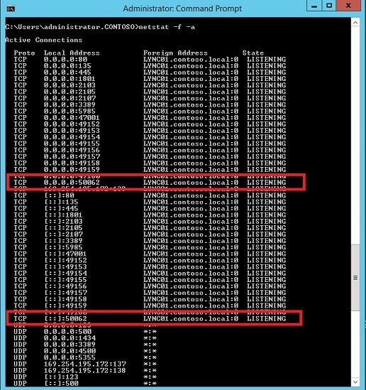

# Deploying a SQL Server nonstandard port and alias in Lync Server 2013
[]
Microsoft Lync Server 2013 supports using a non-standard port and alias in SQL Server. Using a SQL Server non-standard port and an alias increases security and creates a more flexible environment for the Lync deployment. These steps are only a single step in properly securing your Lync Server 2013 environment. Additional steps should be taken to reduce the attack surface of a Lync Server 2013 implementation. 
  
The following article describes the steps required to setup a SQL Server non-standard port and alias in Lync Server 2013.
  
## Deploying a SQL Server Non-Standard Port and Alias in Lync Server 2013

Lync Server 2013 Topology Builder supports using a SQL Server alias as the Fully Qualified Domain Name (FQDN) instead of the actual SQL Server FQDN when configuring Lync Server 2013. This allows the actual SQL Server FQDN to be hidden from any malicious attacker. In addition, using a non-standard port obscures the actual port from any would be attacker attempting to attack the database on the standard port 1433, as shown in the following figure.
  

  
In order to be successful in determining the port Lync Server 2013 is using to communicate with SQL Server, the attacker would need to scan all ports to obtain the port information. A port scan by an attacker increases the chances that security can detect and stop the instruction. In addition to adding increased security with a non-standard port, you can also use a SQL Server alias to provide flexibility for the deployment. This is valuable in order to reduce configuration changes in situations where a SQL Server name change is required.
  
> [!NOTE]
> SQL Server provides two fault tolerance methods (Failover Clustering and Mirroring). Both SQL Server fault tolerance methods are supported using a SQL Server non-standard port and alias with Lync Server 2013. If the SQL Server backend used by the pool is in a mirrored configuration, then the SQL browser service on the SQL Server backend servers should be running for Front End servers to connect to the mirrored database when the databases are failed over to the mirrored SQL Server. 
  
When configuring SQL Server database connectivity from within Topology Builder, or when using the Install-CsDatabase cmdlet, it's not possible to explicitly define a SQL Server non-standard port number and associate it with a SQL instance. To set a non-standard port, you'll need to use SQL Server and Windows Server utilities.
  
To set up a SQL Server non-standard port and alias for use with Lync Server 2013, you will need to complete three primary steps. These steps are:
  
- Confirm that Lync Server 2013 has the Latest Updates Applied.
    
- Setup the SQL Server Non-Standard Port and Alias.
    
- Configure Lync Server 2013 with the SQL Server alias using Topology Builder.
    
- Publish the Topology, and Verify the Database.
    
### Confirm that Lync Server 2013 has the Latest Updates Applied

It is important to keep Lync Server 2013 up to date. To check for the most recent updates and information on how to apply them, see [Updates for Lync Server 2013](https://support.microsoft.com/kb/2809243).
  
### Setup the SQL Server Non-Standard Port and Alias

The SQL Server non-standard port and alias must be set up on the database instance before it can be referenced from Lync Server 2013 Topology Builder. To set up a SQL Server non-standard port and alias, you will have to complete three primary steps. These steps are as follows:
  
- Change the Default TCP/IP Protocol Values.
    
- Create and Configure a SQL Server Alias.
    
- Create a Domain Name System (DNS) Canonical Name (CNAME) Resource Record.
    
### Modify the Default TCP/IP Protocol Values

1. Select Start, and choose SQL Server Configuration Manager, as shown in the following figure.
    
     
  
2. In the navigation pane, choose to expand the SQL Server instance, choose to expand SQL Server Network Configuration, and choose Protocols for \<instance name\>, as shown in the following figure.
    
     
  
3. In the right pane, right-click TCP/IP, and select Properties. The TCP/IP Properties dialog box is displayed.
    
4. Select the IP Addresses tab. The IP Addresses tab shows all of the active IP addresses on the server. These are in the format IP1, IP2, up to IPAll, as shown in the following figure. 
    
     
  
5. Clear the TCP Dynamic Ports field for all IP addresses. If the field contains a zero character, then it means SQL Server is listening on dynamic ports. Make sure these fields are cleared and do not contain a zero. 
    
6. For the IP address that Lync Server will be using to connect to the database, make sure that Enabled is set to Yes, as shown in the following figure.
    
     
  
7. In the IPAll section at the bottom of the dialog, enter the desired port in the TCP Port field, as shown in the following figure. In this example, we use port 50062, but you can use any port between 49152 and 65535. These are the ports assigned to dynamic and private use, and this ensures you won't conflict with other ports being used in the Lync Server 2013 deployment. 
    
     
  
8. Choose OK to exit the TCP/IP Properties dialog. 
    
9. Restart the SQL Server instance by selecting SQL Server Services in the left pane of SQL Server Configuration Manager. Then right-click SQL Server \<instance name\> in the right pane, and select Restart, as shown in the following figure.
    
     
  
> [!IMPORTANT]
> Make sure you update your firewall settings to accommodate the new SQL Server port. 
  
### Create and Configure a SQL Server Alias

1. Select Start, and choose SQL Server Configuration Manager, as shown in the following figure.
    
     
  
2. In the left pane, choose to expand SQL Server instance, choose to expand SQL Native Client \<version\> Configuration, and then choose Aliases, as shown in the following figure.
    
     
  
3. Right-click Aliases, and select New Alias….
    
4. Enter the Alias Name, Port Number, Protocol, and Server, as shown in the following figure.
    
     
  
    > [!CAUTION]
    > Make sure to enter the same non-standard port you used in the previous step since that is the port SQL Server will be listening on. If a configured alias is connecting to the wrong SQL Server FQDN or Instance, disable and then re-enable the associated network protocol. Doing this clears any cached connection information and allows the client to connect correctly. 
  
### Create a DNS CNAME Resource Record

1. Sign into the computer managing DNS.
    
2. Select Start, and choose Server Manager, as shown in the following figure. 
    
     
  
3. Choose the Tools drop-down, and select DNS, as shown in the following figure.
    
     
  
4. In the left pane, expand the server name node, expand the Forward Lookup Zones node, and choose the relevant domain.
    
5. Right-click the domain, and select New Alias (CNAME)…, as shown in the following figure.
    
     
  
6. Enter the Alias Name and the FQDN for SQL Server, as shown in the following figure.
    
     
  
7. Choose OK to save the CNAME and view it in DNS Manager. 
    
### Validate Database Connectivity

There are many different ways to make sure it is working. You want to make sure that the SQL Server database is listening on the specified port using the alias. A quick check can be completed using the netstat and telnet commands. 
  
> [!NOTE]
> Telnet Client is a Feature that comes with Windows Server but that must be installed. A Windows Server Feature can be installed by opening Server Manager and selecting Add Roles and Features from the Manage menu. 
  
### Use netstat and telnet to verify database connectivity

1. Select Start, and type cmd to open a command prompt. 
    
2. Type netstat -a -f, and confirm that SQL Server is running with the correct port, as shown in the following figure.
    
     
  
3. Type telnet \<alias name\> \<port #\> to confirm the connection to the SQL Server instance. If the connection is successful, telnet will connect and you shouldn't see an error. This shows that the SQL Server instance is listening on the correct port with the correct alias. If there's a problem connecting to the SQL Server database, then telnet shows an error that the connection cannot be made. Now that you have checked database connectivity on the database server, you can do the same thing from Lync Server (over the network) and make sure there aren't any firewalls blocking access along the way. 
    
### Conclusion

Once the SQL Server alias has been configured, you can use it to create a Lync Server 2013 topology in the Topology Builder tool. For more information about topologies, see [Defining and configuring the topology in Lync Server 2013](defining-and-configuring-the-topology.md).
  
## See also

#### 

[Microsoft Lync Server 2013](microsoft-lync-server-2013.md)
#### 

[Planning for security in Lync Server 2013](planning-for-security.md)
  
[Defining and configuring the topology in Lync Server 2013](defining-and-configuring-the-topology.md)
  
[Deploying Lync Server 2013](deploying-lync-server-2013.md)

