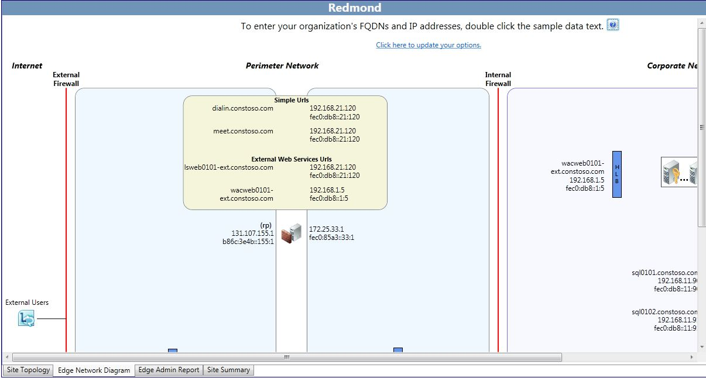

# Editing the network configuration diagram in Lync Server 2013
[]
Most of the work that a designer does in the Lync Server 2013, Planning Tool consists of defining the entries for the IP addresses and fully qualified domain names (FQDNs) for the entries on the network diagram. The information that is entered on this page carries over into the reports and other information contained in the Planning Tool. 
  

  
The Planning Tool creates a network diagram with default text for IP addresses and FQDNs. 
  
To edit the network diagram and input values:
  
1. Choose a section of the network to begin working on. For example, double-click the text, **access1.contoso.com**. In the dialog box that opens, type the actual FQDN of the server access1.contoso.com and the actual IP address, replacing the 131.107.155.3.
    
2. Click **OK** to save the entries. 
    
3. Continue to edit IP addresses and FQDNs, providing virtual IP addresses for hardware load balancers or server entries for Domain Name System (DNS) load balancing for servers in pools.
    
A helpful feature of the Planning Tool is that it can incrementally assign a range of IP addresses and server host names, rather than requiring the designer to edit each separate server in a pool. For example:
  
1. Double-click the pooled Front End Servers. When the dialog box opens, select **Do you want to use the IPs and FQDN as starting points for all equivalent servers in this cluster?**. 
    
2. For example, the starting value for the first server is fe0101.contoso.com and an IP address of 192.168.21.122.
    
3. Type fe0.contoso.com in **Front End Server FQDN**, type 192.168.21.131 in **Front End Server IP address**, and then click **OK**.
    
4. The auto-increment feature updates all servers in the pool to fe01 through fe06, and all IP address from 192.168.21.131 to 136.
    
After you have completed all edits, save the topology by completing the following steps: 
  
To save the Planning Tool design, click **File**, and then click **Save Topology** or **Save Topology As**. If a **Save Planning Tool As** dialog box appears, type a name for the file in **File name**, and then click **Save**. 
  
## See also

#### 

[Editing the design in Lync Server 2013](editing-the-design.md)

