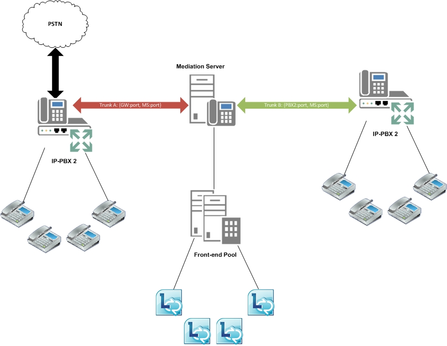

# Intertrunk routing in Lync Server 2013
[]
Lync Server 2013 can interconnect an IP-PBX to a public switched telephone network (PSTN) gateway so that calls from a PBX phone can be routed to the PSTN, and incoming PSTN calls can be routed to a private branch exchange (PBX) phone. Similarly, Lync Server 2013 can interconnect two or more IP-PBX systems so that calls can be placed and received between PBX phones from the different IP-PBX systems. 
  
This intertrunk routing feature can be configured by using the Lync Server Management Shell cmdlet, **Set-CsTrunkConfiguration**, with the new parameter, PstnUsages. This parameter specifies the set of PSTN usage records to use. A trunk uses this PSTN usage to determine a route and to route all incoming calls accordingly. 
  
```
Set-CsTrunkConfiguration -Identity <TrunkId> -PstnUsages @{add="<UsageString>"}
```

The following diagram illustrates Lync Server 2013 providing interconnectivity between a PSTN gateway and an IP-PBX.
  
**Intertrunk routing between gateway and IP PBX**


  
The following diagram illustrates Lync Server 2013 interconnecting two IP-PBX systems.
  
**Intertrunk routing between two IP PBXs**


  

