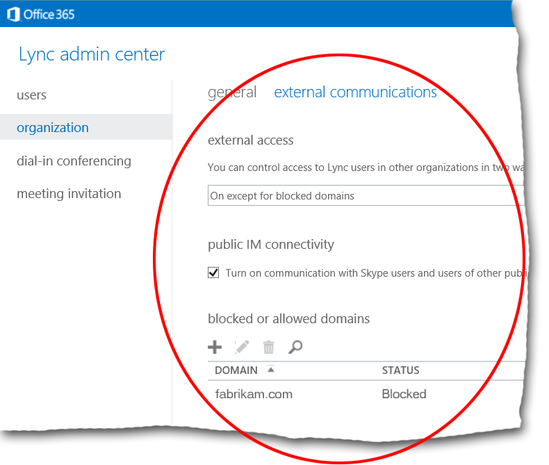

# Managing communications in Skype for Business Online with outside users and organizations
[]
The following cmdlets can be used to manage federation with external domains and with public instant messaging (IM) providers:
  
|**Cmdlet**|**Description**|
|:-----|:-----|
|[New-CsEdgeAllowAllKnownDomains](new-csedgeallowallknowndomains.md)   |Allows users to communicate with all domains except for those specified on the blocked domains list.    Federation is a service that enables users to exchange IM and presence information with users from other domains. Typically, administrators use allowed and blocked lists to specify the outside domains that users can communicate with.    |
|[New-CsEdgeAllowList](new-csedgeallowlist.md)   |Limits user communication to a specified collection of domains.    Users will be allowed to communicate only with domains that appear on the allowed domains list.    |
|[New-CsEdgeDomainPattern](new-csedgedomainpattern.md)   |Modifies the allowed or blocked domain lists.    |
|[Get-CsTenantFederationConfiguration](get-cstenantfederationconfiguration.md)          [Set-CsTenantFederationConfiguration](set-cstenantfederationconfiguration.md)   |Enables and disables federation with other domains and federation with public providers.    |
|[Get-CsTenantHybridConfiguration](get-cstenanthybridconfiguration.md)          [Set-CsTenantHybridConfiguration](set-cstenanthybridconfiguration.md)   |Assigns the appropriate values to hybrid configuration settings.    In a hybrid or "split domain" deployment, an organization has some users with accounts homed on Skype for Business Online while simultaneously having other users with accounts homed on Lync Server 2013. By default, users homed on Skype for Business Online do not have access to the complete range of capabilities offered by Enterprise Voice. To provide Skype for Business Online users with access to these Enterprise Voice capabilities, administrators need to assign the appropriate values to hybrid configuration settings. These values can be managed only by using the **CsTenantHybridConfiguration** cmdlets.    |
|[Get-CsTenantPublicProvider](get-cstenantpublicprovider.md)          [Set-CsTenantPublicProvider](set-cstenantpublicprovider.md)   |Manages federation with public providers.    Public providers are organizations that provide SIP communication services for the general public. When you establish a federation relationship with a public provider, you effectively establish federation with any user who has an account hosted by that provider.    |
   
You can also manage federation settings, for both federated domains and for public providers, by using the Skype for Business Online admin center:
  

  
## See also

#### 

[The Skype for Business Online cmdlets](the-skype-for-business-online-cmdlets.md)
  
[Quick reference: Using Windows PowerShell to do common Skype for Business Online management tasks](quick-reference-using-windows-powershell-to-do-common-skype-for-business-online.md)

