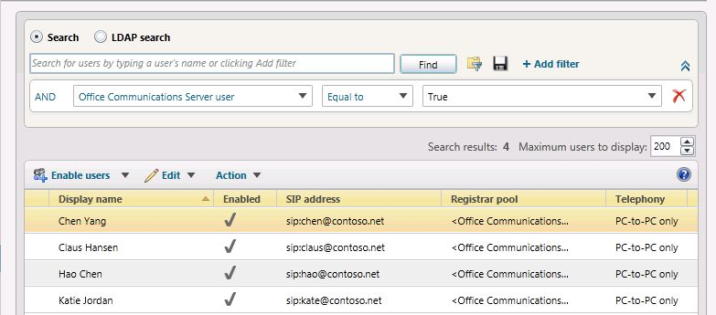

# Move multiple users to the pilot pool [OCS 2007 R2 to W15]
[]
 **In this article**
  
[To move multiple users by using the Lync Server 2013 Control Panel](#sectionSection0)
  
[To move multiple users by using the Lync Server 2013 Management Shell](#sectionSection1)
  
[To move all users at the same time by using the Lync Server 2013 Management Shell](#sectionSection2)
  
You can move multiple users from your Office Communications Server 2007 R2 pool to your Lync Server 2013 pilot pool using Lync Server 2013 Control Panel or Lync Server 2013 Management Shell.
  
## To move multiple users by using the Lync Server 2013 Control Panel
<a name="sectionSection0"> </a>

1. Open **Lync Server Control Panel**.
    
2. From the **User Search** tab, click the **Search** button. 
    
3. Next, click **Add Filter**.
    
4. Create a filter where **Office Communications Server user** is equal to **True**. 
    
5. Click **Find** to search for legacy Office Communications Server 2007 R2 users. 
    
6. Select two users that you want to move to the Lync Server 2013 pool. In this example, we will move users Chen Yang and Claus Hansen.
    
     
  
7. From the **Action** menu, select **Move selected users to pool**.
    
8. From the drop-down list, select the Lync Server 2013 pool.
    
9. Click **Action** and then click **Move selected users to pool**. Click OK.
    
     
  
10. Verify that the **Registrar pool** column for the users now contains the Lync Server 2013 pool, which indicates that the users have been successfully moved. 
    
## To move multiple users by using the Lync Server 2013 Management Shell
<a name="sectionSection1"> </a>

1. Open the Lync Server 2013 Management Shell. 
    
2.  At the command line, type the following and replace **User1** and **User2** with specific user names you want to move and replace **pool_FQDN** with the name of the destination pool. In this example we will move users Hao Chen and Katie Jordan. 
    
  ```
  Get-CsUser -Filter {DisplayName -eq "User1" -or DisplayName - eq "User2"} | Move-CsLegacyUser -Target "pool_FQDN"
  ```

     
  
3. At the command line, type the following 
    
  ```
  Get-CsUser -Identity "User1"
  ```

4. The **Registrar Pool** identity should now point to the pool you specified as **pool_FQDN** in the previous step. The presence of this identity confirms that the user has been successfully moved. Repeat step to verify **User2** has been moved. 
    
     
  
## To move all users at the same time by using the Lync Server 2013 Management Shell
<a name="sectionSection2"> </a>

In this example, all users have been returned to the Office Communications Server 2007 R2 pool (pool01.contoso.net). Using the Lync Server 2013 Management Shell, we will move all users at the same time to the Lync Server 2013 pool (pool02.contoso.net).
  
1. Open the **Lync Server 2013 Management Shell**.
    
2. At the command line, type the following: 
    
  ```
  Get-CsUser -OnOfficeCommunicationServer | Move-CsLegacyUser -Target "pool_FQDN"
  ```

     
  
3. Next, run **Get-CsUser** for one of the pilot users. 
    
  ```
  Get-CsUser -Identity "Hao Chen"
  ```

4. The **Registrar Pool** identity for each user now points to the pool you specified as "pool_FQDN" in the previous step. The presence of this identity confirms that the user has been successfully moved. 
    
5. Additionally, we can view the list of users in the Lync Server 2013 Control Panel and verify that the Registrar Pool value now points to the Lync Server 2013 pool.
    
     
  

