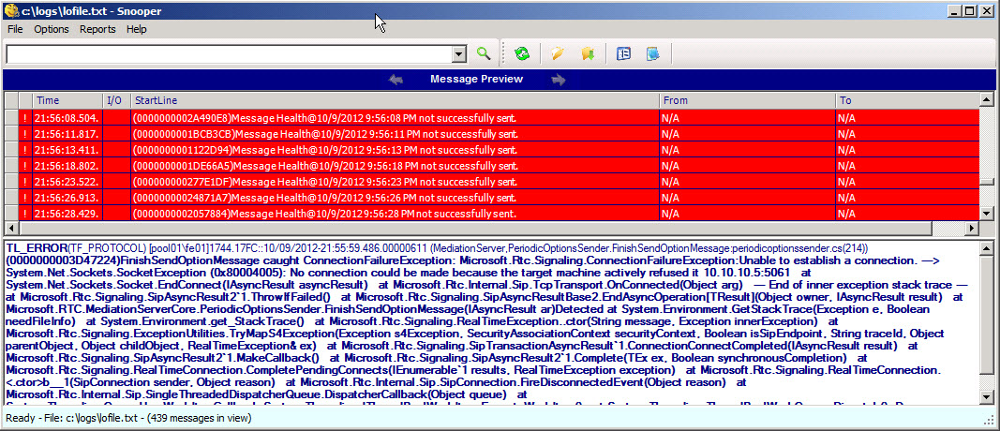
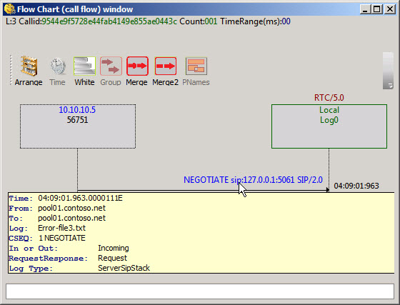

# Reading capture logs from the Centralized Logging Service in Lync Server 2013
[]
You realize the real benefit of the Centralized Logging Service after you run the search and you have a file that you can use to track down a reported problem. There are a number of ways that you can read the file. The output file is in a standard text format and you can use Notepad.exe or any other programs that will allow you to open and read a text file. For larger files and more complex issues, you could use a tool like Snooper.exe that is designed to read and parse the logging output from the Centralized Logging Service. Snooper is included with the Lync Server 2013 Debug Tools that are available as a separate download. You can download the Lync Server 2013 Debug Tools here: [https://go.microsoft.com/fwlink/?LinkId=285257](https://go.microsoft.com/fwlink/?LinkId=285257). When you install the Lync Server 2013 Debug Tools, short cuts and menu items are not created. After you install the Lync Server 2013 Debug Tools, open Windows Explorer, a command-line window, or Lync Server Management Shell and go to the directory (default location) C:\Program Files\Microsoft Lync Server 2013\Debugging Tools. Double-click Snooper.exe or type Snooper.exe, and then press ENTER if you are using the command line or Lync Server Management Shell.
  
> [!IMPORTANT]
> The intent of this topic is not to detail and discuss troubleshooting techniques. Troubleshooting and the processes around it is a complex subject. For details about troubleshooting basics and troubleshooting specific workloads, see the Microsoft Lync Server 2010 Resource Kit book at [https://go.microsoft.com/fwlink/p/?linkId=211003](http://go.microsoft.com/fwlink/p/?linkId=211003). The processes and procedures still apply to Lync Server 2013. 
  
Lync Server 2013 introduces an updated version of Snooper that includes some new features. The following screen shot shows the version of Snooper from Office Communications Server 2007.
  

  
The following screen shot shows the new version of Snooper included in the Lync Server 2013 Debug Tools.
  

  
The following screen shot shows the toolbar with frequently used functions.
  

  
And, the newest feature that adds value is the Flow Chart (call flow) diagram view. You select a message flow in the **Message** tab and click the **Call Flow** button. As you proceed through the messages, the call flow diagram updates with new data. 
  

  
You can hover over the diagram view and get details about the messages and content of the flows and messages as well as the server elements. Click on any call flow arrow to go to the message in the Messages view.
  

  
### To open a log file in Snooper

1. To use Snooper and open log files, you need read access to the log files. To use Snooper and access the log files you must be a member of the CsAdministrator or the CsServerAdministrator role-based access control (RBAC) security groups, or a custom RBAC role that contains either of these two groups. 
    
2. After the installation of the Lync Server Debugging Tools (LyncDebugTools.msi), change directory to the location of Snooper.exe using Windows Explorer or from the command line. By default, the debugging tools are located in C:\Program Files\Microsoft Lync Server 2013\Debugging Tools. Double-click or run Snooper.exe.
    
3. After Snooper is open, right-click **File**, click **OpenFile**, find your log files, select a file in the **Open** dialog box, and then click **Open**.
    
4. The log file's **Trace** messages are displayed on the **Trace** tab. Click the **Messages** tab to view the message contents of the collected traces. 
    
### To display a call flow diagram

1. To use Snooper and open log files, you need read access to the log files. To use Snooper and access the log files, you need to be a member of the CsAdministrator or the CsServerAdministrator role-based access control (RBAC) security groups, or a custom RBAC role that contains either of these two groups.
    
2. Open a log file and click the **Messages** tab, select a conversation in the messages view or select a trace component on the **Trace** tab. 
    
3. Click **Call Flow**.
    
    > [!NOTE]
    > If you click on a message or trace that is not part of a call flow, the diagram will not appear and a status message appears at the bottom of Snooper stating "This message is not eligible for callfow". Choose another message or trace and the call flow will appear if the message or trace is part of a call flow. 
  
4. Move through the Messages or the Trace lines and note whether the call flow diagram updates or changes to display a new diagram.
    
5. Hover over elements to get information about call messages, endpoints, and other components.
    

