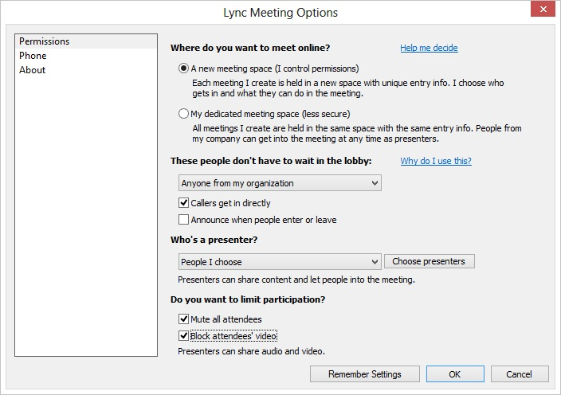

# Scheduling details for meetings in Lync Server 2013
[]
After checking to ensure that no other meeting is scheduled at the requested time, the large meeting support staff that handles the request schedules the meeting on the large-meeting pool. Use the Online Meeting Add-in for Lync that is installed with the Lync Server 2013 client to perform this task, using the credentials of a user enabled for Lync Server in the dedicated large-meeting pool. 
  
To ensure the best user experience, it is important to schedule the large meeting with the right access levels and meeting settings that are appropriate to the meeting organizer's needs. We recommend the following scheduling settings configured in Lync Meeting options:
  
- Use a new meeting space for each large meeting instead of reusing the dedicated meeting space. 
    
- Specify the meeting access level as follows:
    
  - If at least one invitee is external to the organization, set the meeting access type to **Anyone (no restrictions**. This enables you to avoid having to manage a potentially large lobby when the meeting is in progress.
    
  - If the meeting is an internal-only meeting, set the meeting access type to **Anyone from my organization**.
    
    > [!NOTE]
    > Avoid setting the meeting access type to **People I invite from my company** because when you use this setting, organizers must add all user email addresses to the invitee list and you cannot invite a distribution group. > Avoid setting the meeting access type to **Only me, the meeting organizer** because this setting requires that every meeting participant, including presenters, must be put in the lobby at meeting run time. The person responsible for running the large meeting must then constantly monitor the lobby roster and admit new users who are in the lobby. 
  
- Allow users who dial-in from phones to enter the meeting automatically by checking the **Callers get in directly** setting. 
    
- Explicitly invite the following users:
    
  - Meeting organizer and delegate (requester)
    
  - The list of presenters provided by a meeting requester
    
    > [!NOTE]
    > If the meeting access type is set to **People I choose**, you need to explicitly add each participant of a large meeting as an invitee of the meeting. 
  
- Explicitly manage presenters, instead of setting the presenter option to one of the auto-promote values. Be sure to add the following users as presenters:
    
  - Meeting organizer and delegate (requester)
    
  - The list of presenters provided by large meeting requesters
    
    > [!NOTE]
    > By explicitly managing presenters, you can control the number of presenters, so that you can limit presenters to a small enough number to make it possible to have an effective large meeting. If the majority of meeting participants have the attendee role, it helps reduce the chance of people accidentally taking control of the presentation, deleting a PowerPoint presentation, muting/unmuting presenters, and other disruptions to the meeting. 
  
-  Check the **Mute all attendees** setting to make sure that only presenters can broadcast audio into the meeting. 
    
- Check the **Block attendees' video** setting to make sure only presenters can broadcast video into the meeting. 
    
The following figure shows the recommended settings for the Online Meeting Add-in for Lync.
  

  

