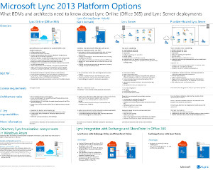

# Technical diagrams for Lync Server 2013
[]
 **Summary:** These diagrams provide visual representations of recommended solutions for Lync 2013. 
  
These resources are available in Visio (.vsd) format (Visio 2010 or Visio 2013) and PDF format. For information about how to print documents, see [Tips for printing posters](technical-diagrams.md#tips).
  
You might need additional software to view these files. See the following table for more information.
  
|**File type**|**Software**|
|:-----|:-----|
|.vsd    |Visio 2010, Visio 2013, or the [free Visio viewer](https://go.microsoft.com/fwlink/?LinkId=393676)   If you use the Visio viewer, right-click the VSD link, click **Save Target As**, save the file to your computer, and then open the file from your computer.    |
|.pdf    |Any PDF viewer, such as [Adobe Reader](https://go.microsoft.com/fwlink/?LinkId=393675)   |
|.zip    |Any file compression utility. Windows 7 and 8 open these files natively.    |
   
## Posters

These posters detail a specific technical area, and are intended to be used with corresponding articles on TechNet or content available on the download center. 
  
|**Title**|**Description**|
|:-----|:-----|
|**Lync Server 2013 On-Premises Architectures**   [Zoom into the poster in full detail with Zoom.it from Microsoft](https://go.microsoft.com/fwlink/?LinkId=392974)(best on desktop or laptop computers)    [PDF version](https://go.microsoft.com/fwlink/?LinkId=392578) (best for mobile devices or tablet computers)    [Visio version](https://go.microsoft.com/fwlink/?LinkId=392579) (best for users with Visio)    |Poster provides architectural guidance for planning and deployment. The poster contains information about common components of Lync Server, terminology used when planning a deployment, new features, server roles, and an installation overview. In addition the poster contains example architectures for increasing high availability and disaster recovery as well as small, medium, and large sample topologies.    Size: 34-by-44 inch    This poster was created using Visio 2013. No modification should be needed for a specific environment.    |
|**Lync Call Quality Methodology**   [Zoom into the poster in full detail with Zoom.it from Microsoft](https://go.microsoft.com/fwlink/?LinkId=392972)(best on desktop or laptop computers)    [Visio and PDF versions together in a .zip file](https://go.microsoft.com/fwlink/?LinkId=391841)   | Poster describing Lync system troubleshooting, especially for issues affecting enterprise voice quality. Use this poster with:    [Lync Server Networking Guide](https://go.microsoft.com/fwlink/p/?LinkID=390677)   [Lync Call Quality Methodology in Lync Server 2013](poster-lync-call-quality-methodology.md) (accessibility article)    [Key Health Indicators in Lync Server 2013](poster-key-health-indicators.md) (accessibility article)     Size: 34-by-44 inch     This poster was created using Visio 2010. No modification should be needed for a specific environment.    |
|**Key Health Indicators**   [Zoom into the poster in full detail with Zoom.it from Microsoft](https://go.microsoft.com/fwlink/?LinkId=392971)(best on desktop or laptop computers)    [Visio and PDF versions together in a .zip file](https://go.microsoft.com/fwlink/?LinkId=391838)   | Poster describing server troubleshooting metrics both for basic server health and for a given server's role in the Lync implementation. Use this poster with:    [Lync Server Networking Guide](https://go.microsoft.com/fwlink/p/?LinkID=390677)   [Lync Call Quality Methodology in Lync Server 2013](poster-lync-call-quality-methodology.md) (accessibility article)    [Key Health Indicators in Lync Server 2013](poster-key-health-indicators.md) (accessibility article)     Size: 17-by-22 inch     This poster was created using Visio 2010. No modification should be needed for a specific environment.    |
|**Lync 2013 Platform Options**   [Zoom into the poster in full detail with Zoom.it from Microsoft](https://go.microsoft.com/fwlink/p/?LinkId=391840)   [PDF version](https://go.microsoft.com/fwlink/p/?LinkId=391837) (best for mobile devices or tablet computers)    [Visio version](https://go.microsoft.com/fwlink/p/?LinkId=391839) (best for users with Visio)    |This poster describes the available platform options for Lync 2013 to BDMs and architects Customers can choose from Lync Online with Office 365, Hybrid Lync, Lync Server on-premises and Hosted Lync. The poster includes details of each architectural option, including the most ideal scenarios for each, the license requirements and IT Pro responsibilities.    Size: 34-by-44 inch    This poster was created using Visio 2013. No modification should be needed for a specific environment.    |
|**Microsoft Lync Server 2013 Protocol Workloads**   [Zoom into the poster in full detail with Zoom.it from Microsoft](https://go.microsoft.com/fwlink/?LinkId=392970)   [PDF version](https://go.microsoft.com/fwlink/?LinkId=392512) (best for mobile devices or tablet computers)    [Visio version](https://go.microsoft.com/fwlink/?LinkId=392513) (best for users with Visio)    |Download this poster to understand the capabilities and requirements of Lync 2013, Lync Phone, Lync Web App, Lync for Mac, and Lync Mobile w. See how Lync Server workloads facilitate communication across an organization.    Size: 24-by-36 inch    This poster was created using Visio 2013. No modification should be needed for a specific environment.    |
   
## Tips for printing posters

If you have a plotter, you can print these posters in their full size. If you don't have plotter, use the following steps to print on smaller paper.
  
### Print posters on smaller paper

1. Open the poster in Visio.
    
2. On the **File** menu, click **Page Setup**.
    
3. On the **Print Setup** tab, in the **Printer paper** section, select the size of paper you want to print on. 
    
4. On the **Print Setup** tab, in the **Print zoom** section, click **Fit to**, and then enter **1 sheet across by 1 sheet down**.
    
5. On the **Page Size** tab, click **Size to fit drawing contents**, and then click **OK**. 
    
6. On the **File** menu, click **Print**. 
    

