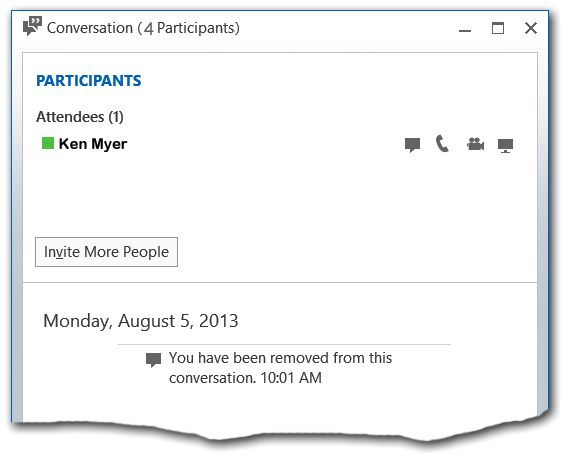
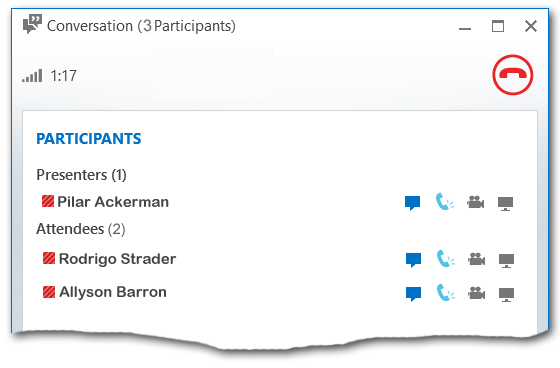

# Using Call Me At with a Lync-enabled phone and Lync Server 2013
[]
The Call Me At feature in Lync provides a way for users to join the audio portion of a conference by using a cell phone, "land line," or other device connected to the Public Switched Telephone Network (PSTN). When you attempt to join a meeting by using Lync, you will typically be presented with the **Join Meeting Audio** dialog box: 
  

  
If you select **Call me at**, you can then pick a phone number from the dropdown list. Lync Server 2013 will place a phone call to the selected number, and you can then use that phone to participate in the audio portion of the conference.
  
The dropdown list is populated by the phone numbers (for mobile phone, home phone, or other phone) that you have entered on the **Phones** tab in the **Lync - Options** dialog box: 
  

  
If you have not entered any phone numbers on the **Phones** tab then you will not have any numbers available in the dropdown box. However, you can always click **New Number** and have Lync Server dial out to any phone number you wish: 
  

  
The Call Me At feature works extremely well provided that you use it in the way it was intended: by having Lync Server call a PSTN phone number. However, you can run into a less-than-optimal experience if you ask Lync Server to call you at a Lync-enabled endpoint (for example, a phone in a conference room). Following is the issue you might run into, as well as two ways to work around the problem.
  
To begin, here's what happens when you provide the Call Me At feature with the phone number of a Lync-enabled phone. Suppose Ken Myer tries to join a meeting by having Lync Server call him at 1-206-555-1219, a Lync Server-enabled phone number. Ken will initially be connected to the meeting, but after a few seconds Lync will display the message **Call was not completed or has ended**, and Ken will appear to have been dropped from the meeting:
  

  
Notice, however, that there is a discrepancy within the Lync conversation window. Ken Myer is the only name listed under the **Participants** heading. However, if you look in the title bar of the window, you'll see that the conference contains a total of 4 participants. 
  
Likewise, if you look in the conversation window of any of the other conference participants you will not see Ken Myer listed anywhere:
  

  
And yet, at the same time, Ken Myer will be able to participate in the audio portion of the call by using his Lync-enabled phone. The Call Me At feature has actually worked, but the user experience is less than optimal.
  
There are at least two ways to work around this problem. If you have already joined a conference in this fashion (like Ken Myer did), you can typically resolve the issue by engaging in a different modality. For example, if you send an instant message the conversation window will now show all the conference participants, including yourself:
  

  
At this point you should be able to participate in the meeting in the expected fashion.
  
Alternatively, you can avoid this issue altogether by changing the way you join the meeting. If you need to have Lync Server call a Lync Server-enabled phone, you should begin by joining the meeting without an audio connection. To do that, select Don't join audio when presented with the Join Meeting Audio dialog box:
  

  
After you have successfully connected to the meeting, you can now "invite" the Lync Server-enabled phone to join the meeting as well. To do that, place the mouse over the People icon and then click **Invite More People**:
  

  
That will bring up the **Send an IM** dialog box. Ignore the dialog box title (you're not actually sending an instant message) and type the phone number of the Lync-enabled phone: 
  

  
After you click **OK**, Lync Server will call the number entered in the dialog box. When the connection is made, you will have full audio capabilities through the Lync-enabled phone, and you will be able to see and interact with the full conference roster.
  

