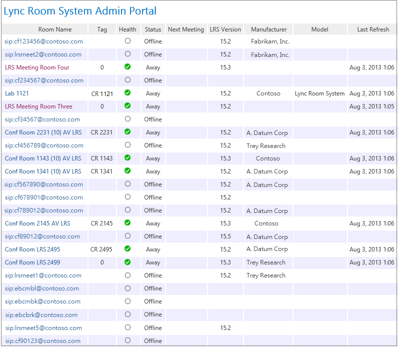

# Using the Lync Room System Administrative Web Portal in Lync Server 2013
[]
 **In this article**
  
[Sign in](#sectionSection0)
  
[LRS Administrative Web Portal Summary Page](#sectionSection1)
  
[LRS Room Information](#sectionSection2)
  
[Additional Notes about the Administrative Web Portal](#sectionSection3)
  
[Frequently Asked Questions](#sectionSection4)
  
After you deploy LRS on the server, you can check the status of all LRS rooms by signing into the LRS Administrative Web Portal from a browser.
  
## Sign in

1. Browse to the following URL:
    
    https://\<fe-server\>/lrs
    
2. Enter the credentials for the LRSSupport account or an account that has been added to the LRSSupportAdminGroup security group.
    

  
## LRS Administrative Web Portal Summary Page

The summary page provides the following information for all of the LRS rooms deployed on the server:
  
- **Tag** The custom name that the administrator gives to the room. The Tag can be set in the portal by clicking on the room name. 
    
- **Health** The health status of the room, which is derived from the Aggregate Health status of the room, which is shown under the Health section of the Room Settings page. 
    
- **Next Meeting** The date and time the next meeting is scheduled. 
    
- **LRS Version, Manufacturer, Model** These values are preset in LRS. Depending on the manufacturer, these fields might be left blank. 
    
- **Last Refresh** Displays the last time the webpage was refreshed. 
    

  
## LRS Room Information

The Room Info section of the portal allows you to view and configure individual LRS rooms. It contains four sections: Settings, Details, Troubleshooting, and Health.
  
### Settings

In the Settings section, you can set the password, room tag, and default volume levels for the room. If you configure these settings, the changes are replicated only after you restart the LRS console. You will only see System Updates settings for Lync Room Systems that are version 15.12 and later.
  

  
### Details

The Details section provides a read-only summary of the LRS room's settings, including: the time of last refresh; next meeting; last updates, maintenance and calibration; default speaker, mic, and ringer settings; version; SIP URI; number of screens and details about each screen; status, and activity.
  

  
### Troubleshooting

The Troubleshooting section can be used to remotely collect logs and save them to a specified location. You can also restart the LRS console (LRS user interface) or restart the entire system. To collect logs, provide a folder path in the specified format and make sure that the folder has write permissions given to the LRS machine account. If the log size is too big, it can take up to 5 minutes to finish collecting logs. Refreshing the page will give you the latest status.
  

  
### Health

The Health section gives a visual indication of the health of the Lync Server connection, audio device, video device, resiliency state, and screen device.
  

  
## Additional Notes about the Administrative Web Portal

> [!NOTE]
>  Setting changes are applied only after the LRS system is restarted. >  If the LRSApp account password expires, you will not be able to see the status of the rooms. Configure the LRSAppuser account password so that it never expires, or be sure to update the password when it's near expiration. >  The LRS administrative web portal is supported for on-premises deployments only. > 
  
## Frequently Asked Questions

### Why can't I sign in to the administrative web portal?

- When you open https://localhost/lrs, you will be able to see the sign in page, but when you type in your credentials, you cannot sign in. In this case, you must open https://FQDNofFEserver/lrs to sign in to the administrative web portal.
    
- If the machine from which you are accessing the administrative web portal is in a workgroup, "http://" will not work. Use "https" instead.
    
### Why can't I see LRS in the administrative web portal?

- Make sure you have LRS accounts in your deployment and that they are created according to the LRS Administrative Web Portal deployment recommendations. Make sure the LRS accounts are provisioned using Enable-CsMeetingRoom, not Enable-CsUser, on the Lync server.
    
- If you have created LRS accounts and cannot see the accounts in administrative web portal, collect the server logs by using the Lync Server Logging tool with the **MeetingPortal** component selected, and then send them to your LRS support contact. 
    
### Why can't I see the status of LRS in the administrative web portal?

- Make sure that the LRSApp user account is SIP-enabled.
    
- If you are still having issues, collect the **Trace.log** file in the LRS system from D:\Tracing\LRSAdminLogs\, and then send it to your LRS support contact. 
    

