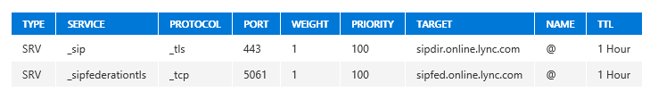

# Configure Cloud Connector integration with your Office 365 tenant
 
Learn how to configure Cloud Connector integration with your Office 365 tenant.
  
Once the Skype for Business Cloud Connector Edition installation is complete, perform the steps in this section to configure your deployment and connect it to your Office 365 tenant.
  
## Configure firewall settings

Configure the firewall settings for your internal and external firewall settings for you perimeter network to open the required ports as described in [Ports and protocols](plan-skype-for-business-cloud-connector-edition.md#BKMB_Ports) in [Plan for Skype for Business Cloud Connector Edition](plan-skype-for-business-cloud-connector-edition.md).
  
## Set up Public Switched Telephone Network (PSTN) gateways

Set up trunks on each PSTN gateway to point back to Mediation Servers for all appliances. Because the pool FQDN is the same for all servers in the pool, each trunk should point to one Mediation Server FQDN or IP address instead of the Mediation Server pool FQDN. Trunks should be set in the same priority.
  
If you are using TLS between Mediation Servers and gateways, you will need to configure the gateways and Mediation Servers to support MTLS as follows:
  
1. Export the Root CA from the Cloud Connector Active Directory computer.
    
2. Follow the PSTN gateway vendor instructions for importing the Root CA.
    
3. Import the Root CA certificate for the certificate issued to your gateway on the Mediation Servers. If you need to obtain an SSL certificate for the gateway, you may do this using the Certificate Authority service running on the Cloud Connector Active Directory computer as follows:
    
   - Modify the existing Web Server template to enable Authenticated users to enroll, or create a new Web Server template to configure other properties and enable Authenticated users to enroll. For detailed instructions, see [Certificate Templates](https://technet.microsoft.com/en-us/library/cc730705.aspx).
    
   - Request a certificate using Certificate snap-in selecting the Web Server template that you have enabled. Be sure to add Common name in Subject and DNS name in Alternative name with FQDN of the gateway, and confirm on the Private Key that Make private key exportable is selected under key options. 
    
4. Export the SSL certificate with Private key and follow the instructions from your PSTN gateway vendor for importing the certificate.
    
## Update the domain for your tenant

Make sure that you've completed the steps to update your domain in Office 365 and have the ability to add DNS records. For more information about how to set up your domain in Office 365, see [Add a domain to Office 365](https://support.office.com/en-us/article/Add-a-domain-to-Office-365-6383f56d-3d09-4dcb-9b41-b5f5a5efd611).
  
## Add DNS records in Office 365 for your Edge

Add the following DNS records to your Office 365 tenant. For information about how to add DNS records to your Office 365 tenant, see [Add or edit custom DNS records in Office 365](https://support.office.com/en-us/article/Add-or-edit-custom-DNS-records-in-Office-365-AF00A516-DD39-4EDA-AF3E-1EAF686C8DC9?ui=en-US&amp;rs=en-US&amp;ad=US&amp;fromAR=1).
  
1. Add a DNS A record for Access Edge.
    
2. SRV records will automatically be created by Office 365 and the deployment scripts. Confirm that you can look up the following two SIP services on the Edge: _sip and _sipfederationtls.
    
     
  
## Set up hybrid connectivity between Cloud Connector Edition and Office 365

To configure hybrid connectivity between your Skype for Business Cloud Connector Edition deployment and your Office 365 tenant, run the following cmdlet in a remote PowerShell session. To learn how to establish a remote PowerShell session, see: [Set up your computer for Windows PowerShell](https://technet.microsoft.com/en-us/library/dn362831%28v=ocs.15%29.aspx).
  
The cmdlet sets the Access Edge external FQDN. In the first of the commands, the \<External Access Edge FQDN\> should be the one for the SIP Access Edge role. By default, this should be ap.\<Domain Name\>.
  
```
Set-CsTenantHybridConfiguration -PeerDestination <External Access Edge FQDN> -UseOnPremDialPlan $false
Set-CsTenantFederationConfiguration -SharedSipAddressSpace $True
```

> [!NOTE]
> The External Access Edge FQDN used for Peer Destination should be set to a PSTN site that will only be used as a fallback in case a user isn't assigned to a PSTN site. For more information, see [Deploy a single site in Cloud Connector](deploy-a-single-site-in-cloud-connector.md) and [Deploy multiple sites in Cloud Connector](deploy-multiple-sites-in-cloud-connector.md). 
  
## Set up PSTN gateways

Set up trunks on each PSTN gateway to point back to Mediation Servers for all appliances. Each trunk should point to one Mediation Server FQDN or IP address instead of the Mediation Server pool FQDN because the pool FQDN is the same for all servers in the pool. Trunks should be set in the same priority.
  
If you are using TLS between Mediation Servers and gateways, you will need to configure the gateways and Mediation Servers to support MTLS as follows:
  
1. Export the Root CA from the Cloud Connector Active Directory computer.
    
2. Follow the PSTN gateway vendor instructions for importing the Root CA.
    
3. Import the Root CA certificate for the certificate issued to your gateway on the Mediation Servers. If you need to obtain an SSL certificate for the gateway, you may do this using the Certificate Authority service running on the Cloud Connector Active Directory computer as follows:
    
   - Modify the existing Web Server template to enable Authenticated users to Enroll, or create a new Web Server template to configure other properties and enable Authenticated users to enroll. For detailed instructions, see [Certificate Templates](https://technet.microsoft.com/library/cc730705.aspx).
    
   - Request a certificate using Certificate snap-in selecting the Web Server template that you have enabled. Be sure to add Common name in Subject and DNS name in Alternative name with FQDN of the gateway, and confirm on the Private Key that Make private key exportable is selected under key options. 
    
4. Export the SSL certificate with Private key and follow the instructions from your PSTN gateway vendor for importing the certificate.
    
5. PSTN gateway(s) in one PSTN site should only connect to the Mediation Server(s) in the same site.
    
## Set up your users in Office 365

Log in to the Office 365 admin portal, add the users that will be enabled for online voice services, and assign an E5 license or Phone System in Office 365 add-on to the E3 license to these users. For information about adding users, see [Add users to Office 365 for business](https://support.office.com/en-US/article/Add-users-to-Office-365-for-business-435ccec3-09dd-4587-9ebd-2f3cad6bc2bc).
  
## Enable users for Phone System in Office 365 voice and voicemail services

After adding your users to Office 365, enable their accounts for Phone System in Office 365 voice services, including voicemail. To enable these capabilities, you must log in to your Office 365 tenant with an account that is an Office 365 Global Administrator role, and be able to run remote PowerShell. To learn how to establish a remote PowerShell session, see: [Set up your computer for Windows PowerShell](https://technet.microsoft.com/en-us/library/dn362831%28v=ocs.15%29.aspx)
  
- Assign the policy to your user and configure the user's business voice phone number, which you specify with the value of the **Identity** parameter:
    
  ```
  Set-CsUser -Identity "<User name>" -EnterpriseVoiceEnabled $true -HostedVoiceMail $true -OnPremLineURI <tel:+phonenumber>
  ```

    > [!NOTE]
    > You can also specify a user's Identity by their SIP address, User Principal name (UPN), domain name and username (domain\username), and display name in Active Directory ("Bob Kelly"). 
  
You can then verify that the users were added and enabled using the following script:
  
```
# Input the user name you want to verify
$user = Get-CsOnlineUser <User name>

# For a hybrid user, the value of $user.EnterpriseVoiceEnabled should be True
$user.EnterpriseVoiceEnabled

# For a hybrid user, the value of $user.HostedVoiceMail should be True
$user.HostedVoiceMail

# For a hybrid user, the value of $user.VoicePolicy should be "HybridVoice"
$user.VoicePolicy
```

You'll need to decide whether your users should be able to make international calls. By default, international calling is enabled. You can disable or enable users for international dialing using the online Skype for Business admin center.
  
To disable international calling on a per user basis, run the following cmdlet in Skype for Business Online PowerShell:
  
```
Grant-CsVoiceRoutingPolicy -PolicyName InternationalCallsDisallowed -Identity $user
```

To re-enable international calling on a per user basis after it has been disabled, run the same cmdlet, but change the value for **PolicyName** to *InternationalCallsAllowed*  .
  
## Assign users to PSTN sites

Use tenant remote PowerShell to assign a site to users even if you only deployed a single site. To learn how to establish a remote PowerShell session, see: [Set up your computer for Windows PowerShell](https://technet.microsoft.com/en-us/library/dn362831%28v=ocs.15%29.aspx).
  
```
# Set the site to users
Set-CsUserPstnSettings -Identity <User Name> -HybridPstnSite <PSTN Site Name>

# Review the site setting for a user
Get-CsUserPstnSettings -Identity <User Name> 

# See all the user settings in one tenant
Get-CsOnlineUser | Get-CsUserPstnSettings
```

> [!NOTE]
> If no PSTN site is assigned to a user, hybrid connectivity between your Skype for Business Cloud Connector Edition deployment and your Office 365 tenant will fall back to use the tenant level default one (Peer Destination) so that calls can be completed. 
  
## Configure online hybrid Mediation Server Settings
<a name="BKMK_ConfigureMediationServer"> </a>

When a P2P call is escalated to a PSTN conference, the Skype for Business Online conferencing server will send an invite to the Cloud Connector Mediation Server. To ensure that Office 365 can route this invite successfully, you need to configure a setting in your online tenant for each Cloud Connector Mediation Server as follows: 
  
1. Create a user in the Office 365 admin portal. Use any user name you want, such as "MediationServer1."
    
    Use the default SIP domain of Cloud Connector (the first SIP domain in the .ini file) as the user domain.
    
    Please note that license assignment is only required for the user propagation into the Skype for Business online directory. Assign an Office 365 licenses (such as E5) to the account you create, allow up to one hour for the changes to propagate,verify the user accounts has been provisioned correctly to the Skype for Business online directory by running following cmdlet, then remove the license from this account.
    ```
   Gets-CsOnlineUser -Identity <UserPrincipalName>
   ```
    
2. Start a tenant Azure AD remote PowerShell session using your global or user admin credentials, and then run the following cmdlet to set the department for the Azure AD user account configured in step 1 to "HybridMediationServer":

   ```
   Set-MsolUser -UserPrincipalName <UserPrincipalName> -Department "HybridMediationServer"
   ```

3. Start a tenant Skype for Business remote PowerShell session using your Skype for Business tenant admin credentials, and then run the following cmdlet to set the Mediation Server and Edge Server FQDN to that user account, replacing \<DisplayName\> with the Display Name of the user for the account you created in step 1:
    
   ```
   Set-CsHybridMediationServer -Identity <DisplayName> -Fqdn <MediationServerFQDN> -AccessProxyExternalFqdn <EdgeServerExternalFQDN>
   ```

    For Identity, use the Display Name of the Office 365 user account you created for this Mediation Server.
    
    For  *MediationServerFQDN*  , use the internal FQDN defined for your Mediation Server.
    
    For  *EdgeServerExternalFQDN*  , use the external FQDN defined for Edge Server Access Proxy. If there are multiple Cloud Connector PSTN sites, choose the Edge Server Access Proxy FQDN assigned to the site where the Mediation Server is located.
    
4. If there are multiple Cloud Connector Mediation Servers (multiple-site, HA), please repeat the previous steps for each of them.
    

