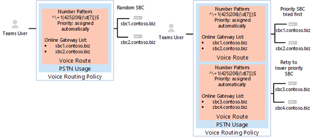
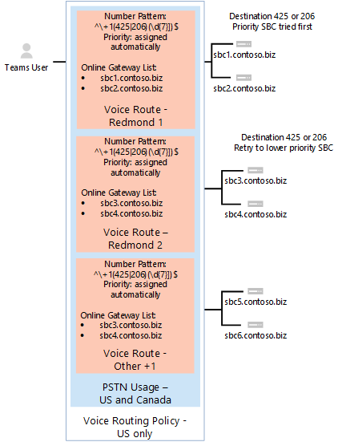
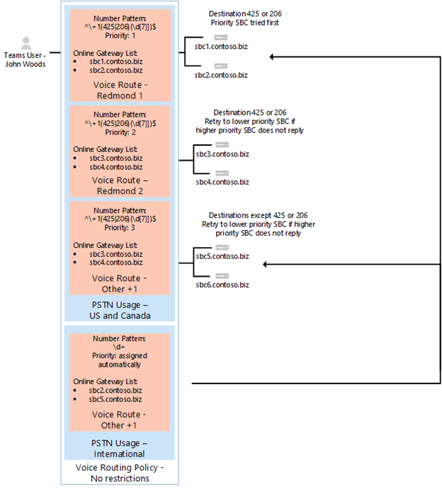
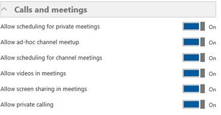

# Configure Direct Routing

If you have not already done so, read [Plan Direct Routing](plan-direct-routing.md) for prerequisites and to review  other steps you’ll need to take before you configure your Microsoft Phone System network. 

  > [!NOTE]
  > This document is intended for IT professionals.  

This article describes how to configure Microsoft Phone System Direct Routing. It details how to pair a supported Session Border Controller (SBC) to Direct Routing and how to configure Microsoft Teams users to use Direct Routing to connect to the Public Switched Telephone Network (PSTN). To complete the steps explained in this article, administrators need some familiarity with PowerShell cmdlets. For more information about using PowerShell, see [Using Windows PowerShell to manage Skype for Business Online](https://technet.microsoft.com/library/dn362831.aspx). 

We recommend that you confirm that your SBC has already been configured as recommended by your SBC vendor's: 

- AudioCodes deployment documentation 
- Ribbon deployment documentation

You can configure your Microsoft Phone System and enable  users to use Direct Routing, then set up Microsoft Teams as the preferred calling client by completing the following procedures: 

- [Pair the SBC with a Microsoft Phone System and validate the pairing](#pair-the-sbc-to-direct-routing-service-of-phone-system)
- [Enable users for Direct Routing Service](#enable-users-for-direct-routing-service)
- [Ensure that Microsoft Teams is the preferred calling client for the users](#set-microsoft-teams-as-the-preferred-calling-client-for-the-users) 

## Pair the SBC to Direct Routing Service of Phone System 

The following are the three high-level steps to let you connect, or pair, the SBC to the Direct Routing interface: 

- Connect to **Skype for Business Online** admin center using PowerShell 
- Pair the SBC 
- Validate the pairing 

### Connect to  Skype for Business Online by using PowerShell 

You can use a PowerShell session connected to the tenant to pair the SBC to the Direct Routing interface. To open a PowerShell session, please follow the steps outlined in [Using Windows PowerShell to manage Skype for Business Online](https://technet.microsoft.com/library/dn362831.aspx). 
 
After you establish a remote PowerShell session, please validate that you can see the commands to manage the SBC. To validate the commands, type or copy/paste in the following in the PowerShell session and press Enter: 

```
gcm *onlinePSTNGateway*
```

Your command will return the four functions shown here that will let you manage the SBCs. 

~~~~    
CommandType    Name                       Version    Source 
-----------    ----                       -------    ------ 
Function       Get-CsOnlinePSTNGateway    1.0        tmp_v5fiu1no.wxt 
Function       New-CsOnlinePSTNGateway    1.0        tmp_v5fiu1no.wxt 
Function       Remove-CsOnlinePSTNGateway 1.0        tmp_v5fiu1no.wxt 
Function       Set-CsOnlinePSTNGateway    1.0        tmp_v5fiu1no.wxt
 
PS C:\windows\System32\WindowsPowershell\v1.0> 
~~~~    


### Pair the SBC to the tenant 

To pair the SBC to the tenant, in the PowerShell session, type the following and press Enter: 

```
New-CsOnlinePSTNGateway -Fqdn <SBC FQDN> -SipSignallingPort <SBC SIP Port> -MaxConcurentSessions <Max Concurrent Session which SBC capable handling> -Enabled $true 
```
  > [!NOTE]
  > 1. We highly recommend setting a limit for the SBC, using information that can be found in the SBC documentation. The limit will trigger a notification if SBC is at the capacity level.
  > 2. You can only pair the SBC with FQDN, where the domain portion of the name matches one of the domains registered in your tenant, except \*.onmicrosoft.com. Using \*.omicrosoft.com domain names is not supported for the SBC FQDN names. For example, if you have two domain names:<br/><br/>
  > **abc**.xyz<br/>**abc**.onmicrosoft.com<br/><br/>
  > For the SBC name, you can use the name sbc.abc.xyz. If you try to pair the SBC with a name sbc.xyz.abc, the system will not let you, as the domain is not owned by this tenant.

```
PS C:\> New-CsOnlinePSTNGateway -Identity sbc.contoso.com -Enabled $true -SipSignallingPort 5067 -MaxConcurrentSessions 100 
 
Identity              : sbc.contoso.com 
Fqdn                  : sbc.contoso.com 
SipSignallingPort     : 5067 
FailoverTimeSeconds   : 10 
ForwardCallHistory    : False 
ForwardPai            : False 
SendSipOptions        : True 
MaxConcurrentSessions : 100 
Enabled               : True 

PS C:\>  
```
There are additional options that can be set during the pairing. In the previous example, however, only the minimum required parameters are shown. 
 
The following table lists the additional parameters that you can use in setting parameters for *New-CsOnlinePstnGateway*. 

|**Required?**|**Name**|**Description**|**Default**|**Possible values**|**Type and restrictions**|
|:-----|:-----|:-----|:-----|:-----|:-----|
|Yes|FQDN|The FQDN name of the SBC |None|NoneFQDN name, limit 63 characters|String,  list of allowed and disallowed characters on [Naming conventions in Active Directory for computers, domains, sites, and OUs](https://support.microsoft.com/en-us/help/909264)|
|No|MediaBypass |The parameter reserved for future use. Parameter indicated of the SBC supports Media Bypass and the administrator wants to use it.|None|True<br/>False|Boolean|
|Yes|SipSignallingPort |Listening port used for communicating with Direct Routing services by using the Transport Layer Security (TLS) protocol.|None|Any port|0 to 65535 |
|No|FailoverTimeSeconds |When set to **True**, outbound calls that are not answered by the gateway within 10 seconds are routed to the next available trunk; if there are no additional trunks, then the call is automatically dropped. In an organization with slow networks and gateway responses, that could potentially result in calls being dropped unnecessarily. The default value is **True**.|True|True<br/>False|Boolean|
|No|ForwardCallHistory |Indicates whether call history information will be forwarded through the trunk. If enabled, the Office 365 PSTN Proxy sends two headers: History-info and Referred-By. The default value is **False** ($False). |False|True<br/>False|Boolean|
|No|ForwardPAI|Indicates whether the P-Asserted-Identity (PAI) header will be forwarded along with the call. The PAI header provides a way to verify the identity of the caller. The default value is **False** ($False).|False|True<br/>False|Boolean|
|No|SendSIPOptions |Defines if an SBC will or will not send the SIP options. If disabled, the SBC will be excluded from Monitoring and Alerting system. We highly recommend that you enable SIP options. Default value is **True**. |True|True<br/>False|Boolean|
|No|MaxConcurrentSessions |Used by alerting system. When any value is set, the alerting system will generate an alert to the tenant administrator when the number of concurrent session is 90% or higher than this value. If parameter is not set, the alerts are not generated. However, the monitoring system will report number of concurrent session every 24 hours. |Null|Null<br/>1 to 100,000 ||
|No|Enabled*|Used to enable this SBC for outbound calls. Can be used to temporarily remove the SBC, while it is being updated or during maintenance. |False|True<br/>False|Boolean|
 
### Verify the SBC pairing 

Verify the connection: 
- Check if the SBC is on the list of paired SBCs. 
- Validate SIP Options. 
 
#### Validate if SBC is on the list of paired SBCs 

After you pair the SBC, validate that the SBC is present in the list of paired SBCs by running the following command  in a remote PowerShell session: `Get-CSOnlinePSTNGateway`

The paired gateway should appear in the list as shown in the example belwow, and verify that the parameter *Enabled* displays the value **True**.

 ```
C:> Get-CsOnlinePSTNGateway -Identity sbc.contoso.com  
 
Identity              : sbc.contoso.com  
Fqdn                  : sbc.contoso.com 
SipSignallingPort     : 5067 
CodecPriority         : SILKWB,SILKNB,PCMU,PCMA 
ExcludedCodecs        :  
FailoverTimeSeconds   : 10 
ForwardCallHistory    : False 
ForwardPai            : False 
SendSipOptions        : True 
MaxConcurrentSessions : 100 
Enabled               : True 

C:\> 
```

#### Validate SIP Options flow 

To validate the pairing using outgoing SIP Options, use the SBC management interface and see that the SBC get 200 OK responses to the outgoing OPTIONS.
  
When Direct Routing sees incoming OPTIONS, it will start sending outgoing options to the SBC FQDN configured in the Contact header field in the incoming OPTIONS message. 

To validate the pairing using incoming SIP Options, use the SBC management interface and see that the SBC gets reply on the OPTIONS messages coming in from Direct Routing and that the response code is 200 OK.  

## Enable users for Direct Routing Service 

When you are ready to enable users for the Direct Routing Service, follow these steps: 

1. Create a user in Office 365 and assign a phone system license. 
2. Ensure that the user is homed in Skype for Business Online. 
3. Configure the phone number and enable enterprise voice and voicemail. 
4. Configure voice routing. The route is automatically validated.  

### Create a user in Office 365 and assign the license 

There are two options for creating a new user in Office 365. However, we recommend that your organization select and use one option to avoid routing issues: 

- Create the user in on-premise Active Directory and sync the user to the cloud. See [Integrate your on-premises directories with Azure Active Directory](https://docs.microsoft.com/en-us/azure/active-directory/connect/active-directory-aadconnect).  
- Create the user directly in the Office 365 Administrator Portal. See [Add users individually or in bulk to Office 365 - Admin Help](https://support.office.com/en-us/article/Add-users-individually-or-in-bulk-to-Office-365-Admin-Help-1970f7d6-03b5-442f-b385-5880b9c256ec). 

  If you build the system that co-exists with Skype for Business 2015 or Lync 2010/2013 on-premises, the only supported option is to create the user in on-premises Active Directory and sync the user to the cloud (Option 1). 

Required licenses: 

- Office 365 Enterprise E3 (including SfB Plan2, Exchange Plan2, and Teams) + Phone System  
- Office 365 Enterprise E5  (including SfB Plan2, Exchange Plan2, Teams, and Phone System) 

Optional licenses: 

- Calling Plan 
- Audio Conferencing 

### Ensure that the user is homed in Skype for Business Online 

Direct Routing requires the user to be homed in Skype for Business Online. You can check this by looking at the RegistrarPool parameter. It needs to have a value in the infra.lync.com domain.

1. Connect to remote PowerShell.
2. Issue the command: 

    ```Get-CsOnlineUser -Identity "<User name>" | fl RegistrarPool``` 

### Configure the phone number and enable enterprise voice and voicemail 

After you have created the user and assigned a license, the next step is to configure their phone number and voicemail. This can be done in one step. 

To add the phone number and enable for voicemail:
 
1. Connect to a remote PowerShell session. 
2. Enter the command: 
    
    ```Set-CsUser -Identity "<User name>" -EnterpriseVoiceEnabled $true -HostedVoiceMail $true -OnPremLineURI tel:+ phone number```

For example, to add a phone number for user “Spencer Low,” you would enter the following: 

```Set-CsUser - “Spencer Low" -OnPremisLineURI tel:+14255388797 -EnterpriseVoiceEnabled $true -HostedVoiceMail $true```

The phone number used has to be configured as a full E.164 phone number with country code. 

  > [!NOTE]
  > If the user’s phone number is managed on premises, use on-premises Skype for Business Management Shell or Control Panel to configure the user's phone number. 

### Configure Voice Routing 

Microsoft Phone System has a routing mechanism that allows a call to be sent to a specific SBC based on: 

- Called number pattern 
- Called number pattern + Specific User who makes the call
 
SBCs can be designated as active and backup. That means when the SBC that is configured as active for this number pattern, or number pattern + specific user, is not available, then the calls will be routed to a backup SBC.
 
Call routing is made up of the following elements: 
- Voice Routing Policy – container for PSTN Usages; can be assigned to a user or to multiple users 
- PSTN Usages – container for Voice Routes and PSTN Usages; can be shared in different Voice Routing Policies 
- Voice Routes – number pattern and set of Online PSTN Gateways to use for calls where calling number matches the pattern 
- Online PSTN Gateway - pointer at SBC, also stores the configuration that is applied when call is placed via the SBC, such as forward P-Asserted-Identity (PAI) or Preferred Codecs; can be added to Voice Routes 

#### Creating a voice routing policy with one PSTN Usage 

The following diagram shows two examples of voice routing policies in call flow.

**Call Flow 1 (on the left):** If a user makes a call to  +1 425 XXX XX XX or +1 206 XXX XX XX, the call is routed  to SBC sbc1<span></span>.contoso.biz or sbc2<span></span>.contoso.biz. If neither sbc1<span></span>.contoso.biz nor sbc2<span></span>.contoso.biz are available, the call is dropped. 

**Call Flow 2 (on the right):** If a user makes a call to  +1 425 XXX XX XX or +1 206 XXX XX XX, the call is first routed to SBC sbc1<span></span>.contoso.biz or sbc2<span></span>.contoso.biz. If neither SBC is available, the route with lower priority will be tried (sbc3<span></span>.contoso.biz and sbc4<span></span>.contoso.biz). If none of the SBCs are available, the call is dropped. 



In both examples, while the Voice Route is assigned priorities, the SBCs in the routes are tried in random order.

  > [!NOTE]
  > Unless the user also has a Microsoft Calling Plan license, calls to any number except numbers matching the patterns + +1 425 XXX XX XX or +1 206 XXX XX XX in the example configuration are dropped. If the user has a Calling Plan license, the call is automatically routed according to the policies of  the Microsoft Calling Plan. 

The Microsoft Calling Plan applies automatically as the last route to all users with the Microsoft Calling Plan license and does not require additional call routing configuration.

In the example shown in the following diagram, a voice route is added to send calls to all other US and Canadian number (calls that go to called number pattern +1 XXX XXX XX XX).



For all other calls, if a user has both licenses (Microsoft Phone System and Microsoft Calling Plan), Automatic Route is used. If nothing matches the number patterns in the administrator-created online voice routes, route via Microsoft Calling Plan.

If the user has only Microsoft Phone System, the call is dropped because no matching rules are available.

  > [!NOTE]
  > The Priority value for route “Other +1” doesn’t matter in this case, as there is only one route that matches the pattern +1 XXX XXX XX XX. If a user makes a call to +1 324 567 89 89 and both sbc5.contoso.biz and sbc6.contoso.biz are unavailable, the call is dropped.

The following table summarizes the configuration using three voice routes. In this example, all three routes are part of the same PSTN Usage “US and Canada”.

|**PSTN usage**|**Voice route**|**Number pattern**|**Priority**|**SBC**|**Description**|
|:-----|:-----|:-----|:-----|:-----|:-----|
|US only|“Redmond 1”|^\\+1(425\|206)(\d{7})$|1|sbc1<span></span>.contoso.biz<br/>sbc2<span></span>.contoso.biz|Active route for called numbers +1 425 XXX XX XX or +1 206 XXX XX XX|
|US only|“Redmond 2”|^\\+1(425\|206)(\d{7})$|2|sbc3<span></span>.contoso.biz<br/>sbc4<span></span>.contoso.biz|Backup route for called numbers +1 425 XXX XX XX or +1 206 XXX XX XX|
|US only|"Other +1”|^\\+1(\d{10})$|3|sbc5<span></span>.contoso.biz<br/>sbc6<span></span>.contoso.biz|Route for called numbers +1 XXX XXX XX XX (except +1 425 XXX XX XX or +1 206 XXX XX XX)|
|||||||

**[Sentence unclear - missing a verb?]**All routes associated with the PSTN Usage “US and Canada” and the PSTN Usage associated with the Voice Routing Policy “US Only.” In this example, the voice routing policy is assigned to user Spencer Low.

#### Examples of call routes

In the following example,  we demonstrate how to configure Routes, PSTN Usages, and Routing policies, and we assign the policy to the user.

**Step 1:** Create PSTN Usage “US and Canada.”

In a  Skype for Business Remote PowerShell session, type:

   ```Set-CsOnlinePstnUsage  -Identity Global -Usage @{Add="US and Canada"}```

Validate that the usage was created: ```Get-CSOnlinePSTNUsage```
   
  > [!TIP]
  > If you have several PSTN Usage designs, the names of the PSTN Usages might truncate when you use the Get-. To get the names without truncation, use the command: ```(Get-CSOnlinePSTNUsage).Usage```

The following example shows the result of running the PowerShell command ```Get-CSOnlinePSTNUsage``` and displays with the truncated names: 
    
  ```
  PS C:\windows\System32\WindowsPowerShell\v1.0> Get-CsOnlinePstnUsage
  
  Identity	: Global
  Usage    	: {testusage, US and Canada, International, karlUsage. . .}
  
  PS C:\windows\System32\WindowsPowerShell\v1.0>
  ```

In the example below, you can see the result of the running the PowerShell command *(Get-CSOnlinePSTNUsage).usage* with full names displayed (not truncated).    

 
  ```
  PS C:\windows\System32\WindowsPowerShell\v1.0> (Get-CsOnlinePstnUsage).usage
  testusage
  US and Canada
  International
  karlUsage
  New test env
  Tallinn Lab Sonus
  karlUsage2
 Unrestricted
  Two trunks
  PS C:\windows\System32\WindowsPowerShell\v1.0> 
  ```

**Step 2:** In a PowerShell session in Skype for Business Online, create three routes, Redmond 1, Redmond 2, and Other+1, as detailed in the previous table:

To create the “Redmond 1” route, enter:

  ```
  New-CsOnlineVoiceRoute -Identity "Redmond 1" -NumberPattern "^+1(425|206)
  (\d{7})$" -OnlinePstnGatewayList sbc1.contoso.biz, sbc2.contoso.biz -Priority 1 -OnlinePstnUsages "US and Canada"
  ```


```
PS C:\windows\System32\WindowsPowerShell\v1.0> New-CsOnlineVoiceRoute -Identity "Redmond 1" -NumberPattern "^\+1(425|206) (\d{7})$" -OnlinePstnGatewayList sbc1.contoso.biz, sbc2.contoso.biz -Priority 1 -OnlinePstnUsages "US and Canada"

Identity                : Redmond 1
Priority       		: 1
Description	 	:
NumberPattern 		: ^\+1(425|206) (\d{7})$
OnlinePstnUsages 	: {US and Canada}
OnlinePstnGatewayList	: {sbc1.contoso.biz, sbc2.contoso.biz}
Name		 	: Redmond 1
SuppressCallerId	:
AlternateCallerId	:
```
To create the Redmond 2 route, enter:

```
New-CsOnlineVoiceRoute -Identity "Redmond 2" -NumberPattern "^\+1(425|206)
(\d{7})$" -OnlinePstnGatewayList sbc3.contoso.biz, sbc4.contoso.biz -Priority 2 -OnlinePstnUsages "US and Canada"
```

To create the Other +1 route, enter:

```
New-CsOnlineVoiceRoute -Identity "Other +1" -NumberPattern "^\+1(\d{10})$"
-OnlinePstnGatewayList sbc5.contoso.biz, sbc6.contoso.biz -OnlinePstnUsages "US and Canada"
```

  > [!CAUTION]
  > Make sure that your regular expression in the NumberPattern attribute is a valid expression. You can test it using this website: [https://www.regexpal.com](https://www.regexpal.com)

In some cases there is a need to route all calls to the same SBC; please use -NumberPattern “.*”

- Route all calls to same SBC

    ```
    Set-CsOnlineVoiceRoute -id "Redmond 1" -NumberPattern "." 
     -OnlinePstnGatewayList sbc1.contoso.biz
    ```

Validate that you’ve correctly configured the route by running this PowerShell command: 

  ```
  Get-CSOnlineVoiceRoute
  ```

This example shows how to verify the configuration you’ve just made:

```
PS C:\windows\System32\WindowsPowerShell\v1.0> New-CsOnlineVoiceRoute | Where-Object {($_.priority -eq 1) -or ($_.priority -eq 2) or ($_.priority -eq 4) -Identity "Redmond 1" -NumberPattern "^\+1(425|206) (\d{7})$" -OnlinePstnGatewayList sbc1.contoso.biz, sbc2.contoso.biz -Priority 1 -OnlinePstnUsages "US and Canada"

Identity	    		: Redmond 1 
Priority       		: 1
Description	 	: 
NumberPattern 		: ^\+1(425|206) (\d{7})$
OnlinePstnUsages 	: {US and Canada}	 
OnlinePstnGatewayList	: {sbc1.contoso.biz, sbc2.contoso.biz}
Name		 	: Redmond 1
Identity		: Redmond 2 
Priority       		: 2
Description	 	: 
NumberPattern 		: ^\+1(425|206) (\d{7})$
OnlinePstnUsages 	: {US and Canada}	 
OnlinePstnGatewayList	: {sbc3.contoso.biz, sbc4.contoso.biz}
Name		 	: Redmond 2
    
Identity		: Other +1 
Priority       		: 4
Description	 	: 
NumberPattern 		: ^\+1(425|206) (\d{7})$
OnlinePstnUsages 	: {US and Canada}	 
OnlinePstnGatewayList	: {sbc5.contoso.biz, sbc6.contoso.biz}
Name		 	: Other +1
```

In the example, the route “Other +1” was automatically assigned priority. 

**Step 3:** Create a Voice Routing Policy  “US Only” and add to the policy the PSTN Usage “US and Canada.”

In a PowerShell session in Skype for Business Online, type:

```New-CsOnlineVoiceRoutingPolicy "US Only" -OnlinePstnUsages "US and Canada"```

The result is shown in this example:

```
PS C:\windows\System32\WindowsPowerShell\v1.0> NewCsOnlineVoiceRoutingPolicy “US Only” -OnlinePstnUsages “US and Canada”
Identity	    : Tag:US only
OnlinePstnUsages    : {US and Canada}
Description    	    :
RouteType    	    : BYOT
```

**Step 4:** Grant to user Spence Low a voice routing policy by using PowerShell.

- In a Powershell session in Skype for Business Online, type:

    ```Grant-CsOnlineVoiceRoutingPolicy -Identity "Spencer Low" -PolicyName "US Only"```

- Validate the policy assignment by entering this command:

    ```Get-CsOnlineUser "Spencer Low" | select OnlineVoiceRoutingPolicy```


```
PS C:\windows\System32\WindowsPowerShell\v1.0> Get-CsOnlineUser “Spencer Low” | select OnlineVoiceRouting Policy

OnlineVoiceRoutingPolicy
------------------------
US Only

PS C:\windows\System32\WindowsPowerShell\v1.0>
```

#### Creating a Voice Routing Policy with several PSTN Usages

The Voice Routing Policy created previously only allows calls to phone numbers in the US and Canada--unless the Microsoft Calling Plan license is also assigned to the user.

In the example that follows, you can create the Voice Routing Policy “No Restrictions.” The policy reuses the PSTN Usage “US and Canada” created in the previous example, as well as the new PSTN Usage “International.” 

This routes all other calls to the SBCs sbc2<span></span>.contoso.biz and sbc5<span></span>.contoso.biz. The examples that are shown assign US Only policy to user “Spencer Low,” and No Restrictions to the user “John Woods.”

Spencer Low – Calls allowed only to US and Canadian numbers. When calling to Redmond number range, the specific set of SBC must be used. Non-US numbers will not be routed unless the Calling Plan license is assigned to the user.

John Woods – Calls allowed to any number. When calling to Redmond number range, the specific set of SBC must be used. Non-US numbers will be routed via sbc2<span></span>.contoso.biz and sbc5<span></span>.contoso.biz.


For all other calls, if a user has both licenses (Microsoft Phone System and Microsoft Calling Plan), Automatic Route is used. If nothing matches the number patterns in the administrator-created online voice routes, route via Microsoft Calling Plan.

If the user has only Microsoft Phone System, the call is dropped because no matching rules are available.



The following table  summarizes routing policy “No Restrictions” usage designations and voice routes. 

|**PSTN usage**|**Voice route**|**Number pattern**|**Priority**|**SBC**|**Description**|
|:-----|:-----|:-----|:-----|:-----|:-----|
|US Only|“Redmond 1”|^+1(425\|206)(\d{7})$|1|sbc1<span></span>.contoso.biz<br/>sbc2<span></span>.contoso.biz|Active route for callee numbers +1 425 XXX XX XX or +1 206 XXX XX XX|
|US Only|“Redmond 2”|^+1(425\|206)(\d{7})$|2|sbc3<span></span>.contoso.biz<br/>sbc4<span></span>.contoso.biz|Backup route for callee numbers +1 425 XXX XX XX or +1 206 XXX XX XX|
|US Only|“Other +1”|^+1(\d{10})$|3|sbc5<span></span>.contoso.biz<br/>sbc6<span></span>.contoso.biz|Route for callee numbers +1 XXX XXX XX XX (except +1 425 XXX XX XX or +1 206 XXX XX XX)|
|International|International|\d+|4|sbc2<span></span>.contoso.biz<br/>sbc5<span></span>.contoso.biz|Route for any number pattern |


  > [!NOTE]
  > - The order of PSTN Usages in Voice Routing Policies is critical. The usages are applied in order, and if a match is found in the first usage, then other usages are never evaluated. The PSTN Usage “International” must be placed after the PSTN Usage “US Only.” To change the order of the PSTN Usages, please run the `Set-CSOnlineRouteRoutingPolicy` command. <br/>For example, to change the order from “US and Canada” first and “International” second to the reverse order run:<br/>   `Set-CsOnlineVoiceRoutingPolicy -id tag:"no Restrictions" -OnlinePstnUsages @{Replace="International", "US and Canada"}`
 > - The priority for  “Other +1” and “International” Voice routes are assigned automatically. They don’t matter as long as they have lower priorities than “Redmond 1” and “Redmond 2.”

#### Example of Voice Routing Policy for user John Woods

The steps to create PSTN Usage “International”, voice route “International,” Voice Routing Policy “No Restrictions,” and then assigning it to the user “John Woods” are as follows.


1.	First, create the PSTN Usage “International." In a remote PowerShell session in Skype for Business Online, enter:

    ```Set-CsOnlinePstnUsage  -Identity Global -Usage @{Add="International"}```

2.	Next, create the new voice route “International.”

    ```
    New-CsOnlineVoiceRoute -Identity "International" -NumberPattern "\d+" -OnlinePstnGatewayList sbc2.contoso.biz, sbc5.contoso.biz -OnlinePstnUsages "International"
    ```

    ```
    PS C:\windows\System32\WindowsPowerShell\v1.0> New-CsOnlineVoiceRoute -Identity "International" -NumberPattern "\d+" -OnlinePstnGatewayList sbc2.contoso.biz, sbc5.contoso.biz -OnlinePstnUsages "International"

    Identity		: International 
    Priority       		: 5
    Description	 	: 
    NumberPattern 		: \d+
    OnlinePstnUsages 	: {International}	 
    OnlinePstnGatewayList	: {sbc2.contoso.biz, sbc5.contoso.biz}
    Name		 	: International
    SupressCallerId		:
    AlternateCallerId	:
    ```
3.	Next, create a Voice Routing Policy “No Restrictions”. The PSTN Usage “Redmond 1” and “Redmond “ are reused in this voice routing policy to preserve special handling for calls to number “+1 425 XXX XX XX” and “+1 206 XXX XX XX” as local or on-premise calls.

    ```New-CsOnlineVoiceRoutingPolicy "No Restrictions" -OnlinePstnUsages "US and Canada", ”International”```

    Take note of the order of PSTN Usages:

    a. If a call made to number “+1425 XXX XX XX” with the usages configured as in the following example, the call follows the route set in “US and Canada” usage and the special routing logic is applied. That is, the call is routed using  sbc1<span></span>.contoso.biz and sbc2<span></span>.contoso.biz first, and then  sbc3<span></span>.contoso.biz and sbc4<span></span>.contoso.biz as the backup routes. 

    b.	If “International” PSTN usage is before “US and Canada,” calls to + 1425 XXX XX XX are routed to sbc2<span></span>.contoso.biz and sbc5<span></span>.contoso.biz as part of the routing logic.

    ```
    PS C:\windows\System32\WindowsPowerShell\v1.0> New-CsOnlineVoiceRoutingPolicy "No Restrictions" -OnlinePstnUsages "US and Canada", ”International”

    Identity		: International 
    OnlinePstnUsages 	: {US and Canada, International}	 
    Description		:  
    RouteType	 	: BYOT
    ```

4.	Assign the voice routing policy to the user “John Woods”.

    ```Grant-CsOnlineVoiceRoutingPolicy -Identity "John Woods" -PolicyName "No Restrictions”```
  
    ```
    PS C:\windows\System32\WindowsPowerShell\v1.0> Grant-CsOnlineVoiceRoutingPolicy -Identity "John Woods" -PolicyName "No Restrictions”

    PS C:\windows\System32\WindowsPowerShell\v1.0> Get CsOnlineUser “John Woods” | Select OnlineVoiceRoutingPolicy

    OnlineVoiceRoutingPolicy
    ------------------------
    No Restrictions

    PS C:\windows\System32\WindowsPowerShell\v1.0>
    ```

The result is that the voice policy applied to John Woods’ calls are unrestricted, and will follow the logic of call routing available for US, Canada, and International calling.

## Enable Calling for Microsoft Teams

Before a user can see the Calls tab in Microsoft Teams, you need to enable private calling for the tenant in Microsoft Teams. To do this:

1.	Sign in as tenant administrator on the Office 365 Admin center.
2.	Go to **Settings and Services and add-ins** and select **Microsoft Teams**. 
3.	Expand **Calls and meetings** and verify that **Allow private calling** is **On**.

    

## Set Microsoft Teams as the preferred calling client for the users

Direct Routing will route calls only to Microsoft Teams, so you need to make sure that Microsoft Teams is the preferred calling client for the users. This is controlled by the TeamsCallingPolicy and the TeamsInteropPolicy. 

1. First, use the following cmdlet in a remote PowerShell session in the Skype for Business Online admin center to see which policies the user has been assigned. 

    ```Get-CsOnlineUser -identity <User Name> | fl *teams*```
 
2. Next, review the different policy instances. 

    ``Get-CsTeamsCallingPolicy`` 

    ``Get-CsTeamsInteropPolicy`` 

Before Microsoft Teams users can use the service, there are additional steps you may need to take to apply the calling policy and allow calls.

### Teams Calling Policy

You need to make sure that the user has a TeamsCallingPolicy with AllowCalling = True. This policy can either be the Global policy in your tenant or a specific policy granted to the user. If you need to grant a user a specific policy, you can use the cmdlet:

```Grant-CsTeamsCallingPolicy -PolicyName <policy> -Identity <User Name>```

### Teams Interop Policy

Make sure that the user has the preferred calling client to set to Microsoft Teams. This can be done in two ways:

- The user sets the preferred calling client in the Microsoft Teams client.
- The user has been assigned a policy that sets the preferred calling client.

To assign a policy that sets Microsoft Teams as the preferred calling client, make sure that the user is granted a policy with CallingDefaultClient = Teams. An example cmdlet is shown below:

```Grant-CsTeamsInteropPolicy -PolicyName DisallowOverrideCallingTeamsChatTeams -Identity “<User Name>”```

## See also

[Plan Direct Routing](plan-direct-routing.md)
