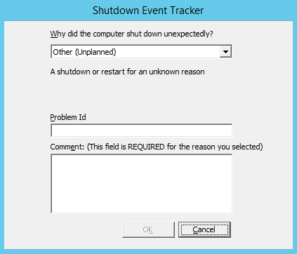
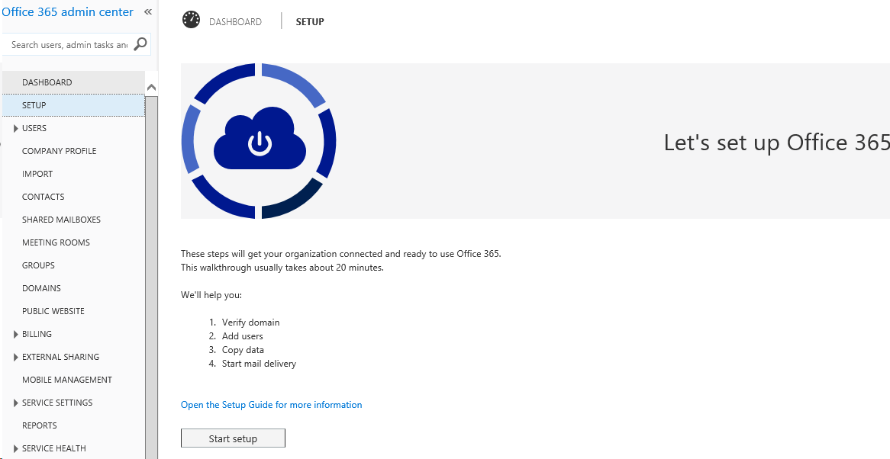
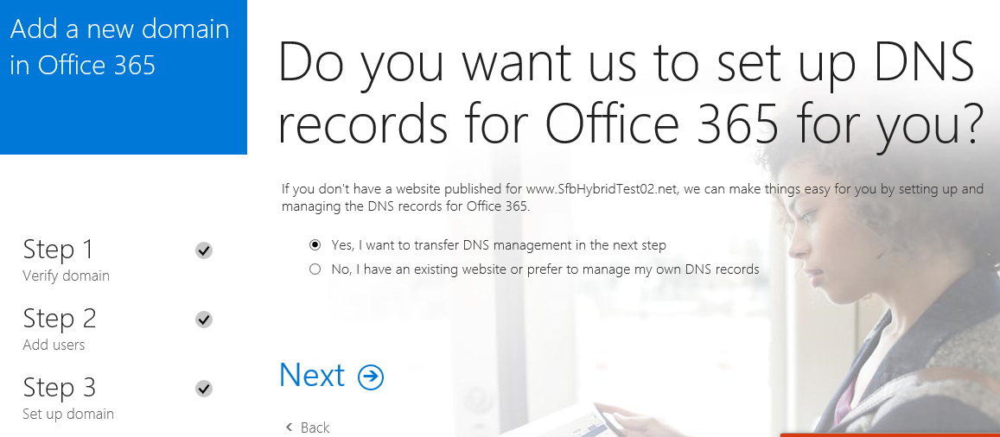
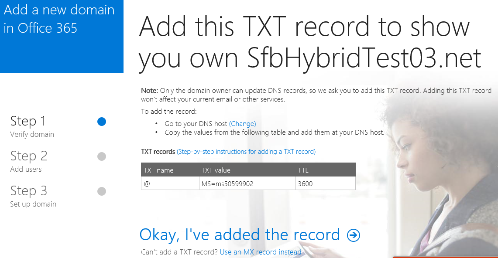
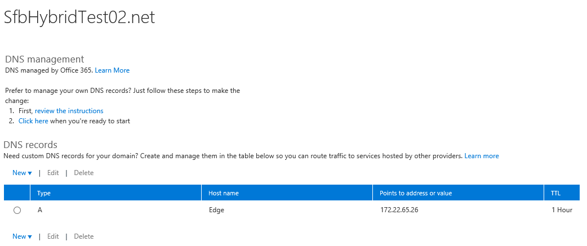
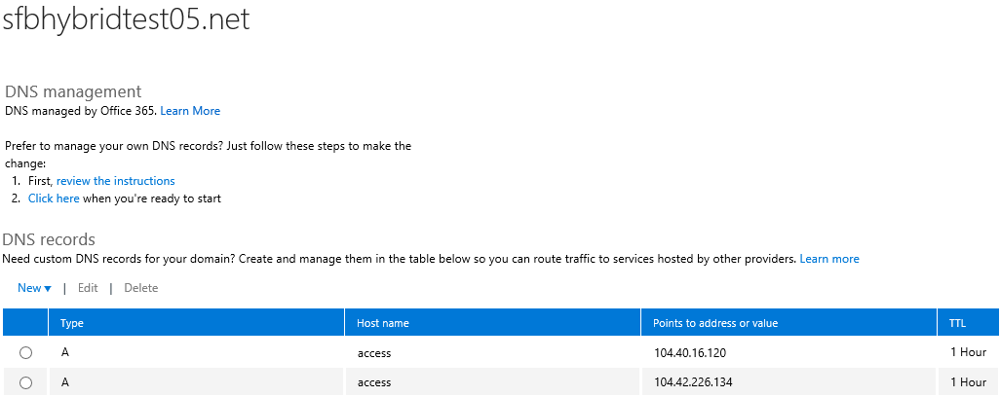
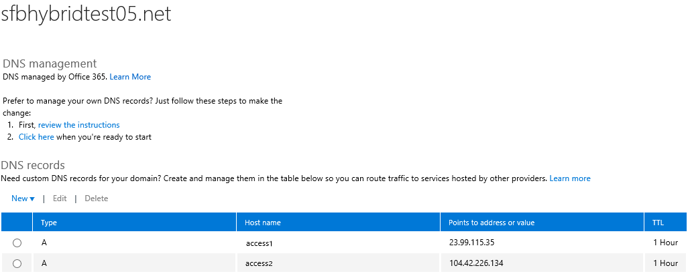

# Configure Skype for Business Cloud Connector Edition 1.3.8
 
How to plan, deploy and configure a dedicated on premises server with Skype for Business Cloud Connector Edition 1.3.8 software to enable on premise voice connections to work with users homed in the Skype for Business Online service in Office 365.
  
Learn how to configure Skype for Business Cloud Connector Edition 1.3.8, a minimal on-premises topology to enable integration of your on-premises voice infrastructure with Cloud PBX voice services in Skype for Business Online. 
  
Before you start, you should review the prerequisites in the [Plan for Skype for Business Cloud Connector Edition](plan-skype-for-business-cloud-connector-edition.md) topic.
  
> [!IMPORTANT]
> The steps in this topic apply only to Cloud Connector Edition 1.3.8. If you are using Cloud Connector Edition 1.4.1, see [Configure and manage Skype for Business Cloud Connector Edition](configure-skype-for-business-cloud-connector-edition.md). 
  
## Preparing your environment for Skype for Business Cloud Connector Edition 1.3.8

This section guides you through how to get the installation files, install Skype for Business Cloud Connector Edition, and prepare your environment to start configuring your deployment.
  
> [!IMPORTANT]
> For successful deployment, when you run the cmdlets to configure Skype for Business Cloud Connector Edition, always use the same console session as the one you started in. Avoid switching to different sessions during the deployment and configuration. 
  
### Download the Skype for Business Cloud Connector Edition 1.3.8 installer

1. Download the installation files: [http://aka.ms/CloudConnectorInstaller](https://aka.ms/cloudconnectorinstaller).
    
2. Move or copy the installer to the server that will host the virtual machines.
    
3. Run the installer and accept the default values during the installation.
    
4. Confirm that the installation completed successfully.
    
### Verify the installation and configure the environment

1. Open a PowerShell console as administrator and confirm that the Skype for Business Cloud Connector Edition cmdlets are available using the following cmdlet:
    
  ```
  Get-Command *-Cc*
  ```

    It should return a list of cmdlets for Skype for Business Cloud Connector Edition.
    
2. The VHDs, SfBBits, and VersionInfo files will be stored in the **Site Directory**.
    
    Get the **Site Directory** with the following cmdlet:
    
  ```
  Get-CcSiteDirectory
  ```

    It should return a location in your file system. The location can be a local folder or a file share. If you want to deploy High Availability (HA) or multi-site environment, you need to use a shared folder. The location must be accessible by the host server where the VMs will run. The default location for the **Site Directory** is: %USERPROFILE%\CloudConnector\SiteRoot.
    
    To set the **Site Directory** to a location other than the default, run the following cmdlet:
    
  ```
  Set-CcSiteDirectory <File path>
  ```

3. The **Appliance Directory** is the local working root directory for Skype for Business Cloud Connector Edition, and the location where external certificates, instances, and logs are saved. The default location is: %USERPROFILE%\CloudConnector\ApplianceRoot.
    
    To get the **Appliance Directory**, run the following cmdlet:
    
  ```
  Get-CcApplianceDirectory
  ```

    To set the **Appliance Directory** to a location other than the default, run the following cmdlet:
    
  ```
  Set-CcApplianceDirectory <File path>
  ```

    You should only set the **Appliance Directory** before you start the Skype for Business Cloud Connector Edition deployment. If you change it after you'll need to redeploy the host server.
    
    > [!IMPORTANT]
    > The path to the **Appliance Directory** must not contain any spaces.
  
### Set the path for the external certificate

- Run the following cmdlet to set the path, including file name, to the external certificate. For example: C:\certs\cce\ap.contoso.com.pfx. The certificate must contain private keys.
    
    Run the following cmdlet to import external your certificate for Cloud Connector:
    
  ```
  Set-CcExternalCertificateFilePath -Path <Full path to External certificate, including file name>
  ```

  ```
  Import-CcCertificate -Certificate <Full path to the External certificate>
  ```

    Specify the full path to the external certificate, including the file name. The certificate can be stored locally or on a file share. This cmdlet copies the external certificate to the **Appliance Directory**. Make sure your prepared certificate contains private keys.
    
    > [!NOTE]
    > If you change the location of the **Appliance Directory** you'll need to run this cmdlet again to import the certificate to the new location.
  
### Download the bits and virtual hard drive (VHD) files to the Site Directory

- Run the following cmdlet to download the bits and VHDs to the **Site Directory**.
    
  ```
  Start-CcDownload
  ```

    Download time depends on network conditions. Run the **Get-CcDownloadProgress** cmdlet to check the download status.
    
### Create virtual switches in Hyper-V Manager

1. Open **Hyper-V Manager** > **Virtual Switch Manager**, and select **New Virtual Switch Manager**.
    
2. Create an External virtual switch and bind it to the physical network adapter that is connected to your internal network domain.
    
3. Create an External virtual switch and bind it to the physical network adapter that is connected to the Internet and has a public IP address assigned.
    
4. Set the name of the switch that is connected to your perimeter network to your internal network domain to **Cloud Connector Corpnet Switch**.
    
    Set the name of the switch that connects your perimeter network to the internet **Cloud Connector Internet Switch**.
    
## Update the CloudConnector.ini configuration file

What does this step do? Where does the exported file go?
  
Prepare the CloudConnector.ini file using the information you gathered using the table in [Determine deployment parameters](plan-skype-for-business-cloud-connector-edition.md#BKMK_SiteParams)[Information you need to gather before deployment](plan-skype-for-business-cloud-connector-edition.md#BKMK_PlanDeployment) in the [Plan for Skype for Business Cloud Connector Edition](plan-skype-for-business-cloud-connector-edition.md) topic.
  
To update the file, first run the following cmdlet to get the sample template (CloudConnector.Sample.ini):
  
```
Export-CcConfigurationSampleFile
```

The sample template is stored in the **Appliance Directory**.
  
After you update it with the values for your environment, save the file as CloudConnector.ini in the **Appliance Directory**. You can run **Get-CcApplianceDirectory** to determine the path to the **Appliance Directory**.
  
When updating the .ini file, consider the following:
  
- **Internet/Corpnet/Management virtual switches**: Add the name of switches you have created. For the management virtual switch, just leave the default value. The deployment script will create it at the beginning of deployment and delete it when the deployment finishes.
    
- **ManagementIPPrefix:** ManagementIPPrefix in the Network section must be a different subnet from other internal IPs. For example, as the default value shows, ManagementIPPrefix is 192.168.213.0, while AD IPAddress is 192.168.0.238.
    
    The deployment scripts create a management network adapter on each virtual machine, assign a management IP, and connect it to a management virtual switch. This enables the host server to connect to and manage each virtual machine via this management network. The management virtual switch is deleted when the deployment is finished.
    
- **Base VM specific configurations:** Settings is this section must be configured for the **Convert-CcIsoToVhdx** cmdlet.
    
    During base VM image preparation, the base VM will be connected to the internal network switch. The following settings are critical for the VM to be able to access internet:
    
  - [Common]BaseVMIP: the corpnet IP address to be assigned to the base VM.
    
  - [Network]CorpnetDefaultGateway: the default gateway to be assigned to the base VM.
    
  - [Network]CorpnetDNSIPAddress: the DNS IP address to be assigned to the base VM.
    
- **External IPs:**
    
  - For MR public IP: specify either ExternalMRIPs for non-NAT or ExternalMRPublicIPs for NAT
    
  - ExternalSIPIPs and ExternalMRIPs can be the same
    
  - Make sure subnet mask InternetIPPrefixLength is correct
    
  - Make sure there is NO IP Conflicts for these external IPs
    
- **Gateways:**
    
  - Remove the secondary Gateway if there is only one. If there are more than two Gateways, follow the existing format to add new ones.
    
  - Make sure IP address and port of the gateway(s) are correct
    
  - To support PSTN Gateway level HA, leave the secondary Gateway, and add any additional gateways you will use. You can copy \> paste an existing entry and then update.
    
- Optionally, you can update the LocalRoute value to restrict outbound call numbers
    
## Prepare base virtual disk (VHDX) from downloaded ISO file

This step prepares a virtual disk file that will be used to create virtual machines during deployment. A temporary virtual machine (base VM) will be created and Windows Server 2012 R2 will be installed from the ISO file. After the VM is created, some necessary components will be installed and the latest Windows update will be applied. At the end, the base VM will be generalized (sysprep) and cleaned up, leaving only the generated virtual disk file.
  
Before proceeding with this step, make sure that the corpnet switch is created. Also, confirm that the following settings are correctly configured in the CloudConnector.ini file:
  
- [Network]CorpnetSwitchName
    
- [Common]BaseVMIP
    
- [Network]CorpnetIPPrefixLength
    
- [Network]CorpnetDefaultGateway
    
- [Network]CorpnetDNSIPAddress
    
Start a PowerShell console as administrator and run the following cmdlet to convert the ISO image to a virtual hard disk (VHD):
  
```
Convert-CcIsoToVhdx -IsoFilePath <Windows ISO File Path, including file name>
```

Specify the full path, including file name, to the ISO image. For example: C:\ISO\WindowsServer2012R2.iso.
  
The created VHD file is stored in the **Site Directory** \Bits\VHD folder. You can get the path to the **Site Directory** by running the **Get-CcSiteDirectory**.
  
> [!IMPORTANT]
> By default, proxy settings are not configured on the base VM. If a proxy is required in your network environment to update the VM via Windows Update, > > you'll see the error "Failed to install Windows updates. Please manually update the VM (Password: \<password\>) and run Convert-CcIsoToVhdx with -GeneralizeOnly". > To resolve this, log on the VM with the given password, manually set up the proxy, complete Windows Update, and then run this cmdlet on the host server: >  `Convert-CcIsoToVhdx -IsoFilePath <Windows ISO File Path> -GeneralizeOnly`
  
### Create VHDs for a multi-site deployment

This is an optional step that applies only to multi-site deployments.
  
If you are deploying a multi-site deployment, you do not need to convert the ISO to a VHD for each site. You can copy the VHD created for the first site to the host server for a second site.
  
 Copy the file to the same file location ( **Site Directory** \Bits\VHD folder), and with the same file name, on the host server for an additional site. Then, run the following cmdlet to set the path for updating the base VHDX file later:
  
```
Convert-CcIsoToVhdx -IsoFilePath <Windows ISO File Path> -SetIsoFilePathOnly
```

## Set the PowerShell Execution policy to RemoteSigned

The PowerShell scripts provided require that the execution policy be set to RemoteSigned. To see the current setting, open a PowerShell console as administrator and then run the following cmdlet:
  
```
Get-ExecutionPolicy
```

If it is not set to "RemoteSigned," run the following cmdlet to change it:
  
```
Set-ExecutionPolicy RemoteSigned
```

## Deploy a single instance of Skype for Business Cloud Connector Edition

You can deploy Skype for Business Cloud Connector Edition with or without HA and multi-site support. You can also convert an existing instance to support HA after it is deployed.
  
If you want to deploy with HA or multi-site support do not perform the tasks in this section. Instead, follow the steps in "One-Site with HA and Multi-Site support".
  
Select one of the procedures below, depending on whether yours is a new installation or an upgrade.
  
### New installation

To start the installation, open a PowerShell console as administrator and run the following cmdlet:
  
```
Install-CcInstance
```

Follow the instructions to provide the external certificate password, safe mode admin password, domain admin user name and password, and VM admin password.
  
### Upgrade from a previous version

If you have an existing deployment of Skype for Business Cloud Connector Edition from the preview release and want to upgrade to the latest version, do the following:
  
1. Uninstall the existing version and then install the new version of CloudConnector.msi from [http://aka.ms/CloudConnectorInstaller](https://aka.ms/cloudconnectorinstaller).
    
2. Confirm that you have the CloudConnector.ini file for the version you are installing, and have updated all of the required values for your environment. You cannot use the .ini file from a previous release.
    
3. Start a PowerShell console as administrator and run the following cmdlet to download the latest version.
    
  ```
  Start-CcDownload
  ```

    The installation will start automatically when the download completes.
    
    If the installation does not start automatically, it may be due to an issue with the version of the CloudConnector.ini file. Verify that the .ini file is correctly updated to include new properties in this version, and that you have transferred any customized properties from your previous deployment. You may need to run the **Export-CcConfigurationSampleFile** to start with a new template.
    
    Run the following cmdlet to start the installation:
    
  ```
  Install-CcInstance -Upgrade
  ```

    > [!IMPORTANT]
    > If you are upgrading from preview release version 2 or later, the cmdlet will start the upgrade automatically. If you are upgrading from preview release version 1, you'll need to remove the deployment and start a new deployment instead. > If you are upgrading from version 6.0.\*.\* to 1.3.\*, you'll need to manually delete the hyper-v virtual management switch manually. 
  
4. Run the following cmdlet to activate the new deployment and turn off the previous version.
    
  ```
  Switch-CcVersion
  ```

If you want to change the credentials used for the deployment, you can run the cmdlet with the **UpdateAllCredentials** parameter. For example: `Install-CcInstance -UpdateAllCredentials`.
  
### Change the configuration for a single instance or start over

If you want to change the configuration settings for a single instance after it is deployed, you can modify the CloudConnector.ini file and start the deployment again.
  
1. Run the following cmdlet to uninstall all existing virtual machines on host server:
    
  ```
  Uninstall-CcInstance
  ```

2. Update the CloudConnector.ini file in the **Appliance Directory**.
    
3. Run the following cmdlet to install Skype for Business Cloud Connector Edition:
    
  ```
  Install-CcInstance
  ```

### Convert existing single instance to HA deployment

You can add HA support to an existing instance by converting it using the following steps.
  
1. Set site directory to a shared folder
    
  ```
  Set-CcSiteDirectory
  ```

2. Download Skype for Business Cloud Connector Edition binaries to share site directory
    
  ```
  Start-CcDownload
  ```

3. Convert iso file to vhdx file into shared site directory
    
  ```
  Convert-CcIsoToVhdx
  ```

4. Register current instance information
    
  ```
  Register-CcHAInstance
  ```

5. Publish current instance as HA instance 
    
  ```
  Publish-CcHAInstance
  ```

If you want to add more HA instances to your deployment, please follow instructions in "Single PSTN site with HA" section to add more ones that are new.
  
## Post-installation configuration
<a name="BKMK_PostInstall"> </a>

Once the installation is complete, perform the steps in this section to configure your deployment and connect it to your Office 365 tenant.
  
1. Login to the VMs created by the installation script. Note that you can safely ignore the **Shutdown Event Tracker** dialog. The dialog is displayed because the operating system on the VM had to be restarted multiple times during the installation for adding features and installing Skype for Business Server on them.
    
     
  
2. Configure the firewall settings to open the required ports as described in [Ports and protocols](plan-skype-for-business-cloud-connector-edition.md#BKMB_Ports) in [Plan for Skype for Business Cloud Connector Edition](plan-skype-for-business-cloud-connector-edition.md).
    
3. Configure the PSTN Gateway or Load Balancer network connection.
    
### Setup your Office 365 tenant

If you do not yet have an Office 365 tenant you can learn how to sign up here: [Office 365 for Business](https://products.office.com/en-us/business/office). Note that you'll need to sign up for a plan that includes Skype for Business Online
  
An Office 365 tenant with Skype for Business Online and Cloud PBX is required. Make sure your tenant is set up and configured before attempting to deploy Skype for Business Cloud Connector Edition.
  
To learn more about how to set up Office 365, see [Set up Office 365 for business](https://support.office.com/en-us/article/Set-up-Office-365-for-business-6a3a29a0-e616-4713-99d1-15eda62d04fa?ui=en-US&amp;rs=en-US&amp;ad=US&amp;fromAR=1)
  
Some Office 365 setup steps require you to use Tenant Remote PowerShell (TRPS) to configure your Office 365 tenant. You can download the Skype for Business Online module for PowerShell from: [Skype for Business Online, Windows PowerShell Module](https://www.microsoft.com/en-us/download/details.aspx?id=39366).
  
### Update the domain name for your tenant

Make sure that you've completed the steps to update your domain in Office 365 and have the ability to add DNS records. For more information about how to set up your domain in Office 365, see [Video: Set up your domain in Office 365](https://support.office.com/en-us/article/Video-Set-up-your-domain-in-Office-365-703dfec1-882d-4e33-b647-937f731887b7?ui=en-US&amp;rs=en-US&amp;ad=US).
  
1. Log in to Office 365 using a tenant admin account, and open the admin portal. Select the **Setup** tab, and then select **Start setup**.
    
     
  
2. On the next page, confirm that **Yes, I want to transfer DNS management in the next step** is selected, and then select **Next**.
    
     
  
3. Verify your DNS host authorization by following the guidance on the page to add a TXT record to your DNS host. Once completed, select **Okay, I've added the record**.
    
     
  
4. Update the Domain Name Servers if required by Office 365.
    
### Add DNS records in Office 365 for your Edge

Add the following DNS records to you Office 365 tenant:
  
1. Add a DNS A record for Access Edge/Data Proxy External (They share same FQDN)
    
2. Add a DNS A record for AV Edge External
    
    https://portal.office.com/Admin/Default.aspx#@/Domains/DomainEdit.aspx?DomainEditLayout=DomainDnsManagementPanel&amp;domainName=\<Domain Fqdn\>
    
     
  
3. SRV records will automatically be created by Office 365 and the deployment scripts. Confirm that you can look up the following 2 SIP services on the Edge:
    
     
  
### Setup Hybrid Skype for Business Cloud Connector Edition and Office 365

To configure hybrid connectivity between your Skype for Business Cloud Connector Edition deployment and your Office 365 tenant, run the following cmdlet in a remote powershell session. To learn how to establish a remote PowerShell session, see: [Using Windows PowerShell to manage Skype for Business Online](https://technet.microsoft.com/en-us/library/dn362831%28v=ocs.15%29.aspx).
  
The cmdlet sets the Access Edge external FQDN. In the first of the commands, the \<External Access Edge FQDN\> should be the one for the SIP Access Edge role. By default, this should be ap.\<Domain Name\>.
  
```
Set-CsTenantHybridConfiguration -PeerDestination <External Access Edge FQDN> -UseOnPremDialPlan $false
Set-CsTenantFederationConfiguration -SharedSipAddressSpace $True
```

> [!NOTE]
> This applies to the single PSTN site. Different cmdlets are required to enable multiple PSTN sites. See "Deployment for one site with HA and multi-Site support". 
  
### Set up PSTN gateways

Set up trunks on each PSTN Gateway to point back to Mediation Servers for all instances. Each trunk should point to one Mediation Server FQDN or IP address instead of the Mediation Server pool FQDN because the pool FQDN is the same for all server in the pool. Trunks should be set in the same priority.
  
If you are using TLS between Mediation Servers and Gateways, you will need configure the Gateways and Mediation servers to support MTLS as follows:
  
1. Export Root CA from Cloud Connector Active Directory computer
    
2. Follow PSTN gateway vendor instructions for importing the Root CA
    
3. Import the Root CA certificate for the certificate issued to your gateway on the Mediation Servers. If you need to obtain an SSL certificate for the gateway you may do this using Certificate Authority service running on the Cloud Connector Active Directory computer as follows:
    
  - Modify the existing Web Server template to enable Authenticated users to Enroll, or create a new Web Server template to configure other properties and enable Authenticated users to enroll. For detailed instructions, see [Certificate Templates](https://technet.microsoft.com/en-us/library/cc730705.aspx).
    
  - Request a certificate using Certificate snap-in selecting the Web Server template that you have enabled. Be sure to add Common name in Subject and DNS name in Alternative name with FQDN of the gateway, and confirm on the Private Key that Make private key exportable is selected under key options. For detailed instructions, see [Request a Certificate](https://technet.microsoft.com/en-us/library/cc730689.aspx).
    
4. Export the SSL certificate with Private key and follow the instructions from your PSTN gateway vendor for importing the certificate.
    
### Set up your users in Office 365

Login to the Office 365 admin portal, add the users that will be enabled for online voice services, and assign E5 license or Cloud PBX add-on on top of E3 license to these users. For information about adding users, see [Add users to Office 365 for business](https://support.office.com/en-US/article/Add-users-to-Office-365-for-business-435ccec3-09dd-4587-9ebd-2f3cad6bc2bc)
  
### Enable users for Cloud PBX voice and voice mail services

After adding your users to Office 365, enable their accounts for Cloud PBX voice services, including voice mail. To enable these capabilities, you must login to your Office 365 tenant with an account that is an Office 365 Global Administrator role, and be able to run remote PowerShell. **You need to follow the steps in this section only for user accounts that do not already have Enterprise Voice enabled.**
  
1. Before you begin, check that the Skype for Business Online Connector (Windows PowerShell module) is deployed on your computer. If it isn't, you can download it from the download center. You can find more information about using this module at Configuring your computer for Skype for Business Online management.
    
2. Start Windows PowerShell as an administrator.
    
3. Type the following and press Enter:
    
  ```
  Import-Module skypeonlineconnector
  ```

4. Type the following and press Enter:
    
  ```
  $cred = Get-Credential
  ```

    After you press ENTER, you should see the Windows PowerShell Credential dialog box.
    
5. Type your tenant admin username and password, and click OK.
    
6. In the PowerShell window, type the following and press Enter:
    
  ```
  $Session = New-CsOnlineSession -Credential $cred -Verbose
  ```

7. Import the session by typing the following cmdlet:
    
  ```
  Import-PSSession $session
  ```

8. Assign the policy to your user and configure the user's business voice phone number, whom you specify with the value of the Identity parameter:
    
  ```
  Set-CsUser -Identity "<User name>" -EnterpriseVoiceEnabled $true -HostedVoiceMail $true -OnPremLineURI <tel:+phonenumber>
  ```

    > [!NOTE]
    > You can also specify a user's Identity by their SIP address, User Principal name (UPN), domain name and username (domain\username), and display name in Active Directory ("Bob Kelly"). 
  
You can then verify that the users were added and enabled using the following script:
  
```
# Input the user name you want to verify
$user = Get-CsOnlineUser <User name>

# For a hybrid user, the value of $user.EnterpriseVoiceEnabled should be True
$user.EnterpriseVoiceEnabled

# For a hybrid user, the value of $user.HostedVoiceMail should be True
$user.HostedVoiceMail

# For a hybrid user, the value of $user.VoicePolicy should be "HybridVoice"
$user.VoicePolicy
```

You'll need to decide whether your users should be able to make international calls. By default, international calling is enabled. You can disable or enable users for international dialing using the online Skype for Business admin center.
  
To disable international calling on a per user basis, run the following cmdlet in Skype for Business Online PowerShell:
  
```
Grant-CsVoiceRoutingPolicy -PolicyName InternationalCallDisallowed -Identity $user
```

To re-enable international calling on a per user basis after it has been disabled, run the same cmdlet, but change the value for **PolicyName** to *InternationalCallsAllowed*  .
  
To complete setup of voice mail for users, do the following:
  
1. Check whether a dial plan named  *BusinessVoice_8D_DialPlan*  already exisits by running the following cmdlet:
    
  ```
  Get-CsOnlineUMDialplan | Select Identity
  ```

2. If the dial plan doesn't exist, create it by running the following cmdlet:
    
  ```
  New-CsOnlineUMDialplan -Identity BusinessVoice_8D_DialPlan -CountryOrRegionCode 1 -NumberOfDigitsInExtension 8
  ```

    > [!NOTE]
    > After creating dial plan, wait five minutes to allow for changes to be replicated before enabling users. 
  
3. Enable users for UM Mailbox by running the following cmdlet:
    
  ```
  Get-CsOnlineUser -Identity <SipAddress/UPN> | Enable-CsOnlineUMMailbox
  ```

### Validate the deployment

After you've completed the steps to deploy and configure Skype for Business Cloud Connector Edition, verify that you can make and receive calls.
  
1. Login to your Skype for Business Client with a user account you just set up.
    
2. Call a PSTN number from the client and confirm that the call succeeds.
    
3. Use your phone or other device associated with the PSTN number to call your Skype for Business client and confirm that the call succeeds.
    
> [!NOTE]
> You should confirm that you can successfully make calls after adding additional sites or converting sites to enable HA support. 
  
## Single site with High Availability (HA) and multi-site support
<a name="BKMK_PostInstall"> </a>

Skype for Business Cloud Connector Edition can be deployed in one or more PSTN sites. A PSTN site is a combination of instances deployed at the same location, and that are connected to common PSTN gateways. If you need to support more calls per PSTN site, you can scale up by deploying additional PSTN sites in the same location. You can have up to 4 instances of Skype for Business Cloud Connector Edition per PSTN site.
  
### Single PSTN Site with HA

This section provides guidance on how to deploy a single PSTN site with HA support. This includes deploying multiple instances in a single PSTN site and configuring HA. All of the host servers should be on the same subnet.
  
- Update the CloudConnector.ini file to deploy a single instance deployment.
    
- InternalDomains name(s), even the order for multiple InternalDomains, should be the same across instances as these are the SIP domain names.
    
- We recommend that you use the default value for ADDomain. The same name must be used across instances.
    
- Server names should be different across instances.
    
- Internal pool FQDN should be the same across instances.
    
- Internal IPs should be different across instances.
    
- External FQDNs for Access Edge should be the same across instances.
    
- External IPs for Access Edge should be different across instances.
    
- PSTN Gateway settings should be the same across instances.
    
- After you deploy the first instance, copy "InternalCertificate.cer" from \<Host Machine Folder\>\Certificates\Internal to the same folder on the host server you will use for the next instance so that the instances can use the same internal root certificate.
    
Example for Edge Server:
  
|||
|:-----|:-----|
|Instance 1  <br/> |Instance 2  <br/> |
|
```
[EdgeServer]
InternalMachineName= cc-edge1
InternalPoolName=cc-edgepool
InternalMachineIPs=192.168.0.241

ExternalSIPPoolName=access
ExternalSIPIPs=192.168.1.4

ExternalMRFQDNPoolName=mr
ExternalMRIPs=192.168.1.4
ExternalMRPublicIPs=104.40.16.120

```

|
```
[EdgeServer]
InternalMachineName= cc-edge2
InternalPoolName=cc-edgepool
InternalMachineIPs=192.168.0.242

ExternalSIPPoolName=access
ExternalSIPIPs=192.168.1.5

ExternalMRFQDNPoolName=mr
ExternalMRIPs=192.168.1.5
ExternalMRPublicIPs=104.42.226.134

```

|
   
> [!NOTE]
> To support PSTN Gateway level HA, please keep the secondary Gateway or even add more on every ini configure file. 
  
### First time deployment

Follow these steps the first time you deploy Skype for Business Cloud Connector Edition for a single site with HA. Open a PowerShell session as administrator to run the cmdlets in this section.
  
1. Download or copy the installer (CloudConnector.msi) to each host server.
    
2. Prepare a shared folder and that all host machines have READ/WRITE permissions to. You'll need a different share for each PSTN site. Run the following cmdlet to set the Site Directory root to the shared folder:
    
  ```
  Set-CcSiteDirectory <Shared Folder Full Path>
  ```

3. Run the following cmdlet to download the binaries to the shared folder:
    
  ```
  Start-CcDownload
  ```

    Run this cmdlet on only one of the host servers, which makes the binaries available to each host server that can access the shared folder.
    
4. Run the following cmdlet on each host server to set the path to the external certificate. Include the filename and extension in the path:
    
  ```
  Set-CcExternalCertificateFilePath -Path <External Certificate Full Path, including file name>
  ```

5. Prepare the CloudConnector.ini file for each of the host machines. If you modify the .ini during your deployment you'll need to repeat the remaining steps in this section.
    
6. Run the following cmdlet on one host server at a time to deploy a an instance of Skype for Business Cloud Connector Edition. Wait for one deployment to finish before starting the next.
    
  ```
  Install-CcInstance
  ```

7. Enable HA by running the following cmdlet on each host server:
    
  ```
  Register-CcHAInstance
  ```

8. After you have enabled HA on all host servers for the site, run the following cmdlet to configure HA between servers:
    
  ```
  Publish-CcHAInstance 
  ```

9. Follow the steps in the  (configure-skype-for-business-cloud-connector-edition.md) section to add DNS records, set up hybrid with Office 365, setup PSTN gateways, and set up users.
    
#### Upgrade binaries and update HA topology simultaneously

Follow the section "Upgrade existing deployment to new version" to upgrade all the existing instances.
  
Follow the section "Update HA topology" to add/remove instances, and update all the instances.
  
#### Setup Hybrid

Use tenant remote PowerShell to set the on-premise access edge external FQDN.
  
```
Set-CsTenantHybridConfiguration -PeerDestination <External Access Edge FQDN>
Set-CsTenantFederationConfiguration -SharedSipAddressSpace $True
```

#### Setup PSTN Gateways

Setup trunks on each PSTN Gateway to point back to Mediation Servers for all instances. Each trunk should point to one Mediation Server FQDN or IP address instead of the Mediation Server pool FQDN because the pool FQDN is the same for all server in the pool. Trunks should be set in same priority.
  
#### Setup users

Add the users to your tenant that you want to enable for using Skype for Business Cloud Connector Edition.
  
#### Update HA topology

This step only adds/removes instances. The binaries are not upgraded to the new version. This is the same as converting a single instance to a single instance with HA support.
  
1. Prepare a shared folder and that all host machines have READ/WRITE permissions to. You'll need a different share for each PSTN site. For multiple PSTN sites, with HA in each site, the shared folder must be different for each site. 
    
    Run the following cmdlet to set the **Site Directory** root to the shared folder:
    
  ```
  Set-CcSiteDirectory <Shared Folder Full Path>
  ```

2. Prepare the CloudConnector.ini file for each of the host machines. If you modify the .ini during your deployment you'll need to repeat the remaining steps in this section.
    
3. Enable HA by running the following cmdlet on each host server. Run the cmdlet first on the existing instance, and then run it on any additional instances.
    
  ```
  Register-CcHAInstance
  ```

4. Run the following cmdlet only on newly added host servers. Do not run this cmdlet on the existing instance.
    
  ```
  Install-CcInstance
  ```

5. Enable HA by running the following cmdlet on each host server:
    
  ```
  Publish-CcHAInstance
  ```

### Upgrade binaries only

This section Upgrading the binaries and the HA topology cannot be performed simultaneously. steps in the preceding sections separately to update the binaries and extend the 
  
1. Follow the section "Upgrade existing deployment to new version" to upgrade all the instances.
    
2. Enable HA by running the following cmdlet on each host server. Run the cmdlet first on the existing instance, and then run it on any additional instances.
    
  ```
  Register-CcHAInstance
  ```

3. Enable HA by running the following cmdlet on each host server:
    
  ```
  Publish-CcHAInstance
  ```

### Upgrade binary and update HA topology simultaneously

Follow the section "Upgrade existing deployment to new version" to upgrade all the existing instances.
  
Follow the section "Update HA topology" to add/remove instances, and update all the instances.
  
### Add DNS records for Edge on O365 portal for the same External FQDN and map to different IPs for Access Edge.


  
### Setup Hybrid

Use tenant remote PowerShell set the On-Premise access edge external FQDN. It is exactly same as the normal single PSTN site case.
  
```
Set-CsTenantHybridConfiguration -PeerDestination <External Access Edge FQDN>
Set-CsTenantFederationConfiguration -SharedSipAddressSpace $True

```

### Setup PSTN Gateways

Setup trunks on each PSTN Gateway to point back to Mediation Servers for all instances. Each trunk should point to one Mediation Server FQDN or IP address instead of the Mediation Server pool FQDN because the pool FQDN is the same for all server in the pool. Trunks should be set in same priority.
  
### Setup users

All the setups for users are same as single PSTN site case.
  
## Multiple PSTN Sites
<a name="BKMK_PostInstall"> </a>

This section described how to deploy multiple PSTN sites.
  
1. Deploy Skype for Business Cloud Connector Edition instances for different PSTN sites. Follow the same process described earlier in this topic for deploying a single site.
    
|||
|:-----|:-----|
|PSTN Site 1  <br/> |PSTN Site 2  <br/> |
|
```
[EdgeServer]
InternalMachineName= cc-edge1
InternalPoolName=cc-edgepool
InternalMachineIPs=192.168.0.241

ExternalSIPPoolName=access1
ExternalSIPIPs=192.168.1.4

ExternalMRFQDNPoolName=mr1
ExternalMRIPs=192.168.1.4
ExternalMRPublicIPs=23.99.115.35

```

|
```
[EdgeServer]
InternalMachineName= cc-edge2
InternalPoolName=cc-edgepool
InternalMachineIPs=192.168.0.242

ExternalSIPPoolName=access2
ExternalSIPIPs=192.168.1.5

ExternalMRFQDNPoolName=mr2
ExternalMRIPs=192.168.1.5
ExternalMRPublicIPs=104.42.226.134

```

|
   
2. Within each PSTN site, to support HA, please follow "Single PSTN Site with HA" section.
    
    Note: The share folder for preparing HA is per PSTN site. The share folder MUST be different cross PSTN sites. 
    
3. Add DNS records for Edge on O365 portal for all the External FQDNs and IPs for Access Edge.
    
     
  
4. Setup Hybrid
    
    Use tenant remote PowerShell set the On-Premise access edge external FQDN for all the PSTN sites:
    
  ```
  # Run this cmdlet for each site
New-CsHybridPstnSite  -Identity <PSTN Site Name> -EdgeFqdn <External Access Edge FQDN>

# Review all the sites
Get-CsHybridPstnSite

# (Optional) Update/Delete site
Set-CsHybridPstnSite  -Identity <PSTN Site Name> -EdgeFqdn <External Access Edge FQDN>
Remove-CsHybridPstnSite  -Identity <PSTN Site Name>

  ```

    Compared with a single instance, "Set-CsTenantHybridConfiguration -PeerDestination" is optional. It can be used to set the tenant level default fallback PSTN site FQDN. If in the tenant there is one major site and several branch office, set the Access Edge FQDN of the major site as the Peer Destination as default, and create Hybrid PSTN Site for all other branch office sites. "Set-CsTenantFederationConfiguration -SharedSipAddressSpace $True" is still required.
    
5. Setup Gateways
    
    PSTN Gateway(s) in one PSTN site should only connect to the MS(s) in the same site.
    
6. Setup users
    
    Follow the steps in the preceding section to set up your users.
    
    In addition, use tenant remote PowerShell to assign a site to users.
    
  ```
  # Set the site to users
Set-CsUserPstnSettings -Identity <User Name> -HybridPstnSite <PSTN Site Name>

# Review the site setting for a user
Get-CsUserPstnSettings -Identity <User Name> 

# See all the user settings in one tenant
Get-CsOnlineUser | Get-CsUserPstnSettings
  ```

    If no PSTN site is assigned to a user, it will fallback to use the tenant level default one (Peer Destination). In the fallback case, if Peer Destination is empty, the user cannot make outbound calls.
    
## Single site with HA compared to multi-site deployments
<a name="BKMK_PostInstall"> </a>

The following table lists the differences between single site with HA support and a multiple site deployment.
  
|**Category**|**Item**|**Single-Site with HA**|**Multi-Site**|
|:-----|:-----|:-----|:-----|
|Setup  <br/> |Shared folder  <br/> |Requires the **same** shared folder across instances <br/> |Requires a **different** shared folder across instances <br/> |
|Configure  <br/> |VirtualMachineDomain  <br/> |Requires the **same** domain across instances <br/> |Requires the **same** domain across PSTN sites <br/> |
|SIPDomains  <br/> |Domain names and order should be the **same** across instances <br/> |Domain names and order should be the **same** across cross PSTN sites <br/> |
|Server name  <br/> |**Different** across instances <br/> |**Different** across PSTN sites <br/> |
|Internal pool FQDN  <br/> |**Same** across instances <br/> |**Same** across PSTN sites <br/> |
|Internal IP  <br/> |**Different** across instances <br/> |**Different** across PSTN sites <br/> |
|External FQDN  <br/> |**Same** across instances <br/> |**Different** across PSTN sites <br/> |
|External IP  <br/> |**Different** across instances <br/> |**Different** across PSTN sites <br/> |
|PSTN GW settings  <br/> |**Same** across instances <br/> |**Different** cross PSTN sites <br/> |
|DNS record  <br/> |Add records with the **same** External Access FQDNs and **different** IP addresses <br/> |Add records with **different** External Access FQDNs and **different** IP addresses <br/> |
|Setup hybrid tenant  <br/> |Set PeerDestination  <br/> |Set HybridPstnSite  <br/> Set PeerDestination for fallback  <br/> |
|Setup gateway  <br/> |MS GW **M:N** mapping in this site <br/> |PSTN Gateway(s) in each PSTN site should only connect to the Mediation Server(s) in the same site  <br/> |
|Setup user  <br/> |Regular user  <br/> |Set UserPstnSettings  <br/> |
   
The following table presents the item configurations across implementations.
  
||**Same**|**Different**|
|:-----|:-----|:-----|
|Cross all instances no matter within or cross PSTN site  <br/> |Domain name  <br/> Internal Pool FQDN  <br/> |Server name  <br/> Internal IP  <br/> External IP  <br/> |
|Cross all instances within a PSTN site  <br/> |External FQDN  <br/> PSTN Gateway settings  <br/> ||
|Cross PSTN sites  <br/> ||External FQDN  <br/> PSTN Gateway settings  <br/> |
   
## Configure Windows Updates
<a name="BKMK_PostInstall"> </a>

By default, automatic Windows Updates is turned off on all Skype for Business Cloud Connector virtual machines. If you want to check for and install Windows Updates, follow the steps in this section that apply to your type of deployment. You should plan on updating both the host server and the virtual machines running on it at the same time to minimize the amount of down time necessary for the updates.
  
If you prefer, you can use a Windows Server Update Services (WSUS) server to provide updates to Cloud Connector servers. Just be sure to configure the updates to **not** install automatically.
  
### Windows Update for the host servers

Checking for and installing Windows updates may require a server restart. When a host server is restarting, users will not be able to use Cloud Connector Edition to place or receive calls. You can manually check for and install updates to control when the updates take place, and then restart the machines as needed during times you choose to avoid disruption of services.
  
To do so, connect to each host server and open the **Control Panel**. Select **System and Security** **\>** **Windows Update**, and then manage the updates and server restarts as appropriate for your environment.
  
### Windows Updates for the virtual machines

To use Windows Update on the virtual machines in your deployment, follow the same process as updating the host servers. Refer to the following section that is appropriate for your deployment:
  
- **Single instance deployment**
    
    Connect to each virtual machine and open the **Control Panel**. Select **System and Security** **\>** **Windows Update**, and then manage the updates and server restarts as appropriate for your environment.
    
- **Single Site with High Availability**
    
    In a deployment with HA support, the instance being updated and restarted cannot be accessed by users during the updates. Users will connect to other instances in the deployment until all virtual machines and all Skype for Business services start on the virtual machines after the updates are completed. To avoid any potential disruption to service, you can remove the instance from HA while you apply the updates, and then restore it when complete. To do so:
    
1. On each host server, open a PowerShell console as administrator.
    
2. Remove the instance from HA with the following cmdlet:
    
  ```
  Enter-CcUpdate
  ```

3. Follow the steps for a single instance to manually apply the updates and restart the virtual machine.
    
4. Set the instance back to HA with the following cmdlet:
    
  ```
  Exit-CcUpdate
  ```

- **Multiple PSTN sites**
    
    Treat each site as a single site, and then follow the steps for either a single instance or a single site with HA as appropriate for your deployment.
    
## Troubleshooting
<a name="BKMK_PostInstall"> </a>

We've provided solutions to the issues most commonly encountered by customers during the preview program.
  
- **Issue: Deployment fails or stops responding when running the deployment scripts. After logging on to each VM, the IP address is missing or incorrect for the Management/Internal/External NIC.**
    
    **Resolution:** This issue cannot be resolved automatically. NICs cannot be added to VMs while they are running. Please shut down and remove these VMs in hyper-v manager, then rerun the deployment scripts with the following command:
    
  ```
  Uninstall-CcInstance
  ```

  ```
  Install-CcInstance
  ```

- **Issue: After AD and forest are installed, the CMS server and/or Mediation Server did not join the domain correctly.**
    
    **Resolution:** To resolve this issue, take the following steps:
    
  - Log on to the AD server and verify that the domain was created correctly.
    
  - Log on to CMS/Mediation Server and verify that on the corpnet NIC a valid IP address is assigned, and that valid static IP and DNS is configured as the AD server's IP address.
    
  - Log on to the CMS/Mediation Server, open a Command Prompt. Make sure you can ping the FQDN and IP address of the AD server. If you cannot, there may be IP address conflict. Please try to assign a new IP for AD and update DNS on CMS/Mediation server accordingly.
    
- **Issue: You receive the following error/warning message:**
    
    "No gateway specified for the route. Specify at least one gateway for the route" detected while deploy CMS server.
    
    **Resolution:** Please ignore this warning. We are using LocalRoute instead of VoiceRoute.
    
- **Issue: You receive the following error message, "Remove-VMSwitch : Failed while removing virtual Ethernet switch. The virtual switch 'Cloud Connector Management Switch' cannot be deleted because it is being used by running virtual machines or assigned to child pools."**
    
    **Resolution:** The "Cloud Connector Management Switch" was not deleted after the deployment. If you hit this error, please go to Hyper-v manager and verify that there is not still a virtual machine still connected to it. If there are virtual machines still connected, disconnect them and delete the management switch. If the management switch still cannot be deleted, restart the host server and try again.
    
- **Issue: The host server was restarted when Windows updates were applied, and calls serviced by the server are failing.**
    
    **Resolution:** If you deployed a high availability environment, we provide a cmdlet to help move one host machine (deployment instance) into or out of the current topology when you check and install windows update manually. Use the following steps to accomplish this:
    
1. On the host server, start a PowerShell console as administrator, then run:
    
  ```
  Enter-CcUpdate
  ```

2. Check for updates and install any that are available.
    
3. In the PowerShell console, run the following cmdlet:
    
  ```
  Exit-CcUpdate
  ```

- **Issue: When a call is made from Skype for Business client using a PSTN number, the call cannot be escalted to a conference by inviting another PSTN number.**
    
    **Resolution:** To resolve this issue, take the following steps:
    
1. Create a user in the O365 admin portal. Use any user name you want, such as "MediationServer1."
    
    Do not assign any O365 licenses (such as E5) to the account you create. Wait for O365 AD sync to complete.
    
2. Launch Tenant Remote PS using your tenant admin credentials, then run the following cmdlet to set the Mediation Server and Edge Server FQDN to that user account, replacing \<UserName\> with the user name you used to create the account:
    
  ```
  Set-CsHybridMediationServer -Identity <UserName> -Fqdn <MediationServerFQDN> -AccessProxyExternalFqdn <EdgeServerExternalFQDN>
  ```

    For  *MediationServerFQDN*  , use the internal FQDN defined for your Mediation Server.
    
    For  *EdgeServerExternalFQDN*  , use the external FQDN defined for Edge Server Access Proxy. If there are multiple CCE PSTN sites, choose the Edge Server Access Proxy FQDN assigned to the site that contains where the Mediation Server is located.
    
3. If there are multiple CCE Mediation Servers (multiple-site, HA), please repeat the previous steps for each of them.
    
## Cmdlet reference table
<a name="BKMK_PostInstall"> </a>

The following table lists the Skype for Business Cloud Connector Edition cmdlets with a brief description.
  
|**Cmdlet name**|**Description**|
|:-----|:-----|
|Convert-CcIsoToVhdx  <br/> |Converts windows ISO file to VHDX file.  <br/> |
|Enter-CcUpdate  <br/> | Enters update process on host server. <br/> |
|Exit-CcUpdate  <br/> | Exits update process on host server. <br/> |
|Export-CcConfigurationSampleFile  <br/> |Exports cloudconnector.ini file to working directory on host server.  <br/> |
|Get-CcApplianceDirectory  <br/> | Gets working directory on host server. All deployment files store in this directory. <br/> |
|Get-CcApplianceLogDirectory  <br/> |Gets log directory on host server.  <br/> |
|Get-CcDownloadProgress  <br/> | Gets download progress of VHD, SfBBits and msi. <br/> |
|Get-CcExternalCertificateFilePath  <br/> |Gets external certificate file path. This certificate is prepared by user.  <br/> |
|Get-CcSiteDirectory  <br/> | Gets site root directory. VHD, SfBbits and Cloud Connector msi are downloaded to this directory. <br/> |
|Get-CcSiteLogDirectory  <br/> |Gets log directory of the site.  <br/> |
|Get-CcVersion  <br/> | Gets the version of the scripts from the local machine <br/> |
|Install-CcInstance  <br/> | Installs cloud connector instance to host server including AD, CMS, Mediation server and Edge server virtual machines. <br/> |
|Publish-CcHAInstance  <br/> | Publishes high availability information of cloud connect instance on host server. <br/> |
|Register-CcHAInstance  <br/> | Registers high availability information of cloud connect instance on host server. <br/> |
|Search-CcLog  <br/> |Searches incoming and outgoing call log in appliance log directory.  <br/> |
|Set-CcApplianceDirectory  <br/> | Sets working directory on host server. All deployment files store in this directory. <br/> |
|Set-CcExternalCertificateFilePath  <br/> |Sets external certificate file path. This certificate is prepared by user.  <br/> |
|Set-CcSiteDirectory  <br/> | Sets site root directory. VHD, SfBbits and Cloud Connector msi are downloaded to this directory. <br/> |
|Start-CcDownload  <br/> | Starts to download cloud connector VHD, SfBBits and MSI asynchronisly. <br/> |
|Start-CcLogging  <br/> |Starts generating incoming and outgoing call log.  <br/> |
|Stop-CcLogging  <br/> |Stops generation incoming and outgoing call log.  <br/> |
|Switch-CcVersion  <br/> | Disconnects running instance and switches to a newly deployed or backup instance. <br/> |
|Uninstall-CcInstance  <br/> | Deletes cloud connector instance from host server. <br/> |
   

