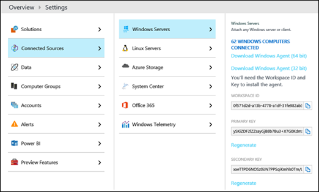

# Monitor Cloud Connector using Operations Management Suite (OMS)

Read this topic to learn how to monitor your Cloud Connector version 2.1 and later deployment by using Microsoft Operations Management Suite (OMS).

You can now monitor your Cloud Connector version 2.1 and later deployment by using Operations Management Suite (OMS), a Microsoft cloud IT management solution. OMS Log Analytics enables you to monitor and analyze the availability and performance of resources including physical and virtual machines. For more information about OMS and Log Analytics, see [What is Operations Management Suite (OMS)?](https://docs.microsoft.com/azure/operations-management-suite/operations-management-suite-overview).

This topic contains the following sections:

- Prerequisites

- Configure Cloud Connector to use OMS

- Configure OMS

- Analyze the alerts in your Log Analytics repository

- Recommended monitoring set

## Prerequisites

Before you can use OMS to monitor your Cloud Connector deployment, you will need the following:

- **An Azure account and an OMS workspace.** If you don't already have an Azure account, you will need to create one to use OMS Log Analytics. For information about how to create an Azure account and set up an OMS workspace, see [Get started with a Log Analytics workspace](https://docs.microsoft.com/azure/log-analytics/log-analytics-get-started).

- **Cloud Connector version 2.1 or later**

- **Log Analytics new log search** is required for Cloud Connector monitoring. For more information, see [Upgrade your Azure Log Analytics workspace to new log search](https://docs.microsoft.com/azure/log-analytics/log-analytics-log-search-upgrade).

## Configure Cloud Connector to use OMS

You'll need to configure your Cloud Connector on-premises environment to use OMS. To do this, you will need your OMS workspace ID and key, which you can find by using the OMS portal as follows: Settings --\>Connected Sources --\> Windows Servers:



How you configure Cloud Connector to use OMS depends on your scenario:

- **If you are installing a new Cloud Connector appliance or you want to re-deploy an appliance**, follow these steps before you run Install-CcAppliance:

1. In the CloudConnector.ini file [Common] section, set the OMSEnabled parameter to True.

    Each time Cloud Connector is deployed or upgraded, it will try to install the OMS agent automatically onto the VMs. Enable this feature so the OMS agent can survive the Cloud Connector automatic update.

2. To configure the OMS ID and key, run Set-CcCredential -AccountType OMSWorkspace. 

- **If you are installing an OMS agent onto an existing Cloud Connector appliance**, follow these steps:

1. In the CloudConnector.ini file [Common] section, set OMSEnabled=true. 

2. Run Import-CcConfiguration. 

3. Run Install-CcOMSAgent. 

    > [!NOTE]
    > If the OMSWorkspace credential has never been set, you are prompted for the credential when you run install-CcOMSAgent. 

- **If you want to update the OMS workspace ID or key in a Cloud Connector appliance that has already installed an OMS agent:**

1. To configure the OMS ID and key, run Set-CcCredential -AccountType OMSWorkspace. 

2. To apply the updates, run Install-CcOMSAgent. 

- **For all scenarios, verify that the agents are connected as follows:**

    In the OMS portal, go to Settings -\> Connected Sources -\> Windows Servers. You will see a list of connected machines. 

## Configure OMS

Next, you will need to specify your OMS configuration by using the OMS portal. Specifically, you will need to:

- Specify information about event logs and performance counters.

- Create alerts. 

### Specify information about event logs and performance counters

In the OMS portal, you must specify information about the event logs and performance counters as follows:

1. Go to Settings-\>Data-\>Windows Event logs, and add event logs for: 

   - Lync Server

   - Application

     > [!NOTE]
     > You must manually enter Lync Server in the text box. It does not appear as an option in the drop-down list. 

     For more information, see [Windows event log data sources in Log Analytics](https://docs.microsoft.com/azure/log-analytics/log-analytics-data-sources-windows-events)

2. Go to Settings-\>Data-\> Windows Performance Counters, and add performance counters for: 

   - **OS level counters**. You can add OS level counters, such as processor usage, memory usage, network usage, or you can use existing solutions such as Capacity and Performance, Network Performance Monitor without adding counters explicitly. No matter how you decide to monitor them, Microsoft recommends that you monitor these OS counters.

   - **Skype for Business counters**. There are numerous counters provided by Skype for Business. You can find these counters by logging on to any Mediation Server and opening the Performance Monitor. These counters start with "LS:". Microsoft recommends that you start with the following capacity counters at a minimum, and add others that are of interest:

     Total active calls:

   - LS:MediationServer - Inbound Calls(_Total)\- Current 

   - LS:MediationServer - Outbound Calls(_Total)\- Current 

     Total active media bypass calls:

   - LS:MediationServer - Inbound Calls(_Total)\- Active media bypass calls 

   - LS:MediationServer - Outbound Calls(_Total)\- Active media bypass calls 

     > [!NOTE]
     > You must manually enter the performance counters in the text box. They do not appear as options in the drop-down list. 

     For more information, see [Windows and Linux performance data sources in Log Analytics](https://docs.microsoft.com/azure/log-analytics/log-analytics-data-sources-performance-counters)

### Create alerts

There are two types of alerts in OMS: Number of results alerts and Metric measurement alerts. For more information about creating alerts, see [Working with alert rules in Log Analytics](https://docs.microsoft.com/azure/log-analytics/log-analytics-alerts-creating).

You should consider the following when creating alerts:

- Make sure the alert is a Number-of-results alert, which is the default selection. 

- The demo queries require that "Number of results" is set to "Greater than 0". 

- It is recommended that you set both Time window and Alert frequency to 5 minutes. 

- It is recommended that you do not enable "Suppress alerts" for demo alerts. 

- For typical alert scenarios, Microsoft recommends creating a pair of alerts: one error alert and one reset alert. For the error alert, select severity level Critical; for the reset alert, select severity level Informational .

The following sections describe how to create sample alerts.

 **Create an alert pair: "RTCMEDSRV is NOT running in Mediation Servers" and "RTCMEDSRV is back in running in Mediation Servers"**

To create this alert pair:

- The query for the error alert is:

  ```
  Event | where Computer contains "MediationServer" | where EventLog == "Lync Server" and (EventID == 25002 or EventID == 25003)  | summarize arg_max(TimeGenerated, EventID) by Computer | where EventID == 25003
  ```

    The query uses the computer filter  *where Computer contains "MediationServer"*  . The filter selects only the computer whose name contains the string "MediationServer".

     You would replace the filter with your own computer filter or simply remove it. You can create complex string filters without regular expressions. For more information, see [String operators](https://docs.loganalytics.io/docs/Language-Reference/Scalar-operators/String-operators). You can also choose to use regular expressions. Moreover, you can create a computer group by saving a search query and using that group as your computer filter in your alert query. For more information, see [Computer groups in Log Analytics log searches](https://docs.microsoft.com/azure/log-analytics/log-analytics-computer-groups).

    For each computer, the error query will get the last event log for both the RTCMEDSRV service start and service stop. It will return one log if the last event is the service stop event; it will return nothing if the last event is the service start event. In short, the query would return a list of servers whose RTCMEDSRV is stopped in the time window. 

- The query for the reset alert is:

  ```
  Event | where Computer contains "MediationServer" | where EventLog == "Lync Server" and (EventID == 25002 or EventID == 25003) | summarize arg_max(TimeGenerated, EventID) by Computer  | where EventID == 2500
  ```

    The reset query does exactly the opposite thing of the error query. For each computer, it will return one if the last event is the service start event; it will return nothing if the last event is the service stop event.

  **Create an alert pair: " Too many concurrent calls in Mediation Servers" and "Concurrent calls fall back to normal load"**

To create this alert:

- The query for the error alert is:

  ```
  Perf | where Computer contains "MediationServer" | where (ObjectName == "LS:MediationServer - Outbound Calls" or ObjectName == "LS:MediationServer - Inbound Calls") | summarize arg_max(TimeGenerated, CounterValue) by ObjectName, Computer | summarize  TotalCalls = sum(CounterValue) by Computer| where TotalCalls >= 500
  ```

    For each computer, the query will get the last counters for inbound call and outbound call and sum those two values. It will return one log if the sum value exceeds 500; it will return nothing if it doesn't. In short, the query would return a list of servers whose concurrent calls are too many in the time window.

- The query for the reset alert is:

  ```
  Perf  | where Computer contains "MediationServer" | where (ObjectName == "LS:MediationServer - Outbound Calls" or ObjectName ==  "LS:MediationServer - Inbound Calls") | summarize arg_max(TimeGenerated, CounterValue) by ObjectName, Computer | summarize  TotalCalls = sum(CounterValue) by Computer| where TotalCalls < 500
  ```

    The reset query does exactly the opposite thing of the error query. For each computer, the query will get the last counters for inbound call and outbound call and sum those two values. It will return one log if the sum value is less than 500; it will return nothing otherwise.

  **Create an alert: "CPU usage \> 90 or RTCMEDIARELAY stopped in Servers" alert**

To create this alert, the query is:

```
search *| where Computer contains "MediationServer" | where (Type == "Perf" or Type == "Event") | where ((ObjectName ==  "Processor" and CounterName == "% Processor Time") or EventLog == "Lync Server") | where (CounterValue > 90 or EventID == 22003)
```

The query will get all processor usage counter and service stop event from all computers and return one log if either processor usage exceeds 90% or service is ever stopped. 

## Analyze the alerts in your Log Analytics repository

To analyze the alerts in your repository, use the Alert Management solution. For more information, see [Alert Management solution in Operations Management Suite (OMS)](https://docs.microsoft.com/azure/log-analytics/log-analytics-solution-alert-management)

## Recommended minimal monitoring set

To identify issues with event logs and performance counters: 

- **Event logs.** For any issue, there should be an events pair, with one set of events to indicate something is wrong, while the other indicates that everything is well. For any given time period, it is the last event recorded that will indicate whether something is amiss for that time period.

- **Performance Counters.** There should be a threshold for the monitored counters.

The following table lists the services that Microsoft recommends monitoring by listing the stop and start event IDs:

|Service Name  <br/> |Target Server Role  <br/> |Stop Event ID  <br/> |Start Event ID  <br/> |
|:-----|:-----|:-----|:-----|
|RTCMEDSRV  <br/> |Mediation Server  <br/> |25003  <br/> |25002  <br/> |
|RTCSRV  <br/> |Edge Server  <br/> |12289  <br/> |12288  <br/> |
|RTCMRAUTH  <br/> |Edge Server  <br/> |19003  <br/> |19002  <br/> |
|RTCMEDIARELAY  <br/> |Edge Server  <br/> |22003  <br/> |22002  <br/> |

The following table lists the network issues that Microsoft recommends monitoring:


| Monitor Name  <br/>                                        | Target Server Role  <br/> | Success Event ID expression  <br/> | Error Event ID expression  <br/> | Failure example  <br/> |
|:-----------------------------------------------------------|:--------------------------|:-----------------------------------|:---------------------------------|:-----------------------|
| Mediation Server to gateway connectivity failure  <br/>    | Mediation Server  <br/>   | 25062                              |                                  | 25002  <br/>           |
| Mediation Server to gateway call completion failure  <br/> | Mediation Server  <br/>   | 25064                              |                                  | 25002  <br/>           |
| Critical network problems  <br/>                           | Edge Server  <br/>        | 14353                              |                                  | 12288  <br/>           |

The following lists the call capacity counters that should be monitored. These numbers should be less that 500 for Cloud Connector standard edition; less than 50 for Cloud Connector minimum edition.

- LS:MediationServer - Inbound Calls(_Total)\- Current 

- LS:MediationServer - Outbound Calls(_Total)\- Current 

- LS:MediationServer - Inbound Calls(_Total)\- Active media bypass calls

- LS:MediationServer - Outbound Calls(_Total)\- Active media bypass calls

## See also

For more information about working with OMS, see the following:

- [Find data using log searches in Log Analytics](https://docs.microsoft.com/azure/log-analytics/log-analytics-log-searches)

- [Azure Log Analytics Language Reference](https://docs.loganalytics.io/docs/Language-Reference)

- [Understanding alerts in Log Analytics](https://docs.microsoft.com/azure/log-analytics/log-analytics-alerts)

- [Connect Windows computers to the Log Analytics service in Azure](https://docs.microsoft.com/azure/log-analytics/log-analytics-windows-agents)


