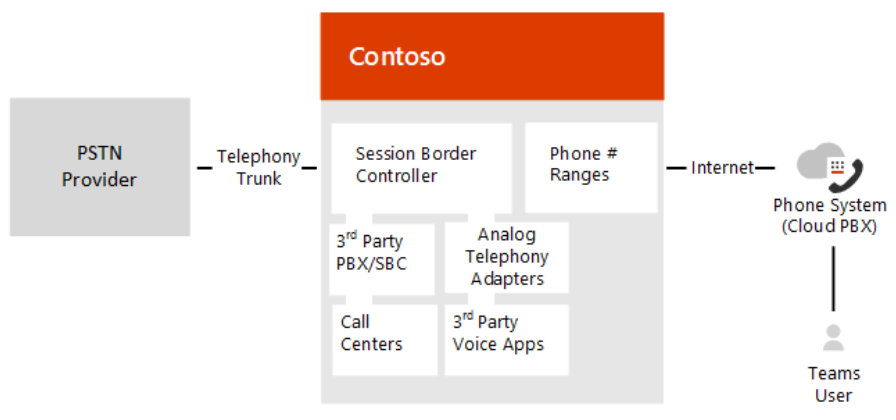

# Plan Direct Routing

Microsoft Phone System Direct Routing lets you connect a supported, customer-provided Session Border Controller (SBC) to Microsoft Phone System.  With this capability, for example, you can configure on-premises PSTN connectivity with Microsoft Teams client, as shown in the following diagram: 



  > [!NOTE]
  > Skype for Business Online also lets you pair a customer-provided SBC, but requires an on-premises Skype for Business Server deployment or a special edition of Skype for Business, called Cloud Connector, in between the SBC and the Microsoft Cloud. This scenario is known as hybrid voice. In contract, Direct Routing allows a direct connection between the supported SBC and the Microsoft Cloud. 

With Direct Routing, you can connect your SBC to almost any telephony trunk or interconnect with third-party Public Switched Telephone Network (PSTN) equipment. Direct Routing enables you to: 

- Use virtually any PSTN trunk with Microsoft Phone System. 
- Configure interoperability between customer-owned telephony equipment, such as a third-party private branch exchange (PBX), analog devices, and Microsoft Phone System.

With Direct Routing, you can connect your SBC to almost any telephony trunk or interconnect with third-party Public Switched Telephone Network (PSTN) equipment. Direct Routing enables you to: 

- Use virtually any PSTN trunk with Microsoft Phone System. 
- Configure interoperability between customer-owned telephony equipment, such as a third-party private branch exchange (PBX), analog devices, and Microsoft Phone System.

Microsoft also offers all-in-the-cloud voice solutions, such as Calling Plan.  However, a hybrid voice solution might be best for your organization if: 

- Microsoft Calling Plan is not available in your country. 
- Your organization requires connection to third-party analog devices, call centers, and so on. 
- Your organization has an existing contract with a PSTN carrier.

Direct Routing also supports users who have the additional license for the Microsoft Calling Plan. For more information, see [Calling Plans in Office 365](https://docs.microsoft.com/en-us/skypeforbusiness/what-are-calling-plans-in-office-365/what-are-calling-plans-in-office-365) and [Licensing requirements](**no URL for this link**). 

With Direct Routing, when users participate in a scheduled conference, the dial-in number is provided by Microsoft Audio Conferencing service, which requires proper licensing.  When dialing out, the Microsoft Audio Conferencing service places the call using online calling capabilities, which requires proper licensing. (Note that dialing out does not route through Direct Routing.) For more information, see [Online Meetings with Teams](https://products.office.com/en-us/microsoft-teams/online-meeting-solutions). 
 
Planning your deployment of Direct Routing is key to a successful implementation. This article describes infrastructure and licensing requirements, and provides information about SBC connectivity: 

- [Infrastructure requirements](#infrastructure-requirements)
- [Licensing and other requirements](#licensing-and-other-requirements)
- [SBC domain names]()
- [Public trusted certificate for the SBC]()
- [SIP Signaling: FQDNs and firewall ports]()
- [Media traffic: IP addresses and port ranges]()
- [Supported SBCs]()

For detailed information about configuring Direct Routing, see [Configure Microsoft Phone System Direct Routing](**insert link when live**).

## Infrastructure requirements
The infrastructure requirements for the supported SBCs, domains, and other network connectivity requirements to deploy Direct Routing are listed in the following table:  

|**Infrastructure requirement**|**You need the following**|
|:--- |:--- |
|Session Border Controller (SBC)|A supported SBC. For more information, see [Supported SBCs](**NEED URL**)).|
|Telephony trunks connected to the SBC|One or more telephony trunks connected to the SBC. On one end, the SBC connects to the Microsoft Phone System via Direct Routing. The SBC can also connect to third-party telephony entities, for example, PBXs, Analog Telephony Adapters, and so on. Any PSTN connectivity option connected to the SBC will work. (Note: For configuration of the PSTN trunks to SBC, please refer to the SBC vendors or trunk providers.)|
|Office 365 tenant|An Office 365 tenant that you use to home your Microsoft Teams users, and the configuration and connection to the SBC.|
|User registrar|User must be homed in Office 365.<br/>If your company has an on-premises Skype for Business or Lync environment with hybrid connectivity to Office 365, you cannot enable voice in Teams for a user homed on-premises.<br/><br/>To check the registrar of a user, use the following Skype for Business Online PowerShell cmdlet:<br/><br/>```Get-CsOnlineUser -Identity <user> | fl HostingProvider```<br/>The output of the cmdlet should show:<br/><br/> ```HostingProvider : sipfed.online.lync.com```|
|Domains|One or more domains added to your Office 365 tenants.<br/><br/>**Note:** You cannot use the default domain, *.onmicrosoft.com; that is automatically created for your tenant.<br/><br/>To view the domains, you can use the following Skype for Business Online PowerShell cmdlet:<br/>```Get-CsTenant | fl Domains```<br/><br/>For more information about domains and Office 365 tenants, see [Domains FAQ](https://support.office.com/en-us/article/Domains-FAQ-1272bad0-4bd4-4796-8005-67d6fb3afc5a).|
|Public IP address for the SBC|A public IP address that can be used to connect to the SBC. Based on the type of SBC, the SBC can use NAT.|
|Fully Qualified Domain Name (FQDN) for the SBC|A FQDN for the SBC, where the domain portion of the FQDN is one of the registered domains in your Office 365 tenant. For more information, see [SBC Domain names](**NEED URL**).|
|Public DNS entry for the SBC |A public DNS entry mapping the SBC FQDN to the public IP Address. |
|Public trusted certificate for the SBC |A certificate for the SBC to be used for all communication with Direct Routing. For more information, see [Public trusted certificate for the SBC](**NEED URL**).|
|Connection points for Direct Routing |The connection points for Direct Routing are the following three FQDNs:<br/><br/>```sip.pstnhub.microsoft.com``` – Global FQDN, must be tried first.<br/>```sip2.pstnhub.microsoft.com``` – Secondary FQDN, geographically maps to the second priority region.<br/>```sip3.pstnhub.microsoft.com``` – Tertiary FQDN, geographically maps to the third priority region.<br/><br/>For information on configuration requirements, see [SIP Signaling: FQDNs and firewall ports](**NEED URL**).|
|Firewall IP addresses and ports for Direct Routing media |The SBC communicates to the following services in the cloud:<br/><br/>SIP Proxy, which handles the signaling<br/>Media Processor, which handles media -except when Media Bypass is on<br/><br/>These two services have separate IP addresses in Microsoft Cloud, described later in this document.<br/><br/>For more information, see the [Microsoft Teams section](https://support.office.com/en-us/article/Office-365-URLs-and-IP-address-ranges-8548a211-3fe7-47cb-abb1-355ea5aa88a2#bkmk_teams) in [Office 365 URLs and IP address ranges](https://support.office.com/en-us/article/Office-365-URLs-and-IP-address-ranges-8548a211-3fe7-47cb-abb1-355ea5aa88a2). |
|Media Transport Profile|TCP/RTP/SAVP <br/>UDP/RTP/SAVP|
Firewall IP addresses and ports for Microsoft Teams media |For more information, see [Office 365 URLs and IP address ranges](https://support.office.com/en-us/article/Office-365-URLs-and-IP-address-ranges-8548a211-3fe7-47cb-abb1-355ea5aa88a2). |
|||

## Licensing and other requirements 


Key scenarios


Requirements/Prerequisites


Link to deploy topic


