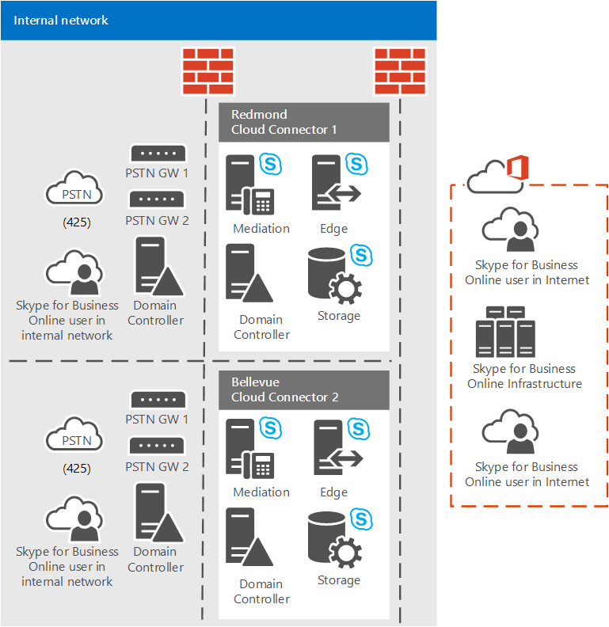

# Plan for Cloud Connector Edition PSTN sites
 
Read this topic to learn how to plan your Cloud Connector Edition PSTN sites to ensure efficient and cost effective call routing.
  
This topic describes what you need to know about Cloud Connector Edition and call routing so that you can plan your Cloud Connector PSTN sites. A PSTN site is a combination of Cloud Connector appliances, deployed at the same location, and with common PSTN gateways connected to them. This topic focuses on how to set up your Cloud Connector site topology to ensure that your Cloud Connector sites can handle both inbound and outbound routing for all users assigned to a site in the most cost efficient and effective way possible. For more information about Cloud Connector and the benefits of PSTN sites, be sure to read [Plan for Skype for Business Cloud Connector Edition](plan-skype-for-business-cloud-connector-edition.md). 
  
## Cloud Connector PSTN sites and call routing

Cloud Connector PSTN sites are a topology construct created to prevent unnecessary long distance and inter-country tariffs, and to ensure that outbound emergency calls are routed to the appropriate trunk. To ensure cost effective and efficient routing of calls, including calls to emergency services, you must carefully plan your PSTN sites and how users are assigned to each site. 
  
As part of your planning for Cloud Connector, it is essential that you talk to your carriers about where your offices and users are located, and where the PSTN trunks terminate from the carrier. You need to work with your carriers to determine how emergency calls can be routed, and then use that information to define Cloud Connector PSTN sites and assign users to the appropriate sites. For example, you should ensure that the trunks that terminate at a datacenter where the PSTN site is stretched are configured to handle both inbound and outbound routing for all of the numbers assigned to the users at that site. 
  
Each Cloud Connector appliance can be connected to several IP Gateways, IP PBXs, or Session Border Controllers (SBCs). Because the Gateways and PBXs are connected to telco trunks (PRI or SIP trunks), Cloud Connector appliances are logically connected to PSTN trunks for inbound and outbound calls. With Cloud Connector and on-premises PSTN connectivity, you obtain the trunk and the associated phone numbers from your local carrier. If your business is a large enterprise, you might have more than one carrier—especially if your business spans more than one city, state, or country. Because your carrier owns the phone number, the carrier is responsible for handling emergency calls.
  
Skype for Business Online treats all Cloud Connector appliances in a site equally, and will route outbound calls on a rotating basis to Cloud Connector appliances in the same site. Each Cloud Connector in a site is cross connected to the same set of PSTN trunks (fully meshed). Because each user is associated with a Cloud Connector PSTN site, any outbound call from that user (normal or emergency) will be assigned to one of the Cloud Connector appliances in the PSTN site that the user is associated with. 
  
Cloud Connector does static call routing to its attached IP Gateways, IP-PBXs, SBCs or direct PSTN trunks. Cloud Connector is not yet capable of dynamic routing to a trunk based on destination (for least cost routing) or based on origin (static or dynamic emergency calling). Inbound calls are not a problem since the call can only come from a trunk associated with the number. Outbound calls, however, can go to any Cloud Connector appliance in a site (and by extension the PSTN trunks attached to that Cloud Connector appliance) which can cause unwanted long distance calls. Furthermore, emergency calls will not go through if the Cloud Connector PSTN site is stretched across datacenters with different area codes or carriers.
  
## An example

The following example shows how to group trunks to PSTN sites and how to assign users to the sites. For Contoso company, assume the following:
  
- There are four users: 
    
  - User A in Redmond WA (USA)
    
  - User B in Bellevue WA (USA)
    
  - User C in Centralia WA (USA)
    
  - User D in Portland OR (USA)
    
- Carrier A provides phone numbers and trunks in:
    
  - Redmond (area code 425)
    
  - Bellevue (area code 425)
    
  - Centralia (area code 360)
    
- Carrier B provides phone numbers and trunks in:
    
  -  Portland (area code 503)
    
Because user A in Redmond (Data Center A) and user B in Bellevue (Data Center B) are in suburbs next to each other and in the same area code (425), Carrier A should be able to take an Emergency Call from user A in Redmond on the trunk in Bellevue. 
  
Consequently, users A and B, and the Cloud Connector trunks for Bellevue and Redmond, can likely be in the same Cloud Connector PSTN site as shown in the following diagram. Emergency calls from users in one office can be routed to trunks in the other. You should, however, check with your carrier that this will work.
  

  
Consider the following examples as well:
  
- User C in Centralia, whose number is provided by Carrier A, is a two hour drive away, and in a different area code (360), from other Carrier A users in the Bellevue and Redmond 425 area code. 
    
    Therefore, even if a call is coming from Carrier A, it is possible that the carrier's call routing software in Centralia area code 360 may reject an incoming emergency call originating from user B in Bellevue area code 425. In this case it is critical that the carrier confirm that Cloud Connector and its associated trunks in the Centralia PSTN sites can handle calls across distances and area codes.
    
- User D in Portland uses a number and trunk provided by Carrier B, so it is highly unlikely that Carrier B will take an emergency call from a phone number that is owned by Carrier A. So user D and the Cloud Connector appliance and associated trunks in Portland will have to be located in a different PSTN site.
    

