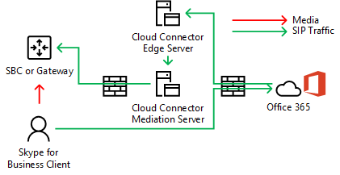
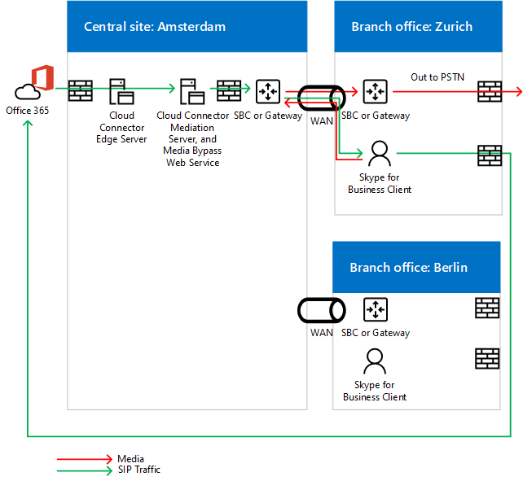
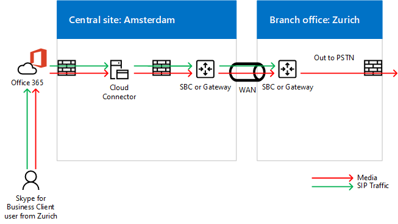
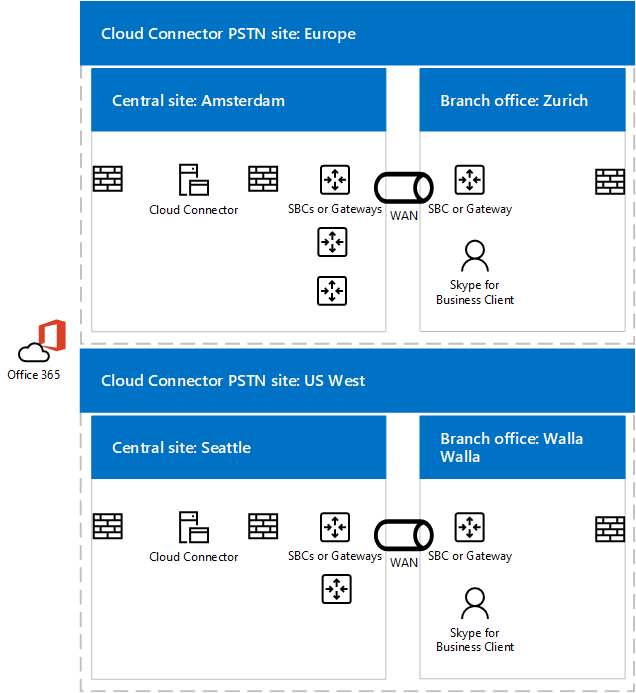

# Plan for media bypass in Cloud Connector Edition
 
Read this topic to review planning considerations for implementing media bypass with Cloud Connector Edition version 2.0 and later. For information about deploying media bypass, see [Deploy media bypass in Cloud Connector Edition](deploy-media-bypass-in-cloud-connector.md).
  
Media bypass allows a client to send media directly to the Public Switched Telephone Network (PSTN) next hop—a gateway or Session Border Controller (SBC)—and eliminate the Cloud Connector Edition component from the media path.
  
Media bypass can improve voice quality by reducing latency, the possibility of packet loss, and the number of points of potential failure. Elimination of media processing for bypassed calls reduces the load on Cloud Connector, which enables a higher number of concurrent calls, and can improve scalability. 
  
 Freeing Cloud Connector from media processing tasks may reduce the number of Cloud Connector appliances an infrastructure requires, so you should enable media bypass whenever possible.
  
## How media bypass affects media and signaling pathways

While signaling takes the same path with or without media bypass, the media flow will differ. The following diagrams show media and signaling pathways in topologies with and without media bypass. 
  
For example, in the following topology—which does not employ media bypass—a Skype for Business client places a PSTN call to an external number, the SIP signaling goes to Office 365, and Office 365 then directs the signaling traffic according to the end-user voice policy. For Cloud Connector users, the voice policy directs signaling traffic to the Cloud Connector Edge Server, which then routes the signaling traffic to a PSTN Session Border Controller (SBC) or gateway via the Cloud Connector Mediation Server. Media flows from the Skype for Business client to the Cloud Connector Mediation Server, and then to the SBC or gateway, as shown in the following diagram:
  
**Media and signaling pathways without media bypass**

  
An inbound call from the PSTN uses the same signaling path in the reverse direction. For internal users, media will still ultimately flow between the Skype for Business client and the Cloud Connector Mediation Server and then the SBC or gateway.
  
In the next topology—which does employ media bypass—signaling takes the same path, but media flows directly between the Skype for Business client and the SBC or gateway, as shown in the following diagram:
  
**Media and signaling pathways with media bypass**

  
## Multi-site scenario and media bypass

Media bypass is also useful when you want to provide telephony services to multiple sites using a single Cloud Connector appliance. Because Cloud Connector cannot route calls based on source or destination numbers, most enterprises deploy an SBC or gateway behind Cloud Connector to make routing decisions. Media bypass in this scenario eliminates the hop between the client and the central SBC or gateway, as shown in the following diagram:
  
**Multi-site application**

  
1. The SIP traffic flows from the user in Zurich to Office 365.
    
2. The traffic then routes to the Cloud Connector appliance in Amsterdam as specified in the user voice routing policy.
    
3. The Cloud Connector appliance in Amsterdam sends the SIP traffic to the central gateway in Amsterdam.
    
4. The central gateway in Amsterdam makes the appropriate routing decisions, and then sends the traffic to an SBC or gateway in Zurich, while media flows directly between the Skype for Business client and SBC or gateway in Amsterdam.
    
   This approach allows serving more users per one Cloud Connector deployment where Cloud Connector is centralized. Even though Cloud Connector is eliminated from the media path, in a centralized multi-site scenario media may still traverse the WAN twice as required to flow through the centralized SBC or gateway.
  
If a client is outside the corporate network placing an outbound call, the media traffic flows via the Edge and Mediation servers of Cloud Connector and WAN link between Zurich and Amsterdam, as shown in the following diagram:
  

  
## Supported clients for media bypass

With the first release of media bypass, the only supported client is the Skype for Business 2016 Windows Client that is part of Office 365 ProPlus, version 16.0.7870.2020 or greater. Customers can use any channel: Current, Deferred, or First Release Deferred. 
  
> [!NOTE]
> If you are using a client VPN solution in combination with the Skype for Business client, then media bypass is supported only with a VPN split-tunnel configuration. 
  
For more information about the release channels, see [Overview of update channels for Office 365 ProPlus](https://support.office.com/en-us/article/Overview-of-update-channels-for-Office-365-ProPlus-9ccf0f13-28ff-4975-9bd2-7e4ea2fefef4?ui=en-US&amp;rs=en-US&amp;ad=US).
  
For the current release version of the clients in different channels, see [Release information for updates to Office 365 ProPlus](https://docs.microsoft.com/officeupdates/release-notes-office365-proplus). 
  
## Cloud Connector capacity considerations with media bypass

Without media bypass—and depending on the hardware—a Cloud Connector appliance can handle from 50 to 500 simultaneous calls that require media to travel through a Mediation Server. For more information, see [Plan for Skype for Business Cloud Connector Edition](https://technet.microsoft.com/en-us/library/mt605227.aspx). 
  
With media bypass enabled, internal clients on the supported version do not use the Mediation Server, so the number of internal clients can increase significantly. 
  
As noted above, external clients or unsupported clients will use the Cloud Connector Edge and Mediation servers for media. When calculating how many Cloud Connector appliances should be placed in a site, you must consider traffic from external users and users on unsupported clients.
  
## Cloud Connector supports Always Bypass mode

Cloud Connector supports Always Bypass mode only. In on-premises environments, there are two options: Always Bypass and Use Site and Region Information.
  
Always Bypass means that media bypass will be attempted for all PSTN calls with internal clients as an origin or destination point. To determine if the client is internal or external, a web site on the mediation server virtual machine is used. If the client can reach the site, it is considered internal and media bypass is used. If the client cannot reach the site (for example the client is on a home network), media bypass is not used. 
  
Always Bypass requires unobstructed connectivity between users and the PSTN gateways within a PSTN Site. 
  
For more information, see [Plan for Skype for Business Cloud Connector Edition](https://technet.microsoft.com/en-us/library/mt605227.aspx). 
  
For example, in the diagram below, Europe users must be well connected to the three Session Border Controllers (SBCs) in Amsterdam while US West users must be well connected to the two SBCs in Seattle. Well connected means that they are either located in the same network sites as the SBCs or gateways, or over WAN links that have proper bandwidth.
  

  
> [!NOTE]
> If a user from Zurich travels to the Seattle office, and you want to use the internal network to deliver media traffic between the traveling user and gateways in Europe (as opposed to going over the Internet), then you must make sure the Seattle office and the Amsterdam office where European SBCs or gateways are located qualify as well connected. 
  
## Codecs used in media bypass

With media bypass enabled, media traffic between a client and an SBC or gateway uses the G.711 codec. 
  
## See also

[Deploy media bypass in Cloud Connector Edition](deploy-media-bypass-in-cloud-connector.md)
