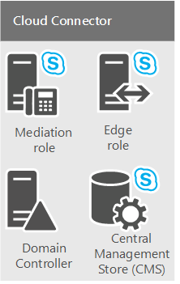
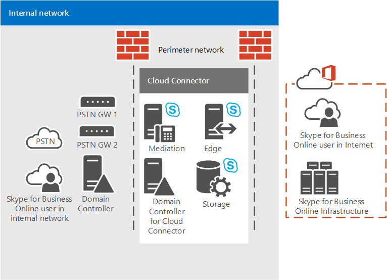
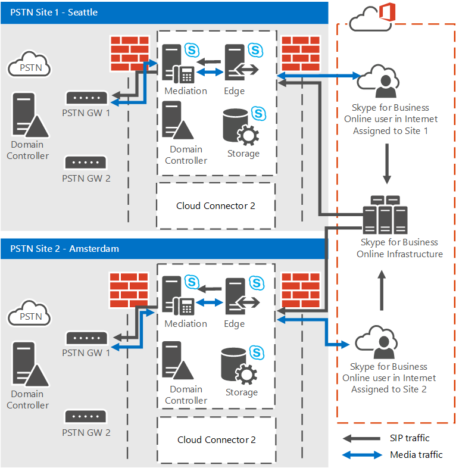
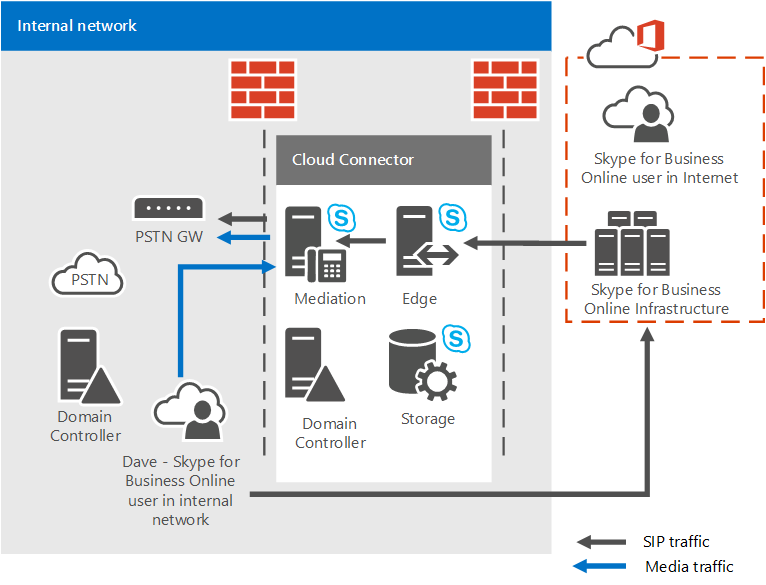
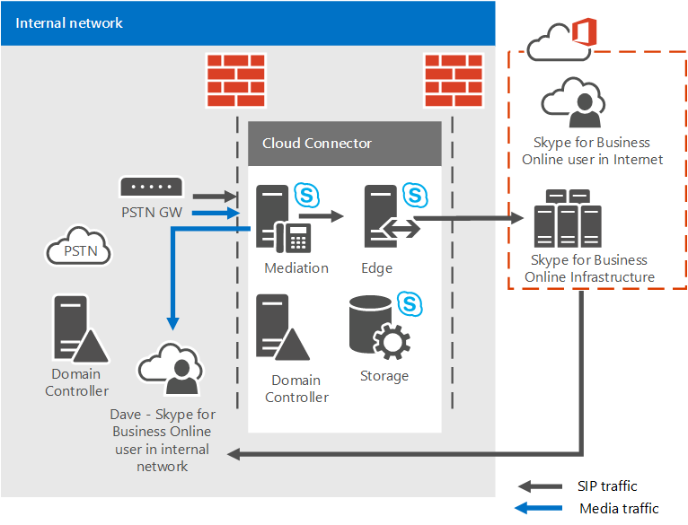

# Plan for Skype for Business Cloud Connector Edition

Find information on Skype for Business Cloud Connector Edition, a set of packaged Virtual Machines (VMs) that implement on-premises PSTN connectivity with Phone System in Office 365 (Cloud PBX).

Cloud Connector Edition might be the right solution for your organization if you do not already have an existing Lync Server or Skype for Business Server deployment. If you're still investigating which Phone System in Office 365 solution is right for your business, see [Microsoft telephony solutions](https://docs.microsoft.com/en-us/SkypeForBusiness/hybrid/msft-telephony-solutions).

This document describes Cloud Connector Edition requirements and supported topologies, and helps you plan your Cloud Connector Edition deployment. Be sure to read this topic before you configure your Cloud Connector environment. When you are ready to deploy and configure Cloud Connector Edition, see [Configure and manage Skype for Business Cloud Connector Edition](configure-skype-for-business-cloud-connector-edition.md).

Cloud Connector Edition 2.1 is now available. If you have not yet upgraded to 2.1, see [Upgrade to a new version of Cloud Connector](upgrade-to-a-new-version-of-cloud-connector.md). You can find the installation file at [https://aka.ms/CloudConnectorInstaller](https://aka.ms/CloudConnectorInstaller).

> [!NOTE]
> Microsoft supports the previous version of Cloud Connector Edition for 60 days after the release of a new version. Microsoft will support version 2.0.1 for 60 days after the release of 2.1 to allow you time to upgrade. All versions previous to 2.0.1 are no longer supported.

Cloud Connector Edition is a hybrid offering that consists of a set of packaged Virtual Machines (VMs) that implement on-premises PSTN connectivity with Phone System in Office 365. By deploying a minimal Skype for Business Server topology in a virtualized environment, users in your organization who are homed in the cloud can receive PBX services from the Microsoft cloud, but PSTN connectivity is provided through the existing on-premises voice infrastructure.


Because Cloud Connector enables you to integrate Phone System in Office 365 services with your existing telephony environment—for example, PBX, analog devices, and Call Centers—you can implement a phased migration from your existing telephony solution to Phone System in Office 365.

For example, assume your company has a sophisticated Call Center with specific functionality that Phone System in Office 365 does not provide. You can choose to leave Call Center users with the existing solution, but move other users to Phone System in Office 365.

Cloud Connector will provide routing between the users homed on premises and online, and you can choose to use your own PSTN provider with Phone System in Office 365.

Consider the following when planning your Cloud Connector Edition deployment:

- To use Cloud Connector to take advantage of cloud voice solutions, you'll need to sign up for an Office 365 tenant that includes Phone System in Office 365. If you do not yet have an Office 365 tenant you can learn how to sign up here: [Office 365 for Business](https://products.office.com/en-us/business/office). Note that you'll need to sign up for a plan that includes Skype for Business Online.

- To register Cloud Connector appliances with the Skype for Business Online service, and to run various cmdlets, Cloud Connector 2.0 and later requires a dedicated Office 365 account with the Skype for Business Tenant Administrator rights. Cloud Connector versions previous to 2.0 require a dedicated Office 365 account with tenant Global Administrator rights.

- Cloud Connector does not require a full on-premises Skype for Business Server deployment.

    Currently, Cloud Connector cannot co-exist with Lync or Skype for Business on-premises servers. If you want to move existing Lync or Skype for Business users to Office 365 and keep providing on-premises telephony to your users, consider Phone System in Office 365 with on-premises connectivity using an existing Skype for Business Server deployment. For more information, see [Plan your Phone System in Office 365 (Cloud PBX) solution](plan-your-phone-system-cloud-pbx-solution.md) and [Plan Phone System in Office 365 with on-premises PSTN connectivity in Skype for Business Server](plan-phone-system-with-on-premises-pstn-connectivity.md).

- If you had a previous Skype for Business or Lync Server deployment, and you extended the schema, you do not need to clean up the schema for the Cloud Connector deployment, as long as you've removed all Skype for Business or Lync Server components from your environment.

- Your users are homed online.

- If your organization has configured Directory Synchronization (DirSync), then all accounts of users who are planned for hybrid voice must be created in your on-premises deployment first, and then synchronized to the cloud.

- You can keep your current PSTN carrier if required.

- If you want to provide dial-in conferencing to users hosted on Cloud Connector, you can purchase PSTN conferencing license or pay as you go Audio Conferencing offer from Microsoft.

- The Audio Conferencing license (or pay as you go offer) also required for call escalations. If a Skype for Business user receives a call from an external PSTN user and wants to add one more participant to that call (escalate the call to a conference), the escalation will be performed via Microsoft Audio Conferencing service.

- Cloud Connector 2.0 and later now supports media bypass. Media bypass allows a client to send media directly to the Public Switched Telephone Network (PSTN) next hop—a gateway or Session Border Controller (SBC)—and eliminate the Cloud Connector Edition component from the media path. For more information, see [Plan for media bypass in Cloud Connector Edition](plan-for-media-bypass-in-cloud-connector-edition.md).

- Cloud Connector 2.1 and later supports monitoring Cloud Connector using Operations Management Suite (OMS). For more information, see [Monitor Cloud Connector using Operations Management Suite (OMS)](monitor-cloud-connector-using-operations-management-suite-oms.md)

- Cloud Connector is available in all countries where Office 365 Enterprise E5 is available.

This topic contains the following sections:

- [Cloud Connector Edition components](plan-skype-for-business-cloud-connector-edition.md#BKMK_Components)

- [Cloud Connector Edition topologies](plan-skype-for-business-cloud-connector-edition.md#BKMK_Topologies)

- [Requirements for deployment](plan-skype-for-business-cloud-connector-edition.md#BKMK_Requirements)

- [Information you need to gather before deployment](plan-skype-for-business-cloud-connector-edition.md#BKMK_PlanDeployment)

- [Dial plan considerations](plan-skype-for-business-cloud-connector-edition.md#BKMK_DailPlan)

- [High availability considerations](plan-skype-for-business-cloud-connector-edition.md#BKMK_HA)

- [Cloud Connector media flow](plan-skype-for-business-cloud-connector-edition.md#BKMK_MediaFlow)

- [Monitoring and troubleshooting](plan-skype-for-business-cloud-connector-edition.md#BKMK_Monitor)

- [For more information](plan-skype-for-business-cloud-connector-edition.md#BKMK_MoreInfo)

## Cloud Connector Edition components
<a name="BKMK_Components"> </a>

With Cloud Connector Edition, you deploy a set of packaged VMs that contain a minimal Skype for Business Server topology—consisting of an Edge component, Mediation component, and a Central Management Store (CMS) role. You will also install a domain controller, which is required for the internal functioning of Cloud Connector. These services are configured for hybrid with your Office 365 tenant that includes Skype for Business Online services.



Cloud Connector components provide the following functionality:

- **Edge component** - Communication between the on-premises topology and the online services goes through the Edge component, which includes the following components:

  - **Access Edge** - Provides SIP routing between the on-premises deployment and Skype for Business Online.

  - **Media Relay** - Provides routing of media between the Mediation component and other media endpoints.

  - **Media Relay Authentication / MRAS** - Generates tokens for access to media relay.

- **Outbound Routing** - Provides load balancing of the voice traffic between gateways or SBCs connected to a Cloud Connector appliance. Calls will be split evenly between all gateways or SBCs connected to the Cloud Connector appliance.

    Provides routing to gateways based on policies. Only global policies which are based on destination (outbound) PSTN numbers are supported.

- **Central Management Store (CMS) role** - Includes the configuration store for the topology components, including CMS File Transfer.

- **Central Management Store (CMS) replica** - Synchronizes configuration information from the global CMS DB on the CMS role server.

- **Domain controller** - Cloud Connector Active Directory Domain Services to store all the global settings and groups necessary to deploy Cloud Connector components. One forest will be created for each Cloud Connector appliance. The domain controller must not have any connections with the production Active Directory. Active Directory services include:

  - Active Directory Domain Services

  - Active Directory Certificate Services to issue internal certificates

- **Mediation component** - Implements SIP and Media gateway mapping protocol between Skype for Business and PSTN gateways. Includes a CMS replica that synchronizes configuration from the global CMS database.

## Cloud Connector Edition topologies
<a name="BKMK_Topologies"> </a>

For purposes of this discussion, we will refer to PSTN sites. A PSTN site is a combination of Cloud Connector appliances, deployed at the same location, and with common PSTN gateways connected to them. PSTN sites allow you to:

- Provide connectivity to gateways that are closest to your users.

- Allow for scalability by deploying multiple Cloud Connector appliances within one or more PSTN sites.

- Allow for high availability by deploying multiple Cloud Connector appliances within a single PSTN site.

This topic introduces PSTN sites. For more information about planning your PSTN sites, see [Plan for Cloud Connector Edition PSTN sites](plan-for-cloud-connector-edition-pstn-sites.md).

You can deploy the following Cloud Connector topologies:

- A single Cloud Connector Edition appliance per PSTN site. This topology is recommended for evaluation purposes only because it does not provide high availability.

- Multiple Cloud Connector Edition appliances per PSTN site to provide high availability.

- Multiple PSTN sites with multiple Cloud Connector Edition appliances to provide scalability with high availability. You can deploy up to 200 sites.

When planning your topology, consider the following:

- With Cloud Connector 2.0 and later, one PSTN site can have up to 16 Cloud Connector appliances. Previous versions support up to 4 appliances per site.

- There are two types of hardware configurations tested with Cloud Connector:

  - The larger version is capable of handling large volumes of simultaneous calls and is supported in all types of production environments.

  - The smaller version is intended to run on lower-end hardware and can be used for evaluation purposes or for sites with low call volumes. If you deploy a smaller version of Cloud Connector, you still need to be mindful of production-class hardware requirements (such as dual power supplies).

- If you have Cloud Connector version 2.0 or later and you deploy the maximum configuration of 16 appliances (with larger hardware), then your PSTN site can handle up to 8,000 simultaneous calls. If you deploy the smaller version, the supported limit is 800.

    You also need to dedicate some appliances for High Availability. The minimal recommendation is that one appliance should be reserved for High Availability.

  - With version 2, If you deploy a 15+1 configuration, your PSTN site can handle up to 7,500 simultaneous calls.

  - If you have an earlier version, and deploy the maximum 3 + 1 configuration (with larger hardware), then your PSTN site can handle up to 1500 simultaneous calls. If you deploy the smaller version, the supported limit is 150.

-  If you need to have more calls per PSTN site, you can scale up by deploying additional PSTN sites in the same location.

> [!NOTE]
> Unless noted, the diagrams and examples below assume the use of the larger version of Cloud Connector.

### Single Cloud Connector appliance within a single PSTN site

The following diagram shows a single Cloud Connector Edition appliance within a single PSTN site. Note that Cloud Connector consists of four VMs installed on one physical host machine that is within a perimeter network for security purposes.



### Multiple Cloud Connector appliances within a single PSTN site

 For scalability and high availability purposes, you can choose to have multiple Cloud Connector Editions within a single PSTN site as shown in the following diagram. Consider the following:

- Calls are distributed in random order between Cloud Connectors in one pool.

- For capacity planning purposes, you must consider the ability to handle the load if one or more Cloud Connectors go offline, based on the following calculations:

  - **N+1 boxes.** For the larger version of Cloud Connector, N+1 boxes support 500\*N concurrent calls with 99.8% availability.

    For the smaller version of Cloud Connector, N+1 boxes support 50\*N concurrent calls with 99.8% availability.

  - **N+2 boxes.** For the larger version of Cloud Connector, N+2 boxes support 500\*N concurrent calls with 99.9% availability.

    For the smaller version of Cloud Connector, N+2 boxes support 50\*N concurrent calls with 99.9% availability.


### Multiple PSTN sites with one or more Cloud Connectors per site

You can also choose to have multiple PSTN sites with one or more Cloud Connector Editions in each site. If your PSTN site reaches the limit of simultaneous calls, you can add another PSTN site to handle the load.

Multiple PSTN sites also allow you to provide connectivity to gateways that are closest to your users. For example, assume you have PSTN gateways in Seattle and Amsterdam. You can deploy two PSTN sites—one in Seattle, one in Amsterdam—and assign users to use the PSTN site that is closest to them. Users from Seattle will be routed to the Seattle PSTN site and gateways, while users in Amsterdam will be routed to the Amsterdam PSTN site and gateways:



## Requirements for deployment
<a name="BKMK_Requirements"> </a>

Before you deploy Cloud Connector Edition, make sure you have the following for your environment:

- **For the host machine -** Cloud Connector VMs must be deployed on dedicated hardware running Windows Server 2012 R2 Datacenter edition (English) with the Hyper-V role enabled.

    For version 2.0 and later, the host computer network card bound to the Skype for Business Corpnet switch must have an IP address configured in the same subnet as the Cloud Connector corporate network machines.

- For versions 2.1 and later, the host appliance must have .NET Framework 4.6.1 or later installed.

- **For the virtual machines -** A Windows Server 2012 R2 ISO (English) image (.iso). The ISO will be converted to VHDs for the virtual machines that will run Skype for Business Cloud Connector Edition.

- The necessary hardware to support installation of the 4 VMs for each Cloud Connector Edition in your deployment. The following configurations are recommended:

  - 64-bit dual processor, six core (12 real cores), 2.50 gigahertz (GHz) or higher

  - 64 gigabytes (GB) ECC RAM

  - Four 600 GB (or better) 10K RPM 128M Cache SAS 6Gbps disks, configured in a RAID 5 configuration

  - Three 1 Gbps RJ45 high throughput network adapters

- If you choose to deploy the smaller version of Cloud Connector Edition that supports up to 50 simultaneous calls, you will need the following hardware:

  - Intel i7 4790 quad core with Intel 4600 Graphics (no high end graphics needed)

  - 32 GB DDR3-1600 non ECC

  - 2: 1TB 7200RPM SATA III (6 Gbps) in RAID 0

  - 2: 1 Gbps Ethernet (RJ45)

- If a proxy server is required on the host machine for browsing the Internet, then you must make the following configuration changes:

  - To bypass the proxy, specify WinHTTP Proxy settings set with your proxy server and a Bypass-list including the "192.168.213.\*" network used by your Cloud Connector Managements services and Skype for Business Corpnet subnet as defined in your CloudConnector.ini file. Otherwise, management connectivity will fail and prevent the deployment and auto recovery of Cloud Connector. The following is a sample winhttp configuration command: netsh winhttp set proxy "10.10.10.175:8080" bypass-list="\*.local;1.\*;172.20.\*;192.168.218.\*'\<local\>".

  - Specify proxy settings per machine rather than per user. Otherwise Cloud Connector downloads will fail. You can specify proxy settings per machine with a registry change or with the Group Policy setting as follows:

  - **Registry:** HKEY_LOCAL_MACHINE\SOFTWARE\Policies\Microsoft\Windows\CurrentVersion\Internet Settings] ProxySettingsPerUser dword:00000000

  - **Group Policy:** Computer\>Administrative Templates\>Windows Components\> Internet Explorer: Make Proxy settings per machine (rather than per user)

- Qualified PBX/Trunk or qualified SBC/Gateway (a minimum of two gateways is recommended).

    Cloud Connector supports the same Session Border Controllers (SBCs) that are certified for Skype for Business. For more information, see [Telephony Infrastructure for Skype for Business](https://docs.microsoft.com/SkypeForBusiness/certification/infra-gateways).

- A local server administrator account with permissions to install and configure Hyper-V on the host servers. The account must have administrator permissions on the local server where Hyper-V is installed and configured.

- During the deployment, you will be asked to create a domain administrator account with permissions to create and publish the topology in the Cloud Connector domain.

- The external DNS records, which are defined in the CloudConnector.ini file included with the installation package:

  - External DNS record for Access Edge service of Edge component; for example, ap.\<Domain Name\>. You need one record per PSTN site. This record must contain IP addresses of all Edges for that site.

- An Office 365 tenant with all required DNS and SRV records created.

    > [!IMPORTANT]
    > When you integrate your tenant with Cloud Connector Edition, the use of the default domain suffix, .onmicrosoft.com, as a SIP domain for your organization is not supported. > You cannot use sip.\<Domain Name\> as the name of your Cloud Connector Edge Access proxy interface because this DNS record is used by Office 365.

- A certificate for the external Edge obtained from a public Certificate Authority (CA).

- Firewall rules to allow traffic through the required ports has been completed.

- An Internet connection for the host machine and the VMs. Cloud Connector downloads some software from the Internet; therefore, you must provide gateway and DNS server information so that the Cloud Connector host machine and VMs can connect to the Internet and download the necessary software.

- A tenant remote PowerShell module installed on the host machine.

- The Office 365 Skype for Business administrator credentials to run remote PowerShell.

    > [!IMPORTANT]
    > The administrator account MUST NOT have multi-factor authentication enabled.

> [!NOTE]
> Cloud Connector deployment is only supported on the Microsoft Hyper-V virtualized platform. Other platforms, such as VMware and Amazon Web Services, are not supported.

> [!NOTE]
> The minimum hardware guidance to run Cloud Connector is based on basic hardware capacity (cores, MHz, gigabytes, and so on) with some buffer to accommodate intangible performance impairments buried in the architecture of any computer. Microsoft has run worst case load testing on commercially available hardware meeting the minimum guidance. Media quality and system performance are verified. Official Cloud Connector appliance partners of Microsoft have specific Cloud Connector hardware implementations on which they have independently tested performance and they stand by the suitability of their hardware to meet load and quality requirements.

> [!NOTE]
> Devices produced by AudioCodes and Sonus have modified code and run on Windows Server Standard edition of servers. These devices are supported.

## Information you need to gather before deployment
<a name="BKMK_PlanDeployment"> </a>

Before you begin your deployment, you need to determine the size of your deployment, the SIP domains that are being serviced, and the configuration information for each PSTN site you plan to deploy. To begin, you will:

- Identify all the SIP domains that will be served by this deployment based on the SIP URIs in use in your company.

- Determine the number of PSTN sites that you need to deploy.

- Ensure you have the hardware necessary to support the four VMs you'll be installing for each Cloud Connector Edition.

For each PSTN site you plan to deploy, you need to:

- Create names for all the components in each Cloud Connector appliance (see [Determine deployment parameters](plan-skype-for-business-cloud-connector-edition.md#BKMK_SiteParams)).

- Define port ranges (see [Ports and protocols](plan-skype-for-business-cloud-connector-edition.md#BKMB_Ports)).

- Create external DNS records for the Edge component (see [Requirements for deployment](plan-skype-for-business-cloud-connector-edition.md#BKMK_Requirements)).

- Determine your certificate requirements for Edge component (see [Certificate requirements](plan-skype-for-business-cloud-connector-edition.md#BKMK_Certs)).

### Ports and protocols
<a name="BKMB_Ports"> </a>

When defining media port ranges, be aware of the following:

- Clients always use port range 50000 to 50019 for media traffic—this range is predefined in Skype for Business Online and cannot be changed.

- The Mediation component, by default, will use port range 49 152 to 57 500 for media traffic. However, connection is established via internal firewall, and, for security reasons, you can limit this port range in your topology. You will need up to 4 ports per call. If you want to limit the number of ports between the Mediation component and the PSTN gateway, then you will also need to configure the corresponding port range on the gateway.

- You must deploy Cloud Connector in a perimeter network. This means you will have two firewalls:

  - The first firewall is external between the internet and your perimeter network.

  - The second firewall is internal between the perimeter network and your internal network.

    Your clients can be in the internet or in the internal network:

  - Clients in the internet will connect to your PSTN via the external firewall through the Edge component.

  - Clients in the internal network will connect via the internal firewall to the Mediation component in the perimeter network, which will connect traffic to the SBC or PSTN gateway.

    This means you need to open ports in both firewalls.

The following tables describe the ports and port ranges for the external and internal firewalls.

This table shows the ports and port ranges for enabling communication between clients in the internal network and the Mediation component:

**Internal firewall**


|**Source IP**|**Destination IP**|**Source Port**|**Destination Port**|
|:-----|:-----|:-----|:-----|
|Cloud Connector Mediation component  <br/> |SBC/PSTN Gateway  <br/> |Any  <br/> |TCP 5060\*\*  <br/> |
|SBC/PSTN Gateway  <br/> |Cloud Connector Mediation component  <br/> |Any  <br/> |TCP 5068/ TLS 5067  <br/> |
|Cloud Connector Mediation component  <br/> |SBC/PSTN Gateway  <br/> |UDP 49 152 - 57 500  <br/> |Any\*\*\*  <br/> |
|SBC/PSTN Gateway  <br/> |Cloud Connector Mediation component  <br/> |Any\*\*\*  <br/> |UDP 49 152 - 57 500  <br/> |
|Cloud Connector Mediation component  <br/> |Internal clients  <br/> |TCP 49 152 - 57 500\*  <br/> |TCP 50,000-50,019  <br/> (Optional)  <br/> |
|Cloud Connector Mediation component  <br/> |Internal clients  <br/> |UDP 49 152 - 57 500\*  <br/> |UDP 50,000-50,019  <br/> |
|Internal clients  <br/> |Cloud Connector Mediation component  <br/> |TCP 50,000-50,019  <br/> |TCP 49 152 - 57 500\*  <br/> |
|Internal clients  <br/> |Cloud Connector Mediation component  <br/> |UDP 50,000-50,019  <br/> |UDP 49 152 -57 500\*  <br/> |

\* This is the default port range on the Mediation component. For optimal call flow, four ports per call are required.

\*\* This port must be configured on the SBC/PSTN gateway; 5060 is an example. You can configure other ports on your SBC/PSTN gateway.

\*\*\* Note that you can also limit the port range on your SBC/Gateway if allowed by the SBC/Gateway manufacturer.

For security purposes, you can limit the port range for the Mediation component by using the [Set-CsMediationServer](https://docs.microsoft.com/powershell/module/skype/set-csmediationserver?view=skype-ps) cmdlet.

For example, the following command limits the number of ports that the Mediation component will use for media traffic to 50 000 - 51 000 for audio (in and out). The Mediation component will be able to handle 250 simultaneous calls with this configuration. Note that you also might want to limit this range on the SBC/PSTN gateway:

```
Set-CSMediationServer -Identity MediationServer:mspool.contoso.com -AudioPortStart 50000 - AudioPortCount 1000
```

To retrieve the name of the Mediation component and see default ports, you can use the [Get-CsService](https://docs.microsoft.com/powershell/module/skype/get-csservice?view=skype-ps) cmdlet as follows:

```
Get-CsService -MediationServer | Select-Object Identity, AudioPortStart, AudioPortCount
```

The following table shows ports and port ranges for enabling communication between the Cloud Connector Edge component to the external firewall. This table shows a minimum recommendation.

In this case, all media traffic to the internet will flow via the Online Edge as follows: User end point--\>Online Edge--\>Cloud Connector Edge:

**External firewall - minimum configuration**


|**Source IP**|**Destination IP**|**Source port**|**Destination port**|
|:-----|:-----|:-----|:-----|
|Any  <br/> |Cloud Connector Edge External Interface  <br/> |Any  <br/> |TCP(MTLS) 5061  <br/> |
|Cloud Connector Edge External Interface  <br/> |Any  <br/> |Any  <br/> |TCP(MTLS) 5061  <br/> |
|Cloud Connector Edge External Interface  <br/> |Any  <br/> |Any  <br/> |TCP 80  <br/> |
|Cloud Connector Edge External Interface  <br/> |Any  <br/> |Any  <br/> |UDP 53  <br/> |
|Cloud Connector Edge External Interface  <br/> |Any  <br/> |Any  <br/> |TCP 53  <br/> |
|Cloud Connector Edge External Interface  <br/> |Any  <br/> |UDP 3478  <br/> |UDP 3478  <br/> |
|Any  <br/> |Cloud Connector Edge External Interface  <br/> |TCP 50,000-59,999  <br/> |TCP 443  <br/> |
|Any  <br/> |Cloud Connector Edge External Interface  <br/> |UDP 3478  <br/> |UDP 3478  <br/> |
|Cloud Connector Edge External Interface  <br/> |Any  <br/> |TCP 50,000-59,999  <br/> |TCP 443  <br/> |

The next table shows ports and port ranges for enabling communication between the Cloud Connector Edge component to the external firewall. This table shows the recommended solution.

In this case all media traffic for the end point in the internet can flow directly to the Cloud Connector Edge component. The media path will be User End Point -\> Cloud Connector Edge.

> [!NOTE]
> This solution will not work if the user end point is behind a symmetric NAT.

**External firewall - recommended configuration**


|**Source IP**|**Destination IP**|**Source Port**|**Destination Port**|
|:-----|:-----|:-----|:-----|
|Any  <br/> |Cloud Connector Edge External Interface  <br/> |Any  <br/> |TCP(MTLS) 5061  <br/> |
|Cloud Connector Edge External Interface  <br/> |Any  <br/> |Any  <br/> |TCP(MTLS) 5061  <br/> |
|Cloud Connector Edge External Interface  <br/> |Any  <br/> |Any  <br/> |TCP 80  <br/> |
|Cloud Connector Edge External Interface  <br/> |Any  <br/> |Any  <br/> |UDP 53  <br/> |
|Cloud Connector Edge External Interface  <br/> |Any  <br/> |Any  <br/> |TCP 53  <br/> |
|Cloud Connector Edge External Interface  <br/> |Any  <br/> |TCP 50,000-59,999  <br/> |Any  <br/> |
|Cloud Connector Edge External Interface  <br/> |Any  <br/> |UDP 3478; UDP 50,000-59,999  <br/> |Any  <br/> |
|Any  <br/> |Cloud Connector Edge External Interface  <br/> |Any  <br/> |TCP 443; TCP 50,000-59,999  <br/> |
|Any  <br/> |Cloud Connector Edge External Interface  <br/> |Any  <br/> |UDP 3478; UDP 50,000 - 59,999  <br/> |

### Host Internet connectivity requirements
<a name="BKMB_Ports"> </a>

The host machine must be able to reach external resources to successfully install, update, and manage Cloud Connector. The following table shows the destinations and ports required between the host machine and external resources.

|Direction  <br/> |Source IP  <br/> |Destination IP  <br/> |Source Port  <br/> |Destination Port  <br/> |Protocol  <br/> |Purpose  <br/> |
|:-----|:-----|:-----|:-----|:-----|:-----|:-----|
|Outbound  <br/> |Cloud Connector host IPs  <br/> |any  <br/> |any  <br/> |53  <br/> |TCP/UDP  <br/> |DNS  <br/> |
|Outbound  <br/> |Cloud Connector host IPs  <br/> |any  <br/> |any  <br/> |80, 443  <br/> |TCP  <br/> |Certificate Revocation List (CRL)  <br/> |
|Outbound  <br/> |Cloud Connectorr host IPs  <br/> |any  <br/> |any  <br/> |80, 443  <br/> |TCP  <br/> |Cloud Connector update  <br/> Skype for Business Online  <br/> Admin PowerShell  <br/> Windows Update  <br/> |

If more restrictive rules are required, refer to following whitelisting URLs:

- [Certificate Revocation List URLs](https://support.office.com/en-us/article/Office-365-URLs-and-IP-address-ranges-8548a211-3fe7-47cb-abb1-355ea5aa88a2) in [Office 365 URLs and IP address ranges](https://support.office.com/en-us/article/Office-365-URLs-and-IP-address-ranges-8548a211-3fe7-47cb-abb1-355ea5aa88a2?ui=en-US&amp;rs=en-US&amp;ad=US)

- Windows Update: [How to Configure a Firewall for Software Updates](https://technet.microsoft.com/en-us/library/bb693717.aspx)

- Skype for Business Online Admin PowerShell: \*.online.lync.com

    If you need a proxy exclusion for this destination, you will need to add it to the WinHTTP bypass list.

- Cloud Connector Update: [Download Center](https://aka.ms/CloudConnectorInstaller), [https://go.microsoft.com](https://go.microsoft.com), and [https://download.microsoft.com](https://download.microsoft.com)

### DNS name resolution for the Edge component
<a name="BKMB_Ports"> </a>

The Edge component needs to resolve the external names of Office 365 services and the internal names of other Cloud Connector components.

Each Edge component is a multi-homed computer with external and internal facing interfaces. Cloud Connector deploys DNS servers on the Domain Controller component within the perimeter network. You can point Edge Server to the DNS Server within the perimeter for all name resolutions, but you need to enable the Cloud Connector DNS Server to resolve external names by setting a DNS zone containing one or more DNS A records for external queries that refer name lookups to other public DNS servers.

In the .ini file, if you set the FQDN name for gateways from the same domain space as your SIP domain, the authoritative zone for this SIP domain will be created in the DNS Server within the perimeter. If Edge Server is pointed to this DNS Server to resolve names, Edge will never resolve the _sipfederationtls.\<yourdomain\> DNS record, which is required for call flow. In this case, Microsoft recommends that you provide a DNS Server on the Edge external interface to resolve Internet name lookups, and each Edge component must use a HOST file to resolve other Cloud Connector component names to IP addresses.

> [!NOTE]
> For security reasons, we recommend that you do not point the Cloud Connector DNS server to internal servers in the production domain for name resolution.

### Determine deployment parameters
<a name="BKMK_SiteParams"> </a>

First you need to define the following common deployment parameters:


|**Item**|**Description**|**Notes**|
|:-----|:-----|:-----|
|SIP domains  <br/> |SIP URI's in use by company users. Provide all SIP domains that will be served by this deployment. You can have more than one SIP domain.  <br/> ||
|Number of PSTN sites  <br/> |The number of PSTN sites you will be deploying.  <br/> ||

For each PSTN site you plan to deploy, you will need to gather the following information before you begin the deployment. You will need to provide this information when you update the CloudConnector.ini file.

When configuring gateway information, remember the following:

- If you only have one gateway, remove the section in the .ini file for the second gateway. If there are more than two gateways, follow the existing format to add new ones.

- Make sure the IP address and the port of the gateway(s) are correct.

- To support PSTN gateway-level HA, keep the secondary gateway or add additional gateways.

(Optional) To restrict the outbound call numbers, update the LocalRoute value.


|**Site parameters**|**Description**|**Notes**|
|:-----|:-----|:-----|
|Virtual machine domain name  <br/> |Domain name for the internal components of Cloud Connector. This domain must be different from the production domain. The name must be the same across all Cloud Connector appliances.  <br/> Name in .ini file: "VirtualMachineDomain"  <br/> |.local domain is preferred.  <br/> |
|Cloud Connector domain controller name  <br/> |Name of the domain controller.  <br/> Name in .ini file: "ServerName"  <br/> |Must be 15 characters or less. Enter Netbios name only.  <br/> |
|Cloud Connector domain controller IP/subnet mask  <br/> |IP address of the domain controller.  <br/> Name in .ini file: "IP"  <br/> ||
|O365 Online service FQDNs  <br/> |Must be the default in most cases for the world-wide O365 instance.  <br/> Name in .ini file: "OnlineSipFederationFqdn"  <br/> ||
|SiteName  <br/> |Skype for Business site name; for example, Seattle.  <br/> Name in .ini file: "SiteName"  <br/> For Release 1.4.1 and later, site name must be different for each site and the name must match the PSTN site, if it exists, defined in Office 365. Note that PSTN sites will automatically be created when registering the first appliance in a site.  <br/> ||
|HardwareType  <br/> Release 1.4.1 and later  <br/> |Type of hardware. The default value is Normal. You can also set to Minimum.  <br/> ||
|Country Code  <br/> |Country Code for Dialing.  <br/> Name in .ini file: "CountryCode"  <br/> ||
|City  <br/> |City (Optional).  <br/> Name in .ini file: "City"  <br/> ||
|State  <br/> |State (Optional).  <br/> Name in .ini file: "State"  <br/> ||
|Base VM IP address  <br/> |The IP address of the temporary base VM that will be used to create the VHDX for all Cloud Connector virtual machines. This IP must be in the same perimeter corporate network subnet defined in the next step and requires Internet access. Be sure to define the corporate default gateway and the DNS that is routable to the internet.  <br/> Name in .ini file: "BaseVMIP"  <br/> ||
|WSUSServer  <br/> WSUSStatusServer  <br/> Release 1.4.1 and later  <br/> |The address of the Windows Server Update Services (WSUS)—an intranet server to host updates from Microsoft Update.  <br/> You can leave blank if WSUS is not needed.  <br/> ||
|Subnet mask for internal network  <br/> |Cloud Connector configures an IP network for internal communication between Cloud Connector components. Edge also must be connected to another subnet which allows Internet connectivity.  <br/> Name in .ini file: "CorpnetIPPrefixLength" under "Parameters for a pool of VM network"  <br/> ||
|Subnet mask for external network  <br/> |For the external network of the Edge component.  <br/> Name in .ini file: "InternetIPPrefix" under "Parameters for a pool of VM network"  <br/> ||
|Switch name for internal network  <br/> |Name for switch that will be used for the internal Cloud Connector network.  <br/> In most cases the default suggested value can be used.  <br/> Name in .ini file: "CorpnetSwitchName" under "Parameters for a pool of VM network  <br/> ||
|Switch name for external network  <br/> |Name for switch that will be used for the external Cloud Connector network.  <br/> In most cases the default suggested value can be used.  <br/> Name in .ini file: "InternetSwitchName" under "Parameters for a pool of VM network  <br/> ||
|Default Gateway for internal network  <br/> |This gateway must provide access to the Internet (Internet also requires setting the DNS server) and will be configured on internal interfaces of Cloud Connector components.  <br/> Name in .ini file: "CorpnetDefaultGateway" under "Parameters for a pool of VM network  <br/> ||
|Default Gateway for external interface of Edge component  <br/> |Will be configured on external interface of Edge component.  <br/> Name in .ini file: "InternetDefaultGateway" under "Parameters for a pool of VM network  <br/> ||
|DNS server for internal network  <br/> |Will be configured on internal interface of temporary VM. Must provide name resolution for Internet names. Without providing a DNS server, Internet connection will fail and deployment will not finish.  <br/> Name in .ini file: "CorpnetDNSIPAddress" under "Parameters for a pool of VM network  <br/> ||
|DNS Server for external interface of Edge component  <br/> |Will be configured on external interface of Edge.  <br/> Name in .ini file: "InternetDNSIPAddress" under "Parameters for a pool of VM network  <br/> ||
|Management switch name  <br/> |Management switch is a temporary switch that will be created automatically, and that will be used for configuration of Cloud Connector during the deployment. It will be disconnected automatically after the deployment. It must be a different subnet from any other networks used in Cloud Connector.  <br/> In most cases the default suggested value can be used.  <br/> Name in .ini file: "ManagementSwitchName" under "Parameters for a pool of VM network  <br/> ||
|Management subnet address/subnet mask  <br/> |Management subnet is a temporary subnet that will be created automatically, and that will be used for configuration of Cloud Connector during the deployment. It will be removed automatically after the deployment. It must be a different subnet from any other networks used in Cloud Connector.  <br/> Names in .ini file: "ManagementIPPrefix" and "ManagementIPPrefixLength" under "Parameters for a pool of VM network  <br/> ||
|Central Management Store (CMS) Machine  <br/> |Single FQDN used for Central Management Store (CMS). The AD Domain name will be used to generate the FQDN.  <br/> Name in .ini file: "ServerName" under "Parameters for Primary Central Management Service  <br/> |Must be 15 characters or less. Enter Netbios name only.  <br/> (CMS Pool Name = Server Name)  <br/> |
|CMS Machine IP address  <br/> |IP address for CMS Server (internal in perimeter network).  <br/> Name in INI file: "IP" under "Parameters for Primary Central Management Service  <br/> ||
|File Share Name  <br/> |File Share Name to be created on CMS server for Skype for Business replication data (for example, CmsFileStore).  <br/> In most cases the default suggested value can be used.  <br/> Name in .ini file: "CmsFileStore" under "Parameters for Primary Central Management Service  <br/> ||
|Mediation component Pool Name  <br/> |Pool Name of Mediation component. Enter Netbios name only. The AD Domain name will be used to generate the FQDN.  <br/> Name in .ini file: "PoolName" under "Parameters for a pool of Mediation Servers"  <br/> |Must be 15 characters or less. Enter Netbios name only.  <br/> |
|Mediation component name  <br/> |Component Name of Mediation component 1. Enter Netbios name only. The AD Domain name will be used to generate the FQDN.  <br/> Name in .ini file: "ServerName" under "Parameters for a pool of Mediation Servers"  <br/> |Must be 15 characters or less. Enter Netbios name only.  <br/> |
|Mediation component Machine IP address  <br/> |Internal Corpnet IP for Mediation component (internal in perimeter network).  <br/> Name in .ini file: "IP" under "Parameters for a pool of Mediation Servers"  <br/> ||
|Edge pool internal name  <br/> |Pool Name of Edge component. Enter Netbios name only. The AD Domain name will be used to generate the FQDN.  <br/> Name in .ini file: "InternalPoolName" under "Parameters for a pool of Edge Servers"  <br/> |Must be 15 characters or less. Enter Netbios name only.  <br/> |
|Edge Server internal name  <br/> |Component Name of Edge component. Enter Netbios name only. The AD Domain name will be used to generate the FQDN.  <br/> Name in .ini file: "InternalServerName" under "Parameters for a pool of Edge Servers"  <br/> |Must be 15 characters or less. Enter Netbios name only.  <br/> |
|Edge server internal IP  <br/> |Internal perimeter network IP of Edge component to communicate with other components of Cloud Connector.  <br/> Name in .ini file: "InternalServerIPs" under "Parameters for a pool of Edge Servers"  <br/> ||
|Access Pool External Name  <br/> |Name of Access Edge; for example, AP. This name must match the name provided for the SSL certificate. Enter Netbios name only. The SIP Domain name will be used to generate the FQDN. One external pool name will be used for all Edge components in the pool. One Edge Access pool is required per PSTN site.  <br/> Name in .ini file: "ExternalSIPPoolName" under "Parameters for a pool of Edge Servers"  <br/> |Must be 15 characters or less. Enter Netbios name only.  <br/> "sip" is reserved and therefore cannot be used as the name.  <br/> The generated FQDN name must match the name provided for the SSL certificate.  <br/> |
|External IP of Access Edge  <br/> |External IP of Edge component - either Public IP if no NAT is available, or translated IP (please specify both addresses if mapped).  <br/> Name in .ini file: "ExternalSIPIPs" under "Parameters for a pool of Edge Servers"  <br/> ||
|Media Relay name  <br/> |Name of Audio Video Media Relay Edge; for example, MR. One external pool name will be used for all Edge components in a pool. One Edge Media Relay pool is required per PSTN site.  <br/> Name in .ini file: "ExternalMRFQDNPoolName" under "Parameters for a pool of Edge Servers"  <br/> |Must be 15 characters or less. Enter Netbios name only.  <br/> |
|External IP of Media Relay Edge  <br/> |Currently only one IP is supported, so this will be the same IP as Access Edge, either public or mapped IP (please specify both addresses if mapped). Can be the same address as Edge component External IP of Access Edge. Note if Edge is behind NAT, you also need to specify the value for the next parameter.  <br/> Name in .ini file: "ExternalMRIPs" under "Parameters for a pool of Edge Servers"  <br/> ||
|External IP of Media Relay Edge (if Edge is behind NAT)  <br/> |If your Edge is behind NAT you also need to specify the public address of the NAT device.  <br/> Name in .ini file: "ExternalMRPublicIPs" under "Parameters for a pool of Edge Servers"  <br/> ||
|Voice Gateway 1 Make and Model  <br/> |Specify the make and model of the SBC/Voice gateway. Note that you can connect a device or SIP trunk from the list of tested devices at [https://technet.Microsoft.com/UCOIP](https://technet.Microsoft.com/UCOIP).  <br/> ||
|Voice Gateway 2 Make and Model (copy this row if you have more than 2 gateways)  <br/> |Specify the make and model of Voice gateway. Note that you can connect a device from the list of tested devices at [https://technet.Microsoft.com/UCOIP](https://technet.Microsoft.com/UCOIP).  <br/> ||
|Voice Gateway 1 Name  <br/> |Used to generate the machine FQDN with AD Domain. Required if TLS will be used between the Mediation component and Voice Gateway. If you do not plan to use FQDN—for example, TLS is not required or Voice Gateway doesn't support connection using FQDN (only IP)—please specify.  <br/> ||
|Voice Gateway 2 Name (copy this row if you have more than 2 gateways)  <br/> |Used to generate the machine FQDN with AD Domain. Required if TLS will be used between Mediation component and Voice Gateway. If you do not plan to use FQDN—for example, TLS is not required or Voice Gateway doesn't support connection using FQDN (only IP)—please specify.  <br/> ||
|Voice Gateway 1 IP Address  <br/> |IP Address of Voice Gateway.  <br/> ||
|Voice Gateway 2 IP Address (copy this row if you have more than 2 gateways)  <br/> |IP Address of Voice Gateway.  <br/> ||
|Voice Gateway 1 Port # (copy this row if you have more than 2 gateways)  <br/> |Port that the Voice Gateway SIP trunk will listen on, e.g. 5060.  <br/> ||
|Voice Gateway 2 Port #  <br/> |Port that the Voice Gateway SIP trunk will listen on, e.g. 5060.  <br/> ||
|Voice Gateway 1 Protocol for SIP Traffic  <br/> |TCP or TLS.  <br/> ||
|Voice Gateway 2 Protocol for SIP Traffic (copy this row if you have more than 2 gateways)  <br/> |TCP or TLS.  <br/> ||
|External Media port range for traffic to and from Edge component  <br/> |TCP/UDP port range for media traffic to and from external interface of edge. Must always start from 50 000. Refer to "Ports and Protocols" for more information.  <br/> |50000 - 59 999  <br/> |
|Media port range to communicate to/from the Mediation component via the internal firewall  <br/> |UDP port range that the Mediation component will use to communicate to clients and gateways (recommendation 4 ports per call).  <br/> ||
|Media port range to communicate to/from Skype for Business client via internal firewall  <br/> |For planning purposes, cannot be changed. Ports need to be opened in the internal firewall to communicate between Skype for Business clients within the internal network and with the Mediation component.  <br/> |50 000- 50 019  <br/> |
|Public Certificate password  <br/> |Must be provided in the script.  <br/> ||
|Safe Mode Administrator Password  <br/> Version 1.4.2 only  <br/> |Safe mode administrator password for internal CC domain.  <br/> ||
|Cloud Connector Domain Administrator password  <br/> Version 1.4.2 only  <br/> |Password for Cloud Connector Domain Administrator (different from your production domain). User name is Administrator. You cannot change the user name.  <br/> ||
|Virtual Machines Administrator Password  <br/> Version 1.4.2 only  <br/> |Used to configure management network during the deployment.  <br/> User name is Administrator. You cannot change the user name.  <br/> ||
|CABackupFile  <br/> Version 2.0 and later  <br/> |Used for saving the Certification Authority Service from the Active Directory server to a file when deploying multiple appliances in a Cloud Connector site. Be sure to use the same password for all appliances within one Cloud Connector site in order to import the CA backup file to new added appliance successfully.  <br/> ||
|CCEService  <br/> Version 2.0 and later  <br/> |Used for the Cloud Connector Management service; needs access to the Cloud Connector site directory. Be sure to use the same password for all appliances within one Cloud Connector site.  <br/> ||
|Office 365 Tenant Admin  <br/> | The account is used by Cloud Connector to update and manage tenant settings for Cloud Connector: <br/>  Version 2.0 and later: Credentials for a dedicated Office 365 account with Skype for Business Administrator rights. <br/>  Versions previous to 2.0: Credentials for a dedicated Office 365 account with Global Tenant Administrator rights. <br/> ||
|Enable REFER support  <br/> |This will define whether SIP REFER support is enabled or disabled on the Trunk Configuration to your IP/PBX. The default value is True. If your IP/PBX Gateway supports REFER support, please leave this as True. If it does not, this value needs to be changed to False. If you are not sure if your gateway supports REFER, please see [Qualified IP-PBXs and Gateways](https://docs.microsoft.com/SkypeForBusiness/certification/infra-gateways).   <br/> ||
|EnableFastFailoverTimer  <br/> Version 2.0 and later  <br/> |With the default value "True", if outbound calls are not answered by the gateway within 10 seconds they will be routed to the next available gateway; if there are no additional trunks then the call will be dropped automatically.  <br/> However, in an organization with slow networks and gateway responses, or when the process of establishing calls takes more than 10 seconds, this could potentially result in calls being dropped unnecessarily.  <br/> When placing calls to some countries, for example the UAE or Afghanistan, call establishing process can take more than 10 seconds. You will need to change the value to False if you encounter similar issues. Do not forget to change the corresponding setting on the connected SBC or Gateway.  <br/> The value can be True or False. The default value is True.  <br/> ||
|ForwardCallHistory  <br/> Version 2.0 and later  <br/> | This parameter is used to turn on SIP headers that are used to report the initial caller in Simultaneous Ringing, Call Forwarding, and Call Transfer scenarios. Setting the parameter to True will turn on two SIP headers: <br/>  History-Info <br/>  Referred-By <br/>  The History-Info header is used for re-targeting SIP requests and "provide(s) a standard mechanism for capturing the request history information to enable a wide variety of services for networks and end-users" ([RFC 4244 - Section 1.1](http://www.ietf.org/rfc/rfc4244.txt)). For the Cloud Connector trunk interfaces, this is used in Simulring and Call Forwarding scenarios.  <br/>  The value can be True or False. The default value is False. <br/> ||
|Forward PAI  <br/> Version 2.0 and later  <br/> |PAI is a private extension to SIP that enables SIP servers to assert the identity of authenticated users. For the SIP trunk provider, PAI may be used for bill-to purposes in the event that History-Info and Referred-By headers are not present. When Forward P-Asserted-Identity is enabled in the configuration, the Mediation Server will forward PAI headers with SIP &amp; Tel URI's from Cloud Connector onto the SIP Trunk. The Mediation Server will forward PAI headers with tel URI's &amp; E.164 numbers ONLY received on the SIP trunk to Cloud Connector. The Mediation Server will also forward any Privacy headers received in either direction. If the SIP Request sent by the Mediation Server includes a Privacy header of the form - "Privacy: id" in conjunction with the PAI header, then the asserted identity should be kept private outside of the network trust domain.  <br/> The value can be True or False. The default value is False.  <br/> ||

### Certificate requirements
<a name="BKMK_Certs"> </a>

Each Edge component requires a certificate from a public certification authority. Certificates must have an exportable private key to copy between Edge components. To meet the certificate requirements, you will need to decide between the following options and provide the Subject Name (SN) and Subject Alternative Name (SAN) for the certificate.

 **If you have a single SIP domain:**

- **Option 1.** The Subject Name must contain the pool name that you assigned to the Edge components. Note that the Subject Name cannot be sip.sipdomain.com because this name is reserved for the online Skype for Business Edge component. The SAN must contain sip.sipdomain.com and the access Edge pool name:

  ```
  SN = accessedgepoolnameforsite1.sipdomain.com, SAN = sip.sipdomain.com,
  acessedgepoolnameforsite1.sipdomain.com
  ```

- **Option 2.** If you would like to use a single Wildcard certificate on all Edge pool servers you deploy, then you may use a wildcard SAN entry of \*.sipdomain.com instead of the Edge pool name in the certificate. The subject name can be the access Edge pool name of any of the Edge pools that you have deployed:

  ```
  SN = accessedgepoolnameforsite1.sipdomain.com, SAN = sip.sipdomain.com, SAN = *.sipdomain.com
  ```

> [!NOTE]
> You must not create an external DNS entry for sip.\<sipdomain\>.com because this name belongs to the Office 365 deployment.

> [!NOTE]
> If you want to use a single certificate for all Edge pools deployed in your organization and cannot use a wildcard certificate as defined in option 2, then you will need to include the FQDN for all deployed Edge pools in the SAN name in the certificate.

 **If you have multiple SIP domains:**

You will need to add sip.sipdomain.com for every SIP domain and the name of the access Edge pools per domain ( it can be one physical pool but with different names). Below is an example of SN and SAN entries in a multiple sip domain scenario:

- **Option 1.** The Subject Name must contain the pool name that you assigned for Edge components. Note that the Subject Name cannot be sip.sipdomain.com because this name is reserved for the online Skype for Business Edge component. The SAN must contain sip.sipdomain.com and the access Edge pool name:

  ```
  SN = accessedgepoolnameforsite1.sipdomain1.com, SAN = sip.sipdomain1.com, sip.sipdomain2.com,
  acessedgepoolnameforsite1.sipdomain1.com
  ```

- <strong>Option 2.</strong>If you would like to use a single Wildcard certificate on all Edge pool servers you deploy, then you may use a wildcard SAN entry of \*.sipdomain.com instead of the Edge pool name in the certificate. The subject name can be the access Edge pool name of any of the Edge pools that you have deployed:

  ```
  SN = accessedgepoolnameforsite1.sipdomain.com, SAN = sip.sipdomain1.com, sip.sipdomain2.com,
  SAN = *.sipdomain1.com
  ```

> [!NOTE]
> You must not create an external DNS entry for sip.\<sipdomain\>.com because this name belongs to the Office 365 deployment.

For purposes of deployment, you can use the following table:

|**Option**|**Description**|**Notes**|
|:-----|:-----|:-----|
|Which option will you use for your deployment?  <br/> |Option 1 or 2  <br/> ||
|SN  <br/> |Provide the SN for your certificate  <br/> ||
|SAN  <br/> |Provides the SAN for your certificate  <br/> ||

If you are using TLS between the gateway and the Mediation Server, you will need to obtain the Root Certificate, or full Certificate chain, for the certificate assigned to the gateway.

## Dial plan considerations
<a name="BKMK_DailPlan"> </a>

Cloud Connector requires the use of an online dial plan. For more information on how to configure an online dial plan, see [What are dial plans?](/microsoftteams/what-are-dial-plans) 
  
## High availability considerations
<a name="BKMK_HA"> </a>

When you deploy Cloud Connector Edition for high availability, you deploy at least two appliances that act as a backup for each other. Each appliance consists of four components: Edge, Mediation, Central Management Store (CMS), and domain controller.

In general, if one component within an appliance goes down, Cloud Connector Edition can continue to handle calls, but you must consider the following:

- **Mediation, CMS, and domain controller component considerations**

    Assume the CMS or domain controller component in one appliance goes down. The appliance can still handle inbound and outbound calls—but if you restart a Mediation component when the domain controller or CMS component is not reachable, mediation will not work. The same applies to restarting the CMS component when the domain controller is down.

    **Recommendation:** Before restarting components, check the availability of the other components in the appliance.

- **Edge component considerations**

    If the Edge component in one appliance in not available, behavior for inbound and outbound calls will differ as follows:

  - **Outbound call**—a call from your user in the Internet to a PSTN network.

    The call distribution mechanism in the cloud will identify that one Edge component is down, and will route all calls to another appliance—so the outbound call is successful.

  - **Inbound call**—a call from the PSTN network to a user who is either in a local network or in the Internet.

     If the Edge component of the appliance that received the call is not working, the inbound calls to this appliance will not be successful because the Mediation component cannot redirect the call to the Edge component in the other appliance.

    **Recommendation:** Have a monitoring system in place. After you identify a malfunction of the Edge component, shut down all components in the appliance where the Edge component is not available.

## Cloud Connector media flow
<a name="BKMK_MediaFlow"> </a>

The following diagrams outline the flow of an outbound and inbound call through Cloud Connector Edition. This is useful information for understanding how connectivity is established.

In the first diagram, an internal user places an outbound call as follows:

1. Dave, a user homed online, but now in the internal network, places a call to an external PSTN user.

2. SIP traffic routes to Skype for Business Online.

3. Skype for Business Online performs a Reverse Number Lookup of the number. The Reverse Number Lookup fails because this number does not belong to anyone in the Skype for Business organization.

4. The call is routed to the Edge component (SIP and Media flow via Online Edge first; Media will go to the Mediation component via the internal firewall).

5. If the route exists, the Edge component relays the traffic to the Mediation component in the perimeter network.

6. The Mediation component sends the traffic to the PSTN gateway.



In the next diagram, an internal user receives an inbound call as follows:

1. The PSTN gateway receives a call for user Dave who is homed online, but now is in the internal network.

2. SIP traffic is routed to the Mediation component.

3. The Mediation component sends SIP traffic to the Edge component, and then it goes to Skype for Business Online.

4. Skype for Business Online performs a Reverse Number Lookup of the number and finds that this is user Dave.

5. SIP signaling goes to all Dave's points of presence.

6. Media traffic will be established between the gateway and Mediation component and between the Mediation component and the end point.



## Monitoring and troubleshooting
<a name="BKMK_Monitor"> </a>

The monitoring and troubleshooting mechanism is installed automatically with every Cloud Connector appliance. The mechanism detects the following events:

- One or more virtual machines of a Cloud Connector appliance are not connected to an internal or internet virtual switch.

- One or more virtual machines of a Cloud Connector appliance are in saved or stopped status.

- Services that are not running.

  If one of the following events is detected, the entire Cloud Connector appliance is drained and marked as offline to prevent the attempt to establish calls to a malfunctioning appliance. Cloud Connector automatic recovery features will subsequently restore services and mark the appliance as online. If automatic recovery fails for some reason, see [Troubleshoot your Cloud Connector deployment](troubleshoot-your-cloud-connector-deployment.md).

  - On the Central Management Store virtual machine:

     - Skype for Business Master Replicator Agent

     - Skype for Business Replica Replicator Agent

  - On the Mediation Server virtual machine:

     - Skype for Business Replica Replicator Agent

     - Skype for Business Server Mediation

  - On the Edge Server Virtual Machine

     - Skype for Business Replica Replicator Agent

     -  Skype for Business Server Access Edge

     - Skype for Business Server Audio/Video Edge

     - Skype for Business Server Audio/Video Authentication

     - Skype for Business Server Web Conferencing Edge

- Inbound rule of Windows firewall for "CS RTCSRV" on Edge, "CS RTCMEDSRV" on the Mediation Server is disabled.

Cloud Connector 2.1 and later supports monitoring Cloud Connector using Operations Management Suite (OMS). For more information, see [Monitor Cloud Connector using Operations Management Suite (OMS)](monitor-cloud-connector-using-operations-management-suite-oms.md)

## For more information
<a name="BKMK_MoreInfo"> </a>

For more information, see the following:

- [Microsoft telephony solutions](https://docs.microsoft.com/en-us/SkypeForBusiness/hybrid/msft-telephony-solutions)

- [Configure and manage Skype for Business Cloud Connector Edition](configure-skype-for-business-cloud-connector-edition.md)

- [Plan for media bypass in Cloud Connector Edition](plan-for-media-bypass-in-cloud-connector-edition.md)

- [Deploy media bypass in Cloud Connector Edition](deploy-media-bypass-in-cloud-connector.md)


