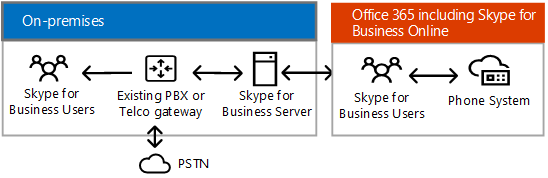
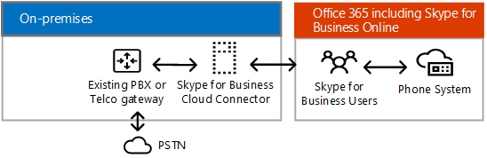
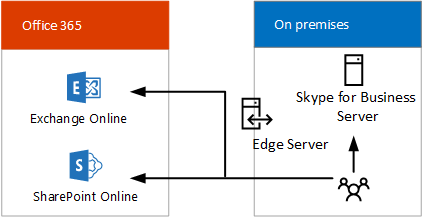
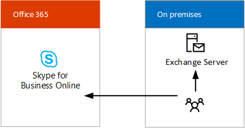

# Skype for Business hybrid solutions
 
Find information on planning a Skype for Business hybrid deployment. 
  
This topic introduces you to several hybrid configurations to help you determine which configuration is best for your business. You can then read more about the configuration you're interested in by following the links in this topic. This topic contains the following sections:
  
- [Skype for Business hybrid configurations](skype-for-business-hybrid-solutions.md#BKMK_HybridConfigurations)
    
- [Add Skype for Business Online into your existing on-premises Skype for Business environment](skype-for-business-hybrid-solutions.md#BKMK_HybridConnectivity)
    
- [Take advantage of Phone System in Office 365 (Cloud PBX)](skype-for-business-hybrid-solutions.md#BKMK_CloudPBX)
    
- [Integrate with Exchange and SharePoint](skype-for-business-hybrid-solutions.md#BKMK_IntegratewExchangeSharePoint)
    
- [Tasks for planning and configuring a hybrid environment](skype-for-business-hybrid-solutions.md#BKMK_Tasks)
    
- [For more information](skype-for-business-hybrid-solutions.md#BKMK_MoreInfo)
    
## Skype for Business hybrid configurations

Skype for Business supports several hybrid configurations. You can add Skype for Business Online into your existing on-premises Skype for Business environment, integrate your Skype for Business deployment with Exchange Online and SharePoint Online, and take advantage of Phone System in Office 365 (Cloud PBX)—Microsoft's technology for enabling call control and Private Branch Exchange (PBX) capabilities in the Office 365 cloud with Skype for Business Online. 
  
With a Skype for Business hybrid deployment, you combine a Skype for Business Online subscription with your on-premises Skype for Business offering. You can start building software-as-a-service management skills in your organization, and move your Skype for Business users to the cloud at your own pace. Your users who are homed in the cloud can take advantage of Phone System in Office 365 while retaining your on-premises Public Switched Telephone Network (PSTN) connectivity.
  
With a Skype for Business hybrid configuration, keep the following in mind:
  
- Some users might be homed on premises and some online, but the users share the same Session Initiation Protocol (SIP) domain, such as contoso.com.
    
- You can migrate users from Skype for Business on premises to Skype for Business Online over time, on your schedule.
    
- You can integrate with other Microsoft Office 365 applications, including Exchange Online and SharePoint Online.
    
- You can integrate with Exchange and SharePoint.
    
- You can take advantage of Skype Meeting Broadcast.
    
- You can take advantage of PSTN conferencing.
    
## Add Skype for Business Online into your existing on-premises Skype for Business environment

Hybrid connectivity between Skype for Business Server and Skype for Business Online means users of a domain, such as contoso.com, are split between using Skype for Business Server on premises and Skype for Business Online. Some of the domain users are homed on premises, and some users are homed online. You can configure your on-premises deployment for hybrid with Skype for Business Online and use Active Directory Synchronization to keep your on-premises and online users synchronized. 
  
The following diagram shows how you can add Skype for Business Online into your existing on-premises Skype for Business environment, allowing you to move users to the cloud at your own pace:
  

  
For more information, see [Plan hybrid connectivity between Skype for Business Server and Skype for Business Online](plan-hybrid-connectivity.md) and [Deploy hybrid connectivity between Skype for Business Server and Skype for Business Online](deploy-hybrid-connectivity/deploy-hybrid-connectivity.md).
  
## Take advantage of Phone System in Office 365 (Cloud PBX)

 Phone System in Office 365 (Cloud PBX) is Microsoft's technology for enabling call control and Private Branch Exchange (PBX) capabilities in the Office 365 cloud with Skype for Business Online. Phone System in Office 365 allows you to replace your existing PBX system with a set of features delivered from Office 365 and tightly integrated into Microsoft's cloud productivity experience.
  
In addition to two Phone System in Office 365 hybrid offerings, Microsoft offers Phone System in Office 365 with Calling Plan—a PSTN calling service—for an all-in-the-cloud solution that does not require an on-premises server deployment. To decide if Phone System in Office 365 with Calling Plan might be the right solution for your organization, see [ Phone System in Office 365 solutions](plan-your-phone-system-cloud-pbx-solution/plan-your-phone-system-cloud-pbx-solution.md#BKMK_PBXOfferings).
  
There are two Phone System in Office 365 hybrid offerings: 
  
- [Phone System in Office 365 with on-premises connectivity provided by your Skype for Business Server deployment](skype-for-business-hybrid-solutions.md#BKMK_Server)
    
- [Phone System in Office 365 with on-premises connectivity provided by Skype for Business Server Cloud Connector Edition](skype-for-business-hybrid-solutions.md#BKMK_CCE)
    
### Phone System in Office 365 with on-premises connectivity provided by your Skype for Business Server deployment

This configuration consists of a Skype for Business Server on-premises deployment modified for hybrid PSTN. Users in your organization who are homed in the cloud can receive PBX services from the Microsoft cloud, but PSTN connectivity is provided through Enterprise Voice on your on-premises Skype for Business Server deployment. 
  

  
This configuration is best if: 
  
- Your PBX does not offer unique features that you need to retain.
    
- Calling Plan, the Office 365 PSTN calling service, is not available in your region.
    
- You have an existing Lync or Skype for Business Server deployment.
    
For more information, see [Plan Phone System in Office 365 with on-premises PSTN connectivity in Skype for Business Server](plan-your-phone-system-cloud-pbx-solution/plan-phone-system-with-on-premises-pstn-connectivity.md) and [Enable users for Phone System in Office 365 with on-premises PSTN connectivity in Skype for Business Server](plan-your-phone-system-cloud-pbx-solution/enable-users-for-phone-system.md).
  
### Phone System in Office 365 with on-premises connectivity provided by Skype for Business Server Cloud Connector Edition

This configuration consists of a set of packaged Virtual Machines (VMs) that implement on-premises PSTN connectivity. By deploying a minimal Skype for Business Server topology in a virtualized environment, users in your organization who are homed in the cloud can receive PBX services from the Microsoft cloud, but PSTN connectivity is provided through the existing on-premises voice infrastructure. 
  

  
This configuration is best if:
  
- Your PBX does not offer unique features that you need to retain.
    
- Calling Plan, the Office 365 PSTN calling service, is not available in your region.
    
- You do not have an existing Lync or Skype for Business Server deployment.
    
For more information, see [Plan for Skype for Business Cloud Connector Edition](plan-your-phone-system-cloud-pbx-solution/plan-skype-for-business-cloud-connector-edition.md).
  
## Integrate with Exchange and SharePoint

A Skype for Business hybrid configuration allows you to integrate with other Microsoft Office 365 applications, including Exchange Online and SharePoint Online.
  
### Skype for Business Server with Exchange Online and SharePoint Online

You can integrate Skype for Business Server with Exchange Online and SharePoint Online as shown in the following diagram:
  

  
Integrating Skype for Business Server with Exchange Online and SharePoint Online has several advantages. You can:
  
- Use the full feature set of Skype for Business Server.
    
- Leverage your existing on-premises phone equipment, such as PBXs.
    
- Use Exchange Online for email, off-loading the burden of on-premises email servers and storage.
    
- Use SharePoint Online for collaboration, off-loading the burden of maintaining on-premises SharePoint servers.
    
- Use Skype for Business, Exchange, and SharePoint integrated features, including Unified Messaging (UM) in Office 365.
    
For more information, see [Plan to integrate Skype for Business and Exchange](../plan-your-deployment/integrate-with-exchange/integrate-with-exchange.md).
  
### Exchange Server with Skype for Business Online

You can integrate Exchange Server with Skype for Business Online as shown in the following diagram:
  

  
Integrating Exchange Server with Skype for Business Online has the following advantages:
  
- Leverage your existing Exchange infrastructure.
    
- Use Skype for Business Online for presence, IM, and conferencing capabilities. 
    
For more information, see [Plan to integrate Skype for Business and Exchange](../plan-your-deployment/integrate-with-exchange/integrate-with-exchange.md).
  
## Tasks for planning and configuring a hybrid environment

Skype for Business provides a rich set of capabilities no matter how you architect your deployment. The architecture you choose will determine which IT responsibilities you own, and which you pay Microsoft to support through your subscription. No matter which architecture is best for your organization, there are five core responsibilities that you will always own:
  
- **Networking and connectivity** - Ensure network capacity and availability through firewalls, proxy servers, gateways, and across WAN links by performing a network assessment or by contracting with a partner to do the assessment.
    
- **Data governance &amp; rights management** - Classify your sensitive data and ensure it is protected and monitored wherever it is stored and while it is in transit.
    
- **Client Endpoints** - Establish, measure, and enforce modern security standards on devices that are used to access your data and assets.
    
- **Account &amp; access management** - Establish a profile for "normal" account activity and alert on unusual activity.
    
- **Identity** - Use credentials secured by hardware or Multi-Factor Authentication (MFA) for all identities.
    
In addition to the architectural tasks you perform for your on-premises environment, you will need to:
  
- Plan and design identity management requirements, including integrating on-premises identities with Office 365.
    
- Ensure network capacity and availability.
    
- Acquire third-party SSL certificates to provide enterprise-security for Office 365 service offerings.
    
- Decide if you want to connect to Office 365 with Internet Protocol version 6 (IPv6).
    
- Determine how much feature integration with on-premises and online versions of Skype for Business, Exchange, and SharePoint is desired. 
    
- Determine which proxy server device will be used for requests from Office 365.
    
You will also need to perform the follow IT Pro tasks to implement your Skype for Business hybrid environment:
  
- Ensure you have a Microsoft Office 365 tenant with Skype for Business Online enabled.
    
- Implement the identity management plan. 
    
- Plan and implement internal and external DNS records and routing.
    
- Configure your proxy or firewall for Office 365 IP address and URL requirements.
    
- Administer user accounts and Skype for Business Online settings. 
    
- Configure the proxy server device, if required. 
    
- Configure the integration of features with on-premises and online versions of Exchange Server and SharePoint.
    
## For more information

For more information, see the following resources:
  
- [Microsoft cloud IT architecture resources](https://aka.ms/clouditarch)
    
- [Microsoft cloud identity for enterprise architects](https://docs.microsoft.com/en-us/office365/enterprise/microsoft-cloud-it-architecture-resources#identity)
    
- [Get your organization ready for Office 365 Enterprise](https://aka.ms/O365EntPrep)
    
- [Plan hybrid connectivity between Skype for Business Server and Skype for Business Online](plan-hybrid-connectivity.md)
    
- [Deploy hybrid connectivity between Skype for Business Server and Skype for Business Online](deploy-hybrid-connectivity/deploy-hybrid-connectivity.md)
    
- [ Phone System in Office 365 solutions](plan-your-phone-system-cloud-pbx-solution/plan-your-phone-system-cloud-pbx-solution.md#BKMK_PBXOfferings)
    
- [Plan to integrate Skype for Business and Exchange](../plan-your-deployment/integrate-with-exchange/integrate-with-exchange.md)
    
If you would like to download a poster version of this topic, go to:
  
- [Skype for Business Architectural Models (pdf)](https://download.microsoft.com/download/7/7/4/7741262C-A60D-41F7-863B-99BF5964FBFE/Skype%20for%20Business%20Architectural%20Models.pdf)
    
- [Skype for Business Architectural Models (Visio)](https://download.microsoft.com/download/7/7/4/7741262C-A60D-41F7-863B-99BF5964FBFE/Skype%20for%20Business%20Architectural%20Models.vsd)
    

