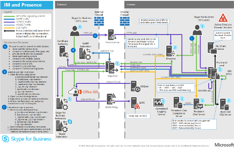
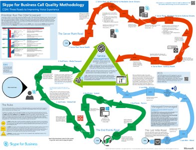
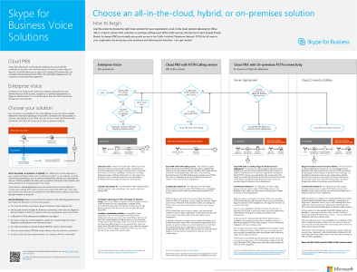
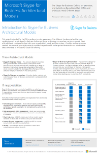

# Technical diagrams for Skype for Business Server

**Summary:** Review these posters as needed while planning, implementing, or managing Skype for Business Server.

These resources are available in Visio (.vsdx) format (Visio 2015) and PDF format. For information about how to print documents, see [Tips for printing large-format posters](technical-diagrams.md#tips).

You might need additional software to view these files. See the following table for more information.

|File type|Software|
|:--- |:--- |
|.vsd |Visio 2010, Visio 2013, or the [free Visio viewer](https://go.microsoft.com/fwlink/p/?LinkId=393676)   If you use the Visio viewer, right-click the VSD link, click **Save Target As**, save the file to your computer, and then open the file from your computer. |
|.pdf |Any PDF viewer, such as [Adobe Reader](https://go.microsoft.com/fwlink/p/?LinkId=393675) |
|.zip |Any file compression utility. Windows 7 and later opens these files natively. |

## Posters

These posters detail a specific technical area, and are intended to be used with corresponding articles or content available on the download center.

|Title|Description|
|:---|:---|
|**Skype for Business Server Protocol Workloads**   [PDF version](https://go.microsoft.com/fwlink/p/?LinkId=550989) (best for mobile devices or tablet computers)   [Visio version](https://go.microsoft.com/fwlink/p/?LinkId=550991) (best for users with Visio) |Download this poster to better understand requirements of Skype for Business servers and clients under different levels of service complexity.    Size: 11-by-17 inch (multiple sheets, conveniently sized to print on most office printers)     This poster was created using Visio 2015. No modification should be needed for a specific environment. |
|**Skype for Business Call Quality Methodology**   [PDF version](https://go.microsoft.com/fwlink/p/?LinkId=617899) (best for mobile devices or tablet computers)   [Visio version](https://go.microsoft.com/fwlink/p/?LinkId=617900) (best for users with Visio) |Download this poster to learn about CQM, the Call Quality Methodology for Skype for Business Server 2015 that helps you find and eliminate issues affecting call quality and user experience for implementations that include enterprise voice features.     Use the [download details page](https://go.microsoft.com/fwlink/p/?LinkId=617898) to get the printable cards and rules if you wish to play it as a board game. Use this poster with the [CQM Scorecard](https://go.microsoft.com/fwlink/p/?LinkId=617904).    Size: 34-by-44 inch     This poster was created using Visio 2015. No modification should be needed for a specific environment. |
|**Skype for Business Voice Solutions**      [PDF version](https://go.microsoft.com/fwlink/?linkid=869123) (best for mobile devices or tablet computers)   [Visio version](https://go.microsoft.com/fwlink/?linkid=869124) (best for users with Visio) |Microsoft offers a variety of options for enabling your users to call landlines and mobile phones through the Public Switched Telephone Network (PSTN)--whether their accounts exist in Office 365 on Skype for Business Online or in your on-premises Skype for Business Server 2015 deployment. This poster outlines the different Microsoft voice offerings, and then provides guidance on which options might be the best for you, depending on your organization's current status and future plans.     Size: 34-by-44 inch    This poster was created using Visio 2015. No modification should be needed for a specific environment. |
|**Skype for Business Architectural Models**      [PDF version](https://go.microsoft.com/fwlink/?linkid=869125) (best for mobile devices or tablet computers)   [Visio version](https://go.microsoft.com/fwlink/?linkid=869126) (best for users with Visio) |This poster series is intended for the IT Pro audience to raise awareness of the different fundamental architectural models through which Skype for Business Online and Skype for Business Server 2015 on premises can be consumed. Start with whichever configuration best suits your organization's needs and future plans. Consider and use others as needed. For example, you might want to consider integration with Exchange and SharePoint or a solution that takes advantage of Microsoft's Cloud PBX offering.    Size: 11-by-17 inch    This poster was created using Visio 2010. No modification should be needed for a specific environment. |

## Visual assets

If you want to make your own Visio topology diagrams using the new Skype for Business symbols, [download the stencils](https://go.microsoft.com/fwlink/p/?LinkId=550985).

## Tips for printing large-format posters

If you have a plotter, you can print large posters in their full size. If you don't have plotter, use the following steps to print on smaller paper such as 11"x17". Printing a large format poster on smaller paper may make the text difficult or impossible to read.

### Print posters on smaller paper

1. Open the poster in Visio.
2. On the **File** menu, click **Page Setup**.
3. On the **Print Setup** tab, in the **Printer paper** section, select the size of paper you want to print on.
4. On the **Print Setup** tab, in the **Print zoom** section, click **Fit to**, and then enter **1 sheet across by 1 sheet down**.
5. On the **Page Size** tab, click **Size to fit drawing contents**, and then click **OK**.
6. On the **File** menu, click **Print**.
