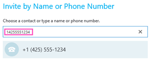

# Dialing out from a meeting so other people can join it

As the meeting organizer, you can dial out using a Skype for Business or Microsoft Teams app to let other people join the same meeting using their phone. Although it's not required, when you are dialing out to someone, it's recommended that you dial the full number, including the country/region code. To get dial-out to work:
  
- You can dial-out only if you join a meeting using a Skype for Business or Microsoft Teams app.
    
- You as the meeting organizer have been enabled for audio conferencing.

 **Step 1:** In the invite meeting, use the **Invite More People** option to dial out to a phone number.
  

  
 **Step 2:** Enter the full phone number, including the country/region code in the box.
  

  
## Supported countries and regions

Dial-out is only available to some countries/regions. For complete list, see [Country and region availability for Audio Conferencing and Calling Plans](../country-and-region-availability-for-audio-conferencing-and-calling-plans/country-and-region-availability-for-audio-conferencing-and-calling-plans.md).
  
## Want to know more about audio conferencing?

- [Set up Audio Conferencing for Skype for Business and Microsoft Teams](set-up-audio-conferencing-for-skype-for-business-and-microsoft-teams.md)
    
- [Skype for Business and Microsoft Teams add-on licensing](../skype-for-business-and-microsoft-teams-add-on-licensing/skype-for-business-and-microsoft-teams-add-on-licensing.md)
    
## Related topics

[Install Skype for Business](https://support.office.com/en-us/article/8a0d4da8-9d58-44f9-9759-5c8f340cb3fb)

